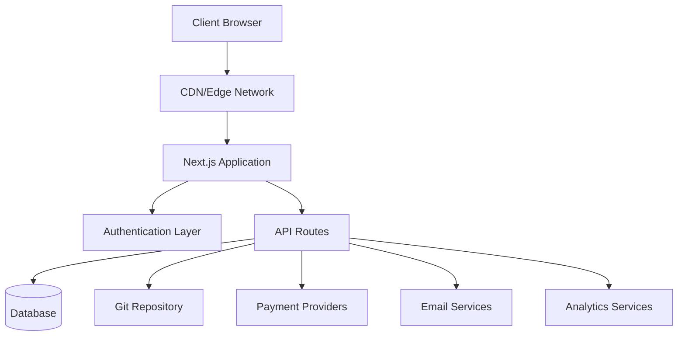
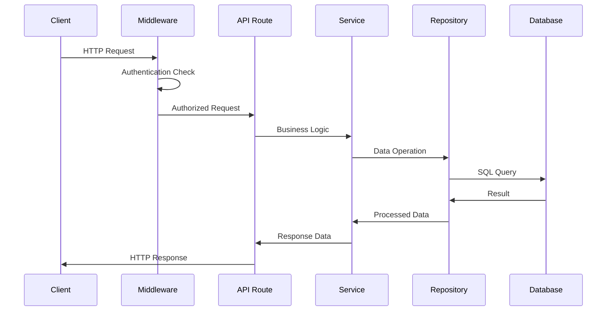
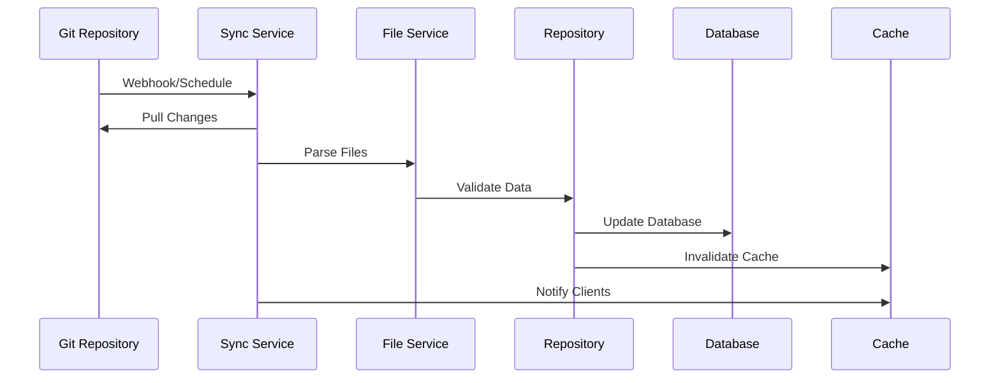
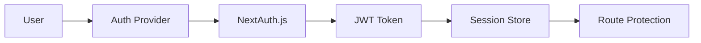

# Architectuuroverzicht

The Ever Works volgt een moderne, schaalbare architectuur die is ontworpen voor prestaties, onderhoudbaarheid en ontwikkelaarservaring.

## Architectuur op hoog niveau



## Kernprincipes

### 1. Scheiding van zorgen
- **Presentatielaag**: Reageercomponenten en UI-logica
- **Bedrijfslaag**: Services en opslagplaatsen
- **Gegevenslaag**: Database en externe API's

### 2. Modulair ontwerp
- Functiegebaseerde organisatie
- Herbruikbare componenten
- Plugin-achtige integraties

### 3. Typ Veiligheid
- Typescript overal
- Strikte typecontrole
- Runtime-validatie met Zod

### 4. Prestaties eerst
- Rendering aan de serverzijde
- Statische generatie waar mogelijk
- Geoptimaliseerde cachingstrategieën

## Applicatielagen

### Frontend-laag

**Technologie**: Reageer 19 + Next.js 15
**Verantwoordelijkheden**:
- Weergave van de gebruikersinterface
- Statusbeheer aan de clientzijde
- Gebruikersinteracties
- Routeafhandeling

**Belangrijkste componenten**:
- Paginacomponenten (`app/[locale]/`)
- Herbruikbare UI-componenten (`components/`)
- Aangepaste haken (`hooks/`)
- Contextproviders (`components/providers/`)

### API-laag

**Technologie**: Next.js API-routes
**Verantwoordelijkheden**:
- Uitvoering van bedrijfslogica
- Gegevensvalidatie
- Externe service-integratie
- Authenticatie afhandeling

**Structuur**:
```
app/api/
├── auth/           # Authentication endpoints
├── admin/          # Admin-only endpoints
├── items/          # Item management
└── webhooks/       # External service webhooks
```

### Gegevenslaag

**Technologieën**: Drizzle ORM + PostgreSQL
**Verantwoordelijkheden**:
- Gegevenspersistentie
- Zoekopdrachtoptimalisatie
- Transactiebeheer
- Schemamigraties

**Componenten**:
- Databaseschema (`lib/db/schema.ts`)
- Opslagplaatsen (`lib/repositories/`)
- Migratiebestanden (`lib/db/migrations/`)

### Inhoudslaag

**Technologie**: op Git gebaseerd CMS
**Verantwoordelijkheden**:
- Synchronisatie van inhoud
- Versiebeheer
- Gezamenlijke redactie
- Validatie van inhoud

**Structuur**:
```
.content/
├── config.yml      # Site configuration
├── items/          # Item definitions
├── categories/     # Category definitions
└── tags/           # Tag definitions
```

## Ontwerppatronen

### 1. Repositorypatroon

Samenvattingen logica voor gegevenstoegang:

```typescript
interface ItemRepository {
  findById(id: string): Promise<Item | null>;
  findBySlug(slug: string): Promise<Item | null>;
  findWithFilters(filters: ItemFilters): Promise<Item[]>;
  create(item: CreateItemRequest): Promise<Item>;
  update(id: string, updates: UpdateItemRequest): Promise<Item>;
  delete(id: string): Promise<void>;
}
```

### 2. Patroon van servicelaag

Bevat bedrijfslogica:

```typescript
class ItemService {
  constructor(
    private itemRepository: ItemRepository,
    private gitService: GitService,
    private notificationService: NotificationService
  ) {}

  async submitItem(data: SubmitItemRequest): Promise<SubmissionResult> {
    // Business logic here
  }
}
```

### 3. Fabriekspatroon

Creëert service-instanties:

```typescript
class PaymentProviderFactory {
  static create(provider: PaymentProvider): PaymentService {
    switch (provider) {
      case 'stripe':
        return new StripePaymentService();
      case 'lemonsqueezy':
        return new LemonSqueezyPaymentService();
      default:
        throw new Error(`Unsupported provider: ${provider}`);
    }
  }
}
```

### 4. Waarnemerspatroon

Gebeurtenisgestuurde updates:

```typescript
class ContentSyncService {
  private observers: ContentObserver[] = [];

  addObserver(observer: ContentObserver): void {
    this.observers.push(observer);
  }

  notifyObservers(event: ContentEvent): void {
    this.observers.forEach(observer => observer.update(event));
  }
}
```

## Gegevensstroom

### 1. Verzoekstroom



### 2. Inhoudssynchronisatiestroom



## Beveiligingsarchitectuur

### 1. Authenticatiestroom



### 2. Autorisatielagen

- **Routeniveau**: Middleware-bescherming
- **API-niveau**: Eindpuntwachters
- **Gegevensniveau**: beveiliging op rijniveau
- **UI-niveau**: Componentgebaseerde toegangscontrole

### 3. Beveiligingsmaatregelen

- **Invoervalidatie**: Zod-schema's
- **SQL-injectie**: geparametriseerde query's
- **XSS-bescherming**: inhoudsopschoning
- **CSRF-bescherming**: Tokenvalidatie
- **Snelheidslimiet**: beperking van verzoek

## Caching-strategie

### 1. Applicatiecache

- **React Query**: gegevenscache aan de clientzijde
- **Next.js Cache**: cache voor pagina- en API-routes
- **Statische generatie**: vooraf gemaakte pagina's

### 2. Databasecache

- **Verbindingspooling**: Efficiënte DB-verbindingen
- **Queryoptimalisatie**: geïndexeerde zoekopdrachten
- **Leesreplica's**: gedistribueerde leesbewerkingen

### 3. CDN-cache

- **Statische middelen**: afbeeldingen, CSS, JS
- **API-antwoorden**: cachebare eindpunten
- **Edge-locaties**: wereldwijde distributie

## Overwegingen bij schaalbaarheid

### 1. Horizontale schaling

- **Stateless Design**: geen sessies aan de serverzijde
- **Database schalen**: Lees replica's en sharding
- **CDN-distributie**: Globale edge-caching

### 2. Prestatieoptimalisatie

- **Codesplitsing**: dynamische import
- **Afbeeldingsoptimalisatie**: Next.js-afbeeldingscomponent
- **Bundeloptimalisatie**: Boomschudden en minificatie

### 3. Monitoring en waarneembaarheid

- **Error Tracking**: Sentry-integratie
- **Prestatiemonitoring**: Core Web Vitals
- **Analytics**: PostHog-integratie
- **Logging**: Gestructureerde loggen

## Technologische beslissingen

### Waarom Next.js?
- **Full-stack framework**: API-routes + frontend
- **Prestaties**: SSR, SSG en ISR
- **Ontwikkelaarservaring**: Hot herladen, TypeScript-ondersteuning
- **Ecosysteem**: rijk plug-in-ecosysteem

### Waarom motregen ORM?
- **Typeveiligheid**: Volledige TypeScript-ondersteuning
- **Prestaties**: Minimale overhead
- **Flexibiliteit**: onbewerkte SQL wanneer dat nodig is
- **Migratiesysteem**: versiegestuurde schemawijzigingen

### Waarom Git-gebaseerd CMS?
- **Versiebeheer**: volledige geschiedenis bijhouden
- **Samenwerking**: workflow voor pull-aanvragen
- **Back-up**: van nature gedistribueerd
- **Flexibiliteit**: elke Git-provider

### Waarom Reageerquery?
- **Caching**: Intelligent cachebeheer
- **Synchronisatie**: achtergrondupdates
- **Optimistische updates**: Betere UX
- **Foutafhandeling**: logica voor opnieuw proberen

## Uitbreidingspunten

De architectuur biedt verschillende uitbreidingspunten:

### 1. Aangepaste authenticatieproviders
```typescript
// lib/auth/providers/custom-provider.ts
export function CustomProvider(options: CustomProviderOptions) {
  return {
    id: "custom",
    name: "Custom Provider",
    type: "oauth",
    // Implementation
  }
}
```

### 3. Integratie van inhoudsbronnen
```typescript
// lib/content/sources/custom-source.ts
export class CustomContentSource implements ContentSource {
  async sync(): Promise<SyncResult> {
    // Implementation
  }
}
```

## Volgende stappen

- [Ontdek de tech-stack](./tech-stack) in detail
