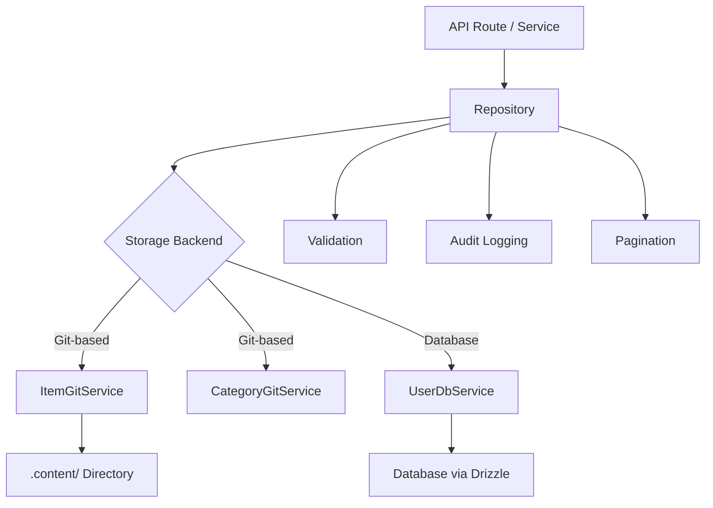

# Opslagpatronen

De sjabloon implementeert het Repository-patroon om een schone gegevenstoegangslaag te bieden tussen bedrijfslogica en gegevensopslag. Repository's omvatten het bouwen van query's, validatie, paginering en auditlogboekregistratie, terwijl de daadwerkelijke opslag wordt gedelegeerd aan onderliggende services (op Git-gebaseerd of database-ondersteund).

## Architectuuroverzicht



## Bronbestanden

|Bestand|Doel|
|------|---------|
|`lib/repositories/item.repository.ts`|Item CRUD met Git-opslag, filtering, audit|
|`lib/repositories/category.repository.ts`|Categoriebeheer met Git-opslag|
|`lib/repositories/user.repository.ts`|Gebruikersbewerkingen met databaseopslag|
|`lib/repositories/tag.repository.ts`|Tagbeheer|
|`lib/repositories/role.repository.ts`|Rolbeheer|
|`lib/repositories/collection.repository.ts`|Collectiebeheer|
|`lib/repositories/sponsor-ad.repository.ts`|Beheer van sponsoradvertenties|
|`lib/repositories/client-item.repository.ts`|Klantgerichte itembewerkingen|
|`lib/repositories/client-dashboard.repository.ts`|Klantdashboardgegevens|
|`lib/repositories/admin-stats.repository.ts`|Beheerstatistieken|
|`lib/repositories/admin-analytics-optimized.repository.ts`|Geoptimaliseerde analysequery's|
|`lib/repositories/integration-mapping.repository.ts`|Externe integratietoewijzingen|
|`lib/repositories/twenty-crm-config.repository.ts`|Twintig CRM-configuratie|

## Algemene repositorymethoden

Alle opslagplaatsen volgen een consistent API-oppervlak:

|Methode|Beschrijving|
|--------|-------------|
|`findAll(options?)`|Haal alle records op met optionele filtering|
|`findAllPaginated(page, limit, options?)`|Gepagineerd ophalen|
|`findById(id)`|Zoek één record op ID|
|`findBySlug(slug)`|Zoek één record per naaktslak|
|`create(data)`|Maak een nieuw record met validatie|
|`update(id, data)`|Update een bestaand record met validatie|
|`delete(id)`|Een record moeilijk verwijderen|
|`getStats()`|Ontvang verzamelde statistieken|

## ItemRepository

De meest uitgebreide repository, die alle belangrijke patronen demonstreert.

### Initialisatie van luie service

De Git-service wordt bij het eerste gebruik lui geïnitialiseerd:

```typescript
export class ItemRepository {
  private gitService: ItemGitService | null = null;

  private async getGitService(): Promise<ItemGitService> {
    if (!this.gitService) {
      const dataRepo = coreConfig.content.dataRepository;
      const token = coreConfig.content.ghToken;
      // Parse GitHub URL, create service config
      this.gitService = await createItemGitService(config);
    }
    return this.gitService;
  }
}
```

### Filteren

De `findAll`-methode ondersteunt filteren op meerdere criteria met OR-logica voor arrays:

```typescript
async findAll(options: ItemListOptions = {}): Promise<ItemData[]> {
  const items = await gitService.readItems(options.includeDeleted ?? false);
  let filteredItems = items;

  if (options.status)
    filteredItems = filteredItems.filter(item => item.status === options.status);

  if (options.categories?.length > 0)
    filteredItems = filteredItems.filter(item => {
      const itemCategories = Array.isArray(item.category) ? item.category : [item.category];
      return options.categories!.some(cat => itemCategories.includes(cat));
    });

  if (options.tags?.length > 0)
    filteredItems = filteredItems.filter(item =>
      options.tags!.some(tag => item.tags.includes(tag))
    );

  if (options.search) {
    const searchLower = options.search.toLowerCase();
    filteredItems = filteredItems.filter(item =>
      item.name.toLowerCase().includes(searchLower) ||
      item.description.toLowerCase().includes(searchLower)
    );
  }

  return filteredItems;
}
```

### Paginering

```typescript
async findAllPaginated(page = 1, limit = 10, options = {}): Promise<{
  items: ItemData[];
  total: number;
  page: number;
  limit: number;
  totalPages: number;
}> {
  return await gitService.getItemsPaginated(page, limit, options);
}
```

### Auditregistratie

Alle muterende bewerkingen worden geregistreerd in een audittrail (best effort, non-blocking):

```typescript
async create(data: CreateItemRequest, auditUser?: AuditUser): Promise<ItemData> {
  this.validateCreateData(data);
  const item = await gitService.createItem(data);

  try {
    await itemAuditService.logCreation(item, auditUser);
  } catch (err) {
    console.warn('Audit logCreation failed:', err);
  }

  return item;
}
```

Vastgelegde auditgebeurtenissen:

|Operatie|Auditmethode|Gegevens vastgelegd|
|-----------|-------------|---------------|
|Creëer|`logCreation`|Nieuw item, gebruiker|
|Bijwerken|`logUpdate`|Vorige staat, nieuwe staat, gebruiker|
|Beoordeling|`logReview`|Item, vorige status, notities, gebruiker|
|Verwijderen|`logDeletion`|Item, gebruiker, zachte/harde vlag|
|Herstellen|`logRestoration`|Artikel, gebruiker|

### Batchbewerkingen

De `batchUpdate` methode optimaliseert meerdere updates met een enkele Git commit:

```typescript
async batchUpdate(updates: Array<{ id: string; data: UpdateItemRequest }>): Promise<ItemData[]> {
  // Pre-validate ALL updates before writing
  for (const { id, data } of updates) {
    this.validateUpdateData(id, data);
  }

  // Write each update without committing
  for (const { id, data } of updates) {
    await gitService.updateItemWithoutCommit(id, data);
  }

  // Single commit for all changes
  await gitService.commitAndPushBatch(`Batch update ${updates.length} items`);

  // Audit logging after successful commit
  for (const entry of auditEntries) {
    await itemAuditService.logUpdate(entry.previous, entry.updated, auditUser);
  }
}
```

### Validatie

Opslagplaatsen voeren invoervalidatie uit vóór opslagbewerkingen:

```typescript
private validateCreateData(data: CreateItemRequest): void {
  if (!data.id?.trim())          throw new Error('Item ID is required');
  if (!data.name?.trim())        throw new Error('Item name is required');
  if (!data.slug?.trim())        throw new Error('Item slug is required');
  if (!data.description?.trim()) throw new Error('Item description is required');
  if (!data.source_url?.trim())  throw new Error('Item source URL is required');

  if (!/^[a-z0-9-]+$/.test(data.slug))
    throw new Error('Slug must contain only lowercase letters, numbers, and hyphens');

  try { new URL(data.source_url); }
  catch { throw new Error('Invalid source URL format'); }
}
```

### Zacht verwijderen en herstellen

```typescript
async softDelete(id: string): Promise<ItemData> {
  return await gitService.softDeleteItem(id);
}

async restore(id: string): Promise<ItemData> {
  return await gitService.restoreItem(id);
}
```

## CategorieRepository

Demonstreert singleton-patroon en duplicaatcontrole:

```typescript
export class CategoryRepository {
  // Duplicate name checking (case-insensitive, excludes self for updates)
  private async checkDuplicateName(name: string, excludeId?: string): Promise<void> {
    const categories = await gitService.readCategories();
    const duplicate = categories.find(cat =>
      cat.name.toLowerCase() === name.toLowerCase() && cat.id !== excludeId
    );
    if (duplicate) throw new Error(`Category with name "${name}" already exists`);
  }

  // Sorting
  private sortCategories(categories, options): CategoryData[] {
    return categories.sort((a, b) => {
      const comparison = a.name.localeCompare(b.name);
      return options.sortOrder === 'desc' ? -comparison : comparison;
    });
  }
}

// Singleton export
export const categoryRepository = new CategoryRepository();
```

## GebruikersRepository

Maakt gebruik van door databases ondersteunde opslag via `UserDbService` met Zod-validatie:

```typescript
export class UserRepository {
  private userDbService: UserDbService;

  async create(data: CreateUserRequest): Promise<AuthUserData> {
    // Zod schema validation
    const validatedData = userValidationSchema
      .pick({ email: true, password: true })
      .parse(data);

    // Uniqueness check
    const exists = await this.userDbService.emailExists(validatedData.email);
    if (exists) throw new Error('Email already in use');

    return await this.userDbService.createUser(validatedData);
  }
}
```

## Strategie voor foutafhandeling

Opslagplaatsen volgen een consistent patroon voor foutafhandeling:

1. Bekende zakelijke fouten opnieuw plaatsen (bijvoorbeeld 'E-mailadres is al in gebruik')
2. Registreer en verpak onbekende fouten met algemene berichten
3. Fouten bij het registreren van audits worden opgemerkt en gewaarschuwd, zonder dat de bewerking wordt geblokkeerd
