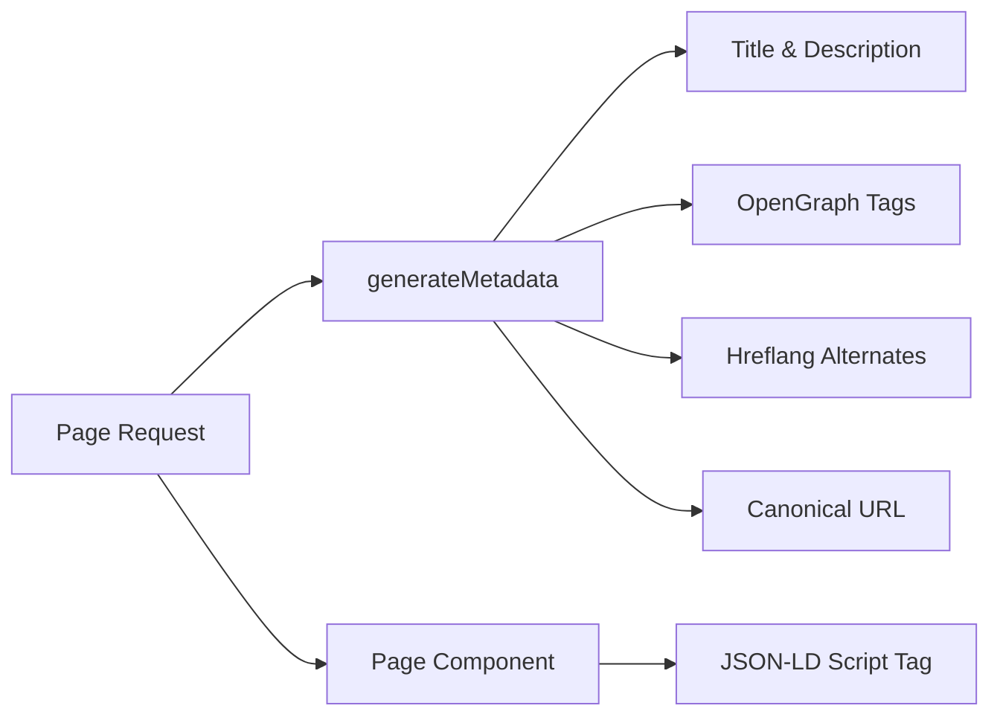

# SEO-systeem

De Ever Works-sjabloon bevat een uitgebreid SEO-systeem dat gestructureerde gegevens (JSON-LD), hreflang-tags, OpenGraph-metagegevens en dynamische sitemaps genereert. Alle SEO-hulpprogramma's staan ​​onder `lib/seo/` en zijn geïntegreerd met de Next.js Metadata API.

## Architectuuroverzicht



### Bronbestanden

|Bestand|Doel|
|---|---|
|`lib/seo/schema.ts`|JSON-LD gestructureerde datageneratoren|
|`lib/seo/hreflang.ts`|Alternatieve URL-generatoren voor taal|
|`lib/seo/listing-metadata.ts`|Metagegevensfabriek van vermeldingspagina|

## JSON-LD gestructureerde gegevens

De `lib/seo/schema.ts` module genereert gestructureerde gegevens van Schema.org voor rijke resultaten in zoekmachines.

### Productschema

Voor artikeldetailpagina's wordt een `Product`-schema gegenereerd:

```typescript
import { generateProductSchema } from '@/lib/seo/schema';

const schema = generateProductSchema({
  name: 'My App',
  description: 'A productivity tool',
  image: 'https://example.com/icon.png',
  url: 'https://example.com/items/my-app',
  category: 'Productivity',
  sourceUrl: 'https://myapp.com',
  brandName: 'MyApp Inc.',
});
```

Gegenereerde uitvoer:

```json
{
  "@context": "https://schema.org",
  "@type": "Product",
  "name": "My App",
  "description": "A productivity tool",
  "image": "https://example.com/icon.png",
  "url": "https://example.com/items/my-app",
  "category": "Productivity",
  "brand": {
    "@type": "Brand",
    "name": "MyApp Inc."
  },
  "offers": {
    "@type": "Offer",
    "url": "https://myapp.com",
    "availability": "https://schema.org/InStock"
  }
}
```

### Organisatieschema

Genereert een `Organization`-schema voor de hele site voor zichtbaarheid in het Kennispaneel:

```typescript
import { generateOrganizationSchema } from '@/lib/seo/schema';

const schema = generateOrganizationSchema();
```

Dit schema omvat:
- Merknaam, URL en logo
- Links naar sociale profielen (`sameAs` array) van `siteConfig.social`
- Contactpunt met e-mail (indien geconfigureerd)

### Websiteschema met SearchAction

Schakelt het zoekvak van Google Sitelinks in:

```typescript
import { generateWebSiteSchema } from '@/lib/seo/schema';

const schema = generateWebSiteSchema('en');
// Includes potentialAction with SearchAction targeting /?q={search_term_string}
```

Het schema respecteert landvoorvoegsels:
- Standaardlandinstelling: `https://example.com`
- Andere landinstellingen: `https://example.com/fr`

### Broodkruimelschema

Genereert `BreadcrumbList` voor navigatiebewuste zoekresultaten:

```typescript
import { generateBreadcrumbSchema } from '@/lib/seo/schema';

const schema = generateBreadcrumbSchema([
  { name: 'Home', url: 'https://example.com' },
  { name: 'Productivity', url: 'https://example.com/categories/productivity' },
  { name: 'My App', url: 'https://example.com/items/my-app' },
]);
```

### Insluiten in pagina's

JSON-LD is ingebed met behulp van een `<script>`-tag in de paginacomponent:

```tsx
export default function ItemDetailPage({ item }) {
  const schema = generateProductSchema({ ... });

  return (
    <>
      <script
        type="application/ld+json"
        dangerouslySetInnerHTML={{ __html: JSON.stringify(schema) }}
      />
      <ItemDetail item={item} />
    </>
  );
}
```

## Hreflang-tags

De module `lib/seo/hreflang.ts` genereert alternatieve taal-URL's voor SEO op meerdere locaties.

### URL-patroon

De sjabloon gebruikt het voorvoegselpatroon 'zo nodig':

|Lokaal|URL-patroon|
|---|---|
|`en` (standaard)|`https://example.com/items/my-app`|
|`fr`|`https://example.com/fr/items/my-app`|
|`es`|`https://example.com/es/items/my-app`|
|`x-default`|Hetzelfde als `en` (standaardlandinstelling)|

### Alternatieven genereren

```typescript
import { generateHreflangAlternates } from '@/lib/seo/hreflang';

// For any page path
const alternates = generateHreflangAlternates('/about');
// Returns: { en: 'https://example.com/about', fr: 'https://example.com/fr/about', ... }

// Convenience functions for common page types
import { generateItemHreflangAlternates } from '@/lib/seo/hreflang';
const itemAlternates = generateItemHreflangAlternates('my-app');

import { generatePageHreflangAlternates } from '@/lib/seo/hreflang';
const pageAlternates = generatePageHreflangAlternates('about');
```

### Integratie met Next.js-metagegevens

```typescript
export async function generateMetadata({ params }) {
  const { locale, slug } = await params;
  return {
    alternates: {
      canonical: `https://example.com/${locale}/items/${slug}`,
      languages: generateItemHreflangAlternates(slug),
    },
  };
}
```

### Ondersteunde landinstellingen

Alle 20+ locaties zijn in kaart gebracht in `LOCALE_TO_HREFLANG`:

```
en -> en, fr -> fr, es -> es, de -> de, zh -> zh,
ar -> ar, he -> he, ru -> ru, uk -> uk, pt -> pt,
it -> it, ja -> ja, ko -> ko, nl -> nl, pl -> pl,
tr -> tr, vi -> vi, th -> th, hi -> hi, id -> id, bg -> bg
```

## Metagegevens van vermeldingspagina

De `lib/seo/listing-metadata.ts` module genereert volledige `Metadata` objecten voor lijst- en categoriepagina's.

### Gebruik

```typescript
import { generateListingMetadata } from '@/lib/seo/listing-metadata';

export async function generateMetadata({ params }) {
  const { locale } = await params;
  return generateListingMetadata({
    title: 'Time Tracking Tools',
    description: 'Browse the best time tracking tools',
    path: '/categories/time-tracking',
    locale,
    itemCount: 42,
    keywords: ['time tracking', 'productivity', 'tools'],
    imageUrl: 'https://example.com/og/time-tracking.png',
  });
}
```

### Gegenereerde metadatastructuur

De functie produceert een compleet Next.js `Metadata` object:

|Veld|Bron|
|---|---|
|`title`|`{titel} \|{sitenaam}`|
|`description`|Aangepast of automatisch gegenereerd op basis van titel + aantal items|
|`keywords`|Samengevoegde trefwoordarray|
|`openGraph.type`|`'website'`|
|`openGraph.siteName`|Van `siteConfig.name`|
|`openGraph.url`|Canonieke URL met landinstelling|
|`openGraph.images`|Optionele afbeeldings-URL|
|`twitter.card`|`'summary_large_image'`|
|`alternates.canonical`|Volledige canonieke URL|
|`alternates.languages`|Hreflang is een alternatief voor alle landinstellingen|

## OpenGraph-afbeelding genereren

Dynamische OG-afbeeldingen worden gegenereerd met Next.js `ImageResponse` op twee niveaus:

|Bestand|Route|Doel|
|---|---|---|
|`app/opengraph-image.tsx`|`/opengraph-image`|Standaard OG-afbeelding voor de hele site|
|`app/[locale]/items/[slug]/opengraph-image.tsx`|`/items/{slug}/opengraph-image`|Dynamische OG-afbeelding per item|

Deze bestanden gebruiken de module `next/og` om React-componenten op verzoek weer te geven als afbeeldingen, waardoor dynamische tekst, logo's en branding mogelijk zijn.

## SEO-checklist

Wanneer u een nieuw paginatype toevoegt, zorg er dan voor dat de volgende SEO-elementen aanwezig zijn:

|Element|Implementatie|
|---|---|
|Paginatitel|`generateMetadata` met beschrijvende titel|
|Metabeschrijving|Aangepaste beschrijving of automatisch gegenereerd|
|Canonieke URL|Ingesteld in `alternates.canonical`|
|Hreflang-tags|Gebruik `generateHreflangAlternates`|
|OpenGraph-tags|Opgenomen via `generateListingMetadata` of handmatig|
|Twitter-kaart|Stel `twitter.card` in op `summary_large_image`|
|JSON-LD|Schema toevoegen via `<script type="application/ld+json">`|
|Broodkruimels|Gebruik `generateBreadcrumbSchema` voor geneste pagina's|

## Beste praktijken

1. **Stel altijd canonieke URL's in** - voorkomt problemen met dubbele inhoud in verschillende landinstellingen.
2. **Neem hreflang op voor alle landinstellingen**: zelfs als de inhoud nog niet is vertaald, helpt de URL-structuur zoekmachines.
3. **Gebruik beschrijvende, unieke titels** -- vermijd algemene titels zoals 'Home' zonder de sitenaam.
4. **Houd beschrijvingen onder de 160 tekens**: langere beschrijvingen worden afgekapt in de zoekresultaten.
5. **Test gestructureerde gegevens** met de Google Rich Results Test-tool voordat u deze implementeert.
6. **Genereer dynamisch OG-afbeeldingen**: statische fallback-afbeeldingen missen itemspecifieke merkmogelijkheden.
