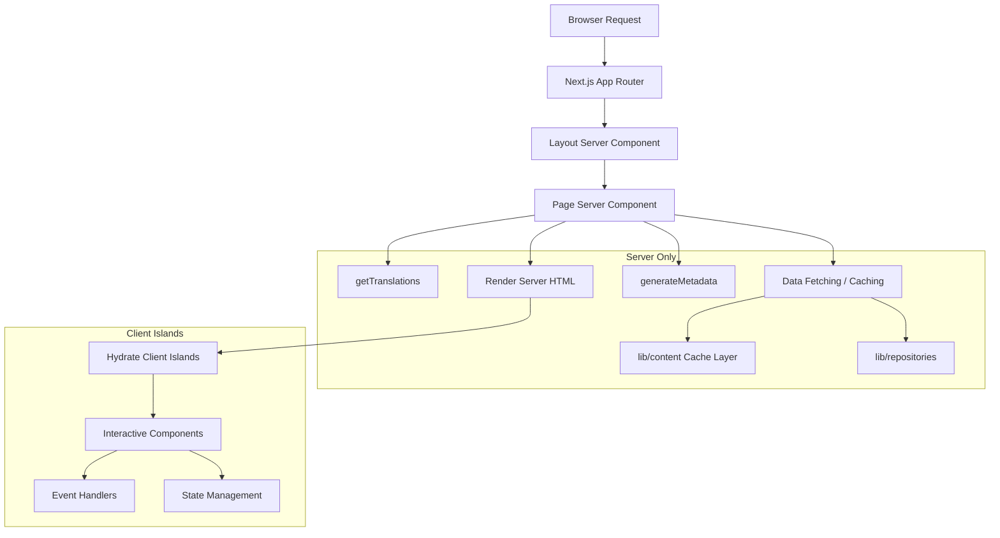

# Patronen van servercomponenten

## Overzicht

De Ever Works-sjabloon maakt gebruik van React Server Components (RSC) als de standaard renderingstrategie in de Next.js App Router. Servercomponenten verzorgen het ophalen van gegevens, het laden van vertalingen, het genereren van metagegevens en het samenstellen van de lay-out op de server, waarbij alleen de weergegeven HTML naar de client wordt verzonden.

## Architectuur



## Bronbestanden

|Bestand|Patroon gedemonstreerd|
|------|---------------------|
|`template/app/[locale]/about/page.tsx`|Gegevens ophalen, i18n, metadata, MDX-weergave|
|`template/app/[locale]/layout.tsx`|Hoofdindeling met localeprovider|
|`template/app/layout.tsx`|Globale lay-out, lettertypen, providers|
|`template/app/sitemap.ts`|Alleen server-routegeneratie|
|`template/app/robots.ts`|Configuratie alleen voor de server|

## Kernpatronen

### Patroon 1: Asynchrone paginacomponenten met i18n

Elke gelokaliseerde pagina volgt dit patroon:

```typescript
// Server Component -- no "use client" directive
export const revalidate = 3600; // ISR: revalidate every hour

interface PageProps {
    params: Promise<{ locale: string }>;
}

export async function generateMetadata({ params }: PageProps): Promise<Metadata> {
    const { locale } = await params;
    const t = await getTranslations({ locale, namespace: 'footer' });
    return {
        title: t('ABOUT_US'),
        description: t('ABOUT_PAGE_META_DESCRIPTION'),
        alternates: {
            languages: generateHreflangAlternates('/about')
        }
    };
}

export default async function AboutPage({ params }: PageProps) {
    const { locale } = await params;
    const pageData = await getCachedPageContent('about', locale);
    const tCommon = await getTranslations({ locale, namespace: 'common' });

    return (
        <PageContainer>
            <MDX source={pageData?.content || DEFAULT_CONTENT} />
        </PageContainer>
    );
}
```

Belangrijkste kenmerken:
- `params` is een `Promise` (Next.js 15+ App Router-conventie)
- Meerdere `getTranslations()` oproepen voor verschillende naamruimten
- Inhoud in cache ophalen via `getCachedPageContent()`
- Statisch hervalidatie-interval met `export const revalidate`

### Patroon 2: Generatie van metadata

Servercomponenten genereren SEO-metagegevens op routeniveau:

```typescript
export async function generateMetadata({ params }: PageProps): Promise<Metadata> {
    const { locale } = await params;
    const t = await getTranslations({ locale, namespace: 'pages' });

    return {
        metadataBase: new URL(appUrl),
        title: t('PAGE_TITLE'),
        description: t('PAGE_DESCRIPTION'),
        alternates: {
            languages: generateHreflangAlternates('/path')
        }
    };
}
```

Het hulpprogramma `generateHreflangAlternates()` van `lib/seo/hreflang.ts` genereert automatisch links naar alternatieve talen voor alle ondersteunde landinstellingen.

### Patroon 3: ISR met inhoudcaching

```typescript
export const revalidate = 3600; // Revalidate every hour

export default async function Page({ params }: PageProps) {
    const data = await getCachedPageContent('page-name', locale);
    // Render with cached data...
}
```

De functie `getCachedPageContent()` biedt een cachelaag aan de serverzijde over de op Git gebaseerde CMS-inhoud in `.content/`. Gecombineerd met `revalidate` ontstaat er een ISR-patroon (Incremental Static Regeneration) waarbij pagina's statisch worden gegenereerd en periodiek worden vernieuwd.

### Patroon 4: Authenticatiecontroles aan de serverzijde

Beveiligde pagina's maken gebruik van server-side beveiliging van `lib/auth/guards.ts`:

```typescript
import { requireAuth, requireAdmin } from '@/lib/auth/guards';

export default async function ProtectedPage() {
    const session = await requireAuth();
    // session.user is guaranteed to exist here
    return <div>Welcome {session.user.email}</div>;
}

export default async function AdminPage() {
    const session = await requireAdmin();
    // session.user.isAdmin is guaranteed true here
    return <AdminDashboard />;
}
```

Deze bewakers bellen `auth()` intern en gebruiken `redirect()` van `next/navigation` om niet-geverifieerde gebruikers naar de inlogpagina te sturen. De omleiding vindt plaats aan de serverzijde, dus er is geen client-JavaScript nodig.

### Patroon 5: Server- en clientcomponenten samenstellen

Servercomponenten delegeren interactiviteit naar clientcomponent "eilanden":

```typescript
// Server Component (page.tsx)
export default async function Page({ params }: PageProps) {
    const { locale } = await params;
    const data = await fetchData();
    const t = await getTranslations({ locale, namespace: 'page' });

    return (
        <div>
            <h1>{t('TITLE')}</h1>
            {/* Server-rendered static content */}
            <StaticContent data={data} />
            {/* Client island for interactivity */}
            <InteractiveFilter initialData={data} />
        </div>
    );
}
```

Gegevens stromen van server naar client als serialiseerbare rekwisieten. Clientcomponenten ontvangen vooraf opgehaalde gegevens en verwerken gebruikersinteracties.

## Strategieën voor het ophalen van gegevens

### Directe toegang tot de opslagplaats

Servercomponenten kunnen repositoryfuncties rechtstreeks importeren en oproepen:

```typescript
import { getItemBySlug } from '@/lib/repositories/item-repository';

export default async function ItemPage({ params }) {
    const item = await getItemBySlug(params.slug);
    // ...
}
```

### Gecachte inhoudslaag

Voor op Git gebaseerde CMS-inhoud:

```typescript
import { getCachedPageContent } from '@/lib/content';

const pageData = await getCachedPageContent('about', locale);
```

### Externe API-aanroepen

Servicefuncties in `lib/services/` omvatten externe API-interacties:

```typescript
import { triggerManualSync } from '@/lib/services/sync-service';
```

## Streaming en spanning

Servercomponenten ondersteunen streaming via React Suspense-grenzen. Grote pagina's kunnen laadstatussen voor afzonderlijke secties weergeven:

```typescript
import { Suspense } from 'react';

export default async function Page() {
    return (
        <div>
            <Header /> {/* Renders immediately */}
            <Suspense fallback={<LoadingSkeleton />}>
                <SlowDataSection /> {/* Streams when ready */}
            </Suspense>
        </div>
    );
}
```

## Best practices in de sjabloon

1. **Geen `"use client"` tenzij nodig** -- componenten zijn standaard servercomponenten
2. **Vertalingen geladen op de server** -- `getTranslations()` draait alleen op de server
3. **Metadata op dezelfde locatie als pagina's** -- `generateMetadata` wordt uit hetzelfde bestand geëxporteerd
4. **Hervalidatie op routeniveau** -- `export const revalidate` regelt de ISR-timing
5. **Bewakingsfuncties voor auth**: omleidingen aan de serverzijde zonder kosten voor clientbundels
6. **Props omlaag, gebeurtenissen omhoog**: servercomponenten geven gegevens als rekwisieten door aan clienteilanden
