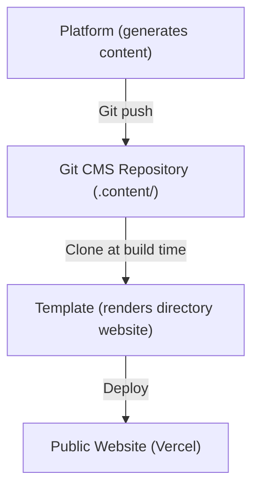
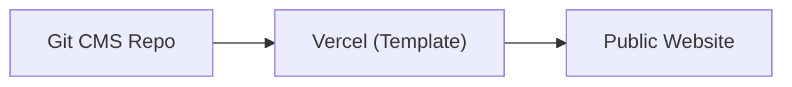
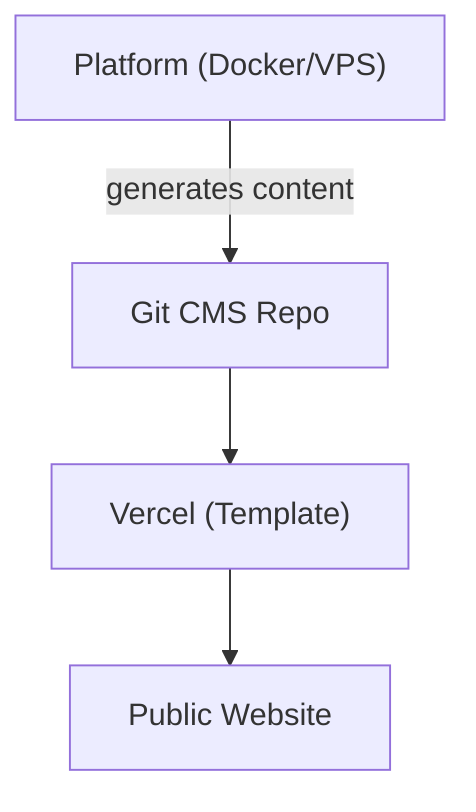
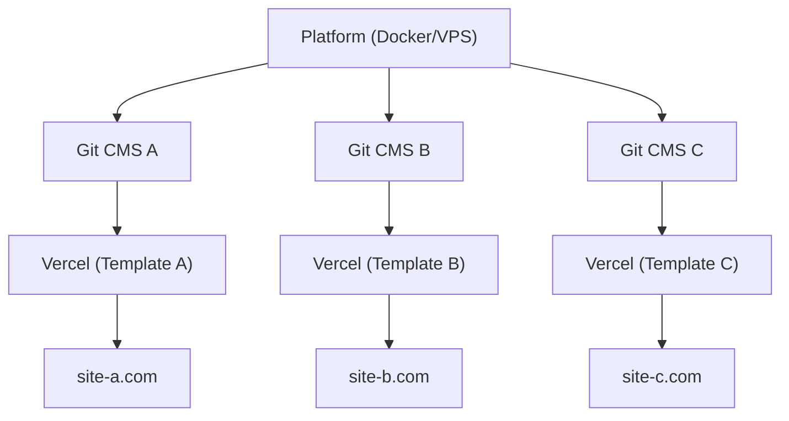

# Platform vs Template

Ever Works bestaat uit twee hoofdproducten die verschillende doelen dienen maar samenwerken als een verenigd ecosysteem. Deze pagina legt het verschil uit en wanneer welk product te gebruiken.

## Ever Works Platform

Het **Ever Works Platform** is de backend-infrastructuur voor het bouwen en beheren van directorywebsites op schaal. Het biedt een REST API, AI-gestuurde contentgeneratiepijplijnen, een plug-insysteem en deployment-orkestratie.

Voor volledige platformdocumentatie, bezoek [docs.ever.works](https://docs.ever.works).

## Directory Web Template

Het **Directory Web Template** (dit project) is een productieklare, full-stack directorywebsite die u kunt klonen, aanpassen en implementeren als een zelfstandige applicatie.

### Wat het doet

- Biedt een complete **directorywebsite** met itemlijsten, zoeken, filteren, categorieën, tags en collecties
- Bevat **authenticatie** via NextAuth.js v5 met OAuth-providers (Google, GitHub, Facebook, Twitter, Microsoft) en Supabase Auth
- Ondersteunt **betalingen** via Stripe, LemonSqueezy en Polar met abonnementsbeheer
- Biedt **internationalisering** met meerdere talen en RTL-ondersteuning via next-intl
- Gebruikt een **Git-gebaseerd CMS** om directory-inhoud te synchroniseren vanuit Git-repositories
- Bevat een **themasysteem** met ingebouwde thema's en dynamische kleurengeneratie
- Biedt **analyses en monitoring** via PostHog en Sentry
- Wordt geleverd met **SEO-optimalisatie**, sitemap-generatie en gestructureerde gegevens (JSON-LD)
- Bevat een **beheerderspaneel** met contentbeheer, gebruikersbeheer en analyses

### Tech Stack

- **Framework:** Next.js 15, React 19
- **Taal:** TypeScript 5
- **ORM:** Drizzle ORM (PostgreSQL)
- **UI:** Tailwind CSS 4, HeroUI React, Radix UI
- **Auth:** NextAuth.js v5, Supabase Auth
- **Betalingen:** Stripe, LemonSqueezy, Polar
- **Testen:** Playwright (E2E)
- **Implementatie:** Vercel (primair), Docker (alternatief)

## Vergelijking Naast Elkaar

| Aspect              | Platform                                   | Template                               |
| ------------------- | ------------------------------------------ | -------------------------------------- |
| **Doel**            | Backend-infrastructuur en AI-pijplijn      | Frontend directorywebsite              |
| **Architectuur**    | Monorepo (Turborepo + pnpm)                | Zelfstandige Next.js-applicatie        |
| **Backend**         | NestJS 11 API                              | Next.js API-routes                     |
| **Database ORM**    | TypeORM                                    | Drizzle ORM                            |
| **Authenticatie**   | JWT + OAuth (NestJS Guards)                | NextAuth.js v5 + Supabase Auth         |
| **Betalingen**      | Niet inbegrepen                            | Stripe, LemonSqueezy, Polar            |
| **AI-functies**     | LangChain-agents, 7 LLM-providers          | Geen (verbruikt AI-gegenereerde inhoud) |
| **Inhoud**          | Genereert inhoud via AI-pijplijnen         | Leest inhoud van Git-gebaseerd CMS     |
| **Implementatie**   | Docker op elke VPS                         | Vercel (of Docker)                     |
| **Testen**          | Jest + Vitest                              | Playwright                             |
| **Doelgroep**       | Platformbeheerders, AI-ontwikkelaars       | Website-bouwers, directorymakers       |

## Hoe Ze Verbinding Maken

Het Platform en het Template werken samen via het **Git-gebaseerde CMS**-patroon:

### Onafhankelijke Werking

- **Template zonder Platform:** Beheer directory-inhoud handmatig door YAML- en Markdown-bestanden in de Git CMS-repository te bewerken. Het Template werkt als een volledig functionele directorywebsite zonder AI-generatie.
- **Platform zonder Template:** Gebruik de Platform API om directorygegevens te genereren en te exporteren naar elk frontend.

## Wanneer Welk Te Gebruiken

### Gebruik het Template wanneer...

- U snel een directorywebsite wilt lanceren met minimale backend-installatie
- Uw directory-inhoud handmatig wordt gecureerd of afkomstig is uit een statische gegevensbron
- U een productieklare website nodig heeft met authenticatie, betalingen en SEO out of the box
- U de voorkeur geeft aan implementatie op Vercel zonder serverbeheer

### Gebruik het Platform wanneer...

- U AI-gestuurde contentgeneratie nodig heeft voor grote directories
- U geautomatiseerde pijplijnen wilt die directory-items ontdekken, verrijken en bijwerken
- U meerdere directories wilt beheren vanuit één backend
- U het plug-insysteem wilt gebruiken voor aangepaste integraties

### Gebruik beide wanneer...

- U wilt dat AI-gegenereerde inhoud in een productiewebsite stroomt
- U een SaaS-product bouwt op Ever Works
- U geautomatiseerde contentgeneratie EN een gepolijste frontend nodig heeft

## Implementatiearchitecturen

### Alleen Template (Eenvoudigst)

Handmatig contentbeheer via Git. Eén Vercel-implementatie.

### Platform + Template (Full Stack)

Geautomatiseerde contentgeneratie via Platform. Verbonden via Git.

### Platform + Meerdere Templates

Eén Platform-instantie beheert meerdere directorywebsites.
