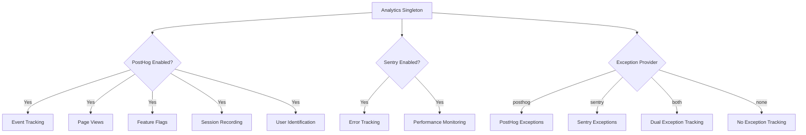
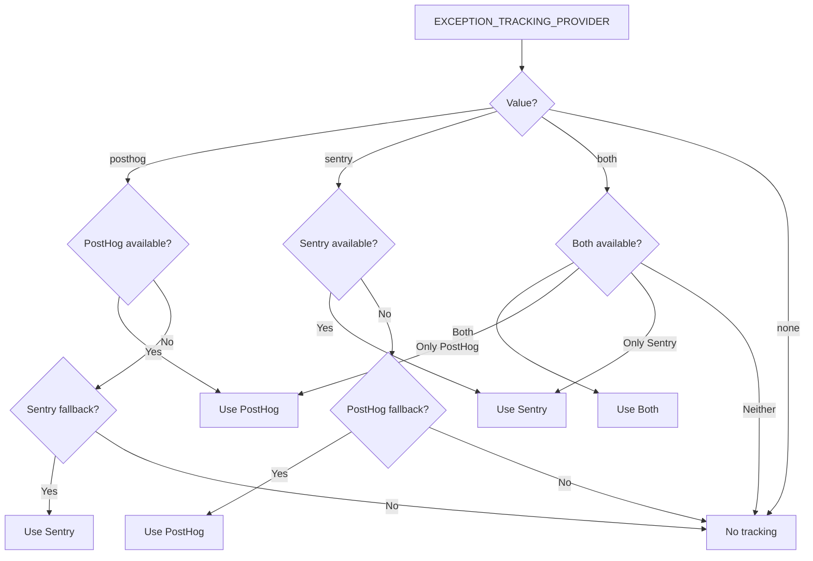

# Analytische Configuratie

Het template biedt een uniform analysesysteem dat PostHog integreert voor productanalyse en Sentry voor foutopsporing. Beide providers worden beheerd via een singleton `Analytics`-klasse met automatisch fallback-gedrag.

## Architectuur



## Omgevingsvariabelen

### PostHog-Configuratie

| Variable | Vereist | Standaard | Beschrijving |
|---|---|---|---|
| `NEXT_PUBLIC_POSTHOG_KEY` | Ja (voor analytiek) | -- | PostHog project API-sleutel |
| `NEXT_PUBLIC_POSTHOG_HOST` | Ja (voor analytiek) | -- | PostHog-instantie-URL |
| `POSTHOG_DEBUG` | Nee | `false` | Foutopsporingslogboek inschakelen |
| `POSTHOG_SESSION_RECORDING_ENABLED` | Nee | `true` | Sessieopnames inschakelen |
| `POSTHOG_AUTO_CAPTURE` | Nee | `false` | Paginaweergaven automatisch vastleggen |
| `POSTHOG_EXCEPTION_TRACKING` | Nee | `true` | PostHog-uitzonderingsregistratie inschakelen |

### Sentry-Configuratie

| Variable | Vereist | Standaard | Beschrijving |
|---|---|---|---|
| `NEXT_PUBLIC_SENTRY_DSN` | Ja (voor fouten) | -- | Sentry Data Source Name |
| `SENTRY_ENABLE_DEV` | Nee | `false` | Sentry inschakelen in ontwikkeling |
| `SENTRY_DEBUG` | Nee | `false` | Sentry-foutopsporingsmodus inschakelen |
| `SENTRY_EXCEPTION_TRACKING` | Nee | `true` | Sentry-uitzonderingsregistratie inschakelen |

### Gecombineerde Uitzonderingsregistratie

| Variable | Vereist | Standaard | Beschrijving |
|---|---|---|---|
| `EXCEPTION_TRACKING_PROVIDER` | Nee | `both` | Te gebruiken provider: `posthog`, `sentry`, `both` of `none` |

## PostHog Installatie

### Stap 1: Inloggegevens ophalen

1. Meld u aan bij [posthog.com](https://posthog.com) of host PostHog zelf
2. Maak een project aan
3. Kopieer de project-API-sleutel en de host-URL

### Stap 2: Omgeving Configureren

```env
NEXT_PUBLIC_POSTHOG_KEY=phc_your_project_key_here
NEXT_PUBLIC_POSTHOG_HOST=https://app.posthog.com
```

PostHog wordt automatisch ingeschakeld wanneer zowel `NEXT_PUBLIC_POSTHOG_KEY` als `NEXT_PUBLIC_POSTHOG_HOST` zijn ingesteld.

### Stap 3: Steekproeffrequenties

Steekproeffrequenties worden automatisch aangepast op basis van de omgeving:

| Omgeving | Gebeurtenis Steekproeffrequentie | Sessie-opname Steekproeffrequentie |
|---|---|---|
| Productie | 10% (`0.1`) | 10% (`0.1`) |
| Ontwikkeling | 100% (`1.0`) | 100% (`1.0`) |

## Sentry Installatie

### Stap 1: DSN ophalen

1. Maak een project aan op [sentry.io](https://sentry.io)
2. Kopieer de DSN uit de projectinstellingen

### Stap 2: Omgeving Configureren

```env
NEXT_PUBLIC_SENTRY_DSN=https://examplePublicKey@o0.ingest.sentry.io/0
SENTRY_ENABLE_DEV=true  # Optioneel: inschakelen in ontwikkeling
```

Sentry wordt automatisch ingeschakeld in productie wanneer de DSN is ingesteld. Stel voor ontwikkeling expliciet `SENTRY_ENABLE_DEV=true` in.

## Analytische Klasse API

De `Analytics`-klasse is een singleton dat toegankelijk is in de hele applicatie:

```typescript
import { analytics } from '@/lib/analytics';
```

### Initialisatie

```typescript
// Analytics initialiseren (eenmaal aanroepen in app-root)
analytics.init();
```

De `init()`-methode is alleen voor de client en kan veilig worden aangeroepen in servercontexten (daar doet het niets).

### Gebeurtenistracking

```typescript
// Een aangepaste gebeurtenis bijhouden
analytics.track('button_clicked', {
  buttonName: 'signup',
  page: '/landing'
});

// Een paginaweergave bijhouden
analytics.trackPageView('/dashboard', {
  referrer: document.referrer
});
```

### Gebruikersidentificatie

```typescript
// Een gebruiker identificeren (na inloggen)
analytics.identify('user-123', {
  email: 'user@example.com',
  plan: 'premium',
  company: 'Acme Inc.'
});

// Identiteit resetten (na uitloggen)
analytics.reset();

// Persistente gebruikerseigenschappen instellen
analytics.setUserProperties({
  subscription_tier: 'premium',
  signup_date: '2024-01-15'
});

// Supereigenschappen instellen (worden met elke gebeurtenis meegestuurd)
analytics.setSuperProperties({
  app_version: '2.0.0',
  platform: 'web'
});
```

### Functiemarkeringen

```typescript
// Controleren of een functiemarkering is ingeschakeld
const isEnabled = analytics.isFeatureEnabled('new-dashboard', false);

// Functiemarkeringen herladen van server
await analytics.reloadFeatureFlags();
```

### Uitzonderingsregistratie

```typescript
// Een uitzondering vastleggen (doorgestuurd naar geconfigureerde provider)
analytics.captureException(error, {
  component: 'PaymentForm',
  action: 'submit'
});

// Vastleggen met een tekenreeksbericht
analytics.captureException('Payment processing failed', {
  orderId: 'ord-123'
});
```

## Selectie van Uitzonderingsprovider



## Sessie-opname

Wanneer `POSTHOG_SESSION_RECORDING_ENABLED=true`, neemt PostHog gebruikerssessies op met deze privacy-instellingen:

```typescript
session_recording: {
  maskAllInputs: true,        // Formulierinvoerwaarden maskeren
  maskTextSelector: "[data-mask]",  // Elementen met data-mask maskeren
  sampleRate: 0.1,            // 10% in productie
}
```

Voeg `data-mask` toe aan elk element waarvan de tekstinhoud verborgen moet zijn in opnames.

## PostHog Uitzonderingsregistratie

Wanneer PostHog-uitzonderingsregistratie is ingeschakeld, installeert het systeem globale fouthandlers:

- **`window.onerror`** -- Vangt niet-afgehandelde JavaScript-fouten op
- **`unhandledrejection`** -- Vangt niet-afgehandelde Promise-afwijzingen op

Deze worden doorgestuurd naar PostHog als `$exception`-gebeurtenissen met stack-traces.

## Sentry-PostHog Integratie

Wanneer beide providers actief zijn (`EXCEPTION_TRACKING_PROVIDER=both`), maakt het systeem een bidirectionele koppeling:

1. De `sentry`-eigenschap van PostHog wordt ingesteld op de Sentry SDK
2. Een aangepaste Sentry-gebeurtenisverwerker stuurt fouten door naar PostHog als `sentry_error`-gebeurtenissen
3. Dit maakt het mogelijk om gebruikerssessies (PostHog) te correleren met foutdetails (Sentry)

## Constanten voor Bezoekerstracking

Het bestand `lib/constants/analytics.ts` biedt constanten voor anonieme bezoekerstracking:

```typescript
// Cookienaam voor anonieme bezoeker-ID
```
