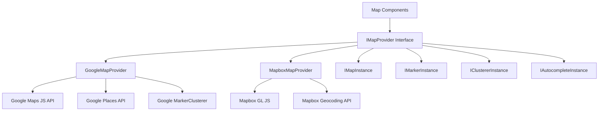
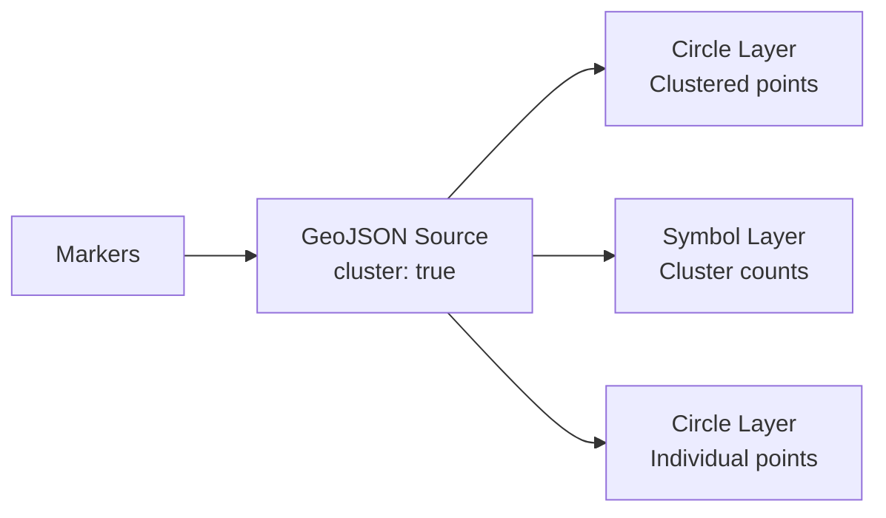

# Kaartconfiguratie

Het template bevat een provideropeenstapelend kaartsysteem dat zowel Google Maps als Mapbox GL JS ondersteunt. Een gedeelde interfacelaag maakt het mogelijk om tussen providers te wisselen zonder componentcode te wijzigen.

## Architectuur



## Providerselectie

De kaartprovider wordt bepaald door welke API-sleutels zijn geconfigureerd:

| Provider | Vereiste omgevingsvariabele |
|---|---|
| Google Maps | `NEXT_PUBLIC_GOOGLE_MAPS_API_KEY` |
| Mapbox | `NEXT_PUBLIC_MAPBOX_ACCESS_TOKEN` |

Als beide zijn geconfigureerd, wordt de provider geselecteerd via de kaartconfiguratie-instellingen van de applicatie.

## Google Maps-instelling

### Stap 1: API-sleutel ophalen

1. Ga naar [Google Cloud Console](https://console.cloud.google.com)
2. Schakel de volgende API's in:
   - Maps JavaScript API
   - Places API
   - Geocoding API
3. Maak een API-sleutel aan met HTTP-verwijzerbeperkingen

### Stap 2: Omgeving configureren

```env
NEXT_PUBLIC_GOOGLE_MAPS_API_KEY=AIzaSy...your-api-key
NEXT_PUBLIC_GOOGLE_MAPS_MAP_ID=your-map-id        # Optional: for styled maps
```

### Stap 3: Beveiliging

De Google Maps-provider afdwingt gebruik van sleutels alleen in de browser:

```typescript
// @security Uses NEXT_PUBLIC_GOOGLE_MAPS_API_KEY (browser-exposed).
// Only use HTTP referrer-restricted keys, never unrestricted or server keys.
```

**Vereiste API-sleutelbeperkingen:**
- Toepassingsbeperking: HTTP-verwijzers
- Voeg uw domeinpatronen toe (bijv. `https://uwdomein.com/*`)
- API-beperking: Beperk tot Maps JavaScript, Places en Geocoding API's

## Mapbox-instelling

### Stap 1: Toegangstoken ophalen

1. Meld u aan op [mapbox.com](https://www.mapbox.com)
2. Kopieer uw openbare toegangstoken (begint met `pk.`)

### Stap 2: Omgeving configureren

```env
NEXT_PUBLIC_MAPBOX_ACCESS_TOKEN=pk.eyJ1Ijoi...your-token
```

### Stap 3: Beveiliging

```typescript
// @security Uses NEXT_PUBLIC_MAPBOX_ACCESS_TOKEN (browser-exposed).
// Only use public tokens (pk.*) with URL restrictions, never secret tokens (sk.*).
```

**Vereiste tokenbeperkingen:**
- Gebruik een **openbaar** token (voorvoegsel `pk.`)
- Voeg URL-beperkingen toe voor uw domeinen
- Gebruik nooit geheime tokens (`sk.*`) in clientzijdige code

## Providerinterface

Beide providers implementeren de `IMapProvider`-interface met identieke mogelijkheden:

### IMapProvider-methoden

| Methode | Beschrijving |
|---|---|
| `isLoaded()` | Controleer of het providerscript is geladen |
| `loadScript()` | Laad de providerbibliotheek (idempotent) |
| `createMap(container, options)` | Maak een kaartinstantie in een DOM-element |
| `createMarker(map, options)` | Voeg een markering toe aan de kaart |
| `createClusterer(map, options, onClick)` | Groepeer nabijgelegen markeringen in clusters |
| `createAutocomplete(input, onSelect)` | Koppel adresautocomplete aan een invoerveld |
| `getStyleUrl(style)` | Haal de stijl-URL op voor straat- of satellietweergave |
| `isConfigured()` | Controleer of API-sleutels aanwezig zijn |

### Kaartstijlen

| Stijl | Google Maps | Mapbox |
|---|---|---|
| `streets` | `roadmap` | `mapbox://styles/mapbox/streets-v12` |
| `satellite` | `satellite` | `mapbox://styles/mapbox/satellite-streets-v12` |

## Typesysteem

De kaartbibliotheek definieert uitgebreide typen in `lib/maps/types.ts`:

### Kerntypes

```typescript
interface Coordinates {
  latitude: number;
  longitude: number;
}

interface MapBounds {
  north: number;
  south: number;
  east: number;
  west: number;
}

interface MapViewport {
  center: Coordinates;
  zoom: number;
  bounds?: MapBounds;
}
```

### Markeringstypes

```typescript
interface MapMarkerData {
  id: string;
  coordinates: Coordinates;
  title: string;
  icon?: string;
  category?: string;
  slug: string;
  description?: string;
}

interface MapMarkerWithDistance extends MapMarkerData {
  distanceKm?: number;
}
```

### Clusterconfiguratie

```typescript
interface ClusterOptions {
  radius?: number;     // Cluster radius in pixels (default: 60)
  maxZoom?: number;    // Max zoom for clustering (default: 16)
  minZoom?: number;    // Min zoom for clustering (default: 0)
  minPoints?: number;  // Min points to form cluster (default: 2)
}
```

### Gebeurtenisafhandelaars

```typescript
interface MapEventHandlers {
  onMarkerClick?: (marker: MapMarkerData) => void;
  onClusterClick?: (cluster: MapClusterData) => void;
  onViewportChange?: (viewport: MapViewport) => void;
  onMapReady?: () => void;
  onMapError?: (error: Error) => void;
}
```

## Kaartcomponenteigenschappen

De `MapComponentProps`-interface definieert de volledige set eigenschappen voor het hoofdkaartcomponent:

| Eigenschap | Type | Standaard | Beschrijving |
|---|---|---|---|
| `markers` | `MapMarkerData[]` | `[]` | Te tonen markeringen |
| `center` | `Coordinates` | -- | Initiële centrumpositie |
| `zoom` | `number` | -- | Initieel zoomniveau (1-20) |
| `style` | `MapStyle` | `streets` | Kaartstijl (straten/satelliet) |
| `height` | `string \| number` | -- | Containerhoogte |
| `width` | `string \| number` | -- | Containerbreedte |
| `enableClustering` | `boolean` | `false` | Markeerdersclustering inschakelen |
| `clusterOptions` | `ClusterOptions` | -- | Clusteringconfiguratie |
| `controls` | `MapControlsConfig` | -- | Instellingen voor UI-bedieningselementen |
| `isLoading` | `boolean` | `false` | Externe laadstatus |
| `isDisabled` | `boolean` | `false` | Interactie uitschakelen |
| `onMarkerClick` | `function` | -- | Klikafhandelaar voor markeringen |
| `onClusterClick` | `function` | -- | Klikafhandelaar voor clusters |
| `onViewportChange` | `function` | -- | Afhandelaar voor viewportwijzigingen |

## Adresautocomplete

Beide providers ondersteunen adresautocomplete met een uniforme interface:

```typescript
interface AddressSuggestion {
  id: string;
  mainText: string;       // Street address
  secondaryText: string;  // City, state
  fullAddress: string;    // Complete formatted address
  coordinates?: Coordinates;
}
```

**Google Maps:** Gebruikt de Places Autocomplete API met velden `formatted_address`, `geometry`, `name` en `address_components`.

**Mapbox:** Gebruikt de Geocoding API (`/geocoding/v5/mapbox.places/`) met debounced invoer (300ms) en een aangepast vervolgkeuzemenu.

## Locatieselector

De `LocationPickerProps`-interface ondersteunt een volledige locatieselectie-ervaring:

```typescript
interface LocationPickerValue {
  address?: string;
  city?: string;
  state?: string;
  country?: string;
  postalCode?: string;
  latitude?: number;
  longitude?: number;
  serviceArea?: 'local' | 'regional' | 'national' | 'global';
  isRemote?: boolean;
}
```

## Geocoderingsdiensten

Servergestuurde geocodering is beschikbaar via `lib/services/geocoding/`:

| Bestand | Doel |
|---|---|
| `geocoding-provider.interface.ts` | Gedeelde geocoderingsinterface |
| `google-geocoding.provider.ts` | Implementatie van Google Geocoding API |
| `mapbox-geocoding.provider.ts` | Implementatie van Mapbox Geocoding API |
| `geocoding.service.ts` | Uniforme geocoderingsdienst |

## Clusteringimplementatie

### Google Maps-clustering

Gebruikt `@googlemaps/markerclusterer` met `AdvancedMarkerElement`:

- Importeert de clustererbibliotheek dynamisch
- Maakt aangepaste markeerdersinhoudelementen met pictogrammen
- Standaardgedrag: zoom naar clustergrenzen bij klikken

### Mapbox-clustering

Gebruikt native Mapbox GL bronlaagclustering:

- GeoJSON-bron met `cluster: true`
- Drie lagen: clustercirkels, aantallabels, niet-geclusterde punten
- Kleurgecodeerd op clustergrootte (klein: cyaan, middel: geel, groot: roze)



## Bedieningselementen configureren

```typescript
interface MapControlsConfig {
  showZoomControls?: boolean;        // Zoom in/out buttons
  showFullscreenControl?: boolean;   // Fullscreen toggle
  showNavigationControl?: boolean;   // Compass/navigation
  showScaleControl?: boolean;        // Distance scale
}
```

## Probleemoplossing

| Probleem | Oplossing |
|---|---|
| Kaart wordt niet weergegeven | Controleer of de API-sleutel is ingesteld en correct is |
| "Google Maps API key not configured" | Stel `NEXT_PUBLIC_GOOGLE_MAPS_API_KEY` in |
| Mapbox lege kaart | Zorg ervoor dat het token begint met `pk.` (openbaar) |
| Markeringen clusteren niet | Stel `enableClustering={true}` in op het kaartcomponent |
| Autocomplete werkt niet | Controleer of Places API is ingeschakeld (Google) |
| CORS-fouten | Controleer de domeinbeperkingen van de API-sleutel |
| Snelheidslimiet | Controleer het API-gebruik in het providerdashboard |
