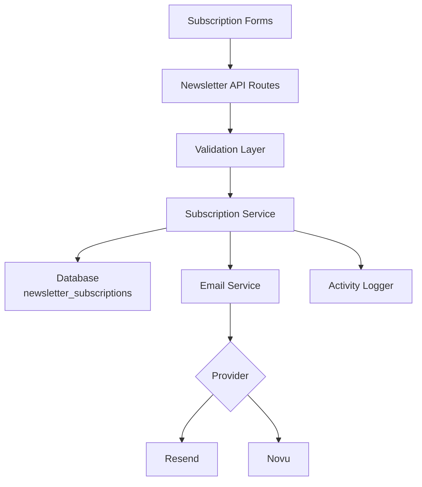
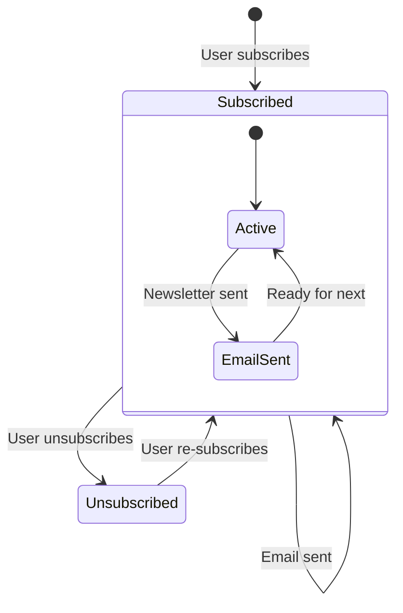

# Newsletter Configuratie

De template bevat een volledig newsletter-abonnementsysteem met e-mailprovider-integratie, validatie, abonnement-levenscyclusbeheer en activiteitsregistratie. De configuratie is gecentraliseerd in `lib/newsletter/`.

## Architectuur



## Bestandsstructuur

```
lib/newsletter/
├── config.ts    # Configuration, types, validation schemas
└── utils.ts     # Email sending, subscription validation, logging
```

## Configuratieconstanten

Het `NEWSLETTER_CONFIG`-object in `config.ts` definieert alle standaardwaarden en berichten:

```typescript
export const NEWSLETTER_CONFIG = {
  DEFAULT_PROVIDER: "resend",
  DEFAULT_FROM: "onboarding@resend.dev",
  DEFAULT_COMPANY_NAME: "Ever Works",

  SOURCES: {
    FOOTER: "footer",
    POPUP: "popup",
    SIGNUP: "signup",
  },

  ERRORS: {
    INVALID_EMAIL: "Please enter a valid email address",
    ALREADY_SUBSCRIBED: "Email is already subscribed to the newsletter",
    NOT_SUBSCRIBED: "Email is not subscribed to the newsletter",
    SUBSCRIPTION_FAILED: "Failed to create subscription. Please try again.",
    UNSUBSCRIPTION_FAILED: "Failed to unsubscribe. Please try again.",
    EMAIL_SEND_FAILED: "Failed to send email. Please try again.",
    STATS_FAILED: "Failed to get newsletter statistics",
  },

  SUCCESS: {
    SUBSCRIBED: "Successfully subscribed to newsletter",
    UNSUBSCRIBED: "Successfully unsubscribed from newsletter",
  },
};
```

## E-mailprovider Instellen

### Resend (Standaard)

```env
RESEND_API_KEY=re_your_api_key_here
```

1. Meld u aan op [resend.com](https://resend.com)
2. Maak een API-sleutel aan
3. Verifieer uw verzenddomein (of gebruik `onboarding@resend.dev` voor testen)

### Novu

```env
NOVU_API_KEY=your_novu_api_key
```

Voor Novu is aanvullende configuratie beschikbaar in de siteconfiguratie:

```yaml
mail:
  provider: "novu"
  template_id: "your-template-id"
  backend_url: "https://api.novu.co"
```

## E-mailconfiguratie

De `createEmailConfig()`-functie bouwt de e-mailconfiguratie uit de applicatieconfiguratie:

```typescript
interface EmailConfig {
  provider: string;      // "resend" or "novu"
  defaultFrom: string;   // Sender email address
  domain: string;        // Application domain URL
  apiKeys: {
    resend: string;
    novu: string;
  };
  novu?: {
    templateId?: string;
    backendUrl?: string;
  };
}
```

Configuratieprioriteit:

| Instelling       | Bron                           | Terugvalwaarde             |
|---|---|---|
| Provider         | `config.mail.provider`         | `"resend"`                 |
| Afzenderadres    | `config.mail.default_from`     | `"onboarding@resend.dev"`  |
| Domein           | `config.app_url`               | `coreConfig.APP_URL`       |
| Resend-sleutel   | `RESEND_API_KEY`-omgevingsvar. | Lege string                |
| Novu-sleutel     | `NOVU_API_KEY`-omgevingsvar.  | Lege string                |

## Validatieschema's

Het newslettersysteem gebruikt Zod-schema's voor invoervalidatie:

### E-mailschema

```typescript
const emailSchema = z.object({
  email: z
    .string()
    .email("Please enter a valid email address")
    .transform((email) => email.toLowerCase().trim()),
});
```

### Abonnementschema

```typescript
const newsletterSubscriptionSchema = z.object({
  email: z
    .string()
    .email("Please enter a valid email address")
    .transform((email) => email.toLowerCase().trim()),
  source: z
    .enum(["footer", "popup", "signup"])
    .default("footer"),
});
```

## Abonnementbronnen

Bijhouden waar abonnementen vandaan komen:

| Bron     | Beschrijving                                |
|---|---|
| `footer` | Abonnementformulier in de website-voettekst |
| `popup`  | Newsletter-popup/modal                      |
| `signup` | Accountregistratieprocedure                 |

## Newsletter-hulpprogramma's

### E-mail Verzenden

```typescript
import { sendEmailSafely, createEmailService } from '@/lib/newsletter/utils';

// Create email service
const { service, config } = await createEmailService();

// Send email with error handling
const result = await sendEmailSafely(
  service,
  config,
  {
    subject: "Welcome to our newsletter!",
    html: "<h1>Welcome!</h1>",
    text: "Welcome!"
  },
  "user@example.com",
  "welcome"
);

if (!result.success) {
  console.error(result.error);
}
```

### Abonnementvalidatie

```typescript
import { canSubscribe, canUnsubscribe } from '@/lib/newsletter/utils';

// Check if email can be subscribed
const { canSubscribe: allowed, error } = await canSubscribe("user@example.com");
if (!allowed) {
  // Email is already subscribed
}

// Check if email can be unsubscribed
const { canUnsubscribe: allowed, error } = await canUnsubscribe("user@example.com");
if (!allowed) {
  // Email is not currently subscribed
}
```

### Activiteitsregistratie

```typescript
import { logNewsletterActivity, trackNewsletterMetric } from '@/lib/newsletter/utils';

// Log newsletter activity
logNewsletterActivity("subscribe", "user@example.com", "footer", {
  ip: "192.168.1.1"
});

// Track newsletter metrics
trackNewsletterMetric("subscription", "user@example.com", "popup");
```

Activiteitstypen:

| Actie          | Wanneer Geregistreerd                             |
|---|---|
| `subscribe`    | Gebruiker abonneert op de newsletter              |
| `unsubscribe`  | Gebruiker meldt zich af                           |
| `email_sent`   | Newsletter-e-mail succesvol verzonden             |
| `email_failed` | Newsletter-e-mail verzenden mislukt               |

### Sjabloon-hulpprogramma's

```typescript
import { getTemplateWithCompany } from '@/lib/newsletter/utils';

// Generate email template with company name
const template = await getTemplateWithCompany(
  (email, companyName) => ({
    subject: `Welcome to ${companyName}`,
    html: `<p>Thanks for subscribing, ${email}!</p>`,
    text: `Thanks for subscribing, ${email}!`
  }),
  "user@example.com"
);
```

### Antwoord-hulpfuncties

```typescript
import { createErrorResponse, createSuccessResponse } from '@/lib/newsletter/utils';

// Standardized error response
const error = createErrorResponse(
  "Subscription failed",
  "user@example.com",
  "subscribe"
);
// { error: "Subscription failed", email: "user@example.com", context: "subscribe" }

// Standardized success response
const success = createSuccessResponse("user@example.com", "subscribe");
// { success: true, email: "user@example.com", context: "subscribe" }
```

## Databaseschema

Newsletter-abonnementen worden opgeslagen in de `newsletter_subscriptions`-tabel:

| Kolom            | Type      | Beschrijving                                     |
|---|---|---|
| `id`             | UUID      | Primaire sleutel                                 |
| `email`          | String    | E-mailadres abonnee (uniek)                      |
| `isActive`       | Boolean   | Huidige abonnementsstatus                        |
| `subscribedAt`   | Timestamp | Wanneer het abonnement begon                     |
| `unsubscribedAt` | Timestamp | Wanneer afgemeld (nullable)                      |
| `lastEmailSent`  | Timestamp | Laatste e-mail verzonden naar abonnee            |
| `source`         | String    | Abonnementsbron (footer, popup, signup)          |

## Abonnements-levenscyclus



## Typen

```typescript
type NewsletterSource = "footer" | "popup" | "signup";

interface NewsletterActionResult {
  success?: boolean;
  error?: string;
  email?: string;
}

interface NewsletterStats {
  totalActive: number;
  recentSubscriptions: number;
}
```

## Beveiliging

- E-mailadressen worden genormaliseerd naar kleine letters en getrimd vóór opslag
- E-mailvalidatie gebruikt een veilige regex die ReDoS-aanvallen voorkomt (uit `lib/utils/email-validation.ts`)
- De `sendEmailSafely`-functie omhult alle e-mailoperaties in try-catch-blokken
- API-sleutels worden nooit aan de client blootgesteld — alle e-mailoperaties vinden server-side plaats

## Probleemoplossing

| Probleem                         | Oplossing                                                                       |
|---|---|
| E-mails worden niet verzonden    | Verifieer dat `RESEND_API_KEY` of `NOVU_API_KEY` is ingesteld                   |
| „Al geabonneerd"-fout            | Controleer de `newsletter_subscriptions`-tabel op bestaand actief item          |
| Verkeerd afzenderadres           | Werk `mail.default_from` bij in de siteconfiguratie                             |
| Sjabloon laadt niet              | Zorg dat `getCompanyName()` toegang heeft tot de siteconfiguratie               |
| Bron wordt niet bijgehouden      | Geef de `source`-parameter door in abonnementverzoeken                          |
