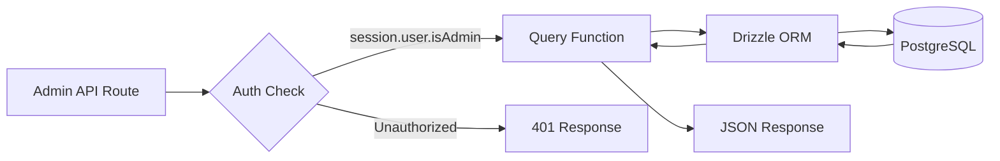
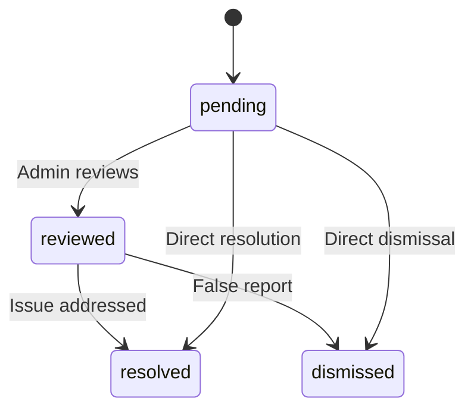

# Query's voor beheerdersdatabases

Beheerdersquery's behandelen itembeheer, gebruikers-/clientbeheer, op rollen gebaseerde toegang, dashboardstatistieken, rapportmoderatie en instellingen. Deze functies worden voornamelijk gebruikt door API-routes onder `app/api/admin/`.

## Beheerquerystroom



## Gebruikersbeheer (`user.queries.ts`)

### Kernfuncties

|Functie|Parameters|Retouren|Beschrijving|
|----------|-----------|---------|-------------|
|`getUserByEmail`|`email: string`|`Gebruiker \|nul`|Zoek gebruiker op e-mailadres|
|`getUserById`|`id: string`|`Gebruiker \|nul`|Zoek gebruiker op primaire sleutel|
|`insertNewUser`|`user: NewUser`|`User[]`|Maak een nieuw gebruikersrecord|
|`updateUserPassword`|`hash, userId`|`void`|Wachtwoord-hash bijwerken|
|`updateUserVerification`|`email, verified`|`void`|Stel de e-mailverificatiestatus in|
|`softDeleteUser`|`userId: string`|`void`|Zacht verwijderen (voegt `-deleted` toe aan e-mail)|
|`isUserAdmin`|`userId: string`|`boolean`|Controleer de beheerdersrol via deelname|

### Controle van beheerdersrollen

De functie `isUserAdmin` voert een join met meerdere tabellen uit om de beheerdersstatus te verifiëren:

```typescript
export async function isUserAdmin(userId: string): Promise<boolean> {
  const result = await db
    .select({ isAdmin: roles.isAdmin })
    .from(userRoles)
    .innerJoin(roles, eq(userRoles.roleId, roles.id))
    .where(and(
      eq(userRoles.userId, userId),
      eq(roles.isAdmin, true),
      eq(roles.status, 'active')
    ))
    .limit(1);

  return result.length > 0;
}
```

### Patroon zacht verwijderen

Gebruikers worden nooit fysiek verwijderd. Bij de zachte verwijdering wordt de gebruikers-ID samengevoegd met de e-mail om het e-mailadres vrij te maken voor herregistratie:

```typescript
export async function softDeleteUser(userId: string) {
  return db
    .update(users)
    .set({
      deletedAt: sql`CURRENT_TIMESTAMP`,
      email: sql`CONCAT(email, '-', id, '-deleted')`
    })
    .where(eq(users.id, userId));
}
```

## Klantenbeheer (`client.queries.ts`)

### PROFIEL CRUD

|Functie|Beschrijving|
|----------|-------------|
|`createClientProfile(data)`|Maak een profiel aan met automatisch gegenereerde unieke gebruikersnaam|
|`getClientProfileById(id)`|Ophalen op profiel-ID|
|`getClientProfileByUserId(userId)`|Ophalen op basis van gebruikersreferentie|
|`getClientProfileByEmail(email)`|Ophalen via het opzoeken van de rekeningentabel|
|`updateClientProfile(id, data)`|Gedeeltelijke update met tijdstempel|
|`deleteClientProfile(id)`|Harde verwijdering van profielrecord|

### Beheerdersdashboardgegevens

De `getAdminDashboardData`-functie is geoptimaliseerd voor het beheerdersdashboard en retourneert zowel een gepagineerde klantenlijst als uitgebreide statistieken in een minimaal aantal zoekopdrachten:

```typescript
export async function getAdminDashboardData(params: {
  page: number;
  limit: number;
  search?: string;
  status?: string;
  plan?: string;
  accountType?: string;
  provider?: string;
  createdAfter?: Date;
  createdBefore?: Date;
}): Promise<{
  clients: ClientProfileWithAuth[];
  stats: { overview, byProvider, byPlan, byAccountType, activity, growth };
  pagination: { page, totalPages, total, limit };
}>
```

De functie sluit admin-gebruikers uit van klantenlijsten met behulp van een LEFT JOIN + IS NULL-patroon:

```typescript
// Exclude admin users from client listing
.leftJoin(userRoles, eq(userRoles.userId, clientProfiles.userId))
.leftJoin(roles, and(eq(userRoles.roleId, roles.id), eq(roles.isAdmin, true)))
.where(isNull(roles.id))  // Only non-admin users
```

### Geavanceerd zoeken naar klanten

`advancedClientSearch` ondersteunt complexe filtering op meerdere criteria:

|Categorie filteren|Parameters|
|----------------|------------|
|**Tekst zoeken**|`search` (via naam, e-mailadres, gebruikersnaam, bedrijf, biografie, functietitel, branche, locatie)|
|**Enumfilters**|`status`, `plan`, `accountType`, `provider`|
|**Datumbereiken**|`createdAfter`, `createdBefore`, `updatedAfter`, `updatedBefore`, `dateRange`|
|**Veldspecifiek**|`emailDomain`, `companySearch`, `locationSearch`, `industrySearch`|
|**Numeriek**|`minSubmissions`, `maxSubmissions`|
|**Booleaans**|`hasAvatar`, `hasWebsite`, `hasPhone`, `emailVerified`, `twoFactorEnabled`|
|**Sorteren**|`sortBy` (aangemaaktAt, bijgewerktAt, naam, e-mailadres, bedrijf, totaalaantal inzendingen), `sortOrder`|

### Klantstatistieken

`getEnhancedClientStats` retourneert een uitgebreid overzicht:

```typescript
{
  overview: { total, active, inactive, suspended, trial },
  byProvider: { credentials, google, github, facebook, twitter, linkedin, other },
  byPlan: { free: number, standard: number, premium: number },
  byAccountType: { individual, business, enterprise },
  activity: { newThisWeek, newThisMonth, activeThisWeek, activeThisMonth },
  growth: { weeklyGrowth, monthlyGrowth },
}
```

## Rapportbeheer (`report.queries.ts`)

### Rapporteer CRUD

|Functie|Beschrijving|
|----------|-------------|
|`createReport(data)`|Maak een inhoudsrapport (item of opmerking)|
|`getReportById(id)`|Ontvang een rapport met verslaggever- en recensentgegevens|
|`getReports(params)`|Gepagineerde rapportlijst met filters|
|`updateReport(id, data)`|Update status, oplossing, voeg beoordelingsnotities toe|
|`getReportStats()`|Statistieken per status, inhoudstype, reden|
|`hasUserReportedContent(reportedBy, contentType, contentId)`|Dubbele rapportcontrole|

### Rapportstatusstroom



### Rapportfiltering

Rapporten ondersteunen filteren op status, inhoudstype (item/opmerking) en reden (spam, intimidatie, ongepast, anders):

```typescript
export async function getReports(params: {
  page?: number;
  limit?: number;
  search?: string;
  status?: ReportStatusValues;
  contentType?: ReportContentTypeValues;
  reason?: ReportReasonValues;
}): Promise<{
  reports: ReportWithReporter[];
  total: number;
  page: number;
  totalPages: number;
  limit: number;
}>
```

## Dashboardstatistieken (`dashboard.queries.ts`)

### Beschikbare statistieken

|Functie|Doel|Gebruikt binnen|
|----------|---------|---------|
|`getVotesReceivedCount(itemSlugs)`|Totaal aantal stemmen op items|Dashboardoverzicht|
|`getCommentsReceivedCount(itemSlugs)`|Totaal aantal reacties op items|Dashboardoverzicht|
|`getUniqueItemsInteractedCount(clientId)`|Items waar de gebruiker mee bezig is geweest|Activiteitenpaneel|
|`getUserTotalActivityCount(clientId)`|Totaal aantal stemmen + opmerkingen per gebruiker|Activiteitenpaneel|
|`getWeeklyEngagementData(itemSlugs, weeks)`|Wekelijks overzicht van stemmen/opmerkingen|Betrokkenheidsgrafiek|
|`getDailyActivityData(clientId, itemSlugs, days)`|Uitsplitsing van dagelijkse activiteiten|Activiteitengrafiek|
|`getTopItemsEngagement(itemSlugs, limit)`|Topitems op basis van betrokkenheid|Paneel met topitems|

### Wekelijkse betrokkenheidsgegevens

Retourneert betrokkenheidsgegevens verzameld per ISO-week, passend bij de `to_char(date, 'IYYY-IW')`-indeling van PostgreSQL:

```typescript
const weeklyVotes = await db
  .select({
    week: sql<string>`to_char(${votes.createdAt}, 'IYYY-IW')`.as('week'),
    count: count(),
  })
  .from(votes)
  .where(and(inArray(votes.itemId, itemSlugs), gte(votes.createdAt, startDate)))
  .groupBy(sql`to_char(${votes.createdAt}, 'IYYY-IW')`)
  .orderBy(sql`to_char(${votes.createdAt}, 'IYYY-IW')`);
```

## Authentificatietokenbeheer (`auth.queries.ts`)

|Functie|Beschrijving|
|----------|-------------|
|`getPasswordResetTokenByEmail(email)`|Vind het resettoken per e-mail|
|`getPasswordResetTokenByToken(token)`|Zoek het reset-token per tokenreeks|
|`deletePasswordResetToken(token)`|Verwijder het gebruikte/verlopen token|
|`getVerificationTokenByEmail(email)`|Zoek het verificatietoken per e-mail|
|`getVerificationTokenByToken(token)`|Zoek het verificatietoken op tokenreeks|
|`deleteVerificationToken(token)`|Verwijder het gebruikte/verlopen token|

Alle tokenfuncties volgen hetzelfde eenvoudige patroon van selecteren per veld met `.limit(1)`.
