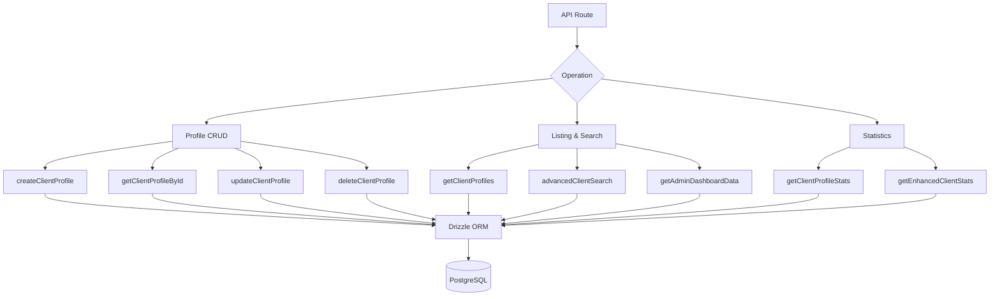

# Klantgerichte vragen

Klantvragen behandelen profielbeheer, vermeldingen met authenticatie-metagegevens, geavanceerd zoeken op meerdere criteria en uitgebreide statistieken. Alle functies bevinden zich in `client.queries.ts` en worden gebruikt door zowel beheerders- als klantgerichte API-routes.

## Architectuur voor klantquery's



## PROFIEL CRUD

### Profiel aanmaken

Nieuwe profielen genereren automatisch unieke gebruikersnamen vanaf het e-mailadres als er geen gebruikersnaam is opgegeven:

```typescript
export async function createClientProfile(data: {
  userId: string;
  email: string;
  name: string;
  displayName?: string;
  username?: string;
  bio?: string;
  jobTitle?: string;
  company?: string;
  status?: string;
  plan?: string;
  accountType?: string;
}): Promise<ClientProfile>
```

Logica voor het genereren van gebruikersnaam:

1. Als `username` wordt opgegeven, normaliseer en zorg voor uniciteit
2. Haal anders de gebruikersnaam uit de e-mail via `extractUsernameFromEmail()`
3. Terugval: genereer het voorvoegsel `user<timestamp>`
4. Alle paden lopen via `ensureUniqueUsername()`, waaraan indien nodig numerieke achtervoegsels worden toegevoegd

Standaardwaarden toegepast tijdens het maken:

|Veld|Standaard|
|-------|---------|
|`displayName`|Hetzelfde als `name`|
|`bio`|`"Welcome! I'm a new user on this platform."`|
|`jobTitle`|`"User"`|
|`company`|`"Unknown"`|
|`status`|`"active"`|
|`plan`|`"free"`|
|`accountType`|`"individual"`|

### Lees Operaties

|Functie|Opzoekveld|Retouren|
|----------|-------------|---------|
|`getClientProfileById(id)`|`clientProfiles.id`|`Klantprofiel \|nul`|
|`getClientProfileByUserId(userId)`|`clientProfiles.userId`|`Klantprofiel \|nul`|
|`getClientProfileByEmail(email)`|Via `accounts` tabel|`Klantprofiel \|nul`|

De op e-mail gebaseerde zoekopdracht wordt via de `accounts` tabel uitgevoerd om de bijbehorende `userId` te vinden en vraagt vervolgens `clientProfiles`:

```typescript
export async function getClientProfileByEmail(email: string): Promise<ClientProfile | null> {
  const account = await getClientAccountByEmail(email);
  if (!account) return null;
  const [profile] = await db
    .select()
    .from(clientProfiles)
    .where(eq(clientProfiles.userId, account.userId))
    .limit(1);
  return profile || null;
}
```

### Bijwerken en verwijderen

- **`updateClientProfile(id, data)`** -- Gedeeltelijke update met automatische `updatedAt` tijdstempel
- **`deleteClientProfile(id)`** -- Harde verwijdering (retourneert Booleaans succes)

## Gepagineerde vermelding

`getClientProfiles` retourneert gepagineerde resultaten met gegevens van de authenticatieprovider, exclusief beheerders:

```typescript
export async function getClientProfiles(params: {
  page?: number;
  limit?: number;
  search?: string;
  status?: string;
  plan?: string;
  accountType?: string;
  provider?: string;
}): Promise<{
  profiles: ClientProfileWithAuth[];
  total: number;
  page: number;
  totalPages: number;
  limit: number;
}>
```

### Uitsluitingspatroon voor beheerders

Zowel de telquery als de gegevensquery gebruiken een LEFT JOIN + IS NULL-patroon om beheerdersgebruikers uit te sluiten:

```typescript
.leftJoin(userRoles, eq(userRoles.userId, clientProfiles.userId))
.leftJoin(roles, and(eq(userRoles.roleId, roles.id), eq(roles.isAdmin, true)))
.where(isNull(roles.id))  // Only non-admin users
```

### Subquery van provider

Om dubbele rijen te voorkomen wanneer een gebruiker meerdere auth-accounts heeft, wordt de provider opgelost via een scalaire subquery:

```typescript
accountProvider: sql<string>`coalesce(
  (SELECT provider FROM ${accounts}
   WHERE ${accounts.userId} = ${clientProfiles.userId}
   LIMIT 1),
  'unknown'
)`
```

### Zoekfilter

Tekstzoekopdrachten gebruiken `ILIKE` in meerdere velden met preventie van SQL-injectie:

```typescript
const escapedSearch = search
  .replace(/\\/g, '\\\\')
  .replace(/[%_]/g, '\\$&');

whereConditions.push(
  sql`(${clientProfiles.username} ILIKE ${`%${escapedSearch}%`} OR
       ${clientProfiles.displayName} ILIKE ${`%${escapedSearch}%`} OR
       ${clientProfiles.company} ILIKE ${`%${escapedSearch}%`} OR
       ${clientProfiles.name} ILIKE ${`%${escapedSearch}%`} OR
       ${clientProfiles.email} ILIKE ${`%${escapedSearch}%`})`
);
```

## Geavanceerd zoeken naar klanten

`advancedClientSearch` ondersteunt meer dan 20 filtercriteria in meerdere categorieën:

|Categorie filteren|Parameters|
|----------------|------------|
|**Tekst zoeken**|`search` (via naam, e-mailadres, gebruikersnaam, bedrijf, biografie, functietitel, branche, locatie)|
|**Enumfilters**|`status`, `plan`, `accountType`, `provider`|
|**Datumbereiken**|`createdAfter`, `createdBefore`, `updatedAfter`, `updatedBefore`, `dateRange`|
|**Veldspecifiek**|`emailDomain`, `companySearch`, `locationSearch`, `industrySearch`|
|**Numeriek**|`minSubmissions`, `maxSubmissions`|
|**Booleaans**|`hasAvatar`, `hasWebsite`, `hasPhone`, `emailVerified`, `twoFactorEnabled`|
|**Sorteren**|`sortBy`, `sortOrder`|

## Klantstatistieken

### Basisstatistieken

`getClientProfileStats` retourneert eenvoudige tellingen:

```typescript
{
  total: number;
  active: number;
  inactive: number;
  byPlan: Record<string, number>;
  byAccountType: Record<string, number>;
}
```

### Verbeterde statistieken

`getEnhancedClientStats` biedt een uitgebreide, multidimensionale uitsplitsing:

```typescript
{
  overview: { total, active, inactive, suspended, trial },
  byProvider: { credentials, google, github, facebook, twitter, linkedin, other },
  byPlan: { free: number, standard: number, premium: number },
  byAccountType: { individual, business, enterprise },
  activity: { newThisWeek, newThisMonth, activeThisWeek, activeThisMonth },
  growth: { weeklyGrowth, monthlyGrowth },
}
```

De verbeterde statistieken gebruiken `countDistinct` met deelname aan meerdere tafels om nauwkeurige tellingen te produceren, zelfs als gebruikers meerdere accountproviders hebben:

```typescript
const statsResult = await db
  .select({
    status: clientProfiles.status,
    plan: clientProfiles.plan,
    accountType: clientProfiles.accountType,
    provider: accounts.provider,
    count: countDistinct(clientProfiles.id)
  })
  .from(clientProfiles)
  .leftJoin(accounts, eq(clientProfiles.userId, accounts.userId))
  .leftJoin(userRoles, eq(userRoles.userId, clientProfiles.userId))
  .leftJoin(roles, and(eq(userRoles.roleId, roles.id), eq(roles.isAdmin, true)))
  .where(isNull(roles.id))
  .groupBy(
    clientProfiles.status,
    clientProfiles.plan,
    clientProfiles.accountType,
    accounts.provider
  );
```

### Activiteitsstatistieken

Activiteitsvensters worden berekend met behulp van datumberekeningen:

```typescript
const oneWeekAgo = new Date(now.getTime() - 7 * 24 * 60 * 60 * 1000);
const oneMonthAgo = new Date(now.getTime() - 30 * 24 * 60 * 60 * 1000);
```

Groeipercentages zijn vereenvoudigde percentages nieuwe registraties ten opzichte van het totaal:

```typescript
const weeklyGrowth = total > 0 ? Math.round((newThisWeek / total) * 100) : 0;
```

## Soorten

Alle clientquerytypen zijn gedefinieerd in `lib/db/queries/types.ts`:

```typescript
export type ClientProfileWithAuth = ClientProfile & {
  accountProvider: string;
  isActive: boolean;
};

export type ClientStatus = "active" | "inactive" | "suspended" | "trial";
export type ClientPlan = "free" | "standard" | "premium";
export type ClientAccountType = "individual" | "business" | "enterprise";
```
