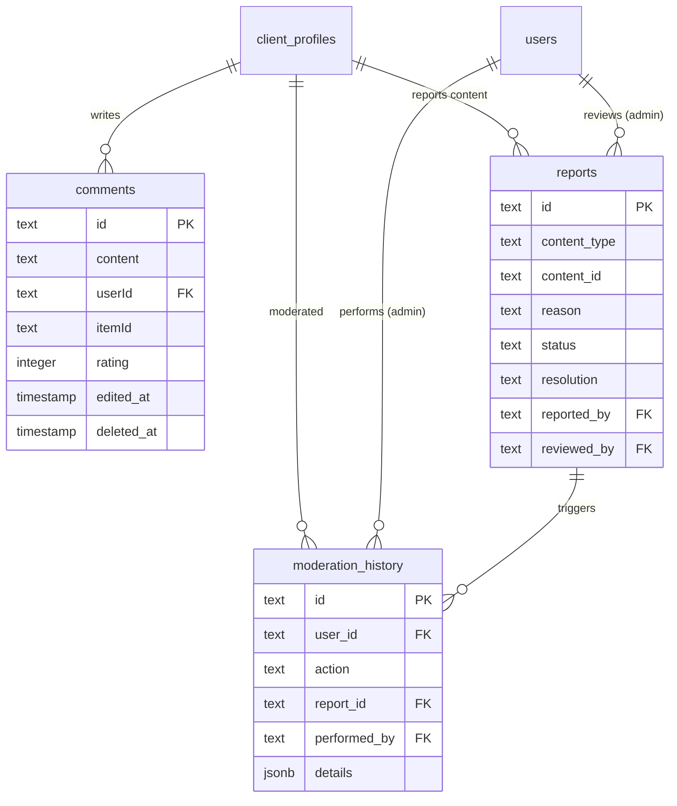
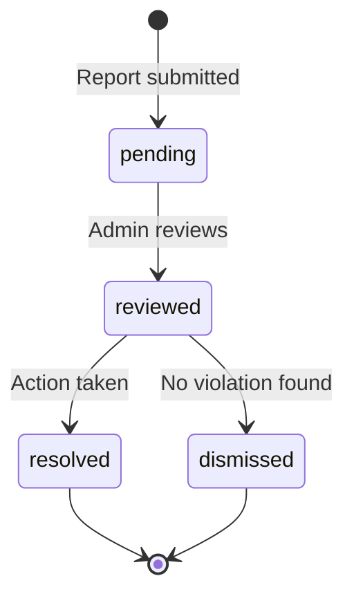

# Opmerkingen Schema Deep Dive

## Overzicht

Met het opmerkingensysteem kunnen gebruikers feedback en recensies over artikelen achterlaten. Opmerkingen zijn gekoppeld aan `client_profiles` (niet rechtstreeks aan `users`), bevatten een beoordelingsveld en ondersteunen zachte verwijdering via `deletedAt`. Het moderatiesubsysteem (`reports` en `moderation_history`) biedt inhoudsrapportage en het bijhouden van administratieve acties.

**Bronbestand:** `template/lib/db/schema.ts`
**Relatiebestand:** `template/lib/db/migrations/relations.ts`

---

## Table: `comments`

Stores user-submitted comments/reviews on items.

### Columns

| Column | DB Name | Type | Nullable | Default | Constraints |
|---|---|---|---|---|---|
| `id` | `id` | `text` | No | `crypto.randomUUID()` | Primary Key |
| `content` | `content` | `text` | No | - | Comment body |
| `userId` | `userId` | `text` | No | - | FK -> `client_profiles.id` (CASCADE) |
| `itemId` | `itemId` | `text` | No | - | Item slug |
| `rating` | `rating` | `integer` | No | `0` | Numeric rating |
| `createdAt` | `created_at` | `timestamp (tz)` | No | `now()` | - |
| `updatedAt` | `updated_at` | `timestamp (tz)` | No | `now()` | - |
| `editedAt` | `edited_at` | `timestamp (tz)` | Yes | - | When last edited |
| `deletedAt` | `deleted_at` | `timestamp (tz)` | Yes | - | Soft delete |

### Foreign Keys

| Column | References | On Delete |
|---|---|---|
| `userId` | `client_profiles.id` | CASCADE |

### TypeScript Types

```typescript
export type Comment = typeof comments.$inferSelect;
export type NewComment = typeof comments.$inferInsert;
```

:::info Note on Foreign Key
Comments reference `client_profiles.id`, not `users.id`. This means the comment author must have a client profile created before they can post comments.
:::

---

## Moderatietabellen

### Tabel: `reports`

Inhoudsrapportagesysteem voor zowel items als opmerkingen.

### Kolommen

|Kolom|DB-naam|Typ|Nulleerbaar|Standaard|Beperkingen|
|---|---|---|---|---|---|
|`id`|`id`|`text`|Nee|`crypto.randomUUID()`|Primaire sleutel|
|`contentType`|`content_type`|`text (enum)`|Nee| - |`item`, `comment`|
|`contentId`|`content_id`|`text`|Nee| - |ID van gerapporteerde inhoud|
|`reason`|`reason`|`text (enum)`|Nee| - |Zie onderstaande opsomming|
|`details`|`details`|`text`|Ja| - |Door de gebruiker verstrekte gegevens|
|`status`|`status`|`text (enum)`|Nee|`'pending'`|Zie onderstaande opsomming|
|`resolution`|`resolution`|`text (enum)`|Ja| - |Zie onderstaande opsomming|
|`reportedBy`|`reported_by`|`text`|Nee| - |FK -> `client_profiles.id` (CASCADE)|
|`reviewedBy`|`reviewed_by`|`text`|Ja| - |FK -> `users.id` (SET NULL)|
|`reviewNote`|`review_note`|`text`|Ja| - |Opmerking over beheerdersbeoordeling|
|`createdAt`|`created_at`|`timestamp`|Nee|`now()`| - |
|`updatedAt`|`updated_at`|`timestamp`|Nee|`now()`| - |
|`reviewedAt`|`reviewed_at`|`timestamp`|Ja| - | - |
|`resolvedAt`|`resolved_at`|`timestamp`|Ja| - | - |

### Enums rapporteren

```typescript
export const ReportContentType = {
    ITEM: 'item',
    COMMENT: 'comment'
} as const;

export const ReportReason = {
    SPAM: 'spam',
    HARASSMENT: 'harassment',
    INAPPROPRIATE: 'inappropriate',
    OTHER: 'other'
} as const;

export const ReportStatus = {
    PENDING: 'pending',
    REVIEWED: 'reviewed',
    RESOLVED: 'resolved',
    DISMISSED: 'dismissed'
} as const;

export const ReportResolution = {
    CONTENT_REMOVED: 'content_removed',
    USER_WARNED: 'user_warned',
    USER_SUSPENDED: 'user_suspended',
    USER_BANNED: 'user_banned',
    NO_ACTION: 'no_action'
} as const;
```

### Indexen

|Naam|Kolommen|Typ|
|---|---|---|
|`reports_content_type_idx`|`contentType`|B-boom|
|`reports_content_id_idx`|`contentId`|B-boom|
|`reports_status_idx`|`status`|B-boom|
|`reports_reported_by_idx`|`reportedBy`|B-boom|
|`reports_created_at_idx`|`createdAt`|B-boom|
|`reports_content_type_content_id_idx`|`(contentType, contentId)`|Composiet B-boom|

### TypeScript-typen

```typescript
export type Report = typeof reports.$inferSelect;
export type NewReport = typeof reports.$inferInsert;
```

---

### Table: `moderation_history`

Tracks all moderation actions taken against users.

### Columns

| Column | DB Name | Type | Nullable | Default | Constraints |
|---|---|---|---|---|---|
| `id` | `id` | `text` | No | `crypto.randomUUID()` | Primary Key |
| `userId` | `user_id` | `text` | No | - | FK -> `client_profiles.id` (CASCADE) |
| `action` | `action` | `text (enum)` | No | - | See enum below |
| `reason` | `reason` | `text` | Yes | - | - |
| `reportId` | `report_id` | `text` | Yes | - | FK -> `reports.id` (SET NULL) |
| `performedBy` | `performed_by` | `text` | Yes | - | FK -> `users.id` (SET NULL) |
| `contentType` | `content_type` | `text (enum)` | Yes | - | `item`, `comment` |
| `contentId` | `content_id` | `text` | Yes | - | - |
| `details` | `details` | `jsonb` | Yes | - | Additional context |
| `createdAt` | `created_at` | `timestamp` | No | `now()` | - |

### Moderation Action Enum

```typescript
export const ModerationAction = {
    WARN: 'warn',
    SUSPEND: 'suspend',
    BAN: 'ban',
    UNSUSPEND: 'unsuspend',
    UNBAN: 'unban',
    CONTENT_REMOVED: 'content_removed'
} as const;
```

### Indexes

| Name | Columns | Type |
|---|---|---|
| `moderation_history_user_id_idx` | `userId` | B-tree |
| `moderation_history_action_idx` | `action` | B-tree |
| `moderation_history_report_id_idx` | `reportId` | B-tree |
| `moderation_history_performed_by_idx` | `performedBy` | B-tree |
| `moderation_history_created_at_idx` | `createdAt` | B-tree |

### TypeScript Types

```typescript
export type ModerationHistoryRecord = typeof moderationHistory.$inferSelect;
export type NewModerationHistoryRecord = typeof moderationHistory.$inferInsert;
```

---

## Relatiediagram



---

## Report Lifecycle



---

## Voorbeelden van zoekopdrachten

### Ontvang opmerkingen over een item

```typescript
import { db } from '@/lib/db/drizzle';
import { comments } from '@/lib/db/schema';
import { eq, isNull, desc } from 'drizzle-orm';

const itemComments = await db
    .select()
    .from(comments)
    .where(
        and(
            eq(comments.itemId, 'my-item-slug'),
            isNull(comments.deletedAt)
        )
    )
    .orderBy(desc(comments.createdAt));
```

### Maak een opmerking

```typescript
await db.insert(comments).values({
    content: 'Great tool, highly recommended!',
    userId: clientProfileId, // Note: client_profiles.id, NOT users.id
    itemId: 'my-item-slug',
    rating: 5,
});
```

### Een opmerking zacht verwijderen

```typescript
await db
    .update(comments)
    .set({ deletedAt: new Date() })
    .where(eq(comments.id, commentId));
```

### Dien een rapport in

```typescript
import { reports } from '@/lib/db/schema';

await db.insert(reports).values({
    contentType: 'comment',
    contentId: commentId,
    reason: 'spam',
    details: 'This comment appears to be promotional spam.',
    reportedBy: clientProfileId,
});
```

### Ontvang openstaande rapporten

```typescript
const pendingReports = await db
    .select()
    .from(reports)
    .where(eq(reports.status, 'pending'))
    .orderBy(desc(reports.createdAt));
```

### Neem een moderatieactie op

```typescript
import { moderationHistory } from '@/lib/db/schema';

await db.insert(moderationHistory).values({
    userId: targetClientProfileId,
    action: 'warn',
    reason: 'Posting spam content',
    reportId: reportId,
    performedBy: adminUserId,
    contentType: 'comment',
    contentId: commentId,
});
```
