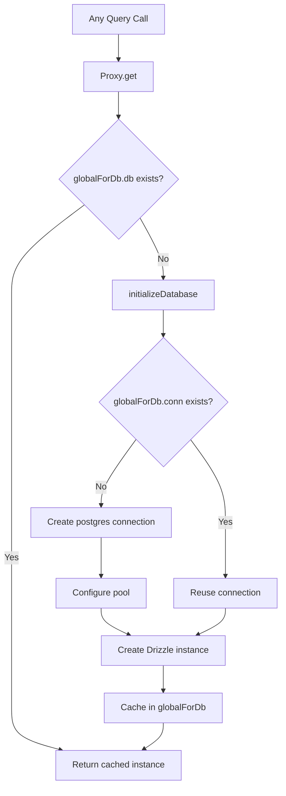

# Databaseverbinding en pooling

De sjabloon gebruikt `postgres.js` (het `postgres` npm-pakket) als het PostgreSQL-stuurprogramma met Drizzle ORM. Verbindingsbeheer wordt afgehandeld via een lui initialisatiepatroon met globale singleton-caching om de hot module replacement (HMR) van Next.js in ontwikkeling te overleven.

## Verbindingsarchitectuur



## Database-instelling (`lib/db/drizzle.ts`)

### Luie initialisatie met proxy

Het database-exemplaar wordt geëxporteerd als `Proxy`, waarmee de verbinding bij de eerste toegang wordt geïnitialiseerd:

```typescript
export const db = new Proxy({} as ReturnType<typeof drizzle>, {
  get(target, prop) {
    const database = initializeDatabase();
    return database[prop as keyof typeof database];
  },
});
```

Dit zorgt voor:
- Er wordt geen verbinding gemaakt tijdens het importeren
- Scripts die de module importeren maar geen query uitvoeren op de database veroorzaken geen verbindingsoverhead
- De eerste daadwerkelijke databasebewerking activeert de initialisatie

### Initialisatiefunctie

```typescript
function initializeDatabase(): ReturnType<typeof drizzle> {
  if (!getDatabaseUrl()) {
    throw new Error('DATABASE_URL environment variable is required');
  }

  if (globalForDb.db) {
    return globalForDb.db;
  }

  const poolSize = getPoolSize();
  const conn = postgres(getDatabaseUrl()!, {
    max: poolSize,
    idle_timeout: 20,
    connect_timeout: 30,
    prepare: false,
    onnotice: getNodeEnv() === 'development' ? console.log : undefined,
  });

  globalForDb.conn = conn;
  globalForDb.db = drizzle(conn, { schema });
  return globalForDb.db;
}
```

### Verbindingsopties

|Optie|Waarde|Doel|
|--------|-------|---------|
|`max`|Configureerbaar (zie zwembadgrootte)|Maximale aansluitingen in het zwembad|
|`idle_timeout`|`20` seconden|Sluit inactieve verbindingen na deze periode|
|`connect_timeout`|`30` seconden|Maximale tijd om een verbinding tot stand te brengen|
|`prepare`|`false`|Schakel voorbereide instructies uit (vereist voor sommige PaaS-omgevingen)|
|`onnotice`|`console.log` (alleen ontwikkelaar)|Registreer PostgreSQL NOTICE-berichten in ontwikkeling|

## Afmetingen zwembad

### Configuratie

De zwembadgrootte kan worden geconfigureerd via de `DB_POOL_SIZE` omgevingsvariabele, met omgevingsbewuste standaardinstellingen:

```typescript
const getPoolSize = (): number => {
  const envPoolSize = process.env.DB_POOL_SIZE;
  if (envPoolSize) {
    const parsed = parseInt(envPoolSize, 10);
    return isNaN(parsed) ? 20 : Math.max(1, Math.min(parsed, 50));
  }
  return getNodeEnv() === 'production' ? 20 : 10;
};
```

### Standaardinstellingen

|Milieu|Standaard zwembadgrootte|Bereik|
|-------------|------------------|-------|
|Productie| 20 | 1 - 50 |
|Ontwikkeling| 10 | 1 - 50 |

De zwembadgrootte wordt vastgezet tussen 1 en 50, ongeacht de geconfigureerde waarde.

### Richtlijnen voor zwembadgrootte

- **Ontwikkeling (10):** Voldoende voor een enkele ontwikkelaar met HMR. Houdt het gebruik van hulpbronnen laag.
- **Productie (20):** Verwerkt gelijktijdige API-verzoeken. Verhoging voor implementaties met veel verkeer.
- **Serverloos (1-5):** Gebruik kleine pools wanneer deze worden geïmplementeerd op serverloze platforms waarbij elke instantie zijn eigen pool krijgt.

## Globaal Singleton-patroon

### HMR-veiligheid

De ontwikkelingsmodus van Next.js voert modules opnieuw uit bij bestandswijzigingen. Zonder bescherming zou elke HMR-cyclus een nieuwe verbindingspool creëren, waardoor databaseverbindingen snel uitgeput zouden raken.

De sjabloon koppelt de verbinding aan `globalThis` om HMR te overleven:

```typescript
const globalForDb = globalThis as unknown as {
  conn: postgres.Sql | undefined;
  db: ReturnType<typeof drizzle> | undefined;
};
```

Wanneer een module opnieuw wordt uitgevoerd:
1. `initializeDatabase()` cheques `globalForDb.db`
2. Als de instantie bestaat, wordt deze onmiddellijk geretourneerd
3. Als de verbinding bestaat, maar de Drizzle-instantie niet, wordt de bestaande verbinding hergebruikt

Ontwikkelingsregistratie geeft aan of een verbinding opnieuw is gebruikt:

```
Reusing existing database connection; pool size is unchanged
```

of vers aangemaakt:

```
Database connection established successfully with pool size: 10
```

### Directe toegang tot instanties

Voor bibliotheken die een concrete Drizzle-instantie vereisen (bijvoorbeeld de Auth.js-adapter), is er een getter-functie beschikbaar:

```typescript
export function getDrizzleInstance(): ReturnType<typeof drizzle> {
  return initializeDatabase();
}
```

## Configuratiemodule (`lib/db/config.ts`)

Een scriptveilige configuratiemodule die **niet** `server-only` importeert, waardoor deze kan worden gebruikt door migratie- en Seed-scripts:

```typescript
export function getDatabaseUrl(): string | undefined {
  return process.env.DATABASE_URL;
}

export function getNodeEnv(): 'development' | 'production' | 'test' {
  const env = process.env.NODE_ENV;
  if (env === 'production' || env === 'test') return env;
  return 'development';
}

export function isProduction(): boolean {
  return getNodeEnv() === 'production';
}
```

## Migratie Runner (`lib/db/migrate.ts`)

De migratierunner is idempotent en veilig te gebruiken bij het opstarten van elke applicatie:

```typescript
export async function runMigrations(): Promise<boolean> {
  const { db } = await import('./drizzle');
  await migrate(db, { migrationsFolder: './lib/db/migrations' });
  return true;
}
```

Belangrijkste gedragingen:
- Drizzle volgt toegepaste migraties in `drizzle.__drizzle_migrations`
- Reeds toegepaste migraties worden automatisch overgeslagen
- Retourneert `true` bij succes, `false` bij mislukking (gooit niet)
- Registreert de migratiestatus voor en na de uitvoering

## Omgevingsvariabelen

|Variabel|Vereist|Standaard|Beschrijving|
|----------|----------|---------|-------------|
|`DATABASE_URL`|Ja| -- |PostgreSQL-verbindingsreeks|
|`DB_POOL_SIZE`|Nee|`20` (producent) / `10` (ontwikkelaar)|Grootte aansluiting zwembad (1-50)|
|`NODE_ENV`|Nee|`development`|Omgeving (ontwikkeling/productie/test)|

## Motregenkitconfiguratie

De Drizzle Kit-configuratie voor het genereren van schema's en migratiebeheer:

```typescript
// drizzle.config.ts
export default {
  schema: "./lib/db/schema.ts",
  out: "./lib/db/migrations",
  dialect: "postgresql",
  dbCredentials: {
    url: process.env.DATABASE_URL,
  },
} satisfies Config;
```

## Problemen oplossen

|Probleem|Oorzaak|Oplossing|
|-------|-------|----------|
|`DATABASE_URL is required`|Ontbrekende omgevingsvar|Stel `DATABASE_URL` in in `.env.local`|
|Time-outs voor verbinding|Langzaam netwerk of overbelaste database|Verhoog `connect_timeout` of controleer de DB-status|
|Uitputting van het zwembad in dev|HMR maakt meerdere pools|Zorg ervoor dat het `globalForDb`-patroon intact is|
|Zwembaduitputting in prod|Te veel gelijktijdige verzoeken|Verhoog `DB_POOL_SIZE` (max. 50)|
|`prepare` fouten op PaaS|PaaS pgBouncer in transactiemodus|Bewaar `prepare: false`|
