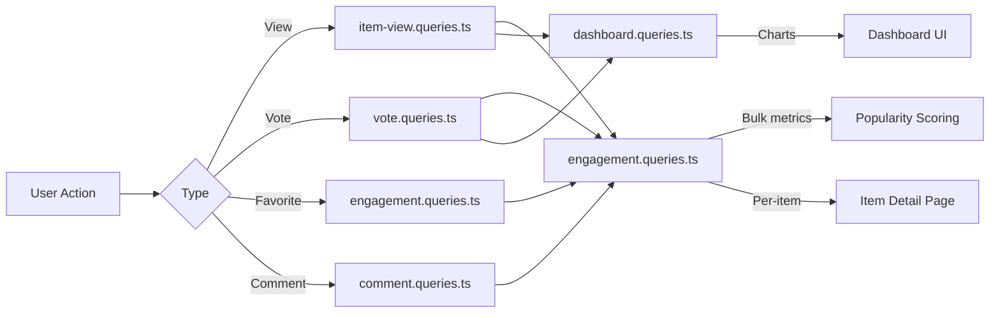

# Betrokkenheids- en interactievragen

Betrokkenheidsquery's verzamelen gebruikersinteracties (weergaven, stemmen, favorieten, opmerkingen) over items. Deze zoekopdrachten maken het sorteren op populariteit, dashboardgrafieken en betrokkenheidspanelen per item mogelijk. De relevante modules zijn `engagement.queries.ts`, `vote.queries.ts`, `comment.queries.ts`, `item-view.queries.ts` en `dashboard.queries.ts`.

## Betrokkenheidsgegevensstroom



## Statistieken voor bulkbetrokkenheid (`engagement.queries.ts`)

### `getEngagementMetricsPerItem`

De primaire functie voor het scoren van populariteit. Retourneert alle betrokkenheidsdimensies voor meerdere items in één parallelle querybatch:

```typescript
export async function getEngagementMetricsPerItem(
  itemSlugs: string[]
): Promise<Map<string, ItemEngagementMetrics>>
```

Retourtype:

```typescript
export interface ItemEngagementMetrics {
  views: number;
  votes: number;       // Net votes (upvotes - downvotes)
  favorites: number;
  comments: number;
  avgRating: number;   // Average rating from comments (0-5)
}
```

### Parallelle querystrategie

Vier onafhankelijke query's worden uitgevoerd via `Promise.all` voor maximale doorvoer:

```typescript
const [viewsData, votesData, favoritesData, commentsData] = await Promise.all([
  // 1. Views per item
  db.select({ itemId: itemViews.itemId, count: count() })
    .from(itemViews)
    .where(inArray(itemViews.itemId, itemSlugs))
    .groupBy(itemViews.itemId),

  // 2. Net votes per item (upvotes - downvotes)
  db.select({
      itemId: votes.itemId,
      netScore: sql<number>`SUM(CASE
        WHEN vote_type = 'upvote' THEN 1
        WHEN vote_type = 'downvote' THEN -1
        ELSE 0 END)`.as('netScore'),
    })
    .from(votes)
    .where(inArray(votes.itemId, itemSlugs))
    .groupBy(votes.itemId),

  // 3. Favorites per item
  db.select({ itemSlug: favorites.itemSlug, count: count() })
    .from(favorites)
    .where(inArray(favorites.itemSlug, itemSlugs))
    .groupBy(favorites.itemSlug),

  // 4. Comments count + average rating (excluding soft-deleted)
  db.select({
      itemId: comments.itemId,
      count: count(),
      avgRating: sql<number>`COALESCE(AVG(${comments.rating}), 0)`.as('avgRating'),
    })
    .from(comments)
    .where(and(inArray(comments.itemId, itemSlugs), isNull(comments.deletedAt)))
    .groupBy(comments.itemId),
]);
```

### Resultaatnormalisatie

Elk zoekresultaat wordt omgezet in een `Map` voor O(1)-zoekopdracht en vervolgens gecombineerd in de uiteindelijke metrische kaart:

```typescript
const viewsMap = new Map<string, number>(
  viewsData.map(v => [v.itemId, Number(v.count)])
);
// ... same for votesMap, favoritesMap, commentsMap

for (const slug of itemSlugs) {
  metricsMap.set(slug, {
    views: viewsMap.get(slug) ?? 0,
    votes: votesMap.get(slug) ?? 0,
    favorites: favoritesMap.get(slug) ?? 0,
    comments: commentsMap.get(slug)?.count ?? 0,
    avgRating: commentsMap.get(slug)?.avgRating ?? 0,
  });
}
```

### Op zichzelf staande metrische functies

|Functie|Retouren|Beschrijving|
|----------|---------|-------------|
|`getFavoritesPerItem(itemSlugs)`|`Map<string, number>`|Favorietentellingen per item|
|`getCommentsPerItem(itemSlugs)`|`Map<string, { count, avgRating }>`|Aantal reacties en gemiddelde beoordelingen|

Beide functies gebruiken hetzelfde patroon: vroege terugkeer voor lege arrays, `groupBy` aggregatie, `Map` constructie.

## Stemvragen (`vote.queries.ts`)

### Stem CRUD

|Functie|Beschrijving|
|----------|-------------|
|`createVote(vote)`|Creëer een stemming met slug-normalisatie|
|`getVoteByUserIdAndItemId(userId, itemSlug)`|Controleer bestaande stemmen|
|`deleteVote(voteId)`|Een stem moeilijk verwijderen|

Alle stemfuncties normaliseren item-slugs via `getItemIdFromSlug()` voordat ze worden opgevraagd.

### Berekening van de nettoscore

Individuele itemscore met voorwaardelijke `SUM`:

```typescript
export async function getVoteCountForItem(itemSlug: string): Promise<number> {
  const itemId = getItemIdFromSlug(itemSlug);
  const [result] = await db
    .select({
      netScore: sql<number>`
        SUM(CASE
          WHEN vote_type = 'upvote' THEN 1
          WHEN vote_type = 'downvote' THEN -1
          ELSE 0
        END)`.as('netScore')
    })
    .from(votes)
    .where(eq(votes.itemId, itemId));
  return Number(result?.netScore ?? 0);
}
```

### Bulkstemscores

`getVotesPerItem` retourneert een `Map<string, number>` van nettoscores voor meerdere items met behulp van `inArray` en `groupBy`.

### Stem-gesorteerde items

```typescript
export async function getItemsSortedByVotes(limit = 10, offset = 0) {
  return db
    .select({
      itemId: votes.itemId,
      voteCount: sql<number>`count(${votes.id})`.as('vote_count')
    })
    .from(votes)
    .groupBy(votes.itemId)
    .orderBy(sql`vote_count DESC`)
    .limit(limit)
    .offset(offset);
}
```

## Reactievragen (`comment.queries.ts`)

### Commentaar CRUD

|Functie|Beschrijving|
|----------|-------------|
|`createComment(data)`|Creëer met slug-normalisatie|
|`getCommentById(id)`|Ruw commentaarrecord|
|`getCommentWithUserById(id)`|Reageer met deelname aan het gebruikersprofiel|
|`updateComment(id, { content?, rating? })`|Update met `editedAt` tijdstempel|
|`updateCommentRating(id, rating)`|Update voor alleen beoordelingen|
|`deleteComment(id)`|Zacht verwijderen (`deletedAt = new Date()`)|

### Opmerkingen met gebruikersgegevens

`getCommentsByItemId` gebruikt een `innerJoin` met `clientProfiles` om elke opmerking te verrijken met auteursinformatie:

```typescript
export async function getCommentsByItemId(itemSlug: string): Promise<CommentWithUser[]> {
  const itemId = getItemIdFromSlug(itemSlug);
  return db
    .select({
      id: comments.id,
      content: comments.content,
      rating: comments.rating,
      userId: comments.userId,
      itemId: comments.itemId,
      createdAt: comments.createdAt,
      updatedAt: comments.updatedAt,
      editedAt: comments.editedAt,
      deletedAt: comments.deletedAt,
      user: {
        id: clientProfiles.id,
        name: clientProfiles.name,
        email: clientProfiles.email,
        image: clientProfiles.avatar
      }
    })
    .from(comments)
    .innerJoin(clientProfiles, eq(comments.userId, clientProfiles.id))
    .where(and(eq(comments.itemId, itemId), isNull(comments.deletedAt)))
    .orderBy(desc(comments.createdAt));
}
```

## Bekijk tracking (`item-view.queries.ts`)

### Dagelijkse ontdubbeling

Weergaven worden per kijker per item per UTC-dag gededupliceerd met behulp van het `onConflictDoNothing` upsert-patroon:

```typescript
export async function recordItemView(
  view: Pick<NewItemView, 'itemId' | 'viewerId' | 'viewedDateUtc'>
): Promise<boolean> {
  const result = await db
    .insert(itemViews)
    .values(view)
    .onConflictDoNothing()
    .returning({ id: itemViews.id });
  return result.length > 0; // true = new view, false = duplicate
}
```

### Bekijk aggregatiefuncties

|Functie|Parameters|Retouren|Beschrijving|
|----------|-----------|---------|-------------|
|`getTotalViewsCount(itemSlugs)`|`string[]`|`number`|Totaal aantal weergaven van items|
|`getRecentViewsCount(itemSlugs, days)`|`string[], number`|`number`|Weergaven in de afgelopen N dagen|
|`getDailyViewsData(itemSlugs, days)`|`string[], number`|`Map<string, number>`|Dagelijkse weergave telt|
|`getViewsPerItem(itemSlugs)`|`string[]`|`Map<string, number>`|Weergavetellingen per item|

### UTC-datumhelper

Alle datumberekeningen gebruiken UTC om tijdzonegerelateerde fouten per één te voorkomen:

```typescript
function getUtcDateString(daysAgo: number = 0): string {
  const date = new Date();
  date.setUTCDate(date.getUTCDate() - daysAgo);
  return date.toISOString().split('T')[0]; // "YYYY-MM-DD"
}
```

## Dashboardstatistieken (`dashboard.queries.ts`)

### Beschikbare statistieken

|Functie|Doel|
|----------|---------|
|`getVotesReceivedCount(itemSlugs)`|Totaal aantal stemmen op items van gebruikers|
|`getCommentsReceivedCount(itemSlugs)`|Totaal aantal reacties op items van gebruikers|
|`getUniqueItemsInteractedCount(clientId)`|Items waar de gebruiker mee bezig is geweest|
|`getUserTotalActivityCount(clientId)`|Totaal aantal stemmen + opmerkingen per gebruiker|
|`getWeeklyEngagementData(itemSlugs, weeks)`|Wekelijkse geaggregeerde grafiekgegevens|
|`getDailyActivityData(clientId, itemSlugs, days)`|Uitsplitsing van dagelijkse activiteiten|
|`getTopItemsEngagement(itemSlugs, limit)`|Topitems op basis van betrokkenheidsscore|

### Wekelijkse betrokkenheidsaggregatie

Gebruikt PostgreSQL's `to_char` met ISO-weekformaat voor consistente weekbuckets:

```typescript
const weeklyVotes = await db
  .select({
    week: sql<string>`to_char(${votes.createdAt}, 'IYYY-IW')`.as('week'),
    count: count(),
  })
  .from(votes)
  .where(and(inArray(votes.itemId, itemSlugs), gte(votes.createdAt, startDate)))
  .groupBy(sql`to_char(${votes.createdAt}, 'IYYY-IW')`)
  .orderBy(sql`to_char(${votes.createdAt}, 'IYYY-IW')`);
```

## Prestatieoverwegingen

- Alle bulkfuncties accepteren arrays en gebruiken `inArray` voor batchverwerking
- Lege array-invoer keert vroegtijdig terug zonder de database te raken
- `Promise.all` voert gelijktijdig onafhankelijke aggregaties uit
- `Map` datastructuren bieden O(1) lookup tijdens het samenstellen van resultaten
- Voorlopig verwijderde reacties worden in alle aggregaties uitgesloten via `isNull(comments.deletedAt)`
