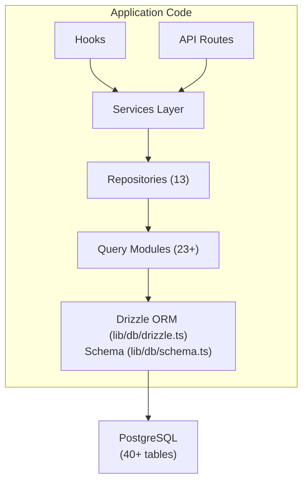

# Databaseoverzicht

De Ever Works-sjabloon gebruikt **Drizzle ORM** met **PostgreSQL** als databaselaag. De database is optioneel (de applicatie kan zonder deze worden uitgevoerd voor implementaties met alleen inhoud), maar ondersteunt alle gebruikers-, abonnements-, betrokkenheids- en beheerdersfuncties.

## Technologie stapel

|Onderdeel|Technologie|Doel|
|-----------|-----------|---------|
|ORM|Druppel ORM|Typeveilige querybouwer en schemabeheer|
|Database|PostgreSQL|Primaire relationele database|
|Bestuurder|`postgres` (postgres.js)|PostgreSQL-client voor Node.js|
|Migraties|Druppelset|Het genereren en uitvoeren van schemamigraties|
|Zaaien|`drizzle-seed` + aangepaste scripts|Database-initialisatie met standaardgegevens|

## Database-architectuur



## Configuratie

### Drizzle-configuratie (`drizzle.config.ts`)

```typescript
export default {
  schema: "./lib/db/schema.ts",
  out: "./lib/db/migrations",
  dialect: "postgresql",
  dbCredentials: {
    url: process.env.DATABASE_URL,
  },
} satisfies Config;
```

De configuratie verwijst naar:
- **Schemabestand**: `lib/db/schema.ts` -- de enige bron van waarheid voor alle tabeldefinities
- **Migratiesuitvoer**: `lib/db/migrations/` -- waar gegenereerde SQL-migratiebestanden worden opgeslagen
- **Dialect**: PostgreSQL
- **Verbinding**: Via `DATABASE_URL` omgevingsvariabele

### Verbindingsbeheer (`lib/db/drizzle.ts`)

De databaseverbinding wordt bij het eerste gebruik lui geïnitialiseerd en hergebruikt verbindingen tijdens hot reloads tijdens de ontwikkeling via een globaal singleton-patroon.

Belangrijkste kenmerken:
- **Luie initialisatie**: de databaseverbinding wordt pas gemaakt nadat de eerste query is uitgevoerd
- **Proxy-gebaseerde toegang**: het geëxporteerde `db`-object gebruikt JavaScript `Proxy` om de verbinding transparant te initialiseren
- **Verbindingspooling**: Configureerbare zwembadgrootte via `DB_POOL_SIZE` omgevingsvariabele (standaard: 20 in productie, 10 in ontwikkeling, vastgeklemd 1-50)
- **Time-out bij inactiviteit**: Verbindingen worden verbroken na 20 seconden inactiviteit
- **Verbindingstime-out**: time-out van 30 seconden voor het tot stand brengen van nieuwe verbindingen
- **Singleton-patroon**: gebruikt `globalThis` om verbindingen in Next.js hot reloads te behouden

```typescript
// Usage - just import and use
import { db } from '@/lib/db/drizzle';

const users = await db.select().from(schema.users);
```

### Omgevingsvariabelen

|Variabel|Vereist|Standaard|Beschrijving|
|----------|----------|---------|-------------|
|`DATABASE_URL`|Nee| - |PostgreSQL-verbindingsreeks|
|`DB_POOL_SIZE`|Nee| 10/20 |Grootte van verbindingspool (dev/prod)|

Wanneer `DATABASE_URL` niet is ingesteld, worden de databasefuncties stilletjes uitgeschakeld, waardoor de toepassing in de modus voor alleen inhoud kan worden uitgevoerd.

## Schemaoverzicht

Het databaseschema is gedefinieerd in één enkel bestand (`lib/db/schema.ts`) met meer dan 40 tabellen, georganiseerd per domein:

|Domein|Tafels|Beschrijving|
|--------|--------|-------------|
|Gebruikers & Aut| 8 |Gebruikers, accounts, sessies, tokens, authenticators|
|Rollen en machtigingen| 3 |RBAC met rollen, machtigingen en toewijzingen van rolmachtigingen|
|Klantprofielen| 1 |Uitgebreide gebruikersprofielen voor klantaccounts|
|Inhoudsbetrokkenheid| 4 |Opmerkingen, stemmen, favorieten, itemweergaven|
|Abonnementen| 4 |Abonnementen, abonnementsgeschiedenis, betalingsproviders, betaalrekeningen|
|Meldingen| 1 |Meldingssysteem in de app|
|Beheer & Moderatie| 4 |Rapporten, moderatiegeschiedenis, itemauditlogboeken, activiteitenlogboeken|
|Integraties| 2 |CRM-configuratie, integratietoewijzingen|
|Bedrijven| 2 |Bedrijven en item-bedrijfsverenigingen|
|Sponsoradvertenties| 1 |Advertenties voor gesponsorde artikelen|
|Enquêtes| 2 |Enquêtes en enquêtereacties|
|Nieuwsbrief| 1 |Nieuwsbriefabonnementen|
|Systeem| 1 |Volgen van de zaadstatus|

## Database-initialisatie

Bij het opstarten van de applicatie (via `instrumentation.ts`), wordt de sjabloon automatisch:

1. **Voert migraties uit**: Drizzle's `migrate()` functie past alle lopende migraties toe (idempotent - reeds toegepaste migraties worden overgeslagen)
2. **Seeds-gegevens**: als de database niet is gezaaid, wordt het Seed-script uitgevoerd met adviserende vergrendelingsbeveiliging om race-omstandigheden te voorkomen bij implementaties met meerdere processen

Dit wordt afgehandeld door `lib/db/initialize.ts`. Zie de [Migrations Guide](./migrations-guide) en [Database Seeding](./seeding) voor meer informatie.

## Sleutelopdrachten

```bash
# Generate a migration from schema changes
pnpm db:generate

# Run pending migrations
pnpm db:migrate

# Seed the database
pnpm db:seed

# Open Drizzle Studio (database GUI)
pnpm db:studio
```
