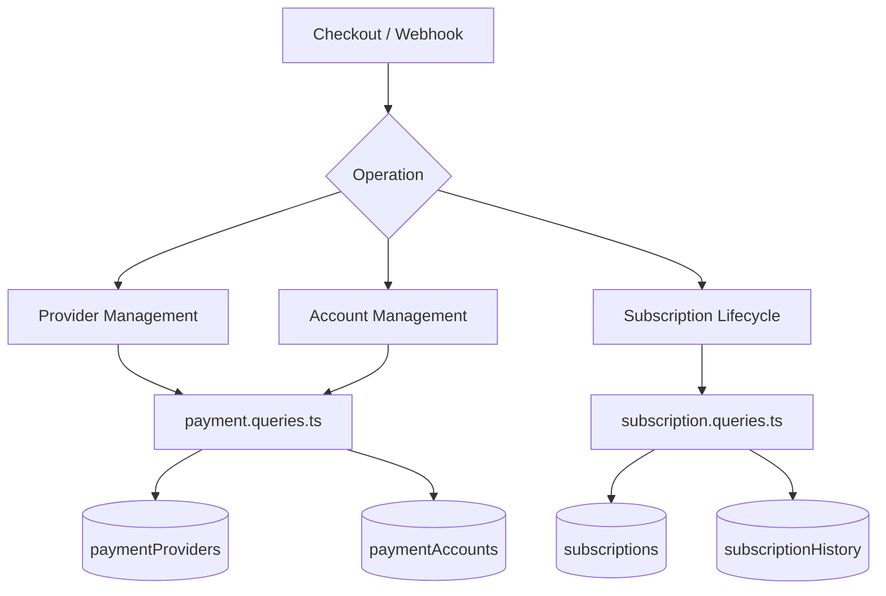
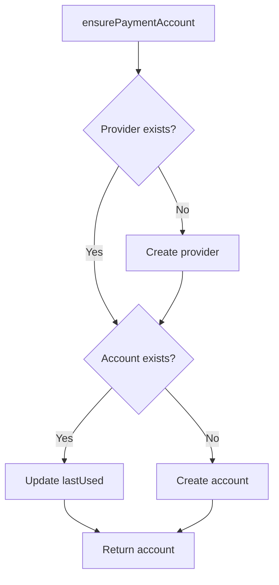
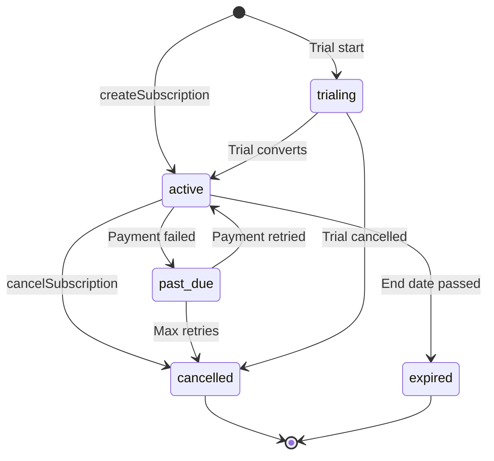

# Vragen over betalingen en abonnementen

Betalingsquery's beheren het providerregister, gebruikersbetaalaccounts en de volledige abonnementslevenscyclus. De relevante modules zijn `payment.queries.ts` en `subscription.queries.ts`.

## Architectuur van betalingssystemen



## Vragen over betalingsproviders (`payment.queries.ts`)

### Aanbieder CRUD

|Functie|Beschrijving|
|----------|-------------|
|`getPaymentProvider(id)`|Provider op ID ophalen|
|`getPaymentProviderByName(name)`|Provider op naam ophalen (bijvoorbeeld `'stripe'`)|
|`getActivePaymentProviders()`|Vermeld alle actieve providers, gesorteerd op naam|
|`createPaymentProvider(data)`|Maak een nieuw providerrecord|
|`updatePaymentProvider(id, data)`|Gedeeltelijke update van providervelden|
|`deactivatePaymentProvider(id)`|Stel `isActive = false` in|

Ondersteunde providernamen: `stripe`, `lemonsqueezy`, `polar`, `solidgate`.

### Vragen over betaalrekeningen

Betaalrekeningen koppelen een gebruiker aan een aanbiederspecifieke klant-ID:

|Functie|Beschrijving|
|----------|-------------|
|`getPaymentAccountByUserId(userId, providerId)`|Krijg een account met actieve providercheck|
|`getPaymentAccountByCustomerId(customerId, providerId)`|Omgekeerd zoeken op klant-ID|
|`createPaymentAccount(data)`|Maak een account aan met `lastUsed` tijdstempel|
|`updatePaymentAccountLastUsed(accountId)`|Raak `lastUsed` tijdstempel aan|
|`getUserPaymentAccountByProvider(userId, providerName)`|Zoeken op providernaam (provider eerst opgelost)|

### Actieve providervalidatie

`getPaymentAccountByUserId` voert een drievoudige inner join uit om ervoor te zorgen dat zowel de provider als de gebruiker geldig zijn:

```typescript
export async function getPaymentAccountByUserId(
  userId: string,
  providerId: string
): Promise<PaymentAccount | null> {
  const result = await db
    .select({ /* payment account fields */ })
    .from(paymentAccounts)
    .innerJoin(paymentProviders, eq(paymentAccounts.providerId, paymentProviders.id))
    .innerJoin(users, eq(paymentAccounts.userId, users.id))
    .where(and(
      eq(paymentAccounts.userId, userId),
      eq(paymentAccounts.providerId, providerId),
      eq(paymentProviders.isActive, true)
    ))
    .limit(1);
  return result[0] || null;
}
```

### Zorg voor een betaalrekening

`ensurePaymentAccount` implementeert een idempotent upsert-patroon voor betaalrekeningen:



```typescript
export async function ensurePaymentAccount(
  providerName: string,
  userId: string,
  customerId: string,
  accountId?: string
): Promise<PaymentAccount>
```

### Gebruikersbetaalrekening instellen

`setupUserPaymentAccount` breidt het waarborgpatroon uit met detectie van klant-ID-wijzigingen:

```typescript
if (existingAccount.customerId !== customerId) {
  await db
    .update(paymentAccounts)
    .set({
      customerId,
      accountId: accountId || existingAccount.accountId,
      lastUsed: new Date(),
      updatedAt: new Date()
    })
    .where(eq(paymentAccounts.id, existingAccount.id));
}
```

### Gemak Aliassen

- `getOrCreatePaymentAccount` -- alias voor `ensurePaymentAccount`
- `createOrGetPaymentAccount` -- alias voor `setupUserPaymentAccount`

## Abonnementsvragen (`subscription.queries.ts`)

### Abonnement opzoeken

|Functie|Parameters|Retouren|
|----------|-----------|---------|
|`getUserActiveSubscription(userId)`|Gebruikers-ID|Actief abonnement of nul|
|`getUserSubscriptions(userId)`|Gebruikers-ID|Alle abonnementen (geordend op datum)|
|`getSubscriptionByProviderSubscriptionId(provider, subId)`|Provider + sub-ID|Abonnement of nul|
|`getSubscriptionByUserIdAndSubscriptionId(userId, subId)`|Gebruiker + sub-ID|Abonnement of nul|
|`getSubscriptionWithUser(subId)`|Abonnement-ID|Abonnement met gebruikersdeelname|
|`hasActiveSubscription(userId)`|Gebruikers-ID|Booleaans|

### Levenscyclus van abonnement

#### Creëer

```typescript
export async function createSubscription(data: NewSubscription): Promise<Subscription> {
  const result = await db
    .insert(subscriptions)
    .values({ ...data, createdAt: new Date(), updatedAt: new Date() })
    .returning();
  return result[0];
}
```

#### Status bijwerken

Statuswijzigingen worden automatisch ingesteld op `cancelledAt` en `cancelReason` bij de overgang naar `CANCELLED`:

```typescript
export async function updateSubscriptionStatus(
  subscriptionId: string,
  status: string,
  reason?: string
): Promise<Subscription | null>
```

#### Annuleer

Ondersteunt zowel onmiddellijke annulering als annulering aan het einde van de periode:

```typescript
export async function cancelSubscription(
  subscriptionId: string,
  reason?: string,
  cancelAtPeriodEnd: boolean = false
): Promise<Subscription | null>
```

Wanneer `cancelAtPeriodEnd = true`, blijft de status `ACTIVE` maar `cancelledAt` en `cancelAtPeriodEnd` zijn ingesteld.

### Abonnementsstatusstroom



### Planresolutie

`getUserPlan` controleert de vervaldatum van het abonnement en valt terug op het gratis abonnement:

```typescript
export async function getUserPlan(userId: string): Promise<string> {
  const subscription = await getUserActiveSubscription(userId);
  if (!subscription) return PaymentPlan.FREE;
  return getEffectivePlan(subscription.planId, subscription.endDate, subscription.status);
}
```

`getUserPlanWithExpiration` retourneert volledige vervalgegevens:

```typescript
{
  planId: string;         // Stored plan
  effectivePlan: string;  // Actual plan after expiration check
  isExpired: boolean;
  expiresAt: Date | null;
  status: string | null;
  subscriptionId: string | null;
}
```

### Vervaldatum en verlenging

|Functie|Beschrijving|
|----------|-------------|
|`getSubscriptionsExpiringSoon(days)`|Actieve abonnementen die binnen N dagen verlopen|
|`getExpiredSubscriptions()`|Abonnementen waarvan de einddatum is verstreken|
|`getSubscriptionsForRenewalReminder(days)`|Abonnementen waarvoor een verlengingsbericht nodig is|

### Abonnementsgeschiedenis

Wijzigingen worden vastgelegd in de `subscriptionHistory` tabel:

```typescript
export async function logSubscriptionHistory(data: NewSubscriptionHistory)
export async function getSubscriptionHistory(subscriptionId: string)
```

### Abonnementsstatistieken

`getSubscriptionStats` retourneert totaaltellingen:

```typescript
{
  total: number;
  active: number;
  cancelled: number;
  expired: number;
  pastDue: number;
  trialing: number;
}
```

## Schemaconstanten

```typescript
// lib/db/schema.ts
export const SubscriptionStatus = {
  ACTIVE: 'active',
  CANCELLED: 'cancelled',
  EXPIRED: 'expired',
  PAST_DUE: 'past_due',
  TRIALING: 'trialing',
} as const;

// lib/constants/payment.ts
export const PaymentPlan = {
  FREE: 'free',
  STANDARD: 'standard',
  PREMIUM: 'premium',
} as const;

export const PaymentProvider = {
  STRIPE: 'stripe',
  LEMONSQUEEZY: 'lemonsqueezy',
  POLAR: 'polar',
  SOLIDGATE: 'solidgate',
} as const;
```
