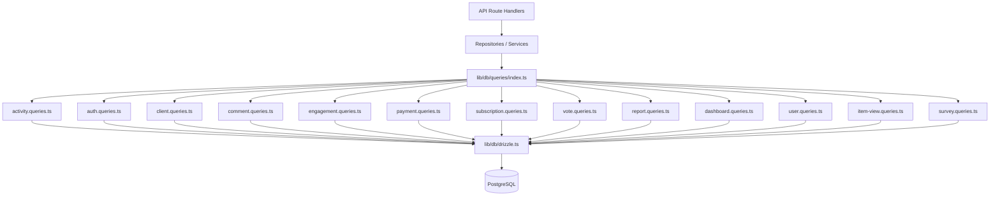

# Zoekpatroonsysteem

De sjabloon organiseert alle databasequery's in domeinspecifieke modules onder `lib/db/queries/`. Elke module volgt het Single Responsibility Principle (SRP), waarbij gerelateerde activiteiten worden gegroepeerd. Een vatexport in `index.ts` biedt één toegangspunt voor alle queryfuncties.

## Architectuuroverzicht



## Querymodules

|Module|Bestand|Doel|
|--------|------|---------|
|Activiteit|`activity.queries.ts`|Activiteitenregistratie en audittrail|
|Aut|`auth.queries.ts`|Tokens voor het opnieuw instellen van wachtwoorden, verificatietokens|
|Klant|`client.queries.ts`|Klantprofiel CRUD, zoeken, statistieken|
|Commentaar|`comment.queries.ts`|Reageer CRUD met gebruikersjoins|
|Bedrijf|`company.queries.ts`|Bedrijfsbeheer en koppeling van artikel-bedrijf|
|Dashboard|`dashboard.queries.ts`|Dashboardstatistieken en betrokkenheidsgrafieken|
|Betrokkenheid|`engagement.queries.ts`|Geaggregeerde betrokkenheidsstatistieken (weergaven, stemmen, favorieten, opmerkingen)|
|Integratie in kaart brengen|`integration-mapping.queries.ts`|CRM-integratietoewijzingen|
|Artikel|`item.queries.ts`|Normalisatie en validatie van item-slugs|
|Artikelcontrole|`item-audit.queries.ts`|Geschiedenis van artikelwijzigingen|
|Artikelweergave|`item-view.queries.ts`|Bekijk tracking met deduplicatie|
|Locatie-index|`location-index.queries.ts`|Indexering van georuimtelijke items|
|Matiging|`moderation.queries.ts`|Acties voor inhoudsmoderatie|
|Nieuwsbrief|`newsletter.queries.ts`|Beheer van nieuwsbriefabonnees|
|Betaling|`payment.queries.ts`|Betaalprovider en accountbeheer|
|Rapporteer|`report.queries.ts`|Inhoudsrapporten met filtering|
|Abonnement|`subscription.queries.ts`|Beheer van de levenscyclus van abonnementen|
|Enquête|`survey.queries.ts`|Enquêtereacties en analyses|
|Gebruiker|`user.queries.ts`|Kerngebruiker CRUD en admin-controles|
|Stem|`vote.queries.ts`|Stem CRUD en berekening van de nettoscore|

## Algemene patronen

### 1. Pagineringspatroon

Alle lijstquery's volgen een consistent pagineringspatroon met `limit` en `offset`:

```typescript
export async function getClientProfiles(params: {
  page?: number;
  limit?: number;
  search?: string;
  status?: string;
}): Promise<{
  profiles: ClientProfileWithAuth[];
  total: number;
  page: number;
  totalPages: number;
  limit: number;
}> {
  const { page = 1, limit = 10, search, status } = params;
  const offset = (page - 1) * limit;

  // 1. Build WHERE conditions dynamically
  const whereConditions: SQL[] = [];
  if (search) { /* add ILIKE condition */ }
  if (status) { whereConditions.push(eq(clientProfiles.status, status)); }
  const whereClause = whereConditions.length > 0
    ? and(...whereConditions)
    : undefined;

  // 2. Count query for total
  const countResult = await db
    .select({ count: sql<number>`count(distinct ${clientProfiles.id})` })
    .from(clientProfiles)
    .where(whereClause);
  const total = Number(countResult[0]?.count || 0);

  // 3. Data query with limit/offset
  const profiles = await db
    .select({ /* fields */ })
    .from(clientProfiles)
    .where(whereClause)
    .orderBy(desc(clientProfiles.createdAt))
    .limit(limit)
    .offset(offset);

  return {
    profiles,
    total,
    page,
    totalPages: Math.ceil(total / limit),
    limit,
  };
}
```

### 2. Dynamisch filterpatroon

Filters worden verzameld als een array van SQL-voorwaarden en samengesteld met `and()`:

```typescript
const whereConditions: SQL[] = [];

if (search) {
  const escapedSearch = search
    .replace(/\\/g, '\\\\')
    .replace(/[%_]/g, '\\$&');
  whereConditions.push(
    sql`(${clientProfiles.name} ILIKE ${`%${escapedSearch}%`} OR
         ${clientProfiles.email} ILIKE ${`%${escapedSearch}%`})`
  );
}

if (status) {
  whereConditions.push(eq(clientProfiles.status, status));
}

if (provider) {
  whereConditions.push(
    sql`exists (
      select 1 from ${accounts}
      where ${accounts.userId} = ${clientProfiles.userId}
        and ${accounts.provider} = ${provider}
    )`
  );
}

const whereClause = whereConditions.length > 0
  ? and(...whereConditions)
  : undefined;
```

### 3. Sluit je aan bij patroon

De codebase gebruikt zowel expliciete `innerJoin`/`leftJoin` als subquery's om gerelateerde gegevens te verwerken:

**Binnenste join voor vereiste relaties:**

```typescript
const result = await db
  .select({
    id: comments.id,
    content: comments.content,
    user: {
      id: clientProfiles.id,
      name: clientProfiles.name,
      email: clientProfiles.email,
      image: clientProfiles.avatar,
    },
  })
  .from(comments)
  .innerJoin(clientProfiles, eq(comments.userId, clientProfiles.id))
  .where(and(eq(comments.itemId, itemId), isNull(comments.deletedAt)))
  .orderBy(desc(comments.createdAt));
```

**Subquery om dubbele rijen van meerdere joins te voorkomen:**

```typescript
const profiles = await db
  .select({
    id: clientProfiles.id,
    // ... other fields
    accountProvider: sql<string>`coalesce(
      (SELECT provider FROM ${accounts}
       WHERE ${accounts.userId} = ${clientProfiles.userId}
       LIMIT 1),
      'unknown'
    )`,
  })
  .from(clientProfiles);
```

### 4. Aggregatiepatroon

Aggregaatfuncties zoals `count`, `SUM` en `AVG` worden gebruikt met `groupBy`:

```typescript
// Net vote score using conditional SUM
const voteCounts = await db
  .select({
    itemId: votes.itemId,
    netScore: sql<number>`
      SUM(CASE
        WHEN vote_type = 'upvote' THEN 1
        WHEN vote_type = 'downvote' THEN -1
        ELSE 0
      END)
    `.as('netScore'),
  })
  .from(votes)
  .where(inArray(votes.itemId, itemSlugs))
  .groupBy(votes.itemId);
```

### 5. Parallelle zoekpatroon

Wanneer meerdere onafhankelijke aggregaties nodig zijn, worden query's parallel uitgevoerd met `Promise.all`:

```typescript
const [viewsData, votesData, favoritesData, commentsData] =
  await Promise.all([
    db.select({ itemId: itemViews.itemId, count: count() })
      .from(itemViews)
      .where(inArray(itemViews.itemId, itemSlugs))
      .groupBy(itemViews.itemId),

    db.select({ itemId: votes.itemId, netScore: sql`...` })
      .from(votes)
      .where(inArray(votes.itemId, itemSlugs))
      .groupBy(votes.itemId),

    db.select({ itemSlug: favorites.itemSlug, count: count() })
      .from(favorites)
      .where(inArray(favorites.itemSlug, itemSlugs))
      .groupBy(favorites.itemSlug),

    db.select({ itemId: comments.itemId, count: count(), avgRating: sql`...` })
      .from(comments)
      .where(and(inArray(comments.itemId, itemSlugs), isNull(comments.deletedAt)))
      .groupBy(comments.itemId),
  ]);
```

### 6. Patroon voor upsert/conflictoplossing

Gebruikt voor deduplicatie, vooral bij het volgen van weergaven:

```typescript
export async function recordItemView(
  view: Pick<NewItemView, 'itemId' | 'viewerId' | 'viewedDateUtc'>
): Promise<boolean> {
  const result = await db
    .insert(itemViews)
    .values(view)
    .onConflictDoNothing()
    .returning({ id: itemViews.id });

  return result.length > 0;
}
```

### 7. Patroon zacht verwijderen

Records worden gemarkeerd als verwijderd in plaats van fysiek te worden verwijderd:

```typescript
export async function deleteComment(id: string) {
  const [comment] = await db
    .update(comments)
    .set({ deletedAt: new Date() })
    .where(eq(comments.id, id))
    .returning();
  return comment;
}

// Querying always filters out soft-deleted records
.where(and(eq(comments.itemId, itemId), isNull(comments.deletedAt)))
```

### 8. Resultaatnormalisatiepatroon

Queryresultaten worden vaak in kaart gebracht via het opzoeken van `Map`-objecten voor efficiënte O(1)-toegang:

```typescript
const viewsMap = new Map<string, number>(
  viewsData.map(v => [v.itemId, Number(v.count)])
);
const votesMap = new Map<string, number>(
  votesData.map(v => [v.itemId, Number(v.netScore ?? 0)])
);

// Combine into final metrics
for (const slug of itemSlugs) {
  metricsMap.set(slug, {
    views: viewsMap.get(slug) ?? 0,
    votes: votesMap.get(slug) ?? 0,
  });
}
```

## Gedeelde nutsvoorzieningen

### `lib/db/queries/utils.ts`

Biedt helperfuncties die worden gedeeld door querymodules:

- **`extractUsernameFromEmail(email)`** -- Extraheert en zuivert een gebruikersnaam van een e-mailadres
- **`ensureUniqueUsername(baseUsername)`** -- Genereert een unieke gebruikersnaam door indien nodig numerieke achtervoegsels toe te voegen

### `lib/db/queries/types.ts`

Definieert gedeelde typen die worden gebruikt in querymodules:

- **`ClientProfileWithAuth`** -- Klantprofiel gecombineerd met gegevens van authenticatieprovider
- **`ClientStatus`** / **`ClientPlan`** / **`ClientAccountType`** -- Enum-typen voor filteren
- **`CommentWithUser`** -- Commentaargegevens verrijkt met gebruikersinformatie

## Importconventie

Alle zoekopdrachten worden geïmporteerd via de vatexport:

```typescript
import {
  getClientProfiles,
  createVote,
  getEngagementMetricsPerItem,
  getUserActiveSubscription,
} from '@/lib/db/queries';
```
