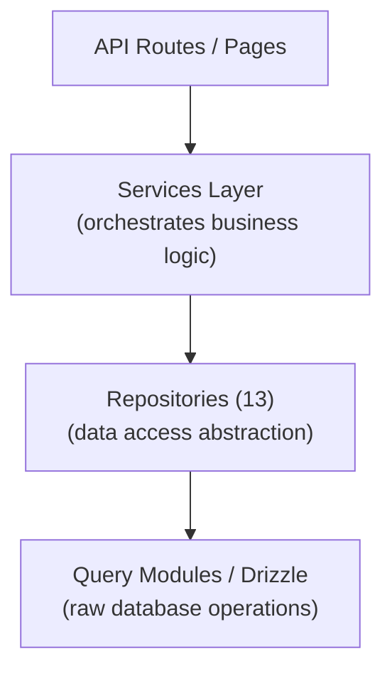

# Bewaarpatroon

De Ever Works-sjabloon implementeert een repositorypatroon via 13 gespecialiseerde repositoryklassen in `lib/repositories/`. Repository's bieden een abstractie op een hoger niveau over onbewerkte databasequery's, waarbij complexe querylogica, bedrijfsregels en gegevenstransformatie worden ingekapseld.

## Architectuur



## Lijst met opslagplaatsen

|Bewaarplaats|Bestand|Domein|
|------------|------|--------|
|Beheeranalyse (geoptimaliseerd)|`admin-analytics-optimized.repository.ts`|Beheeranalyses met prestatie-optimalisatie|
|Beheerstatistieken|`admin-stats.repository.ts`|Statistieken van het beheerdersdashboard|
|Categorie|`category.repository.ts`|Categoriebeheer|
|Klantendashboard|`client-dashboard.repository.ts`|Klantdashboardbewerkingen|
|Klantitem|`client-item.repository.ts`|Inzendingen van klantitems|
|Collectie|`collection.repository.ts`|Collectiebeheer|
|Integratie in kaart brengen|`integration-mapping.repository.ts`|CRM-integratietoewijzingen|
|Artikel|`item.repository.ts`|Artikelbewerkingen|
|Rol|`role.repository.ts`|Rolbeheer|
|Sponsoradvertentie|`sponsor-ad.repository.ts`|Beheer van gesponsorde advertenties|
|Label|`tag.repository.ts`|Tagbeheer|
|Twintig CRM-configuratie|`twenty-crm-config.repository.ts`|CRM-configuratie|
|Gebruiker|`user.repository.ts`|Gebruikersbeheer|

## Git-gebaseerde inhoudopslagplaats (`lib/repository.ts`)

Naast de databaserepository's bevat de sjabloon een op Git gebaseerde contentrepository op `lib/repository.ts`. Dit verwerkt de Git CMS-bewerkingen:

- Kloon de inhoudsopslagplaats van `DATA_REPOSITORY` URL
- Synchroniseer inhoud met upstream (pull/push met conflictdetectie)
- Houd lokale wijzigingen bij en voer ze door
- Time-outbescherming voor Git-bewerkingen (time-out van 120 seconden)

Dit verschilt van de databaserepository's en beheert de map `.content/` die door de inhoudslaag wordt gebruikt.

## Gegevens van opslagplaats

### admin-analytics-geoptimaliseerd.repository.ts

Voor prestaties geoptimaliseerde analyseopslagplaats voor het beheerdersdashboard. Maakt gebruik van batchquery's en cachingstrategieën om de databasebelasting te minimaliseren bij het genereren van analyseweergaven.

Belangrijkste mogelijkheden:
- Geaggregeerde weergavestatistieken
- Trends in gebruikersgroei
- Samenvattingen van inhoudsbetrokkenheid
- Inkomstenanalyse

### admin-stats.repository.ts

Biedt dashboardstatistieken voor het beheerderspaneel.

Belangrijkste mogelijkheden:
- Totaal aantal gebruikers
- Actieve abonnementen tellen mee
- Inhoudsstatistieken (items, opmerkingen, rapporten)
- Recente activiteitenoverzichten

### categorie.repository.ts

Beheert categoriegegevens met CRUD-bewerkingen en relatieafhandeling.

Belangrijkste mogelijkheden:
- Categorielijst met itemtellingen
- Doorkruisen van categoriebomen (bovenliggend/onderliggend)
- Categorie zoeken en filteren
- Categorie ordening

### client-dashboard.repository.ts

De grootste opslagplaats (28 KB), die alle dashboardgegevens aan de clientzijde verwerkt.

Belangrijkste mogelijkheden:
- Beheer van klantinzendingen
- Analyse van inzendingen (views, stemmen, reacties per item)
- Geschiedenis van klantactiviteiten
- Overzichtsstatistieken van het dashboard
- Gepagineerde itemlijst met filters

### client-item.repository.ts

Beheert items vanuit het perspectief van de klant (indiener).

Belangrijkste mogelijkheden:
- Creëren en bijwerken van iteminzendingen
- Bijhouden van de status van artikelen
- Inzendingsgeschiedenis
- Klantspecifieke artikelfiltering

### collectie.repository.ts

Collectiebeheer voor samengestelde artikelgroepen.

Belangrijkste mogelijkheden:
- Verzamel CRUD-bewerkingen
- Associaties voor itemverzameling
- Ophaalbestelling en status
- Gepagineerde collectielijst

### integratie-mapping.repository.ts

Volharding in het in kaart brengen van CRM-integratie.

Belangrijkste mogelijkheden:
- Maak en update toewijzingen tussen interne ID's en CRM-ID's
- Bulk-up-operaties
- Zoeken op interne ID of CRM-ID
- Synchroniseer het bijhouden van tijdstempels
- Versiehashbeheer voor wijzigingsdetectie

### item.repository.ts

Kernitemgegevensbewerkingen (voor in de database opgeslagen metagegevens, niet voor Git-inhoud).

Belangrijkste mogelijkheden:
- Beheer van itemmetagegevens
- Artikel zoeken met meerdere filters
- Aggregatie van gegevens over itembetrokkenheid
- Uitgelicht artikelbeheer

### rol.repository.ts

Rolbeheer voor het RBAC-systeem.

Belangrijkste mogelijkheden:
- Rol CRUD-bewerkingen
- Roltoestemmingsassociaties
- Toewijzingen van gebruikersrollen
- Rolvalidatie

### sponsor-ad.repository.ts

Beheer van de levenscyclus van gesponsorde advertenties.

Belangrijkste mogelijkheden:
- Sponsor het maken en beheren van advertenties
- Statusovergangen (in behandeling, actief, verlopen)
- Advertentiefiltering op status, gebruiker of item
- Betalingsintegratiegegevens
- Afhandeling van vervaldatum

### tag.repository.ts

Tagbeheer met artikelassociaties.

Belangrijkste mogelijkheden:
- Tag CRUD-operaties
- Zoeken op tags en automatisch aanvullen
- Statistieken over taggebruik
- Associaties van itemtags

### twintig-crm-config.repository.ts

Twenty CRM Singleton-configuratiebeheer.

Belangrijkste mogelijkheden:
- CRM-configuratie ophalen/bijwerken
- CRM-integratie in-/uitschakelen
- Beheer van synchronisatiemodus
- Beheer van API-sleutels

### gebruiker.repository.ts

Beheer van gebruikersaccounts.

Belangrijkste mogelijkheden:
- Bewerkingen van gebruikersprofielen
- Zoeken en filteren van gebruikers
- Beheer van accountstatus
- Verwijdering van gebruiker (zachte verwijdering)

## Gebruikspatroon

Opslagplaatsen worden geïmporteerd en rechtstreeks gebruikt in API-routes, services en servercomponenten:

```typescript
import { clientDashboardRepository } from '@/lib/repositories/client-dashboard.repository';

// In an API route
export async function GET(request: NextRequest) {
  const session = await auth();
  const dashboard = await clientDashboardRepository.getDashboardStats(session.user.id);
  return NextResponse.json({ success: true, data: dashboard });
}
```

```typescript
import { itemRepository } from '@/lib/repositories/item.repository';

// In a server component
export default async function ItemPage({ params }) {
  const item = await itemRepository.findBySlug(params.slug);
  return <ItemDetail item={item} />;
}
```

## Repository versus querymodules

|Aspect|Querymodules (`lib/db/queries/`)|Opslagplaatsen (`lib/repositories/`)|
|--------|-----------------------------------|-------------------------------------|
|Complexiteit|Eenvoudige, gerichte vragen|Complexe bewerkingen met meerdere tafels|
|Bedrijfslogica|Geen (pure datatoegang)|Inclusief validatie en bedrijfsregels|
|Gegevenstransformatie|Ruwe databaseresultaten|Getransformeerde/verrijkte data|
|Gebruiksgeval|Directe databasebewerkingen|Gegevenstoegang op functieniveau|
|Typische consument|Andere zoekmodules, eenvoudige routes|Services, API-routes, servercomponenten|

Beide lagen gebruiken Drizzle ORM en importeren de databaseverbinding van `lib/db/drizzle.ts`. De keuze hiertussen hangt af van de complexiteit van de bewerking: bij eenvoudige leesbewerkingen worden rechtstreeks querymodules gebruikt, terwijl complexe functies via opslagplaatsen gaan.
