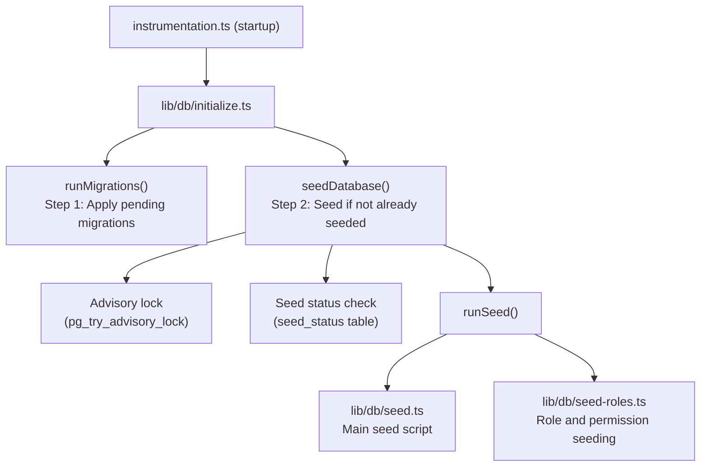

# Databasezaaien

De Ever Works-sjabloon bevat een uitgebreid databasezaaisysteem dat essentiële gegevens (rollen, machtigingen, betalingsproviders) initialiseert en optioneel demogegevens genereert voor ontwikkeling en testen.

## Zaadarchitectuur



## Seed-scripts

### Hoofdstartscript (`lib/db/seed.ts`)

Het primaire zaadscript handelt alle database-initialisatie af. Het werkt in twee modi:

**Productiemodus**: Zaadt alleen essentiële gegevens die nodig zijn om de applicatie te laten functioneren:
- Beheerders- en klantrollen
- Systeemrechten
- Standaard betalingsproviders
- Vereiste systeemrecords

**Demomodus**: daarnaast worden uitgebreide testgegevens voor ontwikkeling verzameld:
- Voorbeeldgebruikers met verschillende rollen
- Voorbeeld klantprofielen
- Voorbeeld abonnementen
- Demoopmerkingen, stemmen en favorieten
- Testmeldingen
- Activiteitenlogboekvermeldingen

De demomodus wordt geactiveerd wanneer de omgevingsvariabele `DEMO_MODE` wordt ingesteld.

Belangrijkste kenmerken:
- **Idempotentie per tafel**: Elke tafel wordt gecontroleerd voordat deze wordt geplaatst; alleen lege tabellen worden gevuld
- **Tabelbestaanscontroles**: Controleert of tabellen bestaan voordat wordt geprobeerd deze in te voegen
- **Gebruikt `drizzle-seed`**: maakt gebruik van de officiële Drizzle Seeding-bibliotheek voor het genereren van gestructureerde gegevens
- **Veilig voor herhalingen**: Kan meerdere keren worden gebeld zonder gegevens te dupliceren

```typescript
// Simplified seed flow
export async function runSeed(): Promise<void> {
  await ensureDb();
  const isDemo = isDemoMode();

  if (isDemo) {
    // Seed comprehensive test data
  } else {
    // Seed minimal essential data only
  }

  // Seed roles (always)
  if (await isTableEmpty('roles', roles)) {
    await seedRoles();
  }

  // Seed permissions (always)
  if (await isTableEmpty('permissions', permissions)) {
    await seedPermissions();
  }

  // Seed payment providers (always)
  if (await isTableEmpty('paymentProviders', paymentProviders)) {
    await seedPaymentProviders();
  }

  // Demo-only: seed users, profiles, subscriptions, etc.
  if (isDemo) {
    await seedDemoData();
  }
}
```

### Rolzaaien (`lib/db/seed-roles.ts`)

Een speciaal script voor het seeden van het RBAC-systeem, dat ook onafhankelijk kan worden uitgevoerd.

**`seedPermissions()`** maakt de initiële machtigingenset:

|Toestemmingssleutel|Beschrijving|
|---------------|-------------|
|`read:own`|Kan eigen gegevens lezen|
|`write:own`|Kan eigen gegevens schrijven|
|`admin:all`|Volledige administratieve toegang|
|`client:manage`|Kan klantspecifieke bewerkingen beheren|
|`user:read`|Kan gebruikersgegevens lezen|
|`user:write`|Kan gebruikersgegevens schrijven|

Gebruikt `onConflictDoUpdate` om bestaande machtigingen veilig bij te werken zonder te mislukken bij herhaling.

**`linkRolesToPermissions()`** creëert rol-toestemmingskoppelingen:

- **Beheerdersrol**: krijgt ALLE rechten
- **Klantrol**: krijgt `read:own`, `write:own` en `client:manage`

De functie valideert dat de vereiste rollen (beheerder, klant) bestaan en actief zijn voordat er koppelingen worden gemaakt.

**`seedRolesAndPermissions()`** orkestreert beide bewerkingen binnen een databasetransactie:

```typescript
export async function seedRolesAndPermissions() {
  await db.transaction(async () => {
    await seedPermissions();
    await linkRolesToPermissions();
  });
}
```

Kan zelfstandig worden uitgevoerd:
```bash
# Run directly (if configured as a script)
npx tsx lib/db/seed-roles.ts
```

## Initialisatiesysteem (`lib/db/initialize.ts`)

Het initialisatiesysteem beheert de volledige opstartvolgorde met gelijktijdigheidsbescherming.

### Zaadstatus volgen

Een `seed_status` tabel houdt de seeding-status bij:

|Status|Betekenis|
|--------|---------|
|`seeding`|Zaadbewerking wordt uitgevoerd|
|`completed`|Zaad succesvol voltooid|
|`failed`|Seed mislukt (fout opgeslagen)|

### Gelijktijdigheid bescherming

Bij implementaties met meerdere processen (bijvoorbeeld als meerdere serverloze Vercel-functies tegelijkertijd starten), voorkomt het systeem dubbele seeding met behulp van:

1. **PostgreSQL-adviesvergrendelingen**: `pg_try_advisory_lock(12345)` biedt een niet-blokkerende vergrendeling. Slechts één proces kan het verkrijgen.
2. **Seed Status Table**: Andere processen controleren de `seed_status` tabel en wachten op voltooiing.
3. **Verouderde detectie**: Als een `seeding` status ouder is dan 5 minuten, wordt deze als oud behandeld en opgeschoond.
4. **Wachttime-out**: Processen die wachten totdat een ander exemplaar is voltooid, krijgen na 60 seconden een time-out.

### Initialisatiestroom

```
initializeDatabase()
│
├── DATABASE_URL not set? → Silent skip (DB is optional)
│
├── Step 1: Run migrations (always, idempotent)
│   └── Failure? → Error in production, warning in dev/preview
│
├── Step 2: Check if already seeded
│   └── seed_status = 'completed'? → Done
│
├── Step 3: Handle edge cases
│   ├── Previous seed failed? → Delete failed status, retry
│   ├── Stale seeding (>5min)? → Clean up, retry
│   └── Another instance seeding? → Wait for completion
│
├── Step 4: Acquire advisory lock
│   └── Lock not available? → Wait for other instance
│
├── Step 5: Double-check (another instance may have finished)
│
├── Step 6: Run seed
│   ├── Create seed_status record ('seeding')
│   ├── Execute runSeed()
│   └── Update seed_status ('completed' or 'failed')
│
└── Step 7: Release advisory lock (always, in finally block)
```

## Zaden handmatig uitvoeren

### Standaard zaad

```bash
pnpm db:seed
```

### Individuele Seed-scripts

```bash
# Seed roles and permissions only
npx tsx lib/db/seed-roles.ts
```

### Demomodus

Om demogegevens te gebruiken, stelt u de omgevingsvariabele `DEMO_MODE` in:

```bash
DEMO_MODE=true pnpm db:seed
```

## Omgevingsvariabelen

|Variabel|Standaard|Beschrijving|
|----------|---------|-------------|
|`DATABASE_URL`| - |PostgreSQL-verbindingsreeks (vereist voor seeden)|
|`DEMO_MODE`|`false`|Schakel het seeden van demogegevens in|

## Samenvatting van zaadgegevens

### Altijd gezaaid (productiemodus)

|Tafel|Gegevens|
|-------|------|
|`roles`|Beheerders- en klantrollen|
|`permissions`|Definities van systeemmachtigingen|
|`rolePermissions`|Roltoestemmingsassociaties|
|`paymentProviders`|Gestreept, LemonSqueezy, Polar, Solidgate|

### Alleen demomodus

|Tafel|Gegevens|
|-------|------|
|`users`|Voorbeeldbeheerders en klantgebruikers|
|`accounts`|Authenticatieaccounts voor voorbeeldgebruikers|
|`clientProfiles`|Klantprofielen met verschillende statussen|
|`subscriptions`|Voorbeeldabonnementen voor verschillende abonnementen|
|`comments`|Voorbeeld artikelopmerkingen|
|`votes`|Voorbeeld stemmen|
|`favorites`|Voorbeeld favorieten|
|`notifications`|Voorbeeld beheerdersmeldingen|
|`activityLogs`|Voorbeeld van activiteitengeschiedenis|

## Beste praktijken

1. **Voer nooit Seed uit in productie met DEMO_MODE**: demogegevens mogen alleen worden gebruikt bij ontwikkeling en fasering
2. **Controleer de status van het zaad voordat u handmatig opnieuw zaait**: Vraag de tabel `seed_status` op om de huidige status te begrijpen
3. **Gebruik transacties**: Bij het zaaien van rollen worden transacties gebruikt om consistentie te garanderen
4. **Idempotent ontwerp**: Controleer altijd of er gegevens aanwezig zijn voordat u deze invoegt om veilige herhalingen te ondersteunen
5. **Adviserende vergrendelingen**: het adviserende vergrendelingssysteem voorkomt problemen in serverloze omgevingen waar meerdere instanties tegelijkertijd kunnen starten
