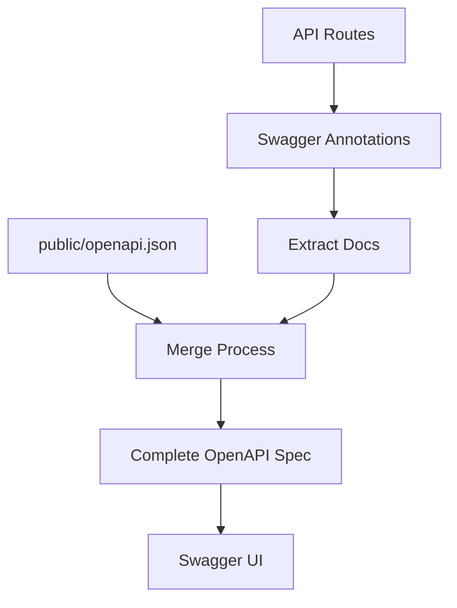

# Geautomatiseerd API Documentatiesysteem

Ever Works bevat een geautomatiseerd OpenAPI-documentatiesysteem dat uitgebreide API-documentatie genereert vanuit uw code.

## Overzicht

Het systeem biedt:
- 📝 **Geautomatiseerde generatie** – Van code-annotaties naar OpenAPI-specificatie
- 🔄 **Hybride aanpak** – Behoudt handmatige documentatie, voegt geautomatiseerde toe
- 🎯 **Type-veilig** – TypeScript-integratie
- 📊 **Swagger UI** – Interactieve API-verkenner
- 🔧 **Hot reload** – Auto-regeneratie tijdens ontwikkeling

## Architectuur



### Hybride Aanpak

- ✅ **Behoudt** bestaand `public/openapi.json` bestand
- ✅ **Voegt** `@swagger` annotaties toe in routecode
- ✅ **Samenvoegen** van beide bronnen automatisch
- ✅ **Genereert** volledige en consistente OpenAPI-bestanden

## Installatie

### 1. Afhankelijkheden installeren

```bash
# Installatiescript uitvoeren
./scripts/install-swagger-deps.sh

# Of handmatig met npm
npm install -D swagger-jsdoc @types/swagger-jsdoc tsx nodemon
```

### 2. Beschikbare scripts

```bash
# Documentatie eenmalig genereren
npm run generate-docs

# Watch-modus voor ontwikkeling (auto-regenereert)
npm run docs:watch

# Ontwikkeling met automatische generatie
npm run dev
```

## Gebruik

### Annotaties toevoegen aan routes

```typescript
// app/api/example/route.ts
import { NextRequest, NextResponse } from 'next/server';

/**
 * @swagger
 * /api/example:
 *   get:
 *     tags: ["Example"]
 *     summary: "Get example data"
 *     description: "Returns example data from the API"
 *     responses:
 *       200:
 *         description: "Success"
 *         content:
 *           application/json:
 *             schema:
 *               type: object
 *               properties:
 *                 success:
 *                   type: boolean
 *                   example: true
 *                 data:
 *                   type: array
 *                   items:
 *                     type: string
 */
export async function GET() {
  return NextResponse.json({ success: true, data: ["example"] });
}
```

### Annotatiehulpmiddelen gebruiken

```typescript
import { createAdminRouteAnnotation, CommonAnnotations } from '@/lib/swagger/annotations';

/**
 * @swagger
 * /api/admin/users:
 *   get:
 *     tags: ["Admin"]
 *     summary: "Get all users"
 *     security:
 *       - bearerAuth: []
 *     responses:
 *       200:
 *         description: "Success"
 *       401:
 *         $ref: '#/components/responses/Unauthorized'
 *       500:
 *         $ref: '#/components/responses/ServerError'
 */
export async function GET() {
  // Implementatie
}
```

### Veelgebruikte annotaties

Het systeem biedt herbruikbare annotatiecomponenten:

```typescript
// lib/swagger/annotations.ts

export const CommonAnnotations = {
  responses: {
    unauthorized: {
      description: "Unauthorized - Invalid or missing authentication",
      content: {
        "application/json": {
          schema: {
            type: "object",
            properties: {
              error: { type: "string", example: "Unauthorized" }
            }
          }
        }
      }
    },
    serverError: {
      description: "Internal Server Error",
      content: {
        "application/json": {
          schema: {
            type: "object",
            properties: {
              error: { type: "string", example: "Internal server error" }
            }
          }
        }
      }
    }
  },
  security: {
    bearerAuth: {
      type: "http",
      scheme: "bearer",
      bearerFormat: "JWT"
    }
  }
};
```

## Bestandsstructuur

```
scripts/
├── generate-openapi.ts     # Hoofdgeneratiescript
├── tsconfig.json          # TypeScript-configuratie voor scripts
└── install-swagger-deps.sh # Afhankelijkheidsinstallateur

lib/swagger/
└── annotations.ts         # Herbruikbare annotatiehulpmiddelen

templates/
└── route-template.ts      # Sjabloon voor nieuwe routes

public/
└── openapi.json          # Gegenereerde OpenAPI-specificatie
```

## Configuratie

### OpenAPI-basisconfiguratie

```typescript
const swaggerDefinition = {
  openapi: '3.0.0',
  info: {
    title: 'Ever Works API',
    version: '1.0.0',
    description: 'API-documentatie voor het Ever Works directory-platform',
  },
  servers: [
    { url: 'http://localhost:3000', description: 'Ontwikkelingsserver' },
    { url: 'https://yourdomain.com', description: 'Productieserver' },
  ],
};
```

### Swagger UI configuratie

Toegang tot de interactieve API-documentatie op:
- Ontwikkeling: `http://localhost:3000/api-docs`
- Productie: `https://yourdomain.com/api-docs`

## Best Practices

### 1. Consistente tagging

Gerelateerde eindpunten groeperen met tags:

```typescript
/**
 * @swagger
 * /api/items:
 *   get:
 *     tags: ["Items"]  // Consistente tagnamen gebruiken
 */
```

### 2. Gedetailleerde beschrijvingen

Duidelijke beschrijvingen en voorbeelden geven.

### 3. Schemadefinities

Herbruikbare schema's definiëren in componenten.

### 4. Foutantwoorden

Alle mogelijke foutantwoorden documenteren.
