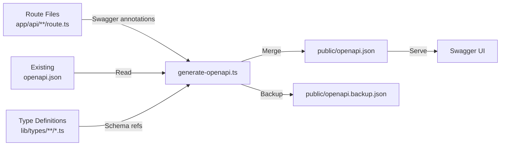

# OpenAPI Generatie

Het sjabloon bevat een geautomatiseerd OpenAPI-documentatiegeneratiesysteem dat `@swagger` JSDoc-annotaties in API-routebestanden scant, ze samenvoegt met bestaande documentatie en een volledige `openapi.json`-specificatie produceert.

## Overzicht



## Generator uitvoeren

```bash
tsx scripts/generate-openapi.ts
tsx scripts/generate-openapi.ts --silent
```

## Configuratie

```typescript
const swaggerOptions = {
	definition: {
		openapi: '3.0.0',
		info: {
			title: 'Ever Works API',
			version: '1.0.0',
			description: 'Comprehensive API documentation for Directory Web Template',
		},
		servers: [{ url: '/', description: 'Current Environment' }],
		components: {
			securitySchemes: {
				sessionAuth: { type: 'http', scheme: 'bearer', bearerFormat: 'JWT' },
				session: { type: 'apiKey', in: 'cookie', name: 'session_token' },
				cronSecret: { type: 'http', scheme: 'bearer', bearerFormat: 'Secret' }
			}
		}
	},
	apis: ['./app/api/**/route.ts', './app/api/**/*.ts', './lib/types/**/*.ts']
};
```

## Beveiligingsschema's

| Schema | Type | Gebruik |
| ------------- | ------------------------ | ------------------------------ |
| `sessionAuth` | Bearer JWT | Geauthenticeerde gebruikerseindpunten |
| `session` | Cookie (`session_token`) | Browser sessie-authenticatie |
| `cronSecret` | Bearer Secret | Cron job eindpunten |

## Ingebouwde componentschema's

### ErrorResponse

```json
{
	"type": "object",
	"properties": {
		"success": { "type": "boolean", "example": false },
		"error": { "type": "string", "example": "Error message" }
	}
}
```

### PaginationMeta

```json
{
	"type": "object",
	"properties": {
		"page": { "type": "integer", "example": 1 },
		"pageSize": { "type": "integer", "example": 20 },
		"total": { "type": "integer", "example": 150 },
		"totalPages": { "type": "integer", "example": 8 }
	}
}
```

## Swagger-annotaties schrijven

```typescript
/**
 * @swagger
 * /api/items:
 *   get:
 *     tags: ["Items"]
 *     summary: "List all items"
 *     responses:
 *       200:
 *         description: "Successful response"
 */
export async function GET(request: Request) {
	// handler implementatie
}
```

## Samenvoegstrategie

De generator gebruikt een intelligente samenvoegalgoritme bij het combineren van bestaande en gegenereerde documentatie.

### Documentatiekwaliteitscriteria

Een route heeft "gedetailleerde documentatie" als aan minimaal 2 van 3 criteria wordt voldaan:

| Criterium | Drempel |
| ------------------- | ------------------------------------------------ |
| Lange beschrijving | Meer dan 50 tekens |
| Antwoordvoorbeelden | Bevat `example` of `examples` in antwoorden |
| Gedetailleerde parameters | Parameters hebben zowel `description` als `example` |
