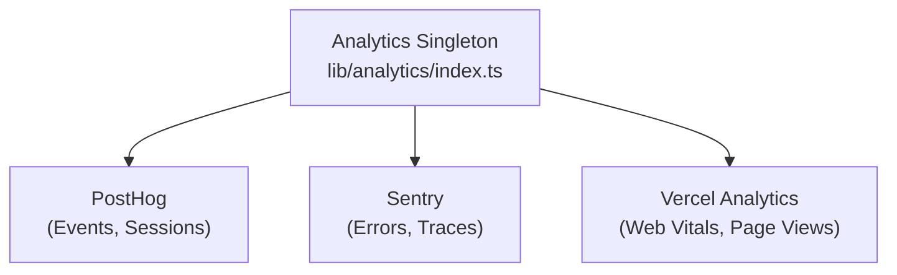

# Analytics-systeem

De Ever Works-sjabloon kan worden geïntegreerd met **PostHog**, **Sentry** en **Vercel Analytics** voor uitgebreide gebeurtenisregistratie, foutmonitoring, sessieregistratie en prestatieanalyses.

## Architectuur



## Analytics-klasse

De kernklasse `Analytics` in `lib/analytics/index.ts` is een singleton die de initialisatie en gebeurtenisverzending tussen providers beheert:

```typescript
class Analytics {
  private static instance: Analytics;
  private initialized: boolean;
  private exceptionTrackingProvider: ExceptionTrackingProvider;

  static getInstance(): Analytics;
  init(): void;
  trackEvent(name: string, properties?: EventProperties): void;
  trackPageView(url: string): void;
  identify(userId: string, properties?: UserProperties): void;
  reset(): void;
}
```

### Resolutie van provider voor het bijhouden van uitzonderingen

Het systeem ondersteunt een flexibele configuratie voor het bijhouden van uitzonderingen:

```typescript
type ExceptionTrackingProvider = 'sentry' | 'posthog' | 'both' | 'none';
```

De aanbieder wordt bepaald door de beschikbaarheid te controleren:
1. Lees de configuratiewaarde `EXCEPTION_TRACKING_PROVIDER` 2. Valideer dat de gekozen provider is ingeschakeld
3. Ga terug naar het beschikbare alternatief als primair niet is geconfigureerd

## PostHog-integratie

### Configuratie

```bash
NEXT_PUBLIC_POSTHOG_KEY=phc_xxx
NEXT_PUBLIC_POSTHOG_HOST=https://us.i.posthog.com

# Optional
NEXT_PUBLIC_POSTHOG_DEBUG=false
NEXT_PUBLIC_POSTHOG_SESSION_RECORDING=true
NEXT_PUBLIC_POSTHOG_AUTO_CAPTURE=true
NEXT_PUBLIC_POSTHOG_SAMPLE_RATE=1.0
NEXT_PUBLIC_POSTHOG_SESSION_RECORDING_SAMPLE_RATE=0.1
NEXT_PUBLIC_POSTHOG_EXCEPTION_TRACKING=true
```

### PostHog API-service

De server-side service bevindt zich op `lib/services/posthog-api.service.ts` en biedt beheerdersanalysegegevens:

```typescript
class PostHogApiService {
  constructor(); // Reads from analyticsConfig

  isConfigured(): boolean;
  async getTotalPageViews(days?: number): Promise<number>;
  async getTopPages(days?: number): Promise<PageData[]>;
  async getEventCounts(eventName: string, days?: number): Promise<number>;
}
```

**Vereist voor API-toegang aan serverzijde:**
```bash
POSTHOG_PERSONAL_API_KEY=phx_xxx
POSTHOG_PROJECT_ID=12345
```

### Haak aan de cliëntzijde

```typescript
import { useAnalytics } from '@/hooks/use-analytics';

const {
  trackEvent,      // (name: string, properties?: object) => void
  trackPageView,   // (url: string) => void
  identify,        // (userId: string, properties?: object) => void
} = useAnalytics();
```

### Geo Analytics-haak

```typescript
import { useGeoAnalytics } from '@/hooks/use-geo-analytics';

const {
  geoData,         // Geographic analytics data
  isLoading,
} = useGeoAnalytics();
```

## Sentry-integratie

### Configuratie

```bash
NEXT_PUBLIC_SENTRY_DSN=https://xxx@sentry.io/xxx
SENTRY_AUTH_TOKEN=sntrys_xxx
SENTRY_ORG=your-org
SENTRY_PROJECT=your-project
NEXT_PUBLIC_SENTRY_EXCEPTION_TRACKING=true
```

Sentry biedt:
- **Fouttracking** -- Automatisch vastleggen van onverwerkte uitzonderingen
- **Prestatiemonitoring** - Transactietracering voor API-routes en het laden van pagina's
- **Sessie opnieuw afspelen** -- Optionele sessie-opname

## Vercel Analytics

Vercel Analytics is automatisch beschikbaar wanneer geïmplementeerd op Vercel:

```bash
# Enabled by default on Vercel deployments
NEXT_PUBLIC_VERCEL_ANALYTICS=true
```

Biedt:
- **Web Vitals** -- Controle van kernwebvitaliteit (LCP, FID, CLS).
- **Paginaweergaven** -- Automatische tracking van paginaweergaven
- **Doelgroepinzichten** -- Geografische en apparaatanalyses

## Beheerder Analytics-dashboard

Het beheerdersdashboard biedt geaggregeerde analyses via de `useAdminStats` hook:

```typescript
import { useAdminStats } from '@/hooks/use-admin-stats';

const {
  stats,           // Dashboard statistics
  isLoading,
} = useAdminStats();
```

De `useDashboardStats` -haak biedt meer gedetailleerde statistieken:

```typescript
import { useDashboardStats } from '@/hooks/use-dashboard-stats';

const {
  stats,           // { items, users, revenue, pageViews, ... }
  isLoading,
  refetch,
} = useDashboardStats();
```

## Analyse uitschakelen

Analytics-providers zijn uitgeschakeld als hun configuratie ontbreekt. Er wordt geen trackingcode geladen als de bijbehorende omgevingsvariabelen niet zijn ingesteld. Hierdoor kan de sjabloon werken zonder enige analyse tijdens de ontwikkeling.
