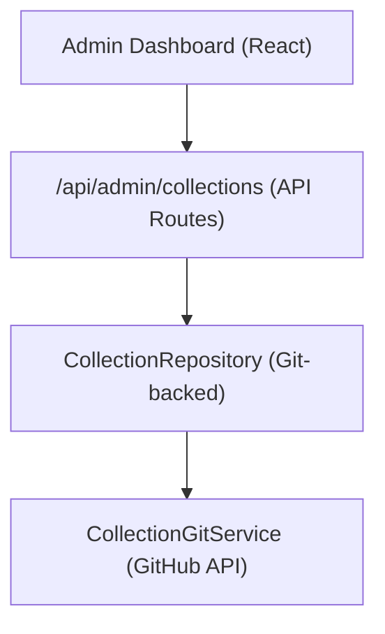

# Collectiesysteem

Met collecties kunnen beheerders groepen items samenstellen voor weergave op de site. Het systeem slaat verzamelgegevens op in de op Git gebaseerde CMS-repository en biedt CRUD-bewerkingen via het beheerdersdashboard.

## Architectuur



Collecties worden opgeslagen als bestanden in de op Git gebaseerde CMS-repository (geconfigureerd via `DATA_REPOSITORY` ), waarbij de `CollectionGitService` wordt gebruikt voor lees-/schrijfbewerkingen via de GitHub API.

## Gegevensmodel

```typescript
interface Collection {
  id: string;
  name: string;
  slug: string;
  description?: string;
  isActive: boolean;
  items: string[];          // Array of item slugs
  item_count: number;       // Computed from items array
  displayOrder?: number;
  created_at: string;
  updated_at: string;
}
```

## CollectieRepository

De repository bevindt zich op `lib/repositories/collection.repository.ts` en biedt:

```typescript
class CollectionRepository {
  async findAll(options?: CollectionListOptions): Promise<Collection[]>;
  async findById(id: string): Promise<Collection | null>;
  async findBySlug(slug: string): Promise<Collection | null>;
  async create(data: CreateCollectionRequest): Promise<Collection>;
  async update(id: string, data: UpdateCollectionRequest): Promise<Collection>;
  async delete(id: string): Promise<void>;
  async assignItems(id: string, itemSlugs: string[]): Promise<void>;
}
```

### Lijstopties

```typescript
interface CollectionListOptions {
  search?: string;           // Filter by name
  includeInactive?: boolean; // Include inactive collections
  sortBy?: 'name' | 'item_count' | 'created_at';
  sortOrder?: 'asc' | 'desc';
  page?: number;
  limit?: number;
}
```

## Beheerderhaak

```typescript
import { useAdminCollections } from '@/hooks/use-admin-collections';

const {
  collections,        // Collection[]
  total, page, totalPages, limit,
  isLoading, isSubmitting,
  createCollection,   // (data: CreateCollectionRequest) => Promise<boolean>
  updateCollection,   // (id: string, data: UpdateCollectionRequest) => Promise<boolean>
  deleteCollection,   // (id: string) => Promise<boolean>
  assignItems,        // (id: string, itemSlugs: string[]) => Promise<boolean>
  fetchAssignedItems, // (id: string) => Promise<Item[]>
  refetch, refreshData,
} = useAdminCollections({ page: 1, limit: 10, search: '' });
```

## API-eindpunten

| Werkwijze | Eindpunt | Beschrijving |
|--------|----------|------------|
| KRIJG | `/api/admin/collections` | Lijstcollecties (gepagineerd) |
| POST | `/api/admin/collections` | Een nieuwe collectie aanmaken |
| ZET | `/api/admin/collections/:id` | Een collectie bijwerken |
| VERWIJDEREN | `/api/admin/collections/:id` | Een verzameling verwijderen |
| KRIJG | `/api/admin/collections/:id/items` | Toegewezen items krijgen |
| POST | `/api/admin/collections/:id/items` | Artikelen toewijzen aan collectie |

## Weergave aan de clientzijde

De hook `useCollectionsExists` controleert of er actieve collecties bestaan en wordt gebruikt voor voorwaardelijke weergave:

```typescript
import { useCollectionsExists } from '@/hooks/use-collections-exists';
const { exists, isLoading } = useCollectionsExists();
```

## Configuratie

Voor verzamelingen zijn de volgende omgevingsvariabelen vereist:

```bash
DATA_REPOSITORY=https://github.com/owner/repo   # Git CMS repository
GH_TOKEN=ghp_xxx                                  # GitHub API token
GITHUB_BRANCH=main                                # Branch for collection data
```

De `CollectionRepository` parseert de `DATA_REPOSITORY` URL om de GitHub-eigenaar en opslagplaats te extraheren en gebruikt vervolgens het token voor API-authenticatie.
