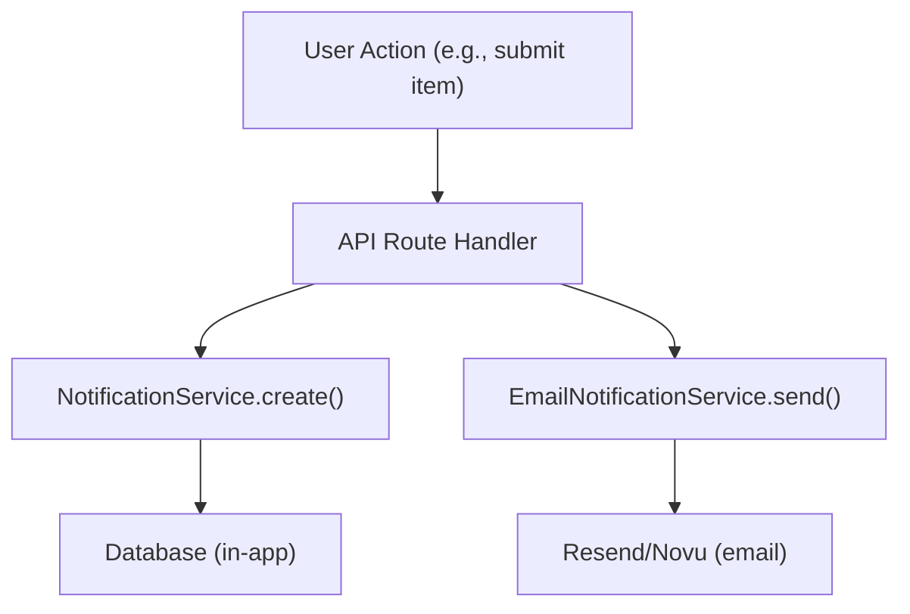

# Meldingssysteem

Het Ever Works-sjabloon biedt zowel in-app-meldingen (opgeslagen in de database) als e-mailmeldingen (via Resend of Novu). Meldingen worden geactiveerd door systeemgebeurtenissen zoals inzendingen van artikelen, inhoudsrapporten en mislukte betalingen.

## In-app-meldingen

### Meldingsservice

De service bevindt zich op `lib/services/notification.service.ts` en beheert databasegebaseerde meldingen:

```typescript
class NotificationService {
  // Create a generic notification
  static async create(data: CreateNotificationData);

  // Convenience methods for specific events
  static async createItemSubmissionNotification(adminUserId, itemId, itemName, submittedBy);
  static async createCommentReportedNotification(adminUserId, commentId, content, reportedBy);
  static async createItemReportedNotification(adminUserId, itemId, itemName, reportedBy);
  static async createUserRegisteredNotification(adminUserId, userName, userEmail);
  static async createPaymentFailedNotification(userId, subscriptionId, errorMessage);
  static async createSystemAlertNotification(adminUserId, title, message);
}
```

### Meldingstypen

```typescript
type NotificationType =
  | "item_submission"      // New item requires admin review
  | "comment_reported"     // Comment flagged by user
  | "item_reported"        // Item flagged by user
  | "user_registered"      // New user account created
  | "payment_failed"       // Subscription payment failed
  | "system_alert";        // Generic system notification
```

### Structuur van meldingsgegevens

```typescript
interface CreateNotificationData {
  userId: string;                    // Recipient user ID
  type: NotificationType;
  title: string;
  message: string;
  data?: Record<string, unknown>;    // Arbitrary metadata (actionUrl, etc.)
}
```

### Meldingsstatistieken

```typescript
interface NotificationStats {
  total: number;
  unread: number;
  byType: Record<string, number>;
}
```

### Beheerderhaak

```typescript
import { useAdminNotifications } from '@/hooks/use-admin-notifications';

const {
  notifications,     // Notification[]
  stats,             // NotificationStats
  isLoading,
  markAsRead,        // (id: string) => Promise<boolean>
  markAllAsRead,     // () => Promise<boolean>
  deleteNotification,// (id: string) => Promise<boolean>
  refetch,
} = useAdminNotifications();
```

## E-mailmeldingen

### E-mailmeldingsservice

Deze service bevindt zich op `lib/services/email-notification.service.ts` en verwerkt de bezorging van transactionele e-mail:

```typescript
class EmailNotificationService {
  // Send notification emails for various events
  static async sendItemSubmissionEmail(adminEmail, itemData);
  static async sendPaymentSuccessEmail(userEmail, paymentData);
  static async sendPaymentFailedEmail(userEmail, paymentData);
  static async sendSubscriptionCancelledEmail(userEmail, subscriptionData);
  static async sendTrialEndingEmail(userEmail, trialData);
  static async sendWelcomeEmail(userEmail, userData);
}
```

### Configuratie van e-mailprovider

De sjabloon ondersteunt twee e-mailproviders:

**Opnieuw verzenden** (standaard):
```bash
RESEND_API_KEY=re_xxx
```

**november**:
```bash
NOVU_API_KEY=xxx
NOVU_TEMPLATE_ID=xxx        # Optional: custom template ID
NOVU_BACKEND_URL=xxx         # Optional: self-hosted Novu URL
```

Providerselectie wordt geconfigureerd in de siteconfiguratie:
```json
{
  "mail": {
    "provider": "resend",
    "default_from": "noreply@yourdomain.com"
  }
}
```

### Betalings-e-mailservice

Het betalingssubsysteem heeft een eigen e-mailservice ( `lib/payment/services/payment-email.service.ts` ) met helpers voor het opmaken van betalingsgegevens:

```typescript
import {
  paymentEmailService,
  extractCustomerInfo,    // Extract customer data from webhook event
  formatAmount,           // Format currency amounts
  formatPaymentMethod,    // Format card details
  formatBillingDate,      // Format billing period dates
  getPlanName,            // Map plan ID to display name
  getBillingPeriod,       // Format billing interval
} from '@/lib/payment/services/payment-email.service';
```

## Meldingsvoorkeuren

Gebruikers kunnen hun meldingsvoorkeuren beheren via de instellingeninterface. De voorkeuren bepalen welke typen meldingen de bezorging van e-mail activeren, terwijl in-app-meldingen altijd worden gemaakt.

## Gebeurtenisstroom



## Gerelateerde documentatie

- [Rapporten en inhoudmoderatie](./reports-moderation.md) -- Meldingen geactiveerd door rapporten
- [Betalingswebhooks](../payment/webhooks.md) -- Betalingsgerelateerde e-mailmeldingen
