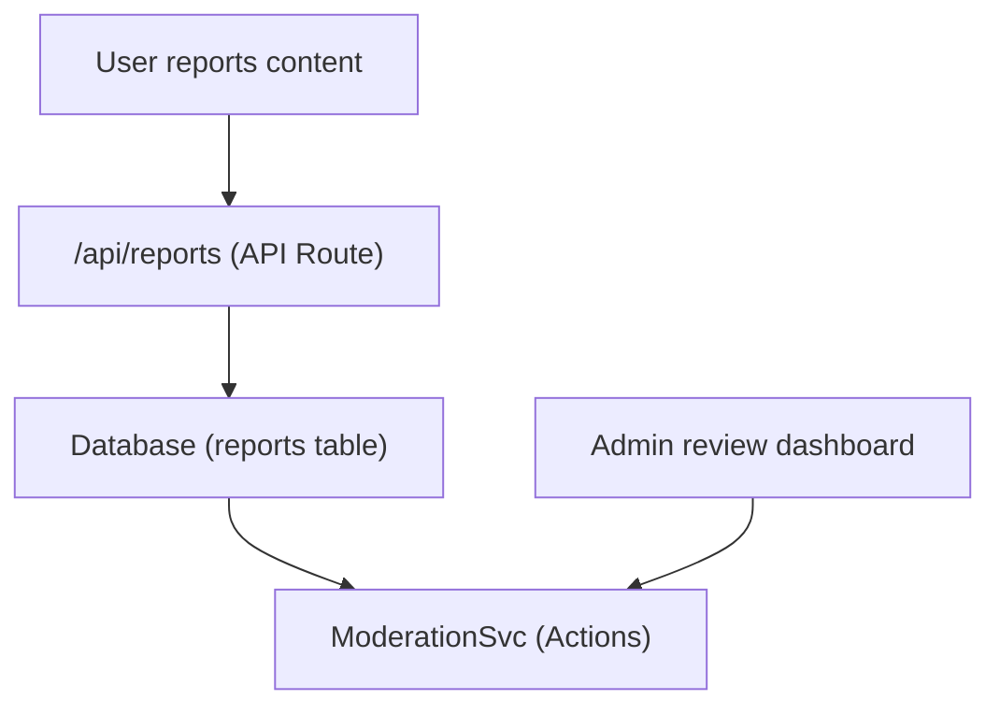

# Rapporten en inhoudmoderatie

De Ever Works-sjabloon bevat een inhoudsrapportage- en moderatiesysteem waarmee gebruikers ongepaste inhoud kunnen markeren en beheerders actie kunnen ondernemen op basis van gerapporteerde items en opmerkingen.

## Architectuur



## Inhoudstypen

Het systeem ondersteunt rapportage van twee inhoudstypen:

```typescript
enum ReportContentType {
  ITEM = 'item',
  COMMENT = 'comment',
}
```

## ModeratieService

De dienst bevindt zich op `lib/services/moderation.service.ts` en biedt moderatieacties:

### Resolutie van de inhoudeigenaar

```typescript
async function getContentOwner(
  contentType: ReportContentTypeValues,
  contentId: string
): Promise<ContentOwnerResult>;
// Returns: { success: boolean, userId?: string, error?: string }
```

Bepaalt de auteur van gerapporteerde inhoud door opmerkingen op te zoeken via `getCommentById()` of items via `ItemRepository.findById()` .

### Moderatieacties

| Actie | Beschrijving | Effect |
|--------|-------------|--------|
| **Inhoud verwijderen** | Verwijder het gerapporteerde item of de opmerking | Inhoud verwijderd, geschiedenis vastgelegd |
| **Waarschuw gebruiker** | Aantal waarschuwingen verhogen | Waarschuwingsteller verhoogd |
| **Gebruiker opschorten** | Account tijdelijk opschorten | Accounttoegang beperkt |
| **Gebruiker verbannen** | Account definitief blokkeren | Account permanent beperkt |
| **Rapport sluiten** | Rapport markeren als opgelost zonder actie | Rapport gesloten |

### Actie-implementatie

Elke actie creëert een item in de moderatiegeschiedenis en kan e-mailmeldingen activeren:

```typescript
// Example: Remove content
async function removeContent(
  contentType: ReportContentTypeValues,
  contentId: string,
  reportId: string,
  adminId: string
): Promise<ModerationResult>;
```

De dienst afgevaardigden naar:
- `deleteComment()` -- Voor het verwijderen van reacties
- `ItemRepository` -- Voor het verwijderen van artikelen
- `createModerationHistory()` -- Voor audittrail
- `incrementWarningCount()` -- Voor gebruikerswaarschuwingen
- `suspendUserQuery()` / `banUserQuery()` -- Voor accountacties
- `EmailNotificationService` -- Voor e-mails met gebruikersmeldingen

## Beheerderhaak

```typescript
import { useAdminReports } from '@/hooks/use-admin-reports';

const {
  reports,           // Report[]
  total, page, totalPages,
  isLoading, isSubmitting,
  resolveReport,     // (id, action, reason?) => Promise<boolean>
  dismissReport,     // (id, reason?) => Promise<boolean>
  deleteReport,      // (id) => Promise<boolean>
  refetch, refreshData,
} = useAdminReports({ page: 1, limit: 10 });
```

## Moderatieworkflow

1. **Gebruiker rapporteert inhoud**: selecteert een reden en verzendt deze via de rapport-API
2. **Beheerdersmelding** -- `NotificationService.createItemReportedNotification()` of `createCommentReportedNotification()` waarschuwt beheerders
3. **Beheerderbeoordelingen** - Bekijk rapportdetails in het beheerdersdashboard
4. **Beheerder onderneemt actie** - Kies uit: inhoud verwijderen, gebruiker waarschuwen, opschorten, verbannen of afwijzen
5. **Geschiedenis vastgelegd** -- `createModerationHistory()` registreert de actie met beheerders-ID, tijdstempel en reden
6. **Gebruiker op de hoogte gesteld** - E-mailmelding verzonden naar de eigenaar van de inhoud over de ondernomen actie

## Moderatieacties Enum

```typescript
enum ModerationAction {
  REMOVE_CONTENT = 'remove_content',
  WARN_USER = 'warn_user',
  SUSPEND_USER = 'suspend_user',
  BAN_USER = 'ban_user',
  DISMISS = 'dismiss',
}
```

## API-eindpunten

| Werkwijze | Eindpunt | Beschrijving |
|--------|----------|------------|
| POST | `/api/reports` | Een nieuw rapport indienen |
| KRIJG | `/api/admin/reports` | Lijstrapporten (admin, gepagineerd) |
| POST | `/api/admin/reports/:id/resolve` | Een melding met actie oplossen |
| POST | `/api/admin/reports/:id/dismiss` | Een rapport afwijzen |
| VERWIJDEREN | `/api/admin/reports/:id` | Een rapport verwijderen |

## Gerelateerde documentatie

- [Meldingssysteem](./notifications.md) -- Hoe rapportmeldingen worden afgeleverd
- [Stemmen en reacties](./voting-comments.md) -- Reactiesysteem dat kan worden gerapporteerd
