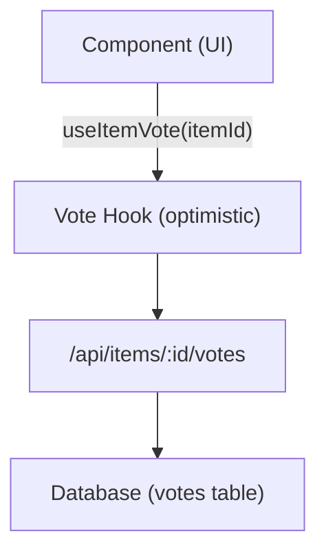

# Stem- en commentaarsysteem

De Ever Works-sjabloon bevat een volledig stem- en commentaarsysteem waarmee gebruikers items kunnen up-/downvoten, beoordelingen met sterbeoordelingen kunnen achterlaten en zich met de inhoud kunnen bezighouden. Beide systemen gebruiken optimistische updates voor directe UI-feedback.

## Stemsysteem

### Architectuur

Het stemsysteem maakt gebruik van een stemmodel per item, waarbij elke geauthenticeerde gebruiker één stem (omhoog of omlaag) per item kan uitbrengen. Het systeem houdt het netto aantal stemmen en de stemmen van individuele gebruikers bij.



### gebruikItemVote Hook

```typescript
import { useItemVote } from '@/hooks/use-item-vote';

const {
  voteCount,       // number -- net vote count
  userVote,        // 'up' | 'down' | null
  isLoading,       // boolean
  handleVote,      // (type: 'up' | 'down') => void
  refreshVotes,    // () => void
} = useItemVote(itemId);
```

### Stemgedrag

| Huidige staat | Actie | Resultaat |
|--------------|--------|--------|
| Geen stem | Klik op Omhoog | Stem omhoog (+1) |
| Geen stem | Klik op Omlaag | Neerstem (-1) |
| Omhoog gestemd | Klik op Omhoog | Stem verwijderen (schakelen) |
| Omhoog gestemd | Klik op Omlaag | Schakel over naar downvote (-2 netto) |
| Gedownvote | Klik op Omlaag | Stem verwijderen (schakelen) |
| Gedownvote | Klik op Omhoog | Schakel over naar upvote (+2 netto) |

### Optimistische updates

De stemhaak implementeert optimistische updates met terugdraaiing:

1. **onMutate** - Annuleer uitgaande zoekopdrachten, maak een momentopname van de huidige status, pas een optimistische update toe
2. **onSuccess** - Vervang optimistische gegevens door serverreactie
3. **onError** - Ga terug naar momentopname, toon fouttoast

### Authenticatie

Niet-geauthenticeerde gebruikers die proberen te stemmen, zien een login-modaliteit via `useLoginModal` :

```typescript
if (!user) {
  loginModal.onOpen('Please sign in to vote on this item');
  throw new Error('Authentication required');
}
```

### Cachebeheer

De `useVoteCache` utility hook biedt cross-component cachebewerkingen:

```typescript
import { useVoteCache } from '@/hooks/use-item-vote';

const {
  invalidateAllVotes,     // () => void
  invalidateItemVotes,    // (itemId: string) => void
  clearVoteCache,         // () => void
  prefetchItemVotes,      // (itemId: string) => Promise<void>
} = useVoteCache();
```

## Reactiesysteem

### Architectuur

Opmerkingen ondersteunen volledige CRUD-bewerkingen met sterbeoordelingen, moderatie en realtime updates.

### gebruikCommentaren Hook

```typescript
import { useComments } from '@/hooks/use-comments';

const {
  comments,              // CommentWithUser[]
  isPending,
  createComment,         // ({ content, itemId, rating }) => Promise
  isCreating,
  updateComment,         // ({ commentId, content?, rating? }) => Promise
  isUpdating,
  deleteComment,         // (commentId) => Promise
  isDeleting,
  rateComment,           // ({ commentId, rating }) => void
  isRatingComment,
  updateCommentRating,   // ({ commentId, rating }) => void
  isUpdatingRating,
  commentRating,         // number
  isLoadingRating,
} = useComments(itemId);
```

### Commentaargegevensmodel

Elke opmerking omvat:
- `id` -- Unieke identificatie
- `content` -- Commentaartekst
- `rating` -- Optionele sterbeoordeling (1-5)
- `userId` -- Referentie van de auteur
- `itemId` -- Bijbehorend artikel
- `user` -- Ingevulde gebruikersgegevens (naam, e-mailadres, afbeelding)
- `createdAt` / `updatedAt` -- Tijdstempels

### Beoordelingsintegratie

Opmerkingen en beoordelingen zijn nauw geïntegreerd:
- Door een opmerking met een beoordeling te maken, wordt de totale beoordeling van het item bijgewerkt
- Het bewerken van de beoordeling van een reactie leidt tot een herberekening
- De `["item-rating", itemId]` -query wordt opnieuw opgehaald na elke commentaarmutatie

### Transcomponentgebeurtenissen

Het commentaarsysteem verzendt aangepaste DOM-gebeurtenissen voor coördinatie tussen componenten:

```typescript
const COMMENT_MUTATION_EVENT = "comment:mutated";
window.dispatchEvent(new CustomEvent(COMMENT_MUTATION_EVENT, { detail: comment }));
```

Andere componenten kunnen luisteren naar commentaarwijzigingen zonder directe React Query-koppeling.

### Beheerdermoderatie

De `useAdminComments` hook biedt commentaarbeheer op beheerdersniveau:

```typescript
import { useAdminComments } from '@/hooks/use-admin-comments';

const {
  comments,         // AdminCommentItem[]
  totalComments,
  totalPages,
  isDeleting,       // string | null (ID of comment being deleted)
  deleteComment,    // (id: string) => Promise<boolean>
} = useAdminComments({ page: 1, limit: 10, search: '' });
```

### API-eindpunten

| Werkwijze | Eindpunt | Beschrijving |
|--------|----------|------------|
| KRIJG | `/api/items/:id/comments` | Opmerkingen voor een item ophalen |
| POST | `/api/items/:id/comments` | Creëer een nieuwe reactie |
| ZET | `/api/items/:id/comments/:commentId` | Een reactie bijwerken |
| VERWIJDEREN | `/api/items/:id/comments/:commentId` | Een opmerking verwijderen |
| POST | `/api/items/:id/comments/rating` | Beoordeel een reactie |
| ZET | `/api/items/:id/comments/rating` | Reactiebeoordeling bijwerken |
| KRIJG | `/api/items/:id/comments/rating` | Totale beoordeling verkrijgen |

## Functievlag-integratie

Zowel stemmen als commentaar respecteren de kenmerkende vlaggen:

```typescript
const flags = getFeatureFlags();
// flags.ratings -- Controls star rating display
// flags.comments -- Controls comment section visibility
```

Wanneer de database niet is geconfigureerd ( `DATABASE_URL` ontbreekt), worden deze functies automatisch uitgeschakeld.
