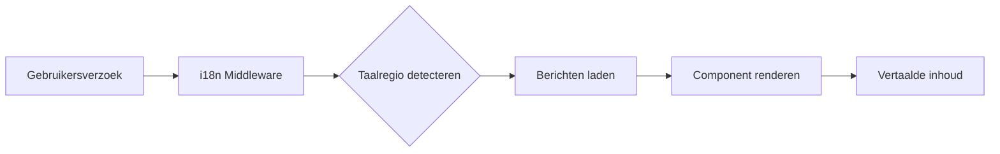

# Internationalisering Overzicht

Ever Works is gebouwd met internationalisering in gedachten en ondersteunt meerdere talen direct via `next-intl`.

## 🌍 Ondersteunde Talen

De template heeft ingebouwde ondersteuning voor:

- 🇬🇧 **Engels** (en) – Standaardtaal
- 🇫🇷 **Frans** (fr)
- 🇪🇸 **Spaans** (es)
- 🇩🇪 **Duits** (de)
- 🇨🇳 **Chinees** (zh)
- 🇸🇦 **Arabisch** (ar)
- 🇧🇬 **Bulgaars** (bg)
- 🇳🇱 **Nederlands** (nl)
- 🇮🇱 **Hebreeuws** (he)
- 🇮🇹 **Italiaans** (it)
- 🇵🇱 **Pools** (pl)
- 🇵🇹 **Portugees** (pt)
- 🇷🇺 **Russisch** (ru)

## Hoe Het Werkt

### URL-gebaseerde Lokalisatie

Ever Works gebruikt URL-gebaseerde taaldetectie:

```
https://yoursite.com/en/about    → Engels
https://yoursite.com/fr/about    → Frans
https://yoursite.com/es/about    → Spaans
```

### Automatische Taaldetectie

Het systeem detecteert automatisch:
1. De browsertaal van de gebruiker
2. Leidt door naar de juiste taalregio
3. Onthoudt de taalvoorkeur van de gebruiker
4. Valt terug op de standaardtaal (Engels)

## Vertaalarchitectuur



## Vertaalbestanden

Vertalingen worden opgeslagen in JSON-bestanden:

```
messages/
├── en.json    # Engels
├── fr.json    # Frans
├── es.json    # Spaans
├── de.json    # Duits
├── zh.json    # Chinees
└── ar.json    # Arabisch
```

## Snel Voorbeeld

```typescript
import { useTranslations } from 'next-intl';

export function MyComponent() {
  const t = useTranslations('common');

  return (
    <div>
      <h1>{t('welcome')}</h1>
      <p>{t('description')}</p>
    </div>
  );
}
```

## Functies

### ✅ Volledige Vertaaldekking
- UI-componenten
- Formulierlabels en validatieberichten
- E-mailsjablonen
- Foutmeldingen
- SEO-metadata

### ✅ RTL-ondersteuning
- Automatische RTL-layout voor Arabisch en Hebreeuws
- Gespiegelde UI-elementen
- Correcte tekstuitlijning

### ✅ Datum- en Getalopmaak
- Taalregio-specifieke datumopmaak
- Valutaopmaak
- Getalopmaak

### ✅ Meervoudsvormen
- Automatische meervoudsvormen
- Taalspecifieke regels

## Volgende Stappen

- [Vertaalgids →](./translation-guide) – Leer hoe u vertalingen toevoegt en beheert
- [Aan de slag](/getting-started) – Stel uw project in
- [Aanpassing](/guides/customization) – Pas uw site aan

## Hulp Nodig?

Bekijk onze [ondersteuningspagina](/advanced-guide/support) voor hulp bij internationalisering.
