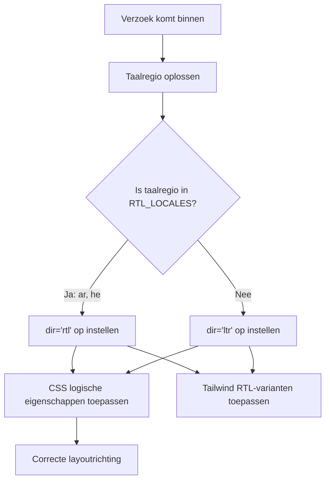

# RTL (Rechts-naar-Links) Ondersteuning

De template ondersteunt rechts-naar-links (RTL)-talen zoals Arabisch en Hebreeuws volledig. Deze pagina documenteert hoe RTL-detectie werkt, hoe de layoutrichting wordt toegepast en hoe componenten zich aanpassen aan RTL-contexten.

## Architectuuroverzicht



## Bronbestanden

| Bestand | Doel |
|------|---------|
| `lib/constants.ts` | RTL-taalregio-lijstdefinitie |
| `app/layout.tsx` | Root-layout met `dir`-attribuut |
| `components/language-switcher.tsx` | Taalkaart met `isRTL`-metadata |

## RTL-taalregioconfiguratie

```typescript
export const RTL_LOCALES: readonly Locale[] = ['ar', 'he'] as const;
```

## Hoe richting wordt toegepast

### Root-layout detectie

```typescript
export default async function RootLayout({ children }) {
  const locale = await getLocale();
  const dir = RTL_LOCALES.includes(locale as Locale) ? 'rtl' : 'ltr';

  return (
    <html lang={locale} dir={dir} suppressHydrationWarning>
      <body className={`${getFontClassNames(locale)} antialiased`}>
        {children}
      </body>
    </html>
  );
}
```

### Browserrendering

Wanneer `dir="rtl"` is ingesteld op `<html>`:

| LTR-gedrag | RTL-gedrag |
|--------------|-------------|
| Tekst loopt van links naar rechts | Tekst loopt van rechts naar links |
| Inhoud begint aan de linkerkant | Inhoud begint aan de rechterkant |
| Schuifbalk rechts | Schuifbalk links |
| `text-align: left` standaard | `text-align: right` standaard |

## CSS-strategieën voor RTL

### 1. CSS Logische Eigenschappen

| Fysieke eigenschap | Logische eigenschap | LTR-betekenis | RTL-betekenis |
|-------------------|-----------------|-------------|-------------|
| `margin-left` | `margin-inline-start` | Linkermarge | Rechtermarge |
| `margin-right` | `margin-inline-end` | Rechtermarge | Linkermarge |
| `padding-left` | `padding-inline-start` | Linkeropvulling | Rechteropvulling |
| `text-align: left` | `text-align: start` | Links uitgelijnd | Rechts uitgelijnd |
| `left` | `inset-inline-start` | Linkerpositie | Rechterpositie |

### 2. Tailwind CSS RTL-ondersteuning

```html
<div class="ml-4 rtl:mr-4 rtl:ml-0">
  Inhoud met richtingsmarge
</div>

<svg class="rtl:rotate-180">
  <path d="M1 9 4-4-4-4" />
</svg>
```

### 3. Tailwind Logische Hulpmiddelen

```html
<div class="ps-4">  <!-- padding-inline-start: 1rem -->
<div class="pe-4">  <!-- padding-inline-end: 1rem -->
<div class="ms-4">  <!-- margin-inline-start: 1rem -->
<div class="me-4">  <!-- margin-inline-end: 1rem -->
```

## Componentpatronen voor RTL

### Breadcrumb-pijlen

```tsx
function ChevronIcon() {
  return (
    <svg className="w-3 h-3 mx-1 rtl:rotate-180" viewBox="0 0 6 10">
      <path d="m1 9 4-4-4-4" />
    </svg>
  );
}
```

## Veelvoorkomende RTL-problemen

| Probleem | Oorzaak | Oplossing |
|-------|-------|-----|
| Verkeerde tekstuitlijning | `text-left` in plaats van `text-start` | Logische eigenschappen gebruiken |
| Pictogrammen niet gespiegeld | Ontbrekende `rtl:rotate-180` bij richtingpictogrammen | RTL-variant toevoegen |
| Marge aan verkeerde kant | `ml-*` in plaats van `ms-*` | Logische Tailwind-hulpmiddelen gebruiken |
| Dropdown verkeerd gepositioneerd | Vaste `left`/`right`-positionering | Logisch `inset-inline-*` gebruiken |

## Nieuwe RTL-taal toevoegen

1. **Taalregio toevoegen** aan `LOCALES` in `lib/constants.ts`
2. **Toevoegen aan `RTL_LOCALES`**
3. **Berichtenbestand aanmaken** op `messages/ur.json`
4. **Taalkaartinvoer toevoegen** in `components/language-switcher.tsx`
5. **Vlag-SVG toevoegen** aan `public/flags/ur.svg`
6. **Layout grondig testen** in RTL-modus

## Best Practices

1. **Geef de voorkeur aan CSS logische eigenschappen** boven fysieke eigenschappen
2. **Gebruik `dir="rtl"` op `<html>`** (al afgehandeld door de root-layout)
3. **Test met echte Arabische/Hebreeuwse inhoud**, niet alleen Engelse tekst in RTL-modus
4. **Spiegel geen decoratieve afbeeldingen** of merklogo's
