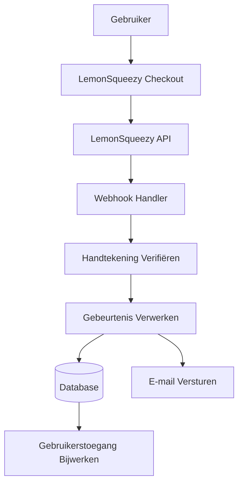

# LemonSqueezy Configuratie

Deze gids legt uit hoe LemonSqueezy als betalingsprovider in uw Ever Works-applicatie geconfigureerd wordt.

## Overzicht

LemonSqueezy is een merchant-of-record platform dat het volgende vereenvoudigt:

- 💰 Globale betalingen met automatische belastingconformiteit
- 🌍 Ondersteuning voor 135+ landen
- 📊 Ingebouwde fraudepreventie
- 🔄 Abonnementsbeheer
- 💳 Meerdere betaalmethoden
- 📧 Geautomatiseerde e-mailkwitanties

:::tip Waarom LemonSqueezy?
LemonSqueezy fungeert als merchant of record en verwerkt automatisch alle belastingconformiteit, btw en omzetbelasting. Dit betekent dat u zich niet hoeft te registreren voor belastingen in verschillende landen.
:::

## Vereiste Omgevingsvariabelen

Voeg deze variabelen toe aan uw `.env.local`-bestand:

```env
# LemonSqueezy Configuratie
LEMONSQUEEZY_API_KEY=your_api_key_here
LEMONSQUEEZY_WEBHOOK_SECRET=your_webhook_secret_here
LEMONSQUEEZY_STORE_ID=your_store_id_here

# Product/Variant-IDs (optioneel)
NEXT_PUBLIC_LEMONSQUEEZY_PRO_VARIANT_ID=variant_id_here
NEXT_PUBLIC_LEMONSQUEEZY_SPONSOR_VARIANT_ID=variant_id_here
```

## LemonSqueezy Dashboard Installatie

### Stap 1: Uw Winkel Aanmaken

1. Registreer bij [LemonSqueezy](https://lemonsqueezy.com)
2. Maak een nieuwe winkel aan
3. Voltooi uw winkelinstellingen (naam, valuta, enz.)
4. Kopieer uw **Winkel-ID** uit de URL of instellingen

### Stap 2: Producten Aanmaken

1. Ga naar **Producten** → **Nieuw Product**
2. Maak uw prijsniveaus aan:

| Product | Prijs | Type | Beschrijving |
|---------|-------|------|--------------|
| **Pro Plan** | $10/maand | Abonnement | Geavanceerde functies |
| **Sponsor Plan** | $20 | Eenmalig | Premium ondersteuning |

3. Maak voor elk product **Varianten** aan met specifieke prijzen
4. Kopieer de **Variant-ID** voor elke prijsoptie

### Stap 3: API-sleutel Ophalen

1. Ga naar **Instellingen** → **API**
2. Maak een nieuwe API-sleutel aan
3. Kopieer de API-sleutel (begint met `ls_`)
4. Voeg deze toe aan uw `.env.local` als `LEMONSQUEEZY_API_KEY`

### Stap 4: Webhooks Configureren

1. Ga naar **Instellingen** → **Webhooks**
2. Klik op **Webhook Aanmaken**
3. Configureer de webhook:
   - **URL**: `https://uwdomein.com/api/lemonsqueezy/webhook`
   - **Gebeurtenissen**: Selecteer alle abonnements- en bestellingsgebeurtenissen
   - **Geheim**: Genereer een geheime sleutel

4. Kopieer het **Webhook Geheim** en voeg het toe aan uw `.env.local`

#### Aanbevolen Gebeurtenissen

Selecteer deze gebeurtenissen in uw webhook-configuratie:

- ✅ `subscription_created` - Nieuw abonnement
- ✅ `subscription_updated` - Abonnementswijzigingen
- ✅ `subscription_cancelled` - Annulering
- ✅ `subscription_payment_success` - Geslaagde betaling
- ✅ `subscription_payment_failed` - Mislukte betaling
- ✅ `subscription_trial_will_end` - Proefperiode eindigt
- ✅ `order_created` - Eenmalige aankoop
- ✅ `order_refunded` - Terugbetaling verwerkt

## Webhook Eindpunt

De webhook is beschikbaar op: `/api/lemonsqueezy/webhook`

### Ondersteunde Gebeurtenistoewijzing

| LemonSqueezy Gebeurtenis | Interne Gebeurtenis | Beschrijving |
|--------------------------|---------------------|--------------|
| `subscription_created` | `SUBSCRIPTION_CREATED` | Nieuw abonnement aangemaakt |
| `subscription_updated` | `SUBSCRIPTION_UPDATED` | Abonnement bijgewerkt |
| `subscription_cancelled` | `SUBSCRIPTION_CANCELLED` | Abonnement geannuleerd |
| `subscription_payment_success` | `SUBSCRIPTION_PAYMENT_SUCCEEDED` | Betaling geslaagd |
| `subscription_payment_failed` | `SUBSCRIPTION_PAYMENT_FAILED` | Betaling mislukt |
| `subscription_trial_will_end` | `SUBSCRIPTION_TRIAL_ENDING` | Proefperiode eindigt binnenkort |
| `order_created` | `PAYMENT_SUCCEEDED` | Eenmalige betaling |
| `order_refunded` | `REFUND_SUCCEEDED` | Terugbetaling verwerkt |

## Implementatie

### Betalingssysteem Architectuur



### Functies

#### Beveiliging

- ✅ HMAC handtekeningverificatie (SHA-256)
- ✅ Webhook geheimvalidatie
- ✅ Uitgebreide foutafhandeling
- ✅ Verzoekregistratie

#### Functionaliteit

- ✅ Levenscyclusbeheer van abonnementen
- ✅ Automatische betalingsverwerking
- ✅ E-mailmeldingen
- ✅ Databasesynchronisatie
- ✅ Foutmonitoring

## Gebruiksvoorbeeld

### Checkout Aanmaken

```typescript
import { LemonSqueezyProvider } from '@/lib/payment/providers/lemonsqueezy-provider';

const lsProvider = new LemonSqueezyProvider({
  apiKey: process.env.LEMONSQUEEZY_API_KEY!,
  storeId: process.env.LEMONSQUEEZY_STORE_ID!,
});

// Checkout-sessie aanmaken
const checkout = await lsProvider.createCheckout({
  variantId: 'variant_id_here',
  customerId: 'customer_id',
  redirectUrl: 'https://yoursite.com/success',
});

// Gebruiker doorsturen naar checkout.url
```

## Testen

### Testmodus

1. LemonSqueezy biedt een testmodus voor ontwikkeling
2. Gebruik test-API-sleutels (beschikbaar in het dashboard)
3. Test webhooks met het webhook-testtool van LemonSqueezy

### Lokaal Testen

```bash
# Gebruik een tool zoals ngrok om uw lokale server bloot te stellen
ngrok http 3000

# Webhook-URL bijwerken in LemonSqueezy-dashboard
https://your-ngrok-url.ngrok.io/api/lemonsqueezy/webhook
```

## Monitoring

Alle webhook-gebeurtenissen worden geregistreerd:

- ✅ **Succes**: `✅ LemonSqueezy [event] handled successfully`
- ❌ **Fouten**: `❌ Failed to handle [event]: [error details]`

Controleer uw applicatielogboeken voor webhook-activiteit.

## Probleemoplossing

### Veelvoorkomende Problemen

**Probleem**: Fout "No signature provided"

- **Oplossing**: Zorg ervoor dat LemonSqueezy de header `x-signature` verzendt
- Controleer de webhook-configuratie in het LemonSqueezy-dashboard

**Probleem**: Fout "Invalid signature"

- **Oplossing**: Verifieer dat `LEMONSQUEEZY_WEBHOOK_SECRET` overeenkomt met het geheim in LemonSqueezy
- Zorg ervoor dat de webhook-URL correct is geconfigureerd

**Probleem**: Webhook ontvangt geen gebeurtenissen

- **Oplossing**: Verifieer dat de webhook-URL openbaar toegankelijk is
- Gebruik ngrok voor lokaal testen
- Controleer de LemonSqueezy webhook-logboeken

## Beveiligingsbeste Praktijken

1. **Alleen HTTPS**: Gebruik altijd HTTPS voor webhook-eindpunten in productie
2. **Geheimrotatie**: Roteer webhook-geheimen regelmatig
3. **Monitoring**: Controleer webhook-logboeken op verdachte activiteit
4. **Omgevingsvariabelen**: Commit geheimen nooit naar versiecontrole
5. **Snelheidsbeperking**: Implementeer snelheidsbeperking voor productiewebhooks
