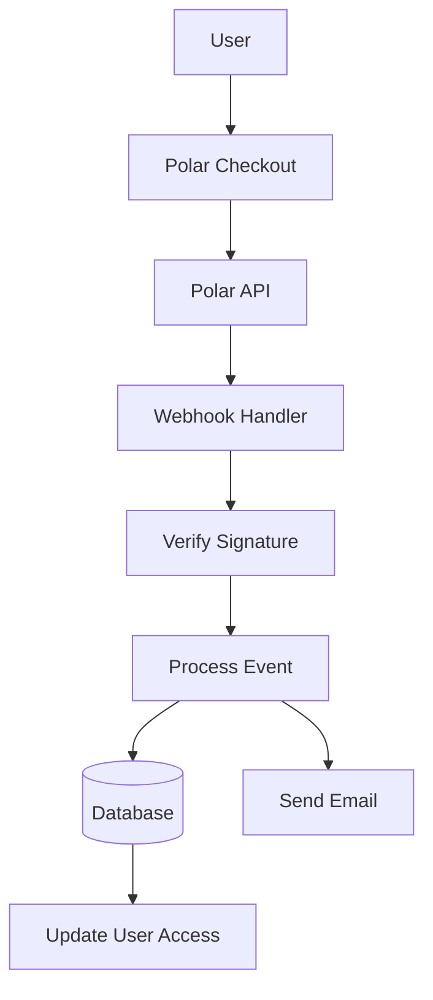

# Polaire configuratie

In deze handleiding wordt uitgelegd hoe u Polar kunt configureren als betalingsprovider in uw Ever Works-applicatie.

## Overzicht

Polar is een modern betalingsplatform ontworpen voor ontwikkelaars en makers dat het volgende biedt:

- 💻 Ontwikkelaarsvriendelijke API en documentatie
- 🔄 Ondersteuning voor abonnementen en eenmalige betalingen
- 🐙 GitHub-integratie voor sponsoring
- 💰 Transparante prijsstructuur
- 🔒 Veilige betalingsverwerking
- 📊 Ingebouwde analyses en rapportage

:::tip Waarom Polar?
Polar is speciaal gebouwd voor ontwikkelaars en open-sourceprojecten en biedt een schone API, uitstekende documentatie en naadloze GitHub-integratie voor sponsoring en het genereren van inkomsten.
:::

## Vereiste omgevingsvariabelen

Voeg deze variabelen toe aan uw `.env.local` -bestand:

```env
# Polar Configuration
POLAR_API_KEY=your_polar_api_key_here
POLAR_WEBHOOK_SECRET=your_webhook_secret_here
POLAR_APP_URL=https://your-app-url.com

# Product IDs (optional)
NEXT_PUBLIC_POLAR_SUBSCRIPTION_PRODUCT_ID=product_id_here
NEXT_PUBLIC_POLAR_ONETIME_PRODUCT_ID=product_id_here
```

:::warning
Geef uw geheime sleutels nooit door aan versiebeheer. Bewaar `.env.local` in uw `.gitignore` -bestand.
:::

## Polar Dashboard-installatie

### Stap 1: Maak uw account aan

1. Meld je aan bij [Polar](https://polar.sh)
2. Voltooi uw accountconfiguratie
3. Controleer uw e-mailadres

### Stap 2: Producten aanmaken

1. Navigeer naar **Producten** → **Nieuw product**
2. Maak uw prijsniveaus:

| Product | Prijs | Typ | Beschrijving |
|---------|-------|------|------------|
| **Pro-abonnement** | $ 10/maand | Abonnement | Geavanceerde functies |
| **Sponsorplan** | $ 20 | Eenmalig | Premium-ondersteuning |

3. Productinstellingen configureren:
   - Stel prijzen en factureringscyclus in
   - Voeg productbeschrijvingen toe
   - Configureer toegangsniveaus
4. Kopieer de **Product-ID** voor elk product

### Stap 3: Haal de API-sleutel op

1. Ga naar **Instellingen** → **API-sleutels**
2. Maak een nieuwe API-sleutel
3. Kopieer de API-sleutel
4. Voeg het toe aan uw `.env.local` als `POLAR_API_KEY` :::tip
Polar levert aparte sleutels voor ontwikkeling en productie. Gebruik testsleutels tijdens de ontwikkeling.
:::

### Stap 4: Webhooks configureren

1. Ga naar **Instellingen** → **Webhooks**
2. Klik op **Webhook maken**
3. Configureer de webhook:
   - **URL**: `https://yourdomain.com/api/polar/webhook` - **Evenementen**: Selecteer alle betalings- en abonnementsgebeurtenissen
   - **Geheim**: Genereer een geheime sleutel

4. Kopieer het **Webhookgeheim** en voeg het toe aan uw `.env.local` #### Aanbevolen evenementen

Selecteer deze gebeurtenissen in uw webhookconfiguratie:

- ✅ `payment.succeeded` - Succesvolle betaling
- ✅ `payment.failed` - Mislukte betaling
- ✅ `subscription.created` - Nieuw abonnement
- ✅ `subscription.updated` - Abonnementswijzigingen
- ✅ `subscription.cancelled` - Annulering
- ✅ `subscription.trial_will_end` - Einde van de proefperiode
- ✅ `refund.created` - Terugbetaling verwerkt

## Architectuur van betalingssystemen



### Polar-aanbieder

De Polar-provider ( `lib/payment/lib/providers/polar-provider.ts` ) implementeert:

- ✅ Klantenbeheer
- ✅ Product- en prijsbeheer
- ✅ Levenscyclus van abonnement
- ✅ Betalingsverwerking
- ✅ Webhook-afhandeling
- ✅ Ondersteuning voor terugbetaling

### API-routes

De volgende API-routes zijn beschikbaar:

| Route | Werkwijze | Beschrijving |
|-------|--------|------------|
| `/api/polar/webhook` | POST | Behandel Polar webhooks |
| `/api/polar/subscription` | POST | Abonnement aanmaken |
| `/api/polar/subscription` | ZET | Abonnement bijwerken |
| `/api/polar/subscription` | VERWIJDEREN | Abonnement opzeggen |
| `/api/polar/checkout` | POST | Afrekensessie aanmaken |
| `/api/polar/payment` | KRIJG | Betalingsstatus verifiëren |

### UI-componenten

Het systeem maakt gebruik van de betaalcomponenten van Polar:

- `PolarCheckoutButton` - Component van de afrekenknop
- `PolarPaymentForm` - Betaalformulier met validatie
- Responsief ontwerp voor mobiel en desktop
- Ondersteuning voor meerdere betaalmethoden

## Gebruiksvoorbeelden

### Maak een abonnement aan

```typescript
import { PolarProvider } from '@/lib/payment/providers/polar-provider';

const configs = createProviderConfigs({
  apiKey: process.env.POLAR_API_KEY!,
  webhookSecret: process.env.POLAR_WEBHOOK_SECRET!,
  options: {
    appUrl: process.env.POLAR_APP_URL!
  }
});

const polarProvider = new PolarProvider(configs.polar);

const subscription = await polarProvider.createSubscription({
  customerId: 'customer_id',
  productId: 'product_id',
  paymentMethodId: 'payment_method_id',
  trialPeriodDays: 7
});
```

### Maak een afrekensessie

```typescript
const checkout = await polarProvider.createCheckout({
  productId: 'product_id_here',
  customerId: 'customer_id',
  successUrl: 'https://yoursite.com/success',
  cancelUrl: 'https://yoursite.com/cancel'
});

// Redirect user to checkout.url
```

### Gebruik de betalingscomponent

```tsx
import { PolarCheckoutButton } from '@/lib/payment';

function PaymentPage() {
  return (
    <PolarCheckoutButton
      productId="product_id_here"
      amount={1000} // 10.00 USD in cents
      currency="usd"
      isSubscription={true}
      onSuccess={(paymentId) => {
        console.log('Payment succeeded:', paymentId);
        // Redirect to success page or update UI
      }}
      onError={(error) => {
        console.error('Payment error:', error);
        // Show error message to user
      }}
    />
  );
}
```

## Uw integratie testen

### Testmodus

1. **Gebruik test-API-sleutels** (beschikbaar in Polar dashboard)
2. **Gebruik testbetaalmethoden**:
   - Testkaarten beschikbaar in het Polar dashboard
   - Testmodus voor alle betaalstromen

3. **Test webhooks lokaal** met een tool als ngrok:

   ``` bash
   ngrok http3000
   ```

   Update de webhook-URL in het Polar-dashboard naar uw ngrok-URL.

### Webhook-testen

```bash
# Use ngrok to expose your local server
ngrok http 3000

# Update webhook URL in Polar dashboard
https://your-ngrok-url.ngrok.io/api/polar/webhook

# Trigger test events from Polar dashboard
```

## Foutafhandeling

Het systeem verwerkt automatisch veelvoorkomende fouten:

| Fouttype | Afhandeling |
|------------|----------|
| Betaling geweigerd | Gebruiksvriendelijke foutmelding |
| Netwerkproblemen | Automatische logica voor opnieuw proberen |
| Webhook-fouten | Aangemeld voor handmatige beoordeling |
| Validatiefouten | Formulierveldmarkering |
| Abonnementsfouten | Foutmeldingen wissen |

## Beste beveiligingspraktijken

1. **API-sleutels**:
   - Geef nooit geheime sleutels vrij in code aan de clientzijde
   - Gebruik omgevingsvariabelen
   - Draai de toetsen regelmatig

2. **Webhook-verificatie**:
   - Controleer altijd webhookhandtekeningen
   - Valideer gebeurtenisgegevens vóór verwerking
   - Gebruik HTTPS voor alle webhook-eindpunten

3. **Betalingsgegevens**:
   - Bewaar nooit betalingsgegevens
   - Gebruik de beveiligde betalingsverwerking van Polar
   - Implementeer de juiste authenticatie

4. **Gebruikerssessies**:
   - Controleer gebruikersauthenticatie
   - Valideer gebruikersrechten
   - Registreer alle betalingsactiviteiten

## GitHub-integratie

Polar biedt naadloze GitHub-integratie:

- **GitHub-sponsoring**: Verbind Polar met GitHub-sponsors
- **Repositorytoegang**: Verleen toegang op basis van abonnementen
- **Organisatieondersteuning**: beheer teamabonnementen
- **Geautomatiseerde toegang**: automatisch toegangsbeheer

### GitHub-integratie instellen

1. Ga naar **Instellingen** → **Integraties** → **GitHub**
2. Verbind uw GitHub-account
3. Configureer de toegangsregels voor de opslagplaats
4. Stel geautomatiseerd toegangsbeheer in

## Afhankelijkheden

Vereiste pakketten (reeds inbegrepen in Ever Works):

```json
{
  "@polar-sh/sdk": "^1.0.0"
}
```

## Problemen oplossen

### Veelvoorkomende problemen

**Probleem**: Webhook ontvangt geen gebeurtenissen

- **Oplossing**: controleer of de webhook-URL openbaar toegankelijk is
- Gebruik ngrok voor lokaal testen
- Controleer of het webhookgeheim correct is

**Probleem**: de betaling mislukt stilletjes

- **Oplossing**: controleer de browserconsole op fouten
- Controleer of de API-sleutels correct zijn
- Controleer Polar-dashboardlogboeken

**Probleem**: abonnement wordt niet bijgewerkt

- **Oplossing**: controleer of webhookgebeurtenissen zijn geconfigureerd
- Controleer de logbestanden van de webhookhandler
- Zorg ervoor dat database-updates werken

**Probleem**: GitHub-integratie werkt niet

- **Oplossing**: controleer de GitHub-verbinding in het Polar-dashboard
- Controleer de toegangsinstellingen voor de repository
- Zorg ervoor dat de juiste machtigingen worden verleend

## Vergelijking: Polar versus andere providers

| Kenmerk | Polair | Streep | CitroenSqueezy |
|---------|-------|--------|-------------|
| **Ontwikkelaarsfocus** | ✅ Uitstekend | ⚠️Goed | ⚠️Goed |
| **GitHub-integratie** | ✅ Native | ❌ Nee | ❌ Nee |
| **Open Source-vriendelijk** | ✅ Ja | ⚠️Beperkt | ⚠️Beperkt |
| **Setupcomplexiteit** | ✅ Eenvoudig | ⚠️Gematigd | ✅ Eenvoudig |
| **API-kwaliteit** | ✅ Uitstekend | ✅ Uitstekend | ⚠️Goed |
| **Belastingnaleving** | ⚠️ Handleiding | ⚠️ Handleiding | ✅ Automatisch |
| **Beste voor** | Ontwikkelaars, OSS | Hoog volume | Wereldwijde verkoop |

## Volgende stappen

- [Stripe-configuratie](./stripe) - Alternatieve betalingsprovider
- [LemonSqueezy-configuratie](./lemonsqueezy) - Alternatieve betalingsprovider
- [Betalingsoverzicht](/betaling) - Betaalaanbieders vergelijken
- [Omgevingsvariabelen](/deployment/environment-variables) - Volledige omgevingsinstellingen
- [Implementatie](/deployment) - Implementeer uw betalingsintegratie

## Bronnen

- [Polaire documentatie](https://docs.polar.sh/)
- [API-referentie](https://docs.polar.sh/api)
- [Webhook-handleiding](https://docs.polar.sh/webhooks)
- [GitHub-integratie](https://docs.polar.sh/integrations/github)

## Ondersteuning

Hulp nodig bij Polar-integratie? Bekijk onze [ondersteuningspagina](/advanced-guide/support) of word lid van onze community.
