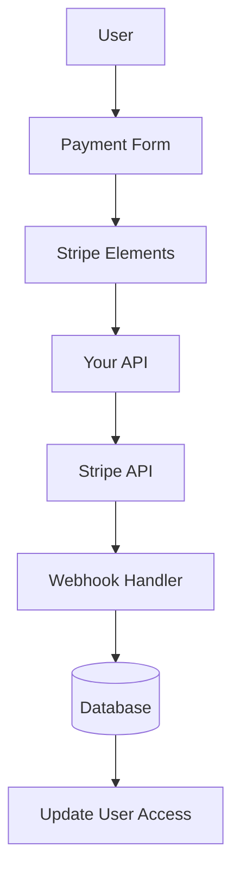

# Streepconfiguratie

In deze handleiding wordt uitgelegd hoe u Stripe in uw Ever Works-applicatie kunt configureren met een compleet abonnements- en betalingssysteem.

## Overzicht

Stripe is een uitgebreid betalingsplatform dat het volgende ondersteunt:

- 💳 Eenmalige betalingen
- 🔄 Terugkerende abonnementen
- 🌍 Meerdere betaalmethoden (kaarten, Apple Pay, Google Pay)
- 💰 Meerdere valuta's
- 📊 Geavanceerde analyses en rapportage

## Vereiste omgevingsvariabelen

Voeg deze variabelen toe aan uw `.env.local` -bestand:

```bash
# Stripe Configuration
STRIPE_SECRET_KEY=sk_test_your_stripe_secret_key_here
STRIPE_WEBHOOK_SECRET=whsec_your_stripe_webhook_secret_here
NEXT_PUBLIC_STRIPE_PUBLISHABLE_KEY=pk_test_your_stripe_publishable_key_here

# Stripe Price IDs
NEXT_PUBLIC_STRIPE_SUBSCRIPTION_PRICE_ID=price_subscription_id_here
NEXT_PUBLIC_STRIPE_ONETIME_PRICE_ID=price_onetime_id_here
NEXT_PUBLIC_STRIPE_FREE_PRICE_ID=price_free_id_here

# Product Pricing (for display purposes)
NEXT_PUBLIC_PRODUCT_PRICE_PRO=10.00
NEXT_PUBLIC_PRODUCT_PRICE_SPONSOR=20.00
NEXT_PUBLIC_PRODUCT_PRICE_FREE=0.00
```

:::warning
Geef uw geheime sleutels nooit door aan versiebeheer. Bewaar `.env.local` in uw `.gitignore` -bestand.
:::

## Stripe Dashboard-configuratie

### Stap 1: Producten aanmaken

In uw [Stripe-dashboard](https://dashboard.stripe.com/):

1. Navigeer naar **Producten** → **Product toevoegen**
2. Maak de volgende producten:

| Product | Prijs | Typ | Beschrijving |
|---------|-------|------|------------|
| **Gratis abonnement** | $ 0,00 | Eenmalig | Basisfuncties |
| **Pro-abonnement** | $ 10,00 | Maandabonnement | Geavanceerde functies |
| **Sponsorplan** | $ 20,00 | Eenmalig | Premium-ondersteuning |

3. Kopieer de **Prijs-ID** voor elk product (begint met `price_` )

### Stap 2: Webhooks configureren

Met webhooks kan Stripe uw applicatie op de hoogte stellen van betalingsgebeurtenissen.

1. Ga naar **Ontwikkelaars** → **Webhooks** → **Eindpunt toevoegen**
2. Stel de eindpunt-URL in:
   - Ontwikkeling: `http://localhost:3000/api/stripe/webhook` - Productie: `https://your-domain.com/api/stripe/webhook` 3. Selecteer gebeurtenissen waarnaar u wilt luisteren:
   - `payment_intent.succeeded` - `payment_intent.payment_failed` - `customer.subscription.created` - `customer.subscription.updated` - `customer.subscription.deleted` - `customer.subscription.trial_will_end` - `invoice.payment_succeeded` - `invoice.payment_failed` 4. Kopieer het **Ondertekeningsgeheim** (begint met `whsec_` )

### Stap 3: API-sleutels ophalen

In uw Stripe-dashboard:

1. **Geheime sleutel**: **Ontwikkelaars** → **API-sleutels** → **Geheime sleutel** (begint met `sk_` )
2. **Publiceerbare sleutel**: **Ontwikkelaars** → **API-sleutels** → **Publiceerbare sleutel** (begint met `pk_` )
3. **Webhookgeheim**: **Ontwikkelaars** → **Webhooks** → Selecteer uw webhook → **Ondertekeningsgeheim**

:::tip
Gebruik de toetsen van de **testmodus** tijdens de ontwikkeling (ze beginnen met `sk_test_` en `pk_test_` ). Schakel over naar de **live-modus**-toetsen voor productie.
:::

## Architectuur van betalingssystemen



### Stripe-aanbieder

De Stripe-provider ( `lib/payment/lib/providers/stripe-provider.ts` ) implementeert:

- ✅ Klantenbeheer
- ✅ Betaalintentie creëren
- ✅ Abonnementenbeheer
- ✅ Webhook-afhandeling
- ✅ Ondersteuning voor installatie-intentie
- ✅ Terugbetalingen en annuleringen

### API-routes

De volgende API-routes zijn beschikbaar:

| Route | Werkwijze | Beschrijving |
|-------|--------|------------|
| `/api/stripe/webhook` | POST | Handvat Stripe webhaken |
| `/api/stripe/subscription` | POST | Abonnement aanmaken |
| `/api/stripe/subscription` | ZET | Abonnement bijwerken |
| `/api/stripe/subscription` | VERWIJDEREN | Abonnement opzeggen |
| `/api/stripe/payment-intent` | POST | Betaalintentie aanmaken |
| `/api/stripe/payment-intent` | KRIJG | Betaling verifiëren |
| `/api/stripe/setup-intent` | POST | Betaalmethode instellen |

### UI-componenten

Het systeem maakt gebruik van Stripe Elements voor veilige betalingsformulieren:

- `StripeElementsWrapper` - Hoofdwikkelcomponent
- `StripePaymentForm` - Betaalformulier met validatie
- Ondersteuning voor Apple Pay en Google Pay
- Responsief ontwerp voor mobiel en desktop

## Gebruiksvoorbeelden

### Maak een abonnement aan

```typescript
import { StripeProvider } from '@/lib/payment/providers/stripe-provider';

const configs = createProviderConfigs({
  apiKey: process.env.STRIPE_SECRET_KEY!,
  webhookSecret: process.env.STRIPE_WEBHOOK_SECRET!,
  options: {
    publishableKey: process.env.NEXT_PUBLIC_STRIPE_PUBLISHABLE_KEY!,
    apiVersion: '2023-10-16'
  }
});

const stripeProvider = new StripeProvider(configs.stripe);

const subscription = await stripeProvider.createSubscription({
  customerId: 'cus_customer_id',
  priceId: 'price_subscription_id',
  paymentMethodId: 'pm_payment_method_id',
  trialPeriodDays: 7
});
```

### Gebruik de betalingscomponent

```tsx
import { PaymentForm } from '@/lib/payment';

function PaymentPage() {
  return (
    <PaymentForm
      amount={1000} // 10.00 USD in cents
      currency="usd"
      isSubscription={true}
      onSuccess={(paymentId) => {
        console.log('Payment succeeded:', paymentId);
        // Redirect to success page or update UI
      }}
      onError={(error) => {
        console.error('Payment error:', error);
        // Show error message to user
      }}
    />
  );
}
```

## Uw integratie testen

### Testmodus

1. **Gebruik test-API-sleutels** (begin met `sk_test_` en `pk_test_` )
2. **Gebruik testkaartnummers**:
   - Succes: `4242 4242 4242 4242` - Daling: `4000 0000 0000 0002` - 3D Veilig: `4000 0025 0000 3155` 3. **Test webhooks lokaal** met Stripe CLI:

   ``` bash
   stripe luister --forward-naar localhost:3000/api/stripe/webhook
   ```

### Webhook-testen

```bash
# Install Stripe CLI
brew install stripe/stripe-cli/stripe

# Login to your Stripe account
stripe login

# Forward webhooks to your local server
stripe listen --forward-to localhost:3000/api/stripe/webhook

# Trigger test events
stripe trigger payment_intent.succeeded
```

## Foutafhandeling

Het systeem verwerkt automatisch veelvoorkomende fouten:

| Fouttype | Afhandeling |
|------------|----------|
| Kaart geweigerd | Gebruiksvriendelijke foutmelding |
| Onvoldoende middelen | Opnieuw proberen met andere kaart |
| Netwerkproblemen | Automatische logica voor opnieuw proberen |
| Webhook-fouten | Aangemeld voor handmatige beoordeling |
| Validatiefouten | Formulierveldmarkering |

## Beste beveiligingspraktijken

1. **API-sleutels**:
   - Geef nooit geheime sleutels vrij in code aan de clientzijde
   - Gebruik omgevingsvariabelen
   - Draai de toetsen regelmatig

2. **Webhook-verificatie**:
   - Controleer altijd webhookhandtekeningen
   - Valideer gebeurtenisgegevens vóór verwerking

3. **Betalingsgegevens**:
   - Bewaar nooit kaartnummers
   - Gebruik de tokenisatie van Stripe
   - Implementeren van PCI-compliance

4. **Gebruikerssessies**:
   - Controleer gebruikersauthenticatie
   - Valideer gebruikersrechten
   - Registreer alle betalingsactiviteiten

## Afhankelijkheden

Vereiste pakketten (reeds inbegrepen in Ever Works):

```json
{
  "@stripe/react-stripe-js": "^3.7.0",
  "@stripe/stripe-js": "^7.3.0",
  "stripe": "^18.1.0"
}
```

## Problemen oplossen

### Veelvoorkomende problemen

**Probleem**: Webhook ontvangt geen gebeurtenissen

- **Oplossing**: controleer of de webhook-URL openbaar toegankelijk is
- Gebruik Stripe CLI voor lokale tests
- Controleer of het webhookgeheim correct is

**Probleem**: de betaling mislukt stilletjes

- **Oplossing**: controleer de browserconsole op fouten
- Controleer of de API-sleutels correct zijn
- Controleer Stripe-dashboardlogboeken

**Probleem**: 3D Secure werkt niet

- **Oplossing**: zorg ervoor dat u de `requires_action` -status verwerkt
- Implementeer de juiste omleidingsstroom
- Test met 3D Secure-testkaarten

## Volgende stappen

- [LemonSqueezy-configuratie](./lemonsqueezy) - Alternatieve betalingsprovider
- [Omgevingsvariabelen](/deployment/environment-variables) - Volledige omgevingsinstellingen
- [Implementatie](/deployment) - Implementeer uw betalingsintegratie

## Bronnen

- [Stripe-documentatie](https://stripe.com/docs)
- [Next.js Integratiehandleiding](https://stripe.com/docs/betalingen/accept-a-betaling?platform=web&ui=elements)
- [Abonnementbeheer](https://stripe.com/docs/billing/subscriptions)
- [Webhook-evenementen](https://stripe.com/docs/api/events/types)

## Ondersteuning

Hulp nodig bij Stripe-integratie? Bekijk onze [ondersteuningspagina](/advanced-guide/support) of word lid van onze community.
