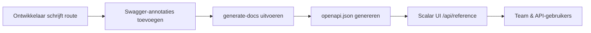

# API Documentatie Training

Beheers het geautomatiseerde API-documentatiesysteem met Swagger-annotaties en de Scalar UI.

## 🎯 Leerdoelen

Aan het einde van deze module zult u:

- ✅ De API-documentatieworkflow begrijpen
- ✅ Correcte Swagger-annotaties schrijven
- ✅ Gestandaardiseerde tag-conventies volgen
- ✅ Documentatie genereren en valideren
- ✅ Veelvoorkomende problemen oplossen
- ✅ API-documentatie van hoge kwaliteit onderhouden

**Geschatte tijd**: 2–3 dagen

---

## Waarom Dit Systeem?

### Opgeloste Problemen

- **Inconsistente documentatie**: Eerder hadden we 8 verschillende Stripe-tags verspreid over meerdere eindpunten
- **Handmatige synchronisatie**: Documentatie vaak verouderd vergeleken met de werkelijke code
- **Slechte ontwikkelaarservaring**: Eenvoudige Swagger UI met beperkte functionaliteit
- **Geen standaarden**: Elke ontwikkelaar documenteerde anders

### Behaalde Voordelen

- **Automatische synchronisatie**: Documentatie direct gegenereerd uit code-annotaties
- **Moderne interface**: Scalar UI met interactief testen en betere UX
- **Consistente standaarden**: Uniform tag-systeem en documentatiepatronen
- **Zero onderhoud**: Geen aparte documentatiebestanden te onderhouden

---

## Systeemarchitectuur

### Kernelementen

1. **Swagger-annotaties in code**
   - JSDoc-opmerkingen met `@swagger`-tags
   - OpenAPI 3.0-specificatieformaat
   - Direct ingebed in routebestanden

2. **generate-docs-script**
   - Scant alle `app/api/**/route.ts`-bestanden
   - Extraheert en valideert Swagger-annotaties
   - Genereert uniforme `public/openapi.json`

3. **Scalar UI-interface**
   - Moderne, responsieve documentatie-interface
   - Interactieve API-testmogelijkheden
   - Toegankelijk via `/api/reference`

### Volledige Workflow



---

## Aan de Slag

### Essentiële Opdrachten

```bash
yarn generate-docs
yarn docs:watch
yarn docs:validate
git status public/openapi.json
```

---

## Gestandaardiseerd Tag-systeem

### Onze Tag-conventies

#### Beheerdersoperaties

```yaml
"Admin - Users"        # Gebruikersbeheer
"Admin - Categories"   # Categoriebeheer
"Admin - Items"        # Inhoudsbeheer
"Admin - Comments"     # Commentaarmoderatie
```

#### Kernapplicatiefuncties

```yaml
"Authentication"       # Aanmelden, afmelden, wachtwoordherstel
"Favorites"           # Gebruikersfavorieten
"Items & Content"     # Openbaar inhoudsbladeren
```

#### Betalingssystemen

```yaml
"Stripe - Core"              # Checkout, Payment Intent
"Stripe - Subscriptions"     # Abonnementsbeheer
"LemonSqueezy - Core"        # Alle LemonSqueezy-operaties
```

---

## Best Practices

### Effectieve Beschrijvingen Schrijven

- Actiewerkwoorden gebruiken: "Aanmaken", "Bijwerken", "Verwijderen", "Ophalen"
- Specifiek zijn: "Gebruikersprofiel ophalen" niet "Gebruiker ophalen"
- Onder 50 tekens houden voor UI-leesbaarheid

### Realistische Voorbeelden

```yaml
# ❌ Slechte voorbeelden
example: "string"

# ✅ Goede voorbeelden
example: "john.doe@company.com"
example: "user_123abc456def"
```

---

## Ontwikkelaarschecklist

Vóór het inleveren van API-wijzigingen controleren:

- [ ] Swagger-annotatie toegevoegd of bijgewerkt
- [ ] Correct tag uit gestandaardiseerd systeem gebruikt
- [ ] Zinvolle samenvatting en beschrijving aanwezig
- [ ] Alle verzoekbody-velden gedocumenteerd
- [ ] Alle reactiecodes gedocumenteerd
- [ ] `yarn generate-docs` uitgevoerd
- [ ] Documentatie geverifieerd op `/api/reference`
- [ ] `public/openapi.json` opgenomen in commit
