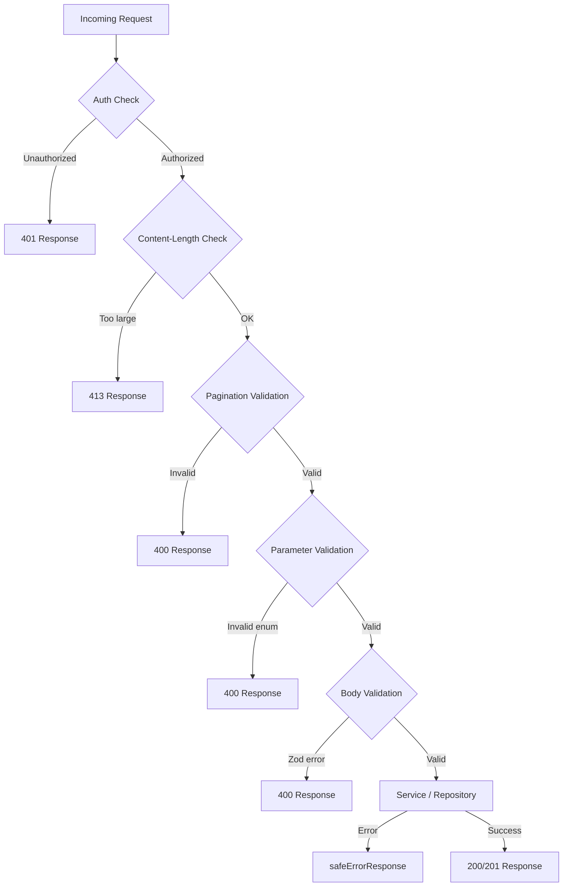

---
id: request-validation
title: "Walidacja żądań API"
sidebar_label: "Walidacja żądań"
---

# Walidacja żądań API

Szablon waliduje żądania API na wielu warstwach: schematy Zod do walidacji treści/zapytań, funkcje pomocnicze dla paginacji i limitów rozmiaru treści oraz inline'owe strażniki typów dla parametrów enum. Ta strona dokumentuje każdy mechanizm walidacji i sposób ich użycia w obsługach tras API.

## Architektura walidacji



## Schematy walidacji Zod

### Schemat lokalizacji (`lib/validations/item.ts`)

Wszystkie pola są opcjonalne; ścisłość jest kontrolowana przez ustawienia na poziomie formularza:

```typescript
export const locationSchema = z.object({
  address: z.string().optional(),
  city: z.string().optional(),
  state: z.string().optional(),
  country: z.string().optional(),
  postal_code: z.string().optional(),
  latitude: z.number()
    .min(-90, 'Latitude must be between -90 and 90')
    .max(90, 'Latitude must be between -90 and 90')
    .optional(),
  longitude: z.number()
    .min(-180, 'Longitude must be between -180 and 180')
    .max(180, 'Longitude must be between -180 and 180')
    .optional(),
  service_area: z.enum(['local', 'regional', 'national', 'global']).optional(),
  is_remote: z.boolean().optional(),
  geocoded_by: z.enum(['mapbox', 'google']).optional(),
}).optional();
```

### Schematy elementów klienta (`lib/validations/client-item.ts`)

#### Tworzenie elementu

```typescript
export const clientCreateItemSchema = z.object({
  name: z.string()
    .min(ITEM_VALIDATION.NAME_MIN_LENGTH)
    .max(ITEM_VALIDATION.NAME_MAX_LENGTH),
  description: z.string()
    .min(ITEM_VALIDATION.DESCRIPTION_MIN_LENGTH)
    .max(ITEM_VALIDATION.DESCRIPTION_MAX_LENGTH),
  source_url: z.string().url('Invalid URL format'),
  category: z.union([
    z.string().min(1, 'Category is required'),
    z.array(z.string().min(1)).min(1),
  ]).optional().nullable(),
  tags: z.array(z.string().min(1)).optional().default([]),
  icon_url: z.string().url().optional().or(z.literal('')),
  location: locationSchema,
});
```

#### Aktualizacja elementu

Używa tych samych definicji pól, ale wszystkie pola są opcjonalne:

```typescript
export const clientUpdateItemSchema = z.object({
  name: z.string().min(...).max(...).optional(),
  description: z.string().min(...).max(...).optional(),
  source_url: z.string().url().optional(),
  category: z.union([z.string(), z.array(z.string())]).optional(),
  tags: z.array(z.string()).optional(),
  icon_url: z.string().url().optional().or(z.literal('')),
  location: locationSchema,
});
```

#### Parametry zapytania listy

Parametry zapytania używają `.transform()` do konwersji wejść tekstowych na wartości typowane:

```typescript
export const clientItemsListQuerySchema = z.object({
  page: z.string().optional()
    .transform(val => (val ? parseInt(val, 10) : 1))
    .refine(val => !Number.isNaN(val))
    .refine(val => val >= 1),
  limit: z.string().optional()
    .transform(val => (val ? parseInt(val, 10) : 10))
    .refine(val => !Number.isNaN(val))
    .refine(val => val >= 1 && val <= 100),
  status: z.enum(['all', 'pending', 'approved', 'rejected']).optional().default('all'),
  search: z.string().max(100).optional(),
  sortBy: z.enum(['name', 'updated_at', 'status', 'submitted_at']).optional().default('updated_at'),
  sortOrder: z.enum(['asc', 'desc']).optional().default('desc'),
  deleted: z.string().optional().transform(val => val === 'true'),
});
```

### Schemat hasła (`lib/validations/auth.ts`)

```typescript
export const passwordSchema = z.string()
  .min(8, "Password must be at least 8 characters")
  .regex(/[A-Z]/, "Must contain at least one uppercase letter")
  .regex(/[a-z]/, "Must contain at least one lowercase letter")
  .regex(/[0-9]/, "Must contain at least one number")
  .regex(/[^A-Za-z0-9]/, "Must contain at least one special character");
```

### Schematy firmy (`lib/validations/company.ts`)

```typescript
export const createCompanySchema = z.object({
  name: z.string().min(1).max(255),
  website: z.string().url().optional().or(z.literal("")),
  domain: z.string().max(255).optional()
    .transform(val => val?.toLowerCase().trim() || undefined),
  slug: z.string().max(255).optional()
    .transform(val => val?.toLowerCase().trim() || undefined)
    .refine(val => !val || /^[a-z0-9-]+$/.test(val)),
  status: z.enum(["active", "inactive"]).default("active"),
});
```

### Typy wywnioskowane

Wszystkie schematy eksportują typy wywnioskowane przez Zod wraz ze schematem:

```typescript
export type ClientUpdateItemInput = z.infer<typeof clientUpdateItemSchema>;
export type ClientCreateItemInput = z.infer<typeof clientCreateItemSchema>;
export type CreateCompanyInput = z.infer<typeof createCompanySchema>;
```

## Walidacja paginacji (`lib/utils/pagination-validation.ts`)

Wspólna funkcja pomocnicza do walidacji parametrów zapytania `page` i `limit`:

```typescript
export function validatePaginationParams(
  searchParams: URLSearchParams
): PaginationParams | PaginationError {
  const page = pageParam ? parseInt(pageParam, 10) : 1;
  const limit = limitParam ? parseInt(limitParam, 10) : 10;

  if (isNaN(page) || page < 1) {
    return { error: 'Invalid page parameter. Must be a positive integer.', status: 400 };
  }
  if (isNaN(limit) || limit < 1 || limit > 100) {
    return { error: 'Invalid limit parameter. Must be between 1 and 100.', status: 400 };
  }
  return { page, limit };
}
```

Użycie w obsługach tras stosuje wzorzec sumy rozłącznej:

```typescript
const paginationResult = validatePaginationParams(searchParams);
if ('error' in paginationResult) {
  return NextResponse.json(
    { success: false, error: paginationResult.error },
    { status: paginationResult.status }
  );
}
const { page, limit } = paginationResult;
```

## Limity rozmiaru treści żądania (`lib/utils/request-body.ts`)

### `readBodyWithLimit`

Odczytuje treść żądania za pomocą `ReadableStream` z inkrementalnym sprawdzaniem rozmiaru:

```typescript
export async function readBodyWithLimit<T = unknown>(
  request: NextRequest,
  options: ReadBodyOptions
): Promise<ReadBodyResult<T>>
```

Cechy:
- Szybka ścieżka: najpierw sprawdza nagłówek `Content-Length`
- Inkrementalna: odczytuje fragmenty strumienia i sprawdza rozmiar w trakcie napływania bajtów
- Anulowanie: wywołuje `reader.cancel()` po przekroczeniu limitu
- Parsowanie JSON: opcjonalne, obsługuje `SyntaxError` w sposób niezakłócający działania

```typescript
// Usage
const { data } = await readBodyWithLimit(request, { maxSize: 1024 });
```

### `validateContentLength`

Wczesne odrzucenie bez odczytywania treści:

```typescript
export function validateContentLength(request: NextRequest, maxSize: number): boolean
```

Zgłasza `BodySizeLimitError`, gdy nagłówek `Content-Length` przekracza limit.

### `BodySizeLimitError`

Niestandardowa klasa błędu z właściwościami `maxSize` i `actualSize`:

```typescript
export class BodySizeLimitError extends Error {
  constructor(
    public readonly maxSize: number,
    public readonly actualSize: number
  ) {
    super(`Request body too large. Maximum size is ${maxSize} bytes, received ${actualSize} bytes.`);
  }
}
```

## Inline'owa walidacja parametrów

Dla parametrów enum niepokrytych przez schematy Zod obsługi tras używają inline'owych strażników typów:

```typescript
// Type-safe status validation
const validStatuses = ['draft', 'pending', 'approved', 'rejected'] as const;
type ItemStatus = (typeof validStatuses)[number];
const isItemStatus = (s: string): s is ItemStatus =>
  (validStatuses as readonly string[]).includes(s);

if (statusParam && !isItemStatus(statusParam)) {
  return NextResponse.json(
    { success: false, error: `Invalid status. Must be one of: ${validStatuses.join(', ')}` },
    { status: 400 }
  );
}
```

Ten wzorzec jest powtarzany dla parametrów `sortBy` i `sortOrder`.

## Oczyszczanie wejść wyszukiwania

Parametry wyszukiwania tekstowego są przycinane i normalizowane:

```typescript
const searchRaw = searchParams.get('search');
const search = searchRaw?.trim() ? searchRaw.trim() : undefined;
```

Parametry CSV są parsowane i normalizowane:

```typescript
const parseCsv = (value: string | null): string[] | undefined => {
  if (!value) return undefined;
  const arr = value.split(',').map(v => v.trim()).filter(Boolean);
  return arr.length ? arr : undefined;
};
```

## Narzędzia paginacji (`lib/paginate.ts`)

Proste funkcje pomocnicze paginacji dla paginacji na poziomie szablonu:

```typescript
export const PER_PAGE = 12;

export function totalPages(size: number, perPage: number = PER_PAGE) {
  return Math.ceil(size / perPage);
}

export function paginateMeta(rawPage: number | string = 1, perPage: number = PER_PAGE) {
  const page = typeof rawPage === 'string' ? parseInt(rawPage) : rawPage;
  const start = (page - 1) * perPage;
  return { page, start };
}
```

## Podsumowanie warstw walidacji

| Warstwa | Lokalizacja | Mechanizm | Cel |
|---------|-------------|-----------|-----|
| Uwierzytelnianie | Obsługa trasy | `session?.user?.isAdmin` | Dostęp oparty na roli |
| Rozmiar treści | `lib/utils/request-body.ts` | Czytnik strumienia | Zapobieganie zbyt dużym payloadom |
| Paginacja | `lib/utils/pagination-validation.ts` | Parsowanie URLSearchParams | Walidacja page/limit |
| Parametry enum | Inline w obsłudze trasy | Funkcje strażników typów | Walidacja status, sortBy itp. |
| Schemat treści | `lib/validations/*.ts` | Schematy Zod | Walidacja ustrukturyzowanych danych wejściowych |
| Wyszukiwanie | Inline w obsłudze trasy | Przycinanie + parsowanie CSV | Oczyszczanie danych wejściowych |
