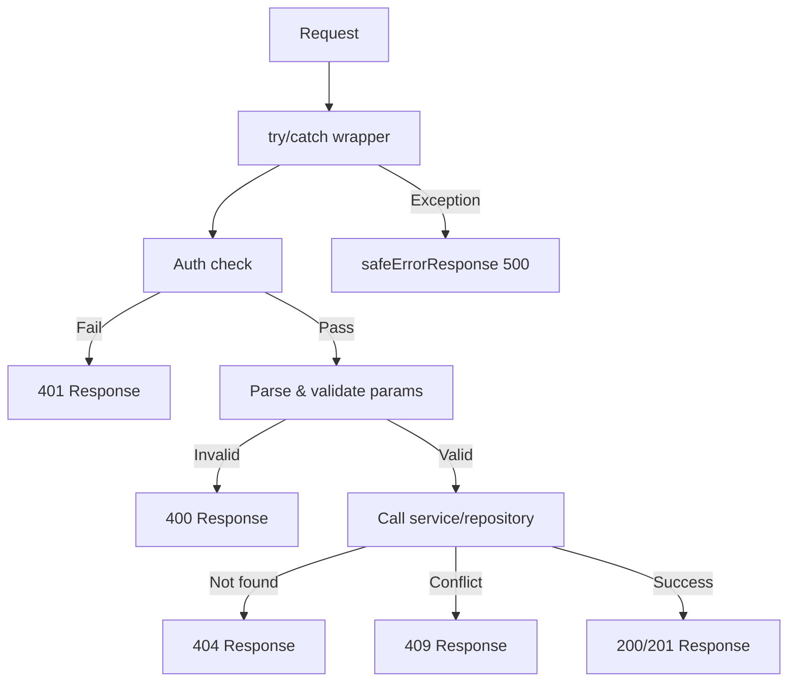

---
id: response-patterns
title: "Wzorce odpowiedzi API"
sidebar_label: "Wzorce odpowiedzi"
---

# Wzorce odpowiedzi API

Wszystkie trasy API stosują spójne konwencje odpowiedzi: typy sum rozłącznych dla sukcesu/błędu, komunikaty błędów uwzględniające środowisko, standardowe kody statusu HTTP oraz dokumentację Swagger/JSDoc. Ta strona omawia każdy wzorzec.

## System typów odpowiedzi

### Suma rozłączna (`lib/api/types.ts`)

Odpowiedzi API używają wartości logicznej `success` jako wyróżnika:

```typescript
export type ApiResponse<T = unknown> =
  | { success: true; data: T; total?: number; page?: number; limit?: number; totalPages?: number }
  | { success: false; error: string };
```

Pozwala to wywołującym na bezpieczne zawężanie typów:

```typescript
const response: ApiResponse<User[]> = await fetchUsers();
if (response.success) {
  // TypeScript knows: response.data is User[]
  console.log(response.data);
} else {
  // TypeScript knows: response.error is string
  console.error(response.error);
}
```

### Paginowana odpowiedź

Punkty końcowe list używają dedykowanego wrappera paginacji:

```typescript
export type PaginatedResponse<T> =
  | {
      success: true;
      data: T[];
      meta: {
        page: number;
        totalPages: number;
        total: number;
        limit: number;
      };
    }
  | { success: false; error: string };
```

### Typy błędów

```typescript
export interface ApiError {
  message: string;
  status?: number;
  code?: string;
}

export interface ErrorResponse {
  success: false;
  error: string;
}
```

## Standardowe kształty odpowiedzi

### Odpowiedzi sukcesu

#### Pojedynczy zasób

```typescript
return NextResponse.json({
  success: true,
  item,
  message: "Item created successfully",
}, { status: 201 });
```

#### Lista z paginacją

```typescript
return NextResponse.json({
  success: true,
  items: result.items,
  total: result.total,
  page: result.page,
  limit: result.limit,
  totalPages: result.totalPages,
});
```

#### Potwierdzenie akcji

```typescript
return NextResponse.json({
  success: true,
  message: "Profile updated successfully",
});
```

### Odpowiedzi błędów

Wszystkie odpowiedzi błędów zawierają `success: false` i ciąg `error`:

```typescript
// Unauthorized
return NextResponse.json(
  { success: false, error: "Unauthorized. Admin access required." },
  { status: 401 }
);

// Validation error
return NextResponse.json(
  { success: false, error: "Invalid page parameter. Must be a positive integer." },
  { status: 400 }
);

// Conflict
return NextResponse.json(
  { success: false, error: `Item with slug '${slug}' already exists` },
  { status: 409 }
);
```

## Konwencje kodów statusu HTTP

| Status | Użycie | Przykład |
|--------|--------|---------|
| `200` | Pomyślne GET, PUT, PATCH, DELETE | Lista elementów, aktualizacja profilu |
| `201` | Pomyślne POST (zasób utworzony) | Tworzenie elementu, tworzenie komentarza |
| `400` | Nieprawidłowe parametry lub treść | Błędna paginacja, brak wymaganych pól |
| `401` | Wymagane lub nieudane uwierzytelnianie | Brak sesji, użytkownik bez uprawnień admina |
| `404` | Nie znaleziono zasobu | Nie znaleziono elementu, nie znaleziono profilu |
| `409` | Konflikt (duplikat zasobu) | Zduplikowane ID lub slug elementu |
| `413` | Treść żądania zbyt duża | Treść przekracza maksimum `readBodyWithLimit` |
| `500` | Wewnętrzny błąd serwera | Nieobsłużone wyjątki |

## Bezpieczna odpowiedź błędu (`lib/utils/api-error.ts`)

### `safeErrorResponse`

Zapobiega wyciekom informacji, wyświetlając ogólne komunikaty na produkcji i szczegółowe komunikaty podczas deweloperki:

```typescript
export function safeErrorResponse(
  error: unknown,
  fallbackMessage: string,
  status: number = 500
): NextResponse {
  const detail = error instanceof Error ? error.message : String(error);

  // Always log full details server-side
  console.error(`[API Error] ${fallbackMessage}:`, detail);

  const message = process.env.NODE_ENV === "development" ? detail : fallbackMessage;

  return NextResponse.json({ success: false, error: message }, { status });
}
```

Użycie w obsługach tras:

```typescript
export async function GET(request: NextRequest) {
  try {
    // ... handler logic
  } catch (error) {
    return safeErrorResponse(error, 'Failed to fetch items');
  }
}
```

### `safeErrorMessage`

Wyodrębnia bezpieczny ciąg wiadomości bez tworzenia `NextResponse`:

```typescript
export function safeErrorMessage(error: unknown, fallbackMessage: string): string {
  if (process.env.NODE_ENV === "development") {
    return error instanceof Error ? error.message : String(error);
  }
  return fallbackMessage;
}
```

### Zachowanie zależne od środowiska

| Środowisko | Wyjście błędu | Log serwera |
|------------|--------------|-------------|
| Deweloperskie | `error.message` (pełne szczegóły) | Pełny błąd zalogowany |
| Produkcyjne | `fallbackMessage` (ogólny) | Pełny błąd zalogowany |

## Struktura obsługi trasy

Wszystkie obsługi tras API stosują spójną strukturę:



### Kanoniczny przykład obsługi GET

```typescript
export async function GET(request: NextRequest) {
  try {
    // 1. Auth check
    const session = await auth();
    if (!session?.user?.isAdmin) {
      return NextResponse.json(
        { success: false, error: "Unauthorized. Admin access required." },
        { status: 401 }
      );
    }

    // 2. Parse and validate parameters
    const { searchParams } = new URL(request.url);
    const paginationResult = validatePaginationParams(searchParams);
    if ('error' in paginationResult) {
      return NextResponse.json(
        { success: false, error: paginationResult.error },
        { status: paginationResult.status }
      );
    }

    // 3. Call service layer
    const result = await repository.findAll(paginationResult);

    // 4. Return structured response
    return NextResponse.json({
      success: true,
      items: result.items,
      total: result.total,
      page: result.page,
      limit: result.limit,
      totalPages: result.totalPages,
    });

  } catch (error) {
    return safeErrorResponse(error, 'Failed to fetch items');
  }
}
```

### Kanoniczny przykład obsługi POST

```typescript
export async function POST(request: NextRequest) {
  try {
    // 1. Auth check
    const session = await auth();
    if (!session?.user?.isAdmin) {
      return NextResponse.json(
        { success: false, error: "Unauthorized." },
        { status: 401 }
      );
    }

    // 2. Parse and validate body
    const body = await request.json();
    if (!body.name || !body.description) {
      return NextResponse.json(
        { success: false, error: "Name and description are required" },
        { status: 400 }
      );
    }

    // 3. Check for conflicts
    const existing = await repository.findBySlug(body.slug);
    if (existing) {
      return NextResponse.json(
        { success: false, error: `Resource with slug '${body.slug}' already exists` },
        { status: 409 }
      );
    }

    // 4. Create resource
    const item = await repository.create(body);

    // 5. Return created resource
    return NextResponse.json({
      success: true,
      item,
      message: "Created successfully",
    }, { status: 201 });

  } catch (error) {
    return safeErrorResponse(error, 'Failed to create resource');
  }
}
```

## Dokumentacja Swagger / JSDoc

Trasy API są dokumentowane inline'owymi adnotacjami Swagger do automatycznego generowania dokumentacji API:

```typescript
/**
 * @swagger
 * /api/admin/items:
 *   get:
 *     tags: ["Admin - Items"]
 *     summary: "Get paginated items list"
 *     security:
 *       - sessionAuth: []
 */
```
