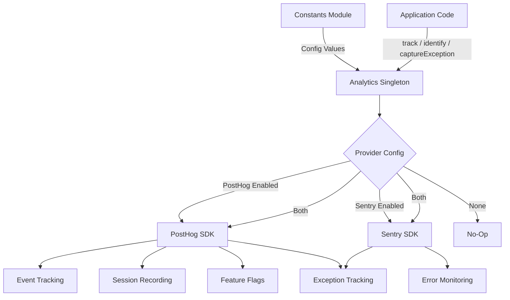
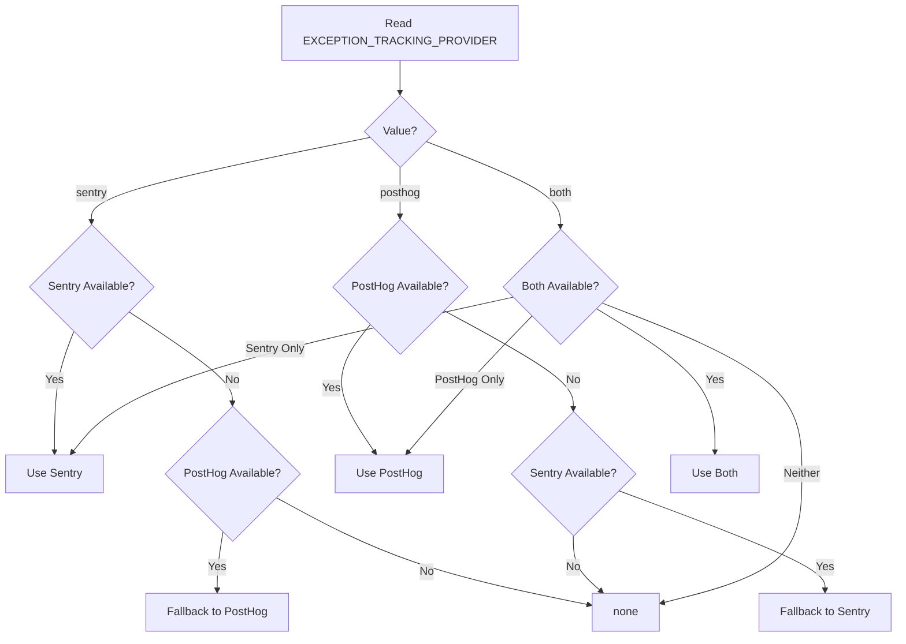

# Moduł analityczny

Moduł analityczny (`template/lib/analytics/`) zapewnia ujednoliconą klasę singleton do śledzenia zdarzeń po stronie klienta, identyfikacji użytkowników, oceny flag funkcji i przechwytywania wyjątków. Integruje **PostHog** do analizy produktów i **Sentry** do monitorowania błędów, z możliwością korzystania z dowolnego dostawcy indywidualnie, obu jednocześnie lub żadnego z nich.

## Przegląd architektury



## Pliki źródłowe

|Plik|Opis|
|------|-------------|
|`lib/analytics/index.ts`|`Analytics` klasa singletonowa i eksport `analytics`|

## Klasa podstawowa: `Analytics`

Klasa `Analytics` to singleton otaczający PostHog i Sentry. Wywoływanie po stronie serwera jest bezpieczne — wszystkie metody zwracają się w trybie cichym, gdy `window` jest niezdefiniowane.

### Definicje typów

```typescript
type EventProperties = Properties;          // PostHog Properties type
type UserProperties = Record<string, any>;
type ExceptionTrackingProvider = 'sentry' | 'posthog' | 'both' | 'none';
```

### Dostęp do Singletona

```typescript
// Get the singleton instance
const analytics = Analytics.getInstance();

// Or use the pre-created export
import { analytics } from '@/lib/analytics';
```

### `init(): void`

Inicjuje PostHog ze scentralizowaną konfiguracją i konfiguruje śledzenie wyjątków. Należy wywołać raz po stronie klienta (zwykle w układzie głównym lub komponencie dostawcy).

```typescript
// In your root layout or PostHog provider
'use client';
import { analytics } from '@/lib/analytics';

useEffect(() => {
  analytics.init();
}, []);
```

**Zachowanie:**
- Pomija inicjalizację, jeśli została już zainicjowana lub działa po stronie serwera
- Odczytuje konfigurację ze stałych (`POSTHOG_KEY`, `POSTHOG_HOST`, `POSTHOG_ENABLED` itp.)
- Konfiguruje nagrywanie sesji z maskowaniem, gdy `POSTHOG_SESSION_RECORDING_ENABLED` ma wartość true
- Stosuje częstotliwość próbkowania (`POSTHOG_SAMPLE_RATE`) — w wersji produkcyjnej domyślnie wynosi 10%
- Konfiguruje globalne procedury obsługi `window.onerror` i `unhandledrejection`, gdy włączone jest śledzenie wyjątków PostHog
- Łączy PostHog z Sentry, gdy obaj dostawcy są aktywni

### `identify(userId: string, properties?: UserProperties): void`

Kojarzy bieżącego anonimowego użytkownika ze zidentyfikowanym identyfikatorem użytkownika. Ustawia także kontekst użytkownika Sentry, gdy funkcja Sentry jest włączona.

```typescript
analytics.identify(session.user.id, {
  email: session.user.email,
  plan: 'premium',
});
```

### `reset(): void`

Resetuje bieżącą tożsamość użytkownika (np. przy wylogowaniu). Czyści konteksty użytkownika PostHog i Sentry.

```typescript
analytics.reset();
```

### `track(eventName: string, properties?: EventProperties): void`

Przechwytuje niestandardowe zdarzenie w PostHog.

```typescript
analytics.track('item_submitted', {
  itemId: 'abc-123',
  category: 'SaaS Tools',
});
```

### `trackPageView(url: string, properties?: EventProperties): void`

Ręcznie przechwytuje zdarzenie wyświetlenia strony. Użyj, gdy `POSTHOG_AUTO_CAPTURE` jest wyłączone i potrzebujesz wyraźnego śledzenia odsłon strony.

```typescript
analytics.trackPageView(window.location.href, {
  referrer: document.referrer,
});
```

### `isFeatureEnabled(flagKey: string, defaultValue?: boolean): boolean`

Synchronicznie ocenia flagę funkcji PostHog.

```typescript
const showNewUI = analytics.isFeatureEnabled('new-dashboard-ui', false);
```

### `reloadFeatureFlags(): Promise<void>`

Wymusza ponowne pobranie flag funkcji z serwera PostHog.

```typescript
await analytics.reloadFeatureFlags();
```

### `captureException(error: Error | string, context?: Record<string, any>): void`

Ujednolicone śledzenie wyjątków wysyłane do skonfigurowanych dostawców.

```typescript
try {
  await riskyOperation();
} catch (error) {
  analytics.captureException(error, {
    component: 'PaymentForm',
    action: 'submit',
  });
}
```

**Routing dostawcy:**
- `'posthog'` — Wysyła zdarzenie `$exception` do PostHog ze śledzeniem stosu
- `'sentry'` — Wywołuje `Sentry.captureException` z dodatkowym kontekstem
- `'both'` — Wysyła do obu dostawców
- `'none'` -- Cicho odrzuca

### `captureError(error: Error, context?: Record<string, any>): void`

**Przestarzałe.** Alias dla `captureException`. Rejestruje ostrzeżenie o wycofaniu.

### `getExceptionTrackingProvider(): ExceptionTrackingProvider`

Zwraca aktualnie aktywnego dostawcę śledzenia wyjątków.

### `setUserProperties(properties: UserProperties): void`

Ustawia trwałe właściwości użytkownika w profilu osoby PostHog poprzez `posthog.people.set()`.

```typescript
analytics.setUserProperties({
  subscription_tier: 'premium',
  company: 'Acme Corp',
});
```

### `setSuperProperties(properties: Record<string, any>): void`

Rejestruje super właściwości wysyłane przy każdym kolejnym zdarzeniu poprzez `posthog.register()`.

```typescript
analytics.setSuperProperties({
  app_version: '2.1.0',
  environment: 'production',
});
```

## Stałe konfiguracyjne

Cała konfiguracja analityczna opiera się na stałych z `lib/constants.ts`:

|Stała|Domyślne|Opis|
|----------|---------|-------------|
|`POSTHOG_KEY`|środowisko var|Klucz API projektu PostHog|
|`POSTHOG_HOST`|środowisko var|Adres URL hosta API PostHog|
|`POSTHOG_ENABLED`|pochodne|Prawda, gdy ustawiony jest zarówno klucz, jak i host|
|`POSTHOG_DEBUG`|środowisko var|Włącz rejestrowanie debugowania PostHog|
|`POSTHOG_SESSION_RECORDING_ENABLED`|`'true'`|Włącz nagrywanie sesji|
|`POSTHOG_AUTO_CAPTURE`|`'false'`|Automatyczne przechwytywanie wyświetleń strony|
|`POSTHOG_SAMPLE_RATE`|`0.1` (prod) / `1.0` (programista)|Częstotliwość próbkowania zdarzenia|
|`POSTHOG_SESSION_RECORDING_SAMPLE_RATE`|`0.1` (prod) / `1.0` (programista)|Częstotliwość próbkowania nagrywania|
|`EXCEPTION_TRACKING_PROVIDER`|`'both'`|Który dostawca obsługuje wyjątki|
|`SENTRY_ENABLED`|pochodne|Prawda, gdy ustawiono DSN i pozwala na to env|

## Rozwiązanie dostawcy śledzenia wyjątków

Dostawca jest ustalany na etapie konstruowania, stosując logikę zastępczą:



## Użycie z Next.js

Typowa integracja w projekcie routera aplikacji Next.js:

```tsx
// app/providers.tsx
'use client';
import { useEffect } from 'react';
import { analytics } from '@/lib/analytics';
import { useSession } from 'next-auth/react';
import { usePathname } from 'next/navigation';

export function AnalyticsProvider({ children }: { children: React.ReactNode }) {
  const { data: session } = useSession();
  const pathname = usePathname();

  useEffect(() => {
    analytics.init();
  }, []);

  useEffect(() => {
    if (session?.user?.id) {
      analytics.identify(session.user.id, {
        email: session.user.email,
      });
    }
  }, [session]);

  useEffect(() => {
    analytics.trackPageView(pathname);
  }, [pathname]);

  return <>{children}</>;
}
```
