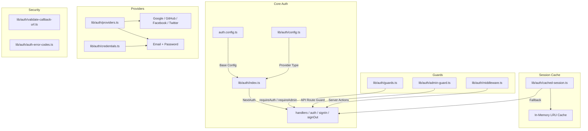
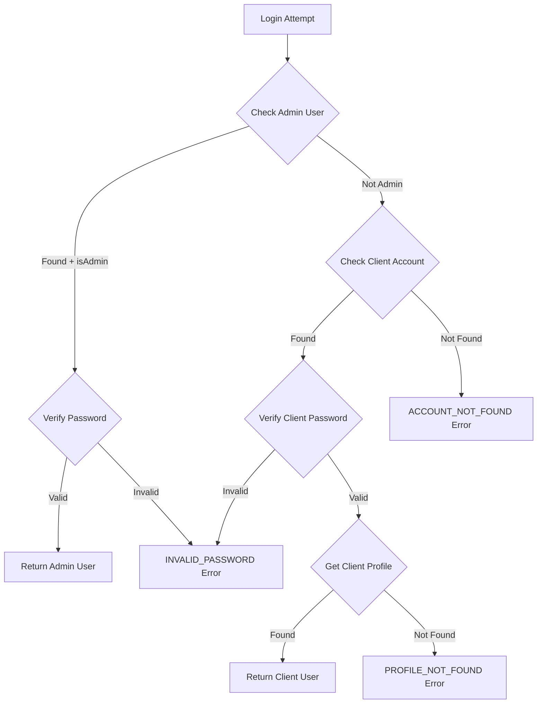

# Moduł narzędzi uwierzytelniających

Moduł narzędzi uwierzytelniających (`template/lib/auth/`) zapewnia wszechstronną warstwę uwierzytelniania zbudowaną na NextAuth.js (Auth.js) z obsługą wielu dostawców, buforowaniem sesji, strażnikami po stronie serwera, zweryfikowanymi akcjami serwera i Supabase jako alternatywnym backendem uwierzytelniania.

## Przegląd architektury



## Pliki źródłowe

|Plik|Opis|
|------|-------------|
|`lib/auth/index.ts`|Konfiguracja NextAuth.js z adapterem Drizzle|
|`lib/auth/config.ts`|Konfiguracja typu dostawcy uwierzytelniania|
|`lib/auth/credentials.ts`|Dostawca danych uwierzytelniających e-mail/hasło|
|`lib/auth/providers.ts`|Fabryka dostawcy OAuth|
|`lib/auth/guards.ts`|Strażnicy stron po stronie serwera|
|`lib/auth/admin-guard.ts`|Strażnik administratora trasy API|
|`lib/auth/middleware.ts`|Sprawdzone oprogramowanie pośredniczące do działania serwera|
|`lib/auth/cached-session.ts`|Warstwa buforowania sesji|
|`lib/auth/session-cache.ts`|Implementacja pamięci podręcznej|
|`lib/auth/validate-callback-url.ts`|Weryfikacja adresu URL przekierowania|
|`lib/auth/auth-error-codes.ts`|Wyliczenie kodów błędów|
|`lib/auth/supabase/`|Klient/serwer/oprogramowanie pośrednie autoryzacji Supabase|

## Konfiguracja NextAuth.js (`index.ts`)

Główny eksport zapewnia standardowy interfejs NextAuth.js:

```typescript
import { auth, signIn, signOut, handlers, unstable_update } from '@/lib/auth';
```

### Strategia sesji

- **Strategia:** JWT (nie sesje bazy danych)
- **Maksymalny wiek:** 30 dni
- **Wiek aktualizacji:** 24 godziny (interwał odświeżania sesji)

### Oddzwonienie JWT

Wywołanie zwrotne JWT wzbogaca tokeny o:
- `userId` -- z obiektu użytkownika lub tokena `sub`
- `clientProfileId` — tworzone automatycznie dla użytkowników OAuth przy pierwszym logowaniu
- `isAdmin` — określane na podstawie flag `isClient`/`isAdmin` lub wartością domyślną `false`
- `provider` — nazwa dostawcy uwierzytelniania

### Odwołanie sesji

Wywołanie zwrotne sesji mapuje pola JWT na obiekt sesji:
- `session.user.id`
- `session.user.clientProfileId`
- `session.user.provider`
- `session.user.isAdmin`

### Strony niestandardowe

```typescript
pages: {
  signIn: '/auth/signin',
  signOut: '/auth/signout',
  error: '/auth/error',
  verifyRequest: '/auth/verify-request',
  newUser: '/auth/register',
}
```

### Wydarzenia

- **signOut** — unieważnia pamięć podręczną sesji użytkownika
- **updateUser** — unieważnia pamięć podręczną sesji w przypadku zmiany danych użytkownika

## Konfiguracja uwierzytelniania (`config.ts`)

### `AuthProviderType`

```typescript
type AuthProviderType = 'supabase' | 'next-auth' | 'both';
```

### `AuthConfig`

```typescript
interface AuthConfig {
  provider: AuthProviderType;
  supabase?: {
    url: string;
    anonKey: string;
    redirectUrl?: string;
  };
  nextAuth?: {
    enableCredentials?: boolean;
    enableOAuth?: boolean;
    providers?: any[];
  };
}
```

### `getAuthConfig(): AuthConfig`

Rozwiązuje konfigurację z tym priorytetem:
1. Globalne nadpisanie poprzez `configureAuth()`
2. Wykrywanie oparte na środowisku (obecność adresu URL/klucza Supabase)
3. Wartość domyślna: `next-auth` z poświadczeniami i włączoną funkcją OAuth

## Dostawca danych uwierzytelniających (`credentials.ts`)

### Funkcje hasła

```typescript
async function hashPassword(password: string): Promise<string>;
// Uses bcryptjs with 10 salt rounds, loaded via dynamic import

async function comparePasswords(plainText: string, hashed: string | null): Promise<boolean>;
// Returns false if hashed is null
```

### Przepływ uwierzytelniania



### `AuthProviders` Wyliczenie

```typescript
enum AuthProviders {
  CREDENTIALS = 'credentials',
  GOOGLE = 'google',
  FACEBOOK = 'facebook',
  GITHUB = 'github',
  TWITTER = 'twitter',
  X = 'x',
  MICROSOFT = 'microsoft',
}
```

## Dostawcy OAuth (`providers.ts`)

### `createNextAuthProviders(config?): Provider[]`

Dynamicznie tworzy instancje dostawcy NextAuth na podstawie konfiguracji:

```typescript
import { createNextAuthProviders } from '@/lib/auth/providers';

const providers = createNextAuthProviders({
  google: { enabled: true, clientId: '...', clientSecret: '...' },
  github: { enabled: true, clientId: '...', clientSecret: '...' },
  credentials: { enabled: true },
});
```

Obsługiwani dostawcy: **Google**, **GitHub**, **Facebook**, **Twitter**, **Dane uwierzytelniające**.

## Strażnicy po stronie serwera (`guards.ts`)

### `requireAuth(): Promise<Session>`

Wymaga uwierzytelnienia. Przekierowuje do `/auth/signin`, jeśli nie jest uwierzytelniony.

```typescript
export default async function ProtectedPage() {
  const session = await requireAuth();
  return <div>Welcome {session.user.email}</div>;
}
```

### `requireAdmin(): Promise<Session>`

Wymaga roli administratora. Przekierowuje do `/admin/auth/signin`, jeśli nie jest uwierzytelniony, `/unauthorized`, jeśli nie jest administratorem.

```typescript
export default async function AdminPage() {
  const session = await requireAdmin();
  return <div>Admin Dashboard</div>;
}
```

### `getSession(): Promise<Session | null>`

Pobiera bieżącą sesję bez przekierowywania. Zwraca `null` dla nieuwierzytelnionych użytkowników.

### `checkIsAdmin(): Promise<boolean>`

Sprawdza status administratora bez przekierowywania.

## Strażnik trasy API (`admin-guard.ts`)

### `checkAdminAuth(): Promise<NextResponse | null>`

Zwraca `null`, jeśli jest autoryzowany, lub błąd `NextResponse` (401/403/500), jeśli nie:

```typescript
export async function GET() {
  const authError = await checkAdminAuth();
  if (authError) return authError;
  // ... handle authorized request
}
```

### `withAdminAuth(handler): handler`

Funkcja wyższego rzędu, która otacza procedury obsługi tras API:

```typescript
import { withAdminAuth } from '@/lib/auth/admin-guard';

export const GET = withAdminAuth(async (request) => {
  // Only reached if user is authenticated admin
  return NextResponse.json({ data: await getAdminData() });
});
```

## Zatwierdzone działania serwera (`middleware.ts`)

### `validatedAction(schema, action)`

Zamyka akcję serwera za pomocą walidacji Zoda:

```typescript
import { validatedAction } from '@/lib/auth/middleware';
import { z } from 'zod';

const schema = z.object({ name: z.string().min(1), email: z.string().email() });

export const updateProfile = validatedAction(schema, async (data, formData) => {
  await db.update(users).set(data);
  return { success: 'Profile updated' };
});
```

### `validatedActionWithUser(schema, action)`

To samo co powyżej, ale także weryfikuje uwierzytelnienie i wstrzykuje użytkownika:

```typescript
export const submitItem = validatedActionWithUser(schema, async (data, formData, user) => {
  await db.insert(items).values({ ...data, userId: user.id });
  return { success: 'Item submitted' };
});
```

### `ActionState` Wpisz

```typescript
type ActionState = {
  error?: string;
  success?: string;
  redirect?: string;
  [key: string]: any;
};
```

## Buforowanie sesji (`cached-session.ts`)

Zmniejsza obciążenie związane z uwierzytelnianiem poprzez buforowanie zdekodowanych sesji w pamięci.

### `getCachedSession(request?): Promise<Session | null>`

```typescript
import { getCachedSession } from '@/lib/auth/cached-session';

// In server components
const session = await getCachedSession();

// In API routes (pass request for token extraction)
const session = await getCachedSession(request);
```

### `invalidateSessionCache(token?, userId?): Promise<void>`

Unieważnia sesje w pamięci podręcznej według tokenu lub identyfikatora użytkownika.

### `clearSessionCache(): void`

Czyści wszystkie sesje w pamięci podręcznej (w przypadku wdrożeń lub aktualizacji krytycznych).

### Ekstrakcja tokenów

Tokeny są pobierane z żądań w następującej kolejności:
1. `next-auth.session-token` lub `__Secure-next-auth.session-token` plik cookie
2. Nagłówek `Authorization: Bearer <token>`
3. `X-Session-Token` niestandardowy nagłówek

## Kody błędów (`auth-error-codes.ts`)

```typescript
enum AuthErrorCode {
  ACCOUNT_NOT_FOUND = 'ACCOUNT_NOT_FOUND',
  INVALID_PASSWORD = 'INVALID_PASSWORD',
  PROFILE_NOT_FOUND = 'PROFILE_NOT_FOUND',
  GENERIC_ERROR = 'GENERIC_ERROR',
  RATE_LIMITED = 'RATE_LIMITED',
  USE_OAUTH_PROVIDER = 'USE_OAUTH_PROVIDER',
  SESSION_REFRESH_FAILED = 'SESSION_REFRESH_FAILED',
  PAGE_REFRESH_FAILED = 'PAGE_REFRESH_FAILED',
}
```

## Weryfikacja adresu URL wywołania zwrotnego (`validate-callback-url.ts`)

### `isValidCallbackUrl(url: string | null): boolean`

Zapobiega lukom w zabezpieczeniach związanych z otwartym przekierowaniem:

```typescript
isValidCallbackUrl('/admin/items')       // true
isValidCallbackUrl('/client/dashboard')  // true
isValidCallbackUrl('https://evil.com')   // false
isValidCallbackUrl('//evil.com')         // false
```

### `getSafeRedirectPath(callbackUrl, fallbackPath): string`

Zwraca adres URL wywołania zwrotnego, jeśli jest prawidłowy, w przeciwnym razie ścieżkę zastępczą.

### `createSafeCallbackUrl(pathname, search?): string`

Tworzy adres URL wywołania zwrotnego ograniczony do 2048 znaków, aby zapobiec zanieczyszczeniu parametrów.
