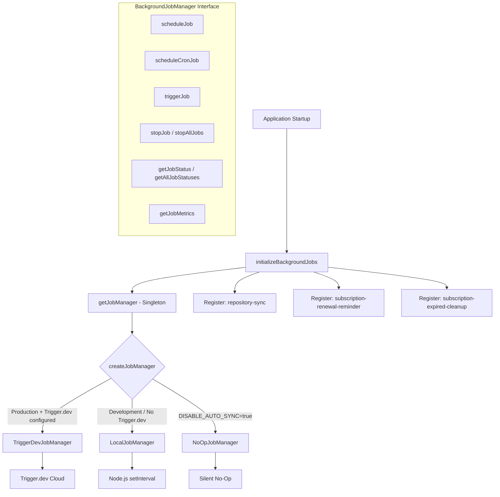
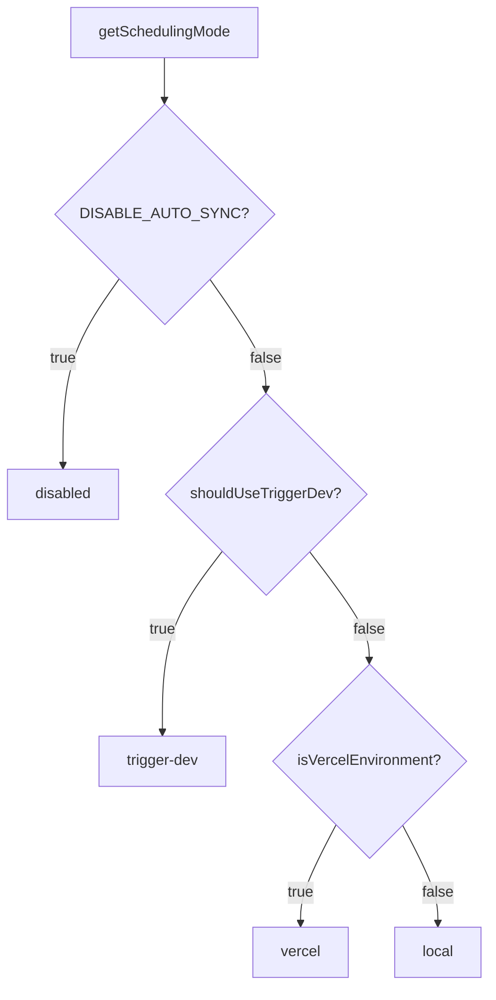

# Moduł zadań w tle

Moduł zadań w tle (`template/lib/background-jobs/`) zapewnia warstwę abstrakcji do planowania i wykonywania powtarzających się zadań. Obsługuje trzy strategie wykonawcze — **Trigger.dev** dla produkcji, **lokalny `setInterval`** dla programowania i tryb **no-op** do całkowitego wyłączenia zadań – wybierany automatycznie na podstawie konfiguracji środowiska.

## Przegląd architektury



## Pliki źródłowe

|Plik|Opis|
|------|-------------|
|`lib/background-jobs/types.ts`|Definicje interfejsów i typów|
|`lib/background-jobs/config.ts`|Wykrywanie konfiguracji i trybu planowania Trigger.dev|
|`lib/background-jobs/job-factory.ts`|Funkcja fabryczna i menedżer singletonu|
|`lib/background-jobs/local-job-manager.ts`|`LocalJobManager` wdrożenie|
|`lib/background-jobs/trigger-dev-job-manager.ts`|`TriggerDevJobManager` wdrożenie|
|`lib/background-jobs/noop-job-manager.ts`|`NoOpJobManager` wdrożenie|
|`lib/background-jobs/initialize-jobs.ts`|Rejestracja zadania przy uruchomieniu aplikacji|
|`lib/background-jobs/index.ts`|Eksport beczek|

## Definicje typów

### `BackgroundJobManager` Interfejs

```typescript
interface BackgroundJobManager {
  scheduleJob(id: string, name: string, job: () => void | Promise<void>, interval: number): void;
  scheduleCronJob(id: string, name: string, job: () => void | Promise<void>, cronExpression: string): void;
  triggerJob(id: string): Promise<void>;
  stopJob(id: string): void;
  stopAllJobs(): void;
  getJobStatus(id: string): JobStatus | undefined;
  getAllJobStatuses(): JobStatus[];
  getJobMetrics(): JobMetrics;
}
```

### `JobStatus`

```typescript
type JobStatusType = 'running' | 'completed' | 'failed' | 'scheduled' | 'stopped';

interface JobStatus {
  id: string;
  name: string;
  status: JobStatusType;
  lastRun: Date | null;
  nextRun: Date | null;
  duration: number;     // Last execution duration in ms
  error?: string;       // Error message if status is 'failed'
}
```

### `JobMetrics`

```typescript
interface JobMetrics {
  totalExecutions: number;       // Total invocations (not unique jobs)
  successfulJobs: number;
  failedJobs: number;
  averageJobDuration: number;    // Rolling average in ms
  lastCleanup: Date;
}
```

### `TriggerDevConfig`

```typescript
interface TriggerDevConfig {
  enabled: boolean;
  apiKey?: string;
  apiUrl?: string;
  environment: string;
  isFullyConfigured: boolean;
  isPartiallyConfigured: boolean;
}
```

### `SchedulingMode`

```typescript
type SchedulingMode = 'trigger-dev' | 'vercel' | 'local' | 'disabled';
```

## Funkcje konfiguracyjne

### `getTriggerDevConfig(): TriggerDevConfig`

Odczytuje ustawienia Trigger.dev z ConfigService.

### `shouldUseTriggerDev(): boolean`

Zwraca `true`, gdy Trigger.dev jest w pełni skonfigurowany, włączony, a środowisko jest produkcyjne.

### `getSchedulingMode(): SchedulingMode`

Określa, który system planowania powinien być aktywny przy użyciu tego priorytetu:



## Fabryka i Singleton

### `createJobManager(): BackgroundJobManager`

Tworzy odpowiedniego menedżera zadań w oparciu o środowisko:

```typescript
import { createJobManager } from '@/lib/background-jobs';

const manager = createJobManager();
// Returns: TriggerDevJobManager | LocalJobManager | NoOpJobManager
```

### `getJobManager(): BackgroundJobManager`

Zwraca instancję singletona, tworząc ją przy pierwszym wywołaniu:

```typescript
import { getJobManager } from '@/lib/background-jobs';

const manager = getJobManager();
manager.scheduleJob('my-job', 'My Job', async () => {
  await doWork();
}, 60_000);
```

### `resetJobManager(): void`

Zatrzymuje wszystkie zadania i niszczy singleton (przydatne do testowania):

```typescript
import { resetJobManager } from '@/lib/background-jobs';
resetJobManager();
```

## Lokalny menadżer zadań

Używa Node.js `setInterval` w środowiskach programistycznych i awaryjnych.

**Kluczowe zachowania:**
- Pomija wykonanie, gdy zadanie jest już uruchomione (zapobiega nakładaniu się)
- Śledzi metryki ze średnim kroczącym czasem trwania
- Konwertuje wyrażenia cron na interwały poprzez uproszczone mapowanie
- Zmniejsza logowanie konsoli w trybie programistycznym

### Mapowanie Cron-interwał

|Wzór Crona|Interwał|
|-------------|----------|
| `*/30 * * * * *` |30 sekund|
| `*/2 * * * *` |2 minuty|
| `*/5 * * * *` |5 minut|
| `*/15 * * * *` |15 minut|
| `0 * * * *` |1 godzina|
| `0 9 * * *` |24 godziny|
|Domyślne|1 minuta|

## TriggerDevJobManager

Rejestruje harmonogramy za pomocą interfejsu API harmonogramów `@trigger.dev/sdk` v4. Czy **nie** wykonuje lokalnych liczników czasu — wykonanie jest obsługiwane przez proces roboczy Trigger.dev.

**Kluczowe zachowania:**
- Leniwie ładuje `@trigger.dev/sdk` poprzez import dynamiczny
- Konwertuje harmonogramy oparte na interwałach na wyrażenia cron
- Śledzi lokalne metryki, gdy zadania są uruchamiane w kontekście roboczym
- `stopJob` / `stopAllJobs` wyczyść tylko stan lokalny (zdalne harmonogramy są zarządzane przez Trigger.dev)

## NoOpJobManager

Wszystkie operacje są cichymi operacjami bez operacji. Używane, gdy `DISABLE_AUTO_SYNC=true` jest w fazie rozwoju.

## Rejestracja pracy

Funkcja `initializeBackgroundJobs()` rejestruje wszystkie zadania aplikacji podczas uruchamiania:

```typescript
import { initializeBackgroundJobs } from '@/lib/background-jobs/initialize-jobs';

// Called once during app initialization
await initializeBackgroundJobs();
```

### Zarejestrowane oferty pracy

|Identyfikator zadania|Harmonogram|Opis|
|--------|----------|-------------|
|`repository-sync`|Co 5 minut|Synchronizuje zawartość CMS opartą na Git poprzez `syncManager.performSync()`|
|`subscription-renewal-reminder`|Codziennie o godzinie 9:00|Wysyła przypomnienia o odnowieniu subskrypcji wygasających za 7 dni|
|`subscription-expired-cleanup`|Codziennie o północy|Przetwarza i wygasa subskrypcje po dacie końcowej|

**Ważne:** wszystkie wywołania zwrotne zadań korzystają z importu dynamicznego, aby zapobiec łączeniu przez pakiet internetowy modułów specyficznych dla Node.js w czasie kompilacji:

```typescript
manager.scheduleJob('repository-sync', 'Repository Synchronization', async () => {
  // Dynamic import prevents webpack bundling of isomorphic-git chain
  const { syncManager } = await import('@/lib/services/sync-service');
  await syncManager.performSync();
}, 5 * 60 * 1000);
```

## Przykłady użycia

### Planowanie niestandardowej pracy

```typescript
import { getJobManager } from '@/lib/background-jobs';

const manager = getJobManager();

// Interval-based (every 10 minutes)
manager.scheduleJob('cleanup-temp', 'Temp File Cleanup', async () => {
  await cleanupTempFiles();
}, 10 * 60 * 1000);

// Cron-based (every hour)
manager.scheduleCronJob('hourly-report', 'Hourly Report', async () => {
  await generateReport();
}, '0 * * * *');
```

### Monitorowanie zadań

```typescript
const manager = getJobManager();

// Check specific job
const status = manager.getJobStatus('repository-sync');
console.log(status?.status, status?.lastRun, status?.duration);

// List all jobs
const allStatuses = manager.getAllJobStatuses();

// Get aggregate metrics
const metrics = manager.getJobMetrics();
console.log(`Total: ${metrics.totalExecutions}, Failed: ${metrics.failedJobs}`);
```

### Ręczny wyzwalacz

```typescript
const manager = getJobManager();
await manager.triggerJob('repository-sync');
```
