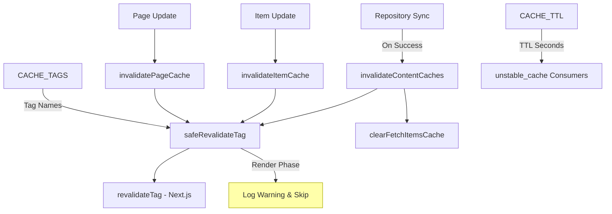
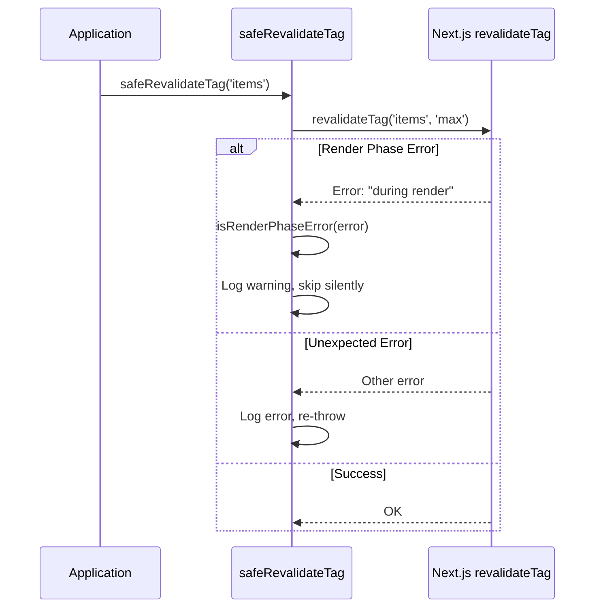
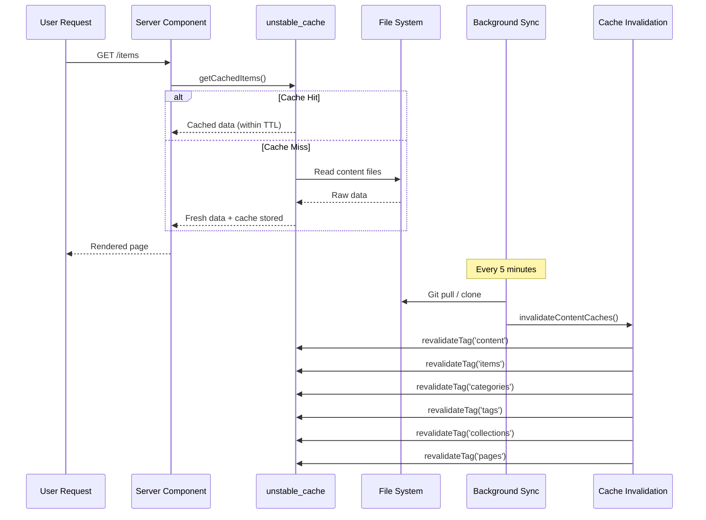

# Moduł unieważniania pamięci podręcznej

Moduł unieważniania pamięci podręcznej (`template/lib/cache-config.ts` i `template/lib/cache-invalidation.ts`) zapewnia scentralizowany system znaczników pamięci podręcznej i funkcje unieważniania dla Next.js `unstable_cache` i `revalidateTag`. Zapewnia prawidłowe unieważnianie pamięci podręcznych zawartości po synchronizacji repozytoriów, jednocześnie obsługując ograniczenia fazy renderowania Next.js.

## Przegląd architektury



## Pliki źródłowe

|Plik|Opis|
|------|-------------|
|`lib/cache-config.ts`|Buforuj stałe TTL i definicje znaczników|
|`lib/cache-invalidation.ts`|Funkcje unieważniania z bezpieczeństwem fazy renderowania|

## Konfiguracja TTL pamięci podręcznej

Wszystkie wartości TTL wyrażone są w **sekundach**, używane z Next.js `unstable_cache`:

```typescript
const CACHE_TTL = {
  CONTENT: 600,   // 10 minutes -- content listings
  ITEM: 600,      // 10 minutes -- individual items
  CONFIG: 600,    // 10 minutes -- site configuration
  PAGES: 600,     // 10 minutes -- static pages
} as const;
```

### Użycie z `unstable_cache`

```typescript
import { unstable_cache } from 'next/cache';
import { CACHE_TTL, CACHE_TAGS } from '@/lib/cache-config';

const getCachedItems = unstable_cache(
  async () => fetchAllItems(),
  ['items-list'],
  {
    revalidate: CACHE_TTL.CONTENT,
    tags: [CACHE_TAGS.CONTENT, CACHE_TAGS.ITEMS],
  }
);
```

## Tagi pamięci podręcznej

Tagi są używane z `revalidateTag()` w celu selektywnego unieważniania pamięci podręcznych.

### Tagi statyczne

|Oznacz stałą|Wartość|Opis|
|-------------|-------|-------------|
|`CACHE_TAGS.CONTENT`|`'content'`|Tag główny — unieważnia wszystkie pamięci podręczne zawartości|
|`CACHE_TAGS.ITEMS`|`'items'`|Kolekcja wszystkich przedmiotów|
|`CACHE_TAGS.CATEGORIES`|`'categories'`|Wszystkie kategorie|
|`CACHE_TAGS.TAGS`|`'tags'`|Wszystkie tagi|
|`CACHE_TAGS.COLLECTIONS`|`'collections'`|Wszystkie kolekcje|
|`CACHE_TAGS.CONFIG`|`'config'`|Konfiguracja witryny|
|`CACHE_TAGS.PAGES`|`'pages'`|Wszystkie strony statyczne|

### Tagi dynamiczne (funkcje)

|Funkcja tagu|Przykładowe wyjście|Opis|
|-------------|---------------|-------------|
|`CACHE_TAGS.ITEM(slug)`|`'item:my-tool'`|Konkretny przedmiot według ślimaka|
|`CACHE_TAGS.PAGE(slug)`|`'page:about'`|Konkretna strona według ślimaka|
|`CACHE_TAGS.ITEMS_LOCALE(locale)`|`'items:en'`|Elementy filtrowane według ustawień regionalnych|
|`CACHE_TAGS.CATEGORIES_LOCALE(locale)`|`'categories:fr'`|Kategorie według lokalizacji|
|`CACHE_TAGS.TAGS_LOCALE(locale)`|`'tags:de'`|Tagi według ustawień regionalnych|
|`CACHE_TAGS.COLLECTIONS_LOCALE(locale)`|`'collections:es'`|Kolekcje według lokalizacji|

### Przykład: buforowanie specyficzne dla ustawień regionalnych

```typescript
import { CACHE_TAGS, CACHE_TTL } from '@/lib/cache-config';

const getCachedItemsByLocale = unstable_cache(
  async (locale: string) => fetchItemsByLocale(locale),
  ['items-by-locale'],
  {
    revalidate: CACHE_TTL.CONTENT,
    tags: [CACHE_TAGS.ITEMS, CACHE_TAGS.ITEMS_LOCALE('en')],
  }
);
```

## Funkcje unieważniające

### `invalidateContentCaches(): Promise<void>`

Unieważnia **wszystkie** pamięci podręczne związane z zawartością. Wywoływane po pomyślnym zakończeniu synchronizacji repozytorium.

```typescript
import { invalidateContentCaches } from '@/lib/cache-invalidation';

// After successful repository sync
await performSync();
await invalidateContentCaches();
```

**Unieważnia te tagi:**
- `CONTENT`, `ITEMS`, `CATEGORIES`, `TAGS`, `COLLECTIONS`, `PAGES`
- Czyści również pamięć podręczną `fetchItems` w pamięci poprzez `clearFetchItemsCache()`

### `invalidateItemCache(slug: string): Promise<void>`

Unieważnia pamięć podręczną dla pojedynczego elementu.

```typescript
import { invalidateItemCache } from '@/lib/cache-invalidation';

await invalidateItemCache('my-saas-tool');
// Revalidates tag: 'item:my-saas-tool'
```

### `invalidatePageCache(slug: string): Promise<void>`

Unieważnia pamięć podręczną dla pojedynczej strony statycznej.

```typescript
import { invalidatePageCache } from '@/lib/cache-invalidation';

await invalidatePageCache('about');
// Revalidates tag: 'page:about'
```

## Bezpieczeństwo fazy renderowania

Next.js nie pozwala na `revalidateTag()` podczas fazy renderowania komponentów serwera. Moduł obsługuje to za pomocą opakowania `safeRevalidateTag`.

### Jak to działa



### Wzorce wykrywania błędów

Funkcja `isRenderPhaseError` sprawdza wiele wzorców pod kątem odporności na zmiany w komunikatach o błędach Next.js:

- `"during render"` -- Bieżący komunikat Next.js
- `"render phase"` -- Sformułowanie alternatywne
- `"revalidate"` + `"render"` -- Obecne są oba słowa kluczowe
- `"unsupported"` + `"render"` -- Kontrola kombinacji

## Schemat przepływu pamięci podręcznej


