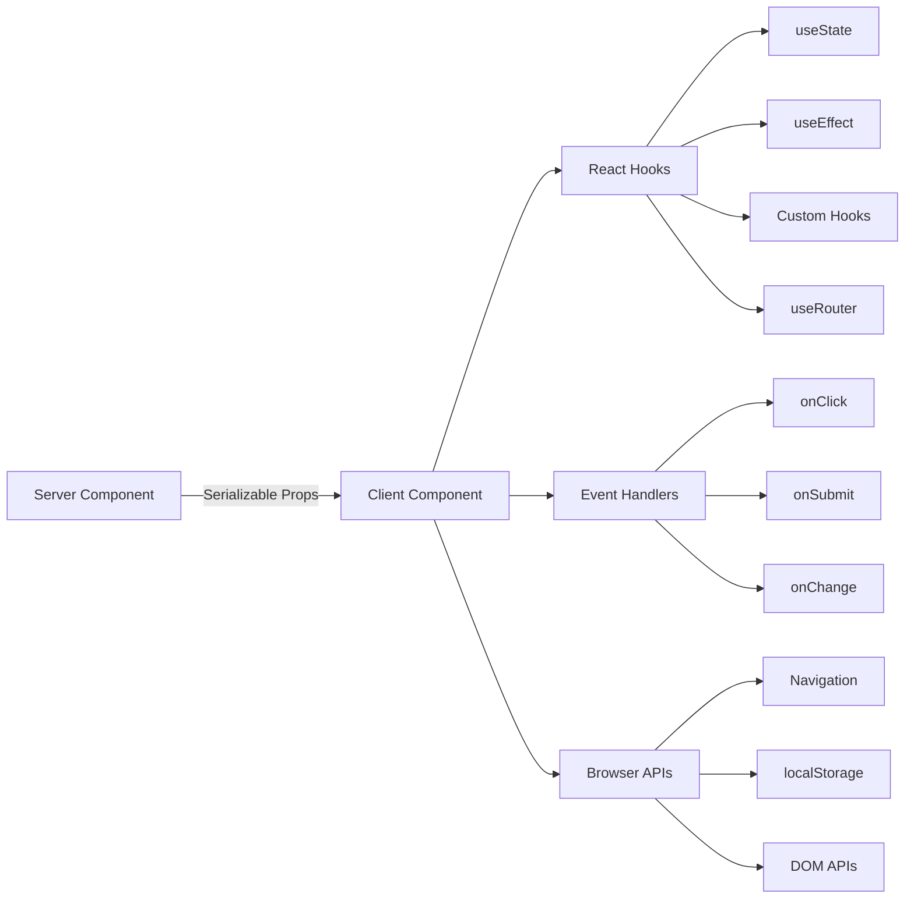

# Wzorce komponentów klienta

## Przegląd

Komponenty klienta w szablonie Ever Works to interaktywne „wyspy”, które obsługują zdarzenia użytkownika, zarządzają stanem lokalnym i integrują się z interfejsami API przeglądarki. Są one identyfikowane przez dyrektywę `"use client"` znajdującą się na górze pliku i są używane selektywnie tam, gdzie wymagana jest interaktywność.

## Architektura



## Pliki źródłowe

|Plik|Wzór|
|------|---------|
|`template/app/[locale]/admin/page.tsx`|Minimalne opakowanie klienta delegujące do komponentu|
|`template/app/not-found.tsx`|Nawigacja klienta za pomocą `useRouter`|
|`template/app/global-error.tsx`|Granica błędu z funkcją resetowania|
|`template/components/filters/filter-url-parser.tsx`|Zarządzanie stanem adresu URL|
|`template/components/header/more-menu.tsx`|Interaktywne menu rozwijane|

## Podstawowe wzory

### Wzór 1: Minimalne opakowanie klienta

Wiele komponentów strony wykorzystuje najcieńsze możliwe opakowanie klienta:

```typescript
"use client";

import { AdminDashboard } from "@/components/admin";

export default function AdminPage() {
    return <AdminDashboard />;
}
```

Ten wzorzec utrzymuje mały plik strony, delegując całą logikę do osobnego komponentu. Dyrektywa `"use client"` wyznacza granicę, gdzie drzewo komponentów serwera przechodzi do renderowania klienta.

### Wzorzec 2: Komponenty granicy błędu

Globalna procedura obsługi błędów demonstruje wzór granicy błędu:

```typescript
'use client';

export default function GlobalError({
    error,
    reset,
}: {
    error: Error & { digest?: string };
    reset: () => void;
}) {
    useEffect(() => {
        console.error(error);
    }, [error]);

    return (
        <html lang="en">
            <body>
                <div>
                    <h1>Something went wrong!</h1>
                    {process.env.NODE_ENV !== 'production' && (
                        <div>
                            <p>{error.message}</p>
                            {error.digest && <p>Error ID: {error.digest}</p>}
                        </div>
                    )}
                    <Button onPress={() => reset()}>Refresh</Button>
                    <Link href="/">Go Home</Link>
                </div>
            </body>
        </html>
    );
}
```

Kluczowe aspekty:
- Rekwizyt `error` zawiera opcjonalny `digest` do śledzenia błędów serwera
- Funkcja `reset()` ponownie renderuje elementy potomne granicy błędu
- Ślady stosu są wyświetlane tylko w fazie rozwoju
- Komponent otacza własne tagi `<html>` i `<body>`, ponieważ błędy globalne zastępują całą stronę

### Wzorzec 3: Nawigacja po stronie klienta

Strona Nie znaleziono przedstawia wzorce nawigacji po stronie klienta:

```typescript
'use client';

import { useRouter } from 'next/navigation';

export default function NotFound() {
    const router = useRouter();

    return (
        <div>
            <Button onClick={() => router.back()}>Go Back</Button>
            <Button onClick={() => router.push('/')}>Back to Home</Button>
            <button onClick={() => router.push('/help')}>Contact Support</button>
        </div>
    );
}
```

Hak `useRouter` z `next/navigation` zapewnia nawigację programową. Zauważ, że to jest z `next/navigation`, a nie `next/router` (Router stron).

### Wzorzec 4: Nawigacja klienta obsługująca i18n

Szablon udostępnia haki nawigacyjne uwzględniające ustawienia regionalne za pośrednictwem `i18n/navigation.ts`:

```typescript
import { createNavigation } from "next-intl/navigation";
import { routing } from "./routing";

export const { Link, redirect, usePathname, useRouter, getPathname } =
    createNavigation(routing);
```

Komponenty klienckie wymagające importu nawigacji uwzględniającej ustawienia regionalne z tego modułu zamiast `next/navigation`:

```typescript
'use client';

import { Link, useRouter, usePathname } from '@/i18n/navigation';

function LocaleAwareComponent() {
    const router = useRouter();
    const pathname = usePathname();

    // router.push('/about') automatically includes the current locale prefix
    return <Link href="/about">About</Link>;
}
```

### Wzorzec 5: Akcje serwera z walidacją formularza

Komponenty klienta integrują się z akcjami serwera przy użyciu sprawdzonego wzorca akcji z `lib/auth/middleware.ts`:

```typescript
// Server action (lib/auth/middleware.ts)
export function validatedAction<S extends z.ZodType, T>(
    schema: S,
    action: ValidatedActionFunction<S, T>
) {
    return async (prevState: ActionState, formData: FormData): Promise<T> => {
        const result = schema.safeParse(Object.fromEntries(formData));
        if (!result.success) {
            return { error: result.error.issues[0].message } as T;
        }
        return action(result.data, formData);
    };
}

// Client component
'use client';

import { useActionState } from 'react';
import { myServerAction } from './actions';

function MyForm() {
    const [state, formAction, isPending] = useActionState(myServerAction, {});

    return (
        <form action={formAction}>
            {state.error && <p>{state.error}</p>}
            <input name="email" type="email" />
            <button type="submit" disabled={isPending}>Submit</button>
        </form>
    );
}
```

### Wzorzec 6: Zarządzanie stanem za pomocą niestandardowych hooków

Szablon organizuje logikę po stronie klienta w niestandardowe haczyki w katalogu `hooks/`:

```typescript
'use client';

import { useFavorites } from '@/hooks/useFavorites';
import { useFilters } from '@/hooks/useFilters';

function ItemList() {
    const { favorites, toggleFavorite } = useFavorites();
    const { filters, updateFilter, resetFilters } = useFilters();

    return (
        <div>
            <FilterBar filters={filters} onChange={updateFilter} onReset={resetFilters} />
            <ItemGrid items={items} favorites={favorites} onToggleFavorite={toggleFavorite} />
        </div>
    );
}
```

## Granice komponentów klienta

### Kiedy używać `"use client"`

- **Procedury obsługi zdarzeń**: `onClick`, `onSubmit`, `onChange`
- **Haki Reaguj**: `useState`, `useEffect`, `useRef`, niestandardowe hooki
- **Api przeglądarki**: `window`, `localStorage`, `navigator`
- **Biblioteki klienckie innych firm**: Biblioteki komponentów interfejsu użytkownika wymagające interaktywności

### Kiedy zachować jako komponent serwera

- Statyczne renderowanie treści
- Pobieranie i transformacja danych
- Ładowanie tłumaczenia (`getTranslations`)
- Generowanie metadanych
- Układaj opakowania

## Najlepsze praktyki w szablonie

1. **Wciśnij `"use client"` tak głęboko jak to możliwe** -- trzymaj granicę blisko interaktywnego skrzydła
2. **Przekaż dane serwera jako rekwizyty** – unikaj ponownego pobierania na kliencie
3. **Użyj `useEffect` tylko w przypadku skutków ubocznych** – nie do pobierania danych
4. **Preferuj działania serwera zamiast tras API** – w przypadku przesyłania formularzy i mutacji
5. **Importuj nawigację z `@/i18n/navigation`** — zapewnia wyznaczanie tras uwzględniających lokalizację
6. ** Interfejs użytkownika przeznaczony wyłącznie do programowania bramy** — użyj testów `process.env.NODE_ENV !== 'production'`
