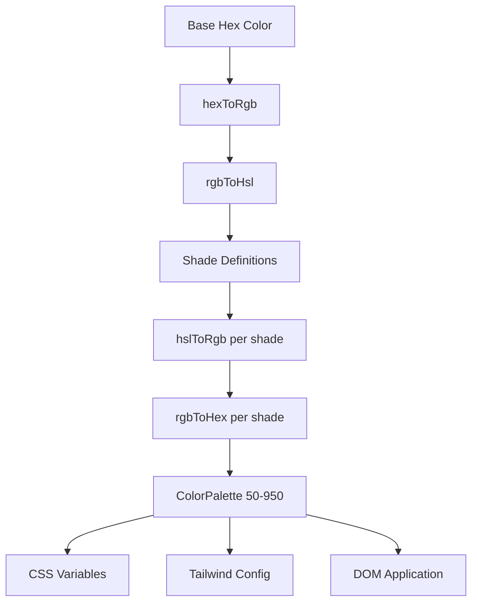

# System kolorów

Szablon wykorzystuje dynamiczny system generowania kolorów, który tworzy kompletne palety kolorów z podstawowych kolorów szesnastkowych. To napędza silnik motywów i umożliwia dostosowywanie kolorów w czasie wykonywania za pomocą zmiennych CSS i integracji CSS Tailwind.

## Przegląd architektury



## Pliki źródłowe

|Plik|Cel|
|------|---------|
|`lib/color-generator.ts`|Generowanie palety podstawowej z kolorów szesnastkowych|
|`lib/theme-color-manager.ts`|Aplikacja kolorów na poziomie motywu i generowanie CSS|
|`lib/theme-utils.ts`|Klasy narzędziowe, pomocnicy krycia i ustawienia wstępne motywów|

## Rurociąg konwersji kolorów

System konwertuje kolory poprzez wiele reprezentacji, aby dokładnie wygenerować odcienie. Cztery funkcje konwersji obsługują pełną podróż w obie strony.

```typescript
// Hex -> RGB -> HSL (for manipulation) -> RGB -> Hex (output)
export function hexToRgb(hex: string): { r: number; g: number; b: number };
export function rgbToHsl(r: number, g: number, b: number): { h: number; s: number; l: number };
export function hslToRgb(h: number, s: number, l: number): { r: number; g: number; b: number };
export function rgbToHex(r: number, g: number, b: number): string;
```

Regulacja jasności i nasycenia odbywa się w przestrzeni kolorów HSL, która zapewnia percepcyjnie jednolite przejścia odcieni w całej palecie.

## Definicje cieni

Każdy poziom odcienia ma stałą regulację jasności i nasycenia w stosunku do koloru bazowego (500):

|Cień|Regulacja jasności|Regulacja nasycenia|Użycie|
|-------|-----------------|-------------------|-------|
| 50 | +45 | -30 |Najjaśniejsze tła|
| 100 | +40 | -25 |Najedź kursorem na tła|
| 200 | +30 | -20 |Aktywne tła|
| 300 | +20 | -10 |Granice|
| 400 | +10 | -5 |Tekst zastępczy|
| **500** | **0** | **0** |**Kolor bazowy**|
| 600 | -10 | +5 |Hover stwierdza|
| 700 | -20 | +10 |Stany aktywne|
| 800 | -30 | +15 |Tekst podkreślony|
| 900 | -40 | +20 |Nagłówki|
| 950 | -45 | +25 |Najciemniejsze tła|

## Interfejs ColorPalette

```typescript
export interface ColorPalette {
  50: string;
  100: string;
  200: string;
  300: string;
  400: string;
  500: string;  // Base color
  600: string;
  700: string;
  800: string;
  900: string;
  950: string;
}
```

## Generowanie palety

Funkcja `generateColorPalette` przyjmuje dowolny kolor szesnastkowy i tworzy pełną paletę 11 odcieni:

```typescript
import { generateColorPalette } from '@/lib/color-generator';

const palette = generateColorPalette('#3b82f6');
// Returns: { 50: '#e8f0fe', 100: '#d4e4fd', ..., 950: '#0a1d3d' }
```

Wartości są zawężane w zakresie od 0 do 100 zarówno w przypadku jasności, jak i nasycenia, aby zapobiec kolorom spoza zakresu.

## Generowanie zmiennych CSS

System generuje niestandardowe właściwości CSS dla każdego odcienia:

```typescript
import { generateCssVariables } from '@/lib/color-generator';

const palette = generateColorPalette('#3b82f6');
const css = generateCssVariables('theme-primary', palette);
// Output:
// --theme-primary: #3b82f6;
// --theme-primary-50: #e8f0fe;
// --theme-primary-100: #d4e4fd;
// ... (all 11 shades)
```

## Integracja CSS z Tailwindem

Wygeneruj obiekty konfiguracyjne Tailwind, które odwołują się do zmiennych CSS:

```typescript
import { generateTailwindConfig } from '@/lib/color-generator';

const config = generateTailwindConfig('theme-primary');
// Returns: {
//   DEFAULT: 'var(--theme-primary)',
//   50: 'var(--theme-primary-50)',
//   100: 'var(--theme-primary-100)',
//   ...
// }
```

## Menedżer kolorów motywów

Moduł `theme-color-manager.ts` stosuje palety do DOM w czasie wykonywania.

### Rozszerzone konfiguracje motywów

Cztery wbudowane motywy definiują kolory podstawowe dla podstawowego, dodatkowego, akcentującego, tła, powierzchni i tekstu:

```typescript
export const EXTENDED_THEME_CONFIGS: Record<ThemeKey, ThemeConfig> = {
  everworks: {
    primary: "#3d70ef",
    secondary: "#00c853",
    accent: "#0056b3",
    background: "#ffffff",
    surface: "#f8f9fa",
    text: "#1a1a1a",
    textSecondary: "#6c757d",
  },
  corporate: { /* ... */ },
  material: { /* ... */ },
  funny: { /* ... */ },
};
```

### Stosowanie palet w DOM

```typescript
import { applyColorPalette, applyThemeWithPalettes } from '@/lib/theme-color-manager';

// Apply a single color palette
applyColorPalette('theme-primary', '#3d70ef');

// Apply an entire theme (primary + secondary + accent + utility colors)
applyThemeWithPalettes('everworks');
```

Funkcja `applyColorPalette` generuje również wariant RGB obsługujący przezroczystość:

```typescript
// Sets both:
// --theme-primary: #3d70ef
// --theme-primary-rgb: 61, 112, 239
```

### Generowanie statycznego CSS

Do renderowania po stronie serwera lub generowania CSS w czasie kompilacji:

```typescript
import { generateThemeCss } from '@/lib/theme-color-manager';

const css = generateThemeCss('everworks');
// Returns full CSS variable string for all theme colors
```

## Zajęcia tematyczne

Moduł `theme-utils.ts` udostępnia gotowe kombinacje klas Tailwind:

```typescript
import { themeClasses } from '@/lib/theme-utils';

// Button variants
themeClasses.button.primary   // "bg-theme-primary hover:bg-theme-accent text-white"
themeClasses.button.secondary // "bg-theme-secondary hover:bg-theme-secondary/80 text-white"
themeClasses.button.outline   // "border-2 border-theme-primary text-theme-primary ..."
themeClasses.button.ghost     // "text-theme-primary hover:bg-theme-primary/10"

// Text variants
themeClasses.text.primary     // "text-theme-text"
themeClasses.text.secondary   // "text-theme-text-secondary"
themeClasses.text.accent      // "text-theme-primary"
```

### Funkcje pomocnicze

```typescript
import { withOpacity, getCssVariable, cn, buildThemeClasses } from '@/lib/theme-utils';

// Generate opacity variant
withOpacity('bg-theme-primary', 50); // "bg-theme-primary/50"

// Get CSS variable reference
getCssVariable('theme-primary'); // "var(--theme-primary)"

// Conditional class building
buildThemeClasses('base-class', 'theme-class', {
  'active-class': isActive,
  'disabled-class': isDisabled,
});
```

## Generowanie kolorów motywu wsadowego

Wygeneruj konfigurację CSS i Tailwind dla wielu kolorów jednocześnie:

```typescript
import { generateThemeColors } from '@/lib/color-generator';

const result = generateThemeColors({
  primary: '#3d70ef',
  secondary: '#00c853',
  accent: '#0056b3',
});

// result.css - Complete CSS variable declarations
// result.tailwind - Tailwind config object for all colors
```

## Niestandardowa aplikacja tematyczna

Zastosuj dowolne kolory bez korzystania z gotowych motywów:

```typescript
import { applyCustomTheme } from '@/lib/theme-color-manager';

applyCustomTheme({
  primary: '#e91e63',
  secondary: '#9c27b0',
  accent: '#673ab7',
});
```

## Obsługa błędów

Menedżer kolorów motywu zawiera zachowanie awaryjne:

- Jeśli klucz motywu nie zostanie znaleziony, zostanie przywrócony domyślny motyw `everworks`.
- Jeśli zastosowanie motywu spowoduje błąd, a żądany motyw nie jest `everworks`, automatycznie ponawia próbę z motywem domyślnym.
- Bezpieczeństwo SSR: `useThemeWithPalettes` sprawdza dostępność `window` przed zastosowaniem zmian DOM.
