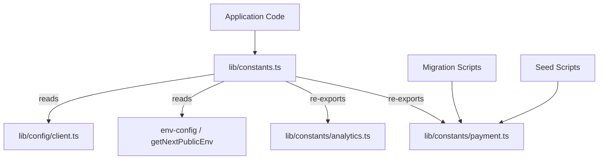

# Stałe odniesienia

Moduł stałych (`template/lib/constants.ts` i `template/lib/constants/`) centralizuje wszystkie wartości konfiguracyjne, wyliczenia, ustawienia zależne od środowiska i liczby magiczne w całej aplikacji. Stałe są zorganizowane w pliki specyficzne dla domeny, aby umożliwić bezpieczny import w kontekstach poza środowiskiem wykonawczym Next.js (np. skrypty migracji, skrypty początkowe).

## Przegląd architektury



## Pliki źródłowe

|Plik|Opis|
|------|-------------|
|`lib/constants.ts`|Główne stałe baryłkę - importuje z env-config i reeksportuje podmoduły|
|`lib/constants/payment.ts`|Wyliczenia i typy płatności (bezpieczne dla skryptów)|
|`lib/constants/analytics.ts`|Stałe związane z analityką|

## Stałe lokalizacji

```typescript
const DEFAULT_LOCALE = 'en';

const LOCALES = [
  'en', 'fr', 'es', 'de', 'zh', 'ar', 'he', 'ru', 'uk', 'pt',
  'it', 'ja', 'ko', 'nl', 'pl', 'tr', 'vi', 'th', 'hi', 'id', 'bg'
] as const;

type Locale = (typeof LOCALES)[number];

/** Right-to-left locales */
const RTL_LOCALES: readonly Locale[] = ['ar', 'he'] as const;
```

## Marka i interfejs użytkownika

```typescript
const LOGO_URL = '/logo-ever-work-3.png';
```

## API i backend

```typescript
/** Base URL for internal Next.js API routes */
const API_BASE_URL = getNextPublicEnv('NEXT_PUBLIC_API_BASE_URL');
```

## Uwierzytelnianie i bezpieczeństwo

```typescript
const COOKIE_SECRET = getNextPublicEnv('COOKIE_SECRET');
const JWT_ACCESS_TOKEN_EXPIRES_IN = getNextPublicEnv('JWT_ACCESS_TOKEN_EXPIRES_IN');
const JWT_REFRESH_TOKEN_EXPIRES_IN = getNextPublicEnv('JWT_REFRESH_TOKEN_EXPIRES_IN');
```

## Analityka — PostHog

|Stała|Źródło|Opis|
|----------|--------|-------------|
|`POSTHOG_KEY`|`NEXT_PUBLIC_POSTHOG_KEY`|Klucz API projektu PostHog|
|`POSTHOG_HOST`|`NEXT_PUBLIC_POSTHOG_HOST`|Host API PostHog|
|`POSTHOG_ENABLED`|Pochodne|Prawda, gdy istnieje zarówno klucz, jak i host|
|`POSTHOG_DEBUG`|`POSTHOG_DEBUG`|Włącz rejestrowanie debugowania|
|`POSTHOG_SESSION_RECORDING_ENABLED`|env / `'true'`|Przełącznik nagrywania sesji|
|`POSTHOG_AUTO_CAPTURE`|env / `'false'`|Automatyczne przechwytywanie wyświetleń strony|
|`POSTHOG_SAMPLE_RATE`|Obliczone|`0.1` w produkcji, `1.0` w fazie rozwoju|
|`POSTHOG_SESSION_RECORDING_SAMPLE_RATE`|Obliczone|`0.1` w produkcji, `1.0` w fazie rozwoju|

## Śledzenie błędów — Sentry

|Stała|Źródło|Opis|
|----------|--------|-------------|
|`SENTRY_DSN`|`NEXT_PUBLIC_SENTRY_DSN`|Nazwa źródła danych Sentry|
|`SENTRY_ENABLE_DEV`|`SENTRY_ENABLE_DEV`|Włącz Sentry w fazie rozwoju|
|`SENTRY_DEBUG`|`SENTRY_DEBUG`|Tryb debugowania Sentry|
|`SENTRY_ENABLED`|Pochodne|Prawda, gdy ustawiono DSN i środowisko na to pozwala|

## Ujednolicone śledzenie wyjątków

```typescript
const EXCEPTION_TRACKING_PROVIDER = getNextPublicEnv('EXCEPTION_TRACKING_PROVIDER', 'both');
const POSTHOG_EXCEPTION_TRACKING = getNextPublicEnv('POSTHOG_EXCEPTION_TRACKING', 'true');
const SENTRY_EXCEPTION_TRACKING = getNextPublicEnv('SENTRY_EXCEPTION_TRACKING', 'true');

type ExceptionTrackingProvider = 'sentry' | 'posthog' | 'both' | 'none';
```

## ReCAPTCHA

```typescript
const RECAPTCHA_SITE_KEY = getNextPublicEnv('NEXT_PUBLIC_RECAPTCHA_SITE_KEY');
const RECAPTCHA_SECRET_KEY = getNextPublicEnv('RECAPTCHA_SECRET_KEY');
```

## Stałe płatności (`constants/payment.ts`)

Ten plik jest celowo oddzielony od `constants.ts`, aby uniknąć importowania `@/lib/config`, co pozwala na użycie go w skryptach migracji i inicjowania działających poza Next.js.

### Wyliczenia

```typescript
enum PaymentFlow {
  PAY_AT_START = 'pay_at_start',
  PAY_AT_END = 'pay_at_end',
}

enum PaymentStatus {
  PENDING = 'pending',
  PAID = 'paid',
  FAILED = 'failed',
}

enum PaymentInterval {
  DAILY = 'daily',
  WEEKLY = 'weekly',
  MONTHLY = 'monthly',
  YEARLY = 'yearly',
  ONE_TIME = 'one-time',
  PER_SUBMISSION = 'per-submission',
}

enum PaymentPlan {
  FREE = 'free',
  STANDARD = 'standard',
  PREMIUM = 'premium',
}

enum PaymentMethod {
  CREDIT_CARD = 'credit_card',
  PAYPAL = 'paypal',
}

enum PaymentCurrency {
  USD = 'USD',
  EUR = 'EUR',
  GBP = 'GBP',
  CAD = 'CAD',
  AUD = 'AUD',
  ETH = 'ETH',
}

enum PaymentProvider {
  STRIPE = 'stripe',
  SOLIDGATE = 'solidgate',
  LEMONSQUEEZY = 'lemonsqueezy',
  POLAR = 'polar',
}

enum SubmissionStatus {
  DRAFT = 'draft',
  PENDING = 'pending',
  APPROVED = 'approved',
  REJECTED = 'rejected',
  PUBLISHED = 'published',
  ARCHIVED = 'archived',
}
```

### Planuj wyświetlane nazwy

```typescript
const PAYMENT_PLAN_NAMES: Record<PaymentPlan, string> = {
  free: 'Free Plan',
  standard: 'Standard Plan',
  premium: 'Premium Plan',
};
```

### Ceny reklam sponsorskich

```typescript
const SponsorAdPricing = {
  WEEKLY: 100,    // $100.00
  MONTHLY: 300,   // $300.00
} as const;
```

## Stałe analityczne (`constants/analytics.ts`)

```typescript
/** Cookie name for anonymous viewer tracking */
const VIEWER_COOKIE_NAME = 'ever_viewer_id';

/** Cookie max age: 365 days in seconds */
const VIEWER_COOKIE_MAX_AGE = 365 * 24 * 60 * 60;  // 31,536,000
```

## Importuj wzory

### Pełny kod aplikacji

```typescript
// Import everything from the main barrel
import {
  DEFAULT_LOCALE,
  LOCALES,
  POSTHOG_ENABLED,
  PaymentPlan,
  PaymentProvider,
  SubmissionStatus,
  VIEWER_COOKIE_NAME,
} from '@/lib/constants';
```

### Skrypty poza środowiskiem wykonawczym Next.js

```typescript
// Import only from payment.ts to avoid Next.js dependencies
import { PaymentPlan, PaymentStatus, SubmissionStatus } from '@/lib/constants/payment';
```
