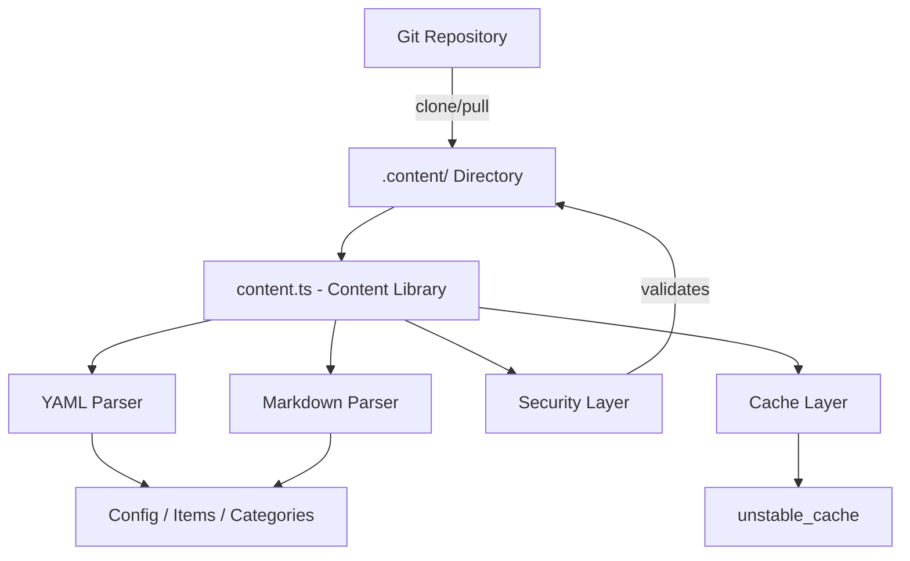
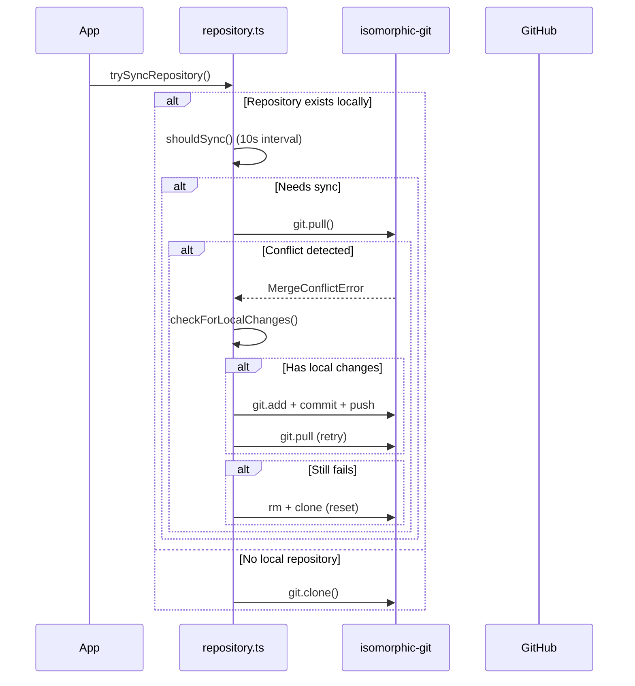

# Biblioteka treści

Biblioteka treści (`lib/content.ts`) udostępnia narzędzia po stronie serwera do odczytywania, analizowania i buforowania treści z repozytorium CMS opartego na Git. Obsługuje pliki treści YAML/Markdown, zarządzanie konfiguracją i synchronizację treści za pomocą solidnych środków bezpieczeństwa.

## Przegląd architektury



## Pliki źródłowe

|Plik|Cel|
|------|---------|
|`lib/content.ts`|Główne przetwarzanie treści, odczytywanie i buforowanie|
|`lib/repository.ts`|Synchronizacja Git clone/pull ze zdalnym repozytorium|
|`lib/lib.ts`|Narzędzia ścieżki (`getContentPath`, `fsExists`, `dirExists`)|
|`lib/cache-config.ts`|Tagi pamięci podręcznej i konfiguracja TTL|

## Warstwa bezpieczeństwa

Biblioteka zawartości wymusza wiele środków bezpieczeństwa, aby zapobiec atakom związanym z przechodzeniem ścieżki i wstrzykiwaniem.

### Walidacja kodu języka

```typescript
function validateLanguageCode(lang: string): boolean {
  const validLangPattern = /^[a-zA-Z0-9_-]+$/;
  return validLangPattern.test(lang) && lang.length <= 10;
}
```

Akceptowane są tylko znaki alfanumeryczne, łączniki i podkreślenia o maksymalnej długości 10 znaków.

### Oczyszczanie nazw plików

```typescript
function sanitizeFilename(filename: string): string {
  const sanitized = path.basename(filename);
  if (sanitized.includes('..') || sanitized.includes('/') || sanitized.includes('\\')) {
    throw new Error('Invalid filename: contains dangerous characters');
  }
  return sanitized;
}
```

Używa `path.basename` do usuwania komponentów katalogu i odrzuca wszelkie pozostałe znaki przejścia.

### Walidacja ścieżki

```typescript
function validatePath(filepath: string, basePath: string): void {
  const resolvedPath = path.resolve(filepath);
  const resolvedBase = path.resolve(basePath);
  if (!resolvedPath.startsWith(resolvedBase + path.sep) && resolvedPath !== resolvedBase) {
    throw new Error('Invalid file path: outside of allowed directory');
  }
}
```

Funkcja `safeReadFile` przeprowadza podwójną kontrolę: sprawdza poprawność ścieżki, a następnie sprawdza, czy rozpoznana ścieżka rzeczywista (z dowiązaniami symbolicznymi) pozostaje w katalogu podstawowym.

### Weryfikacja adresu URL

```typescript
function isValidUrl(url: string): boolean {
  const trimmed = url.trim();
  if (trimmed.startsWith('/') && !trimmed.startsWith('//')) return true;
  return trimmed.startsWith('http://') || trimmed.startsWith('https://');
}
```

Blokuje `javascript:`, `data:`, `vbscript:` i inne niebezpieczne schematy protokołów.

### Walidacja rozmiaru CSS

```typescript
function isValidCssSize(value: string): boolean {
  if (['auto', 'inherit', 'initial', 'unset'].includes(value.trim())) return true;
  return /^\d+(\.\d+)?(px|em|rem|vh|vw|%|pt|cm|mm|in)?$/.test(value.trim());
}
```

Zapobiega wstrzykiwaniu CSS przez niestandardowe pola frontmatter bohatera.

## Przetwarzanie treści

### Analiza YAML

Pliki treści są analizowane przy użyciu biblioteki `yaml` z walidacją schematu Zoda pod kątem frontmatter:

```typescript
const customHeroFrontmatterSchema = z.object({
  background_image: z.string().refine(isValidUrl, {
    message: 'Invalid URL: must be http, https, or relative path'
  }).optional(),
  // ... additional validated fields
});
```

### Buforowanie konfiguracji

Konfiguracja witryny jest buforowana przy użyciu Next.js `unstable_cache` ze zdefiniowanymi TTL i tagami pamięci podręcznej:

```typescript
import { CACHE_TAGS, CACHE_TTL } from './cache-config';

const getCachedConfig = unstable_cache(
  async () => { /* read and parse config.yml */ },
  [CACHE_TAGS.CONFIG],
  { revalidate: CACHE_TTL }
);
```

## Synchronizacja repozytorium Git

Moduł `repository.ts` zarządza operacjami Git przy użyciu `isomorphic-git`.

### Synchronizuj przepływ



### Ochrona przed przekroczeniem limitu czasu

Wszystkie operacje Git są opakowane z konfigurowalnymi limitami czasu:

```typescript
async function withTimeout<T>(promise: Promise<T>, timeoutMs: number = 120000): Promise<T> {
  const timeoutPromise = new Promise<never>((_, reject) => {
    setTimeout(() => reject(new Error(`Operation timeout after ${timeoutMs}ms`)), timeoutMs);
  });
  return Promise.race([promise, timeoutPromise]);
}
```

### Rozwiązywanie konfliktów

System obsługuje konflikty scalania poprzez strategię wieloetapową:

1. **Wykryj lokalne zmiany** poprzez `git.statusMatrix()`
2. **Przed pociągnięciem spróbuj wprowadzić** lokalne zmiany
3. **Ponów próbę pociągnięcia** po udanym naciśnięciu
4. **Pełny reset** (usuń + sklonuj ponownie) w ostateczności

### Zachowanie awaryjne

Jeśli `DATA_REPOSITORY` nie jest skonfigurowany lub klonowanie nie powiedzie się, system utworzy minimalną zawartość zastępczą:

```typescript
// Creates empty content directory with minimal config
const DEFAULT_CONFIG = `site_name: Website
item_name: Item
items_name: Items
copyright_year: ${new Date().getFullYear()}
`;
```

## Egzekwowanie tylko na serwerze

Zarówno `content.ts`, jak i `repository.ts` korzystają z importu `server-only`, aby zapobiec przypadkowemu użyciu po stronie klienta:

```typescript
'use server';
import 'server-only';
```

Dzięki temu operacje na treści z dostępem do systemu plików nigdy nie przedostaną się do pakietów klientów.

## Kluczowe eksportowane funkcje

|Funkcja|Opis|
|----------|-------------|
|`getCachedConfig()`|Zwraca konfigurację witryny w pamięci podręcznej z `config.yml`|
|`trySyncRepository()`|Klonuje lub pobiera zawartość ze zdalnego repozytorium Git|
|`pullChanges()`|Pobiera najnowsze zmiany z rozwiązywaniem konfliktów|
|`validateLanguageCode()`|Sprawdza format kodu języka i18n|
|`sanitizeFilename()`|Usuwa składniki katalogu z nazw plików|
|`safeReadFile()`|Odczytuje pliki z pełną ochroną przed przekroczeniem ścieżki|
