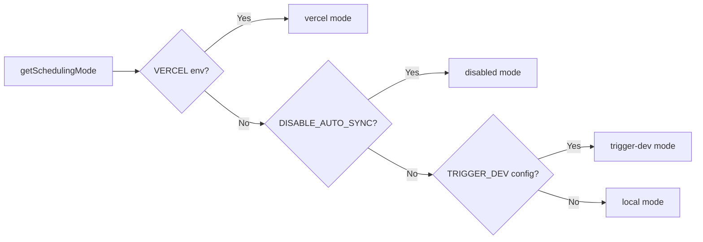

# System zadań Cron

## Przegląd

Szablon Ever Works implementuje elastyczny system zadań w tle, który obsługuje trzy tryby planowania: **Vercel Cron**, **Trigger.dev** i **lokalny harmonogram**. Punkty końcowe Cron to standardowe trasy API Next.js uwierzytelniane za pomocą `CRON_SECRET`, a system zawiera moduł inicjujący singleton, który zapewnia skonfigurowanie zadań dokładnie raz na proces.

## Architektura

```mermaid
flowchart TD
    A[Scheduling Mode Detection] --> B{getSchedulingMode}

    B -->|vercel| C[Vercel Cron]
    B -->|trigger-dev| D[Trigger.dev]
    B -->|local| E[Local Scheduler]
    B -->|disabled| F[No Jobs]

    C --> G[vercel.json crons]
    G --> G1[/api/cron/sync]
    G --> G2[/api/cron/subscription-reminders]
    G --> G3[/api/cron/subscription-expiration]

    G1 --> H[CRON_SECRET Verification]
    G2 --> H
    G3 --> H

    H -->|Valid| I[Execute Job]
    H -->|Invalid| J[401 Unauthorized]

    I --> I1[triggerManualSync]
    I --> I2[subscriptionRenewalReminderJob]
    I --> I3[processExpiredSubscriptions]

    D --> K[Trigger.dev SDK]
    E --> L[Internal setInterval]

    K --> I
    L --> I
```

## Pliki źródłowe

|Plik|Cel|
|------|---------|
|`template/vercel.json`|Definicje harmonogramu cron w Vercel|
|`template/app/api/cron/sync/route.ts`|Punkt końcowy cron synchronizacji treści|
|`template/app/api/cron/subscription-reminders/route.ts`|E-maile z przypomnieniem o odnowieniu|
|`template/app/api/cron/subscription-expiration/route.ts`|Przetwarzanie wygasłej subskrypcji|
|`template/app/api/cron/jobs/background-jobs-init.ts`|Inicjalizacja zadania Singleton|

## Konfiguracja harmonogramu Cron

### vercel.json

```json
{
    "crons": [
        {
            "path": "/api/cron/sync",
            "schedule": "0 3 * * *"
        },
        {
            "path": "/api/cron/subscription-reminders",
            "schedule": "0 9 * * *"
        },
        {
            "path": "/api/cron/subscription-expiration",
            "schedule": "0 0 * * *"
        }
    ]
}
```

|Praca|Harmonogram|Czas|Opis|
|-----|----------|------|-------------|
|Synchronizacja treści| `0 3 * * *` |Codziennie o 3:00 czasu UTC|Synchronizuje zawartość z CMS-a opartego na Git|
|Przypomnienia o subskrypcji| `0 9 * * *` |Codziennie o 9:00 UTC|Wysyła e-maile z przypomnieniem o odnowieniu|
|Wygaśnięcie subskrypcji| `0 0 * * *` |Codziennie o północy UTC|Przetwarza wygasłe subskrypcje|

## Uwierzytelnianie

### Weryfikacja tajna z zachowaniem czasu

Wszystkie punkty końcowe cron weryfikują `CRON_SECRET` za pomocą porównania bezpiecznego pod względem czasu, aby zapobiec atakom związanym z synchronizacją:

```typescript
import crypto from 'crypto';

function verifyCronSecret(request: NextRequest): boolean {
    const authHeader = request.headers.get('authorization');
    const cronSecret = process.env.CRON_SECRET;

    // Development bypass
    if (!cronSecret && process.env.NODE_ENV === 'development') {
        console.log('[Cron] Bypassing cron auth in development');
        return true;
    }

    if (!cronSecret || !authHeader) return false;

    const expectedValue = `Bearer ${cronSecret}`;

    // Length check before timing-safe comparison
    if (authHeader.length !== expectedValue.length) return false;

    return crypto.timingSafeEqual(
        Buffer.from(authHeader, 'utf8'),
        Buffer.from(expectedValue, 'utf8')
    );
}
```

Kluczowe funkcje bezpieczeństwa:
- **Porównanie bezpieczne pod względem czasowym** za pośrednictwem `crypto.timingSafeEqual` — uniemożliwia atakującym zmierzenie różnic w czasie reakcji w celu odgadnięcia sekretu
- **Wstępne sprawdzenie długości** -- `timingSafeEqual` wymaga buforów o równej długości
- **Obejście programistyczne** -- tylko gdy `CRON_SECRET` nie jest skonfigurowane i `NODE_ENV=development`

### Automatyczne uwierzytelnianie Vercel

Po wdrożeniu w Vercel platforma automatycznie dołącza nagłówek `Authorization: Bearer <CRON_SECRET>` dla skonfigurowanych zadań cron. Wystarczy ustawić zmienną środowiskową `CRON_SECRET` w panelu kontrolnym Vercel.

## Wdrożenia pracy

### Zadanie synchronizacji treści

```typescript
export async function GET(request: Request): Promise<NextResponse> {
    const startTime = Date.now();

    // Verify authorization
    if (!isAuthorized) {
        return NextResponse.json({ success: false, message: "Unauthorized" }, { status: 401 });
    }

    try {
        const result = await triggerManualSync();
        const duration = Date.now() - startTime;

        return NextResponse.json({
            success: result.success,
            timestamp: new Date().toISOString(),
            duration,
            message: result.message,
        }, {
            headers: { "Cache-Control": "no-cache, no-store, must-revalidate" },
        });
    } catch (error) {
        return NextResponse.json({
            success: false,
            message: "Cron sync failed",
            details: safeErrorMessage(error, "Unknown error"),
        }, { status: 500 });
    }
}
```

Format odpowiedzi:
```json
{
    "success": true,
    "timestamp": "2025-01-15T03:00:05.123Z",
    "duration": 5123,
    "message": "Sync completed successfully"
}
```

### Zadanie wygaśnięcia subskrypcji

To zadanie przetwarza wygasłe subskrypcje i wysyła e-maile z powiadomieniami:

```typescript
export async function GET(request: NextRequest) {
    if (!verifyCronSecret(request)) {
        return NextResponse.json({ success: false, message: 'Unauthorized' }, { status: 401 });
    }

    // 1. Find and update expired subscriptions
    const result = await subscriptionService.processExpiredSubscriptions();

    // 2. Send notification emails
    const { service: emailService } = await createEmailService();
    if (emailService.isServiceAvailable()) {
        for (const subscription of result.subscriptions) {
            const user = await getUserById(subscription.userId);
            const emailTemplate = getSubscriptionExpiredTemplate({ /* ... */ });
            await sendEmailSafely(emailService, emailConfig, emailTemplate, user.email);
        }
    }

    // 3. Return results
    return NextResponse.json({
        success: true,
        data: {
            processed: result.processed,
            affectedUsers,
            errors: result.errors,
            timestamp: new Date().toISOString()
        }
    });
}
```

Kluczowe zachowania:
- Awarie poczty e-mail nie powodują niepowodzenia zadania
- Metoda `POST` jest również eksportowana jako alias dla wyzwalaczy ręcznych
- Zwraca `207 Multi-Status` w przypadku częściowych sukcesów

### Praca przypomnienia o subskrypcji

```typescript
export async function GET(request: NextRequest) {
    if (!verifyCronSecret(request)) {
        return NextResponse.json({ error: 'Unauthorized' }, { status: 401 });
    }

    const result = await subscriptionRenewalReminderJob();

    if (!result.success) {
        return NextResponse.json(
            { error: 'Job completed with errors', ...result },
            { status: 207 }  // Multi-Status for partial success
        );
    }

    return NextResponse.json({
        message: 'Subscription reminder job completed',
        ...result
    });
}

// Support POST for Vercel Cron
export async function POST(request: NextRequest) {
    return GET(request);
}
```

## Inicjalizacja zadań w tle

### Wzór Singletona

Moduł inicjujący używa `globalThis`, aby mieć pewność, że zadania zostaną skonfigurowane dokładnie raz, nawet w przypadku wywołań funkcji bezserwerowych:

```typescript
const GLOBAL_KEY = '__BACKGROUND_JOBS_INIT__' as const;

interface BackgroundJobsGlobalState {
    initializationState: 'pending' | 'initializing' | 'completed';
    initializationPromise: Promise<void> | null;
    loggedMode: SchedulingMode | null;
}

export async function ensureBackgroundJobsInitialized(): Promise<void> {
    // Skip during tests and builds
    if (process.env.NODE_ENV === 'test') return;
    if (process.env.NEXT_PHASE === 'phase-production-build') return;

    const state = getGlobalState();

    // Fast path: already completed
    if (state.initializationState === 'completed') return;

    // Wait for in-progress initialization
    if (state.initializationState === 'initializing') {
        return state.initializationPromise;
    }

    // Start initialization
    state.initializationState = 'initializing';
    state.initializationPromise = doInitialize();

    try {
        await state.initializationPromise;
        state.initializationState = 'completed';
    } catch (error) {
        state.initializationState = 'pending'; // Allow retry
        throw error;
    }
}
```

### Tryby planowania



|Tryb|Zachowanie|
|------|----------|
|`vercel`|Zadania obsługiwane przez Vercel Cron za pośrednictwem punktów końcowych HTTP|
|`trigger-dev`|Zadania zarządzane przez harmonogram w chmurze Trigger.dev|
|`local`|Wewnętrzny harmonogram oparty na `setInterval` do programowania|
|`disabled`|Brak automatycznego planowania (`DISABLE_AUTO_SYNC=true`)|

## Zmienne środowiskowe

|Zmienna|Wymagane|Opis|
|----------|----------|-------------|
|`CRON_SECRET`|Tylko produkcja|Token okaziciela do uwierzytelniania cron|
|`DISABLE_AUTO_SYNC`|Nie|Ustaw na `true`, aby wyłączyć wszystkie zadania w tle|
|`VERCEL`|Automatyczne ustawianie|Ustawiane automatycznie przez platformę Vercel|

## Najlepsze praktyki

1. **Zawsze używaj porównania bezpiecznego pod względem czasu** w przypadku sekretów cron — zapobiega atakom związanym z synchronizacją
2. **Eksportuj zarówno GET, jak i POST** — Vercel Cron może użyć dowolnej metody
3. **Ustaw `Cache-Control: no-cache`** w odpowiedziach — zapobiegaj buforowaniu wyników zadań
4. **Rejestrowanie czasu trwania zadania** – pomaga zidentyfikować spadki wydajności
5. **Swobodnie obsługuj awarie poczty e-mail** – nie pozwól, aby awarie powiadomień zakłócały pracę
6. **Użyj `207 Multi-Status`** w przypadku częściowych sukcesów – odróżnia to od pełnego sukcesu/porażki
