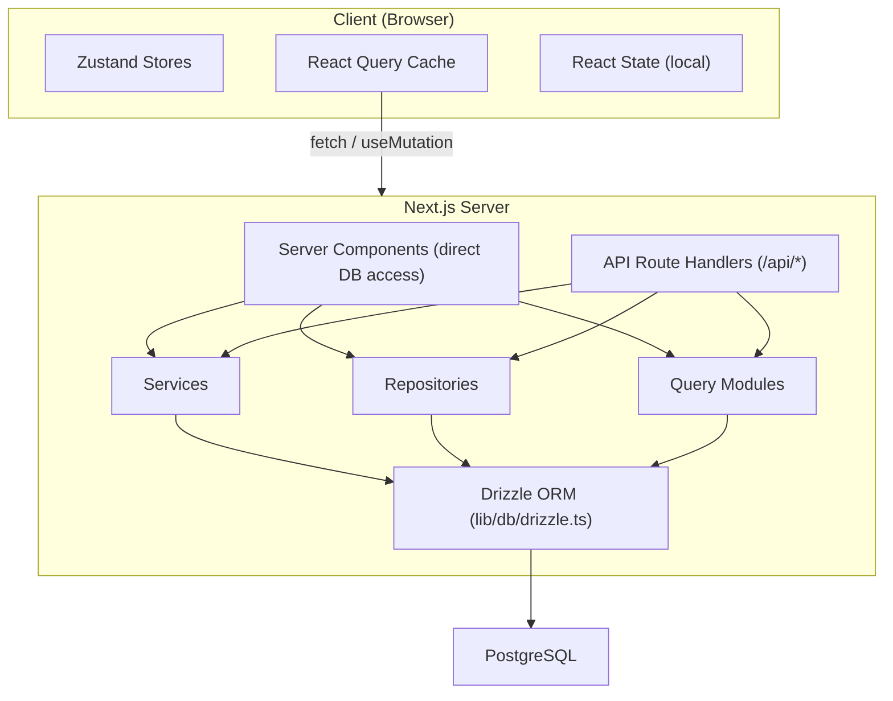

# Zarządzanie przepływem danych i stanem

Ten dokument opisuje sposób przepływu danych przez szablon Ever Works, z bazy danych do interfejsu użytkownika, obejmując komponenty serwera, trasy API, zapytanie React, magazyny Zustand i wzorzec repozytorium.

## Przegląd architektury

Szablon wykorzystuje wielowarstwową architekturę danych:



## Pobieranie danych po stronie serwera

### Komponenty serwera (bezpośredni dostęp do bazy danych)

Komponenty serwera w katalogu `app/` mogą bezpośrednio importować i wywoływać funkcje zapytań do baz danych lub metody repozytorium. Jest to najbardziej wydajna ścieżka, ponieważ pozwala uniknąć niepotrzebnych podróży w obie strony protokołu HTTP.

```typescript
// app/[locale]/admin/items/page.tsx (simplified)
import { getItems } from '@/lib/db/queries';

export default async function AdminItemsPage() {
  const items = await getItems();
  return <ItemsList items={items} />;
}
```

### Obsługa tras API

Trasy API w `app/api/` służą jako pomost pomiędzy komponentami klienta a logiką po stronie serwera. Działają zgodnie ze wzorcem cienkiej obsługi: sprawdzanie danych wejściowych, wywoływanie odpowiedniej usługi lub repozytorium i zwracanie odpowiedzi HTTP.

```typescript
// Typical API route pattern
export async function GET(request: NextRequest) {
  const session = await auth();
  if (!session?.user) {
    return NextResponse.json({ error: 'Unauthorized' }, { status: 401 });
  }

  const data = await someRepository.findAll();
  return NextResponse.json({ success: true, data });
}
```

## Zarządzanie stanem po stronie klienta

### Zapytanie TanStack (zapytanie reagujące 5)

React Query to podstawowe narzędzie do zarządzania stanem serwera po stronie klienta. Szablon szeroko go wykorzystuje poprzez niestandardowe zaczepy w katalogu `hooks/`.

**Konfiguracja globalna** (`lib/react-query-config.ts`):
- Domyślny czas przestania: 5 minut
- Czas odbioru śmieci: 10 minut
- Automatyczna ponowna próba z wykładniczym wycofywaniem (do 3 ponownych prób)
- Ponów pobieranie przy fokusie okna i połącz się ponownie
- Brak ponownych prób w przypadku błędów klienta 4xx

**Wzorzec haka**: Każdy obszar funkcji ma dedykowane haki, które otaczają zapytanie React:

```typescript
// hooks/use-admin-items.ts (simplified pattern)
import { useQuery, useMutation, useQueryClient } from '@tanstack/react-query';

export function useAdminItems(params) {
  return useQuery({
    queryKey: ['admin', 'items', params],
    queryFn: () => fetch('/api/admin/items').then(r => r.json()),
    staleTime: 5 * 60 * 1000,
  });
}

export function useCreateItem() {
  const queryClient = useQueryClient();
  return useMutation({
    mutationFn: (data) => fetch('/api/admin/items', {
      method: 'POST',
      body: JSON.stringify(data),
    }).then(r => r.json()),
    onSuccess: () => {
      queryClient.invalidateQueries({ queryKey: ['admin', 'items'] });
    },
  });
}
```

### Sklepy Zustand

Zustand służy do stanu interfejsu użytkownika tylko dla klienta, który nie wymaga synchronizacji serwera. Przykłady obejmują:

- **Stan motywu**: preferowany tryb jasny/ciemny
- **Stan filtra**: Aktywne wybrane filtry
- **Stan modalny**: Stan otwarty/zamknięty dla modułów modalnych i nakładek
- **Preferencje układu**: widok siatki a widok listy, stan paska bocznego

### Kontekst reakcji

Dostawcy kontekstu React w `components/context/` i `components/providers/` dostarczają stan współdzielony do poddrzew komponentów. Opakowanie dostawców root (`app/[locale]/providers.tsx`) składa się z:

- Dostawca zapytań React (z klientem zapytań)
- Dostawca motywów
- Dostawca sesji uwierzytelniania
- Dostawca powiadomień toastowych

## Warstwy dostępu do danych

### Wzór repozytorium

Repozytoria w `lib/repositories/` zapewniają czystą abstrakcję operacji na bazach danych. Każde repozytorium hermetyzuje zapytania dotyczące określonej jednostki domeny.

```
lib/repositories/
├── admin-analytics-optimized.repository.ts
├── admin-stats.repository.ts
├── category.repository.ts
├── client-dashboard.repository.ts
├── client-item.repository.ts
├── collection.repository.ts
├── integration-mapping.repository.ts
├── item.repository.ts
├── role.repository.ts
├── sponsor-ad.repository.ts
├── tag.repository.ts
├── twenty-crm-config.repository.ts
└── user.repository.ts
```

### Moduły zapytań

Katalog `lib/db/queries/` zawiera ponad 23 moduły zapytań uporządkowane według domen. Zapewniają one surowe funkcje zapytań Drizzle ORM, z których korzystają repozytoria i usługi.

### Warstwa usług

Katalog `lib/services/` zawiera ponad 30 plików usług implementujących logikę biznesową. Usługi organizują wiele repozytoriów, zewnętrzne wywołania API i efekty uboczne (e-mail, powiadomienia, webhooki).

## Architektura klienta API

### Klient API po stronie serwera

`lib/api/server-api-client.ts` zapewnia scentralizowanego klienta HTTP do połączeń po stronie serwera z:
- Automatyczna ponowna próba z wykładniczym wycofywaniem
- Konfigurowalne limity czasu (domyślnie 30 sekund)
- Rozwój logowania strukturalnego
- Normalizacja błędów

### Klient API po stronie przeglądarki

`lib/api/api-client.ts` i `lib/api/api-client-class.ts` zapewniają abstrakcję API po stronie klienta, używaną przez hooki React Query do wywoływania tras API.

## Dane dotyczące treści (CMS oparty na Git)

Zawartość pozycji (listy katalogów) jest przechowywana w repozytorium Git i zarządzana poprzez `lib/content.ts` i `lib/repository.ts`. Ta zawartość jest klonowana do `.content/` w czasie kompilacji i okresowo synchronizowana. System treści używa `isomorphic-git` do operacji Git bezpośrednio z Node.js.

## Strategia pamięci podręcznej

Szablon implementuje wielopoziomowe podejście do buforowania:

1. **Reaguj na zapytania podręczne**: po stronie klienta z konfigurowalnymi czasami przestarzałych/GC na zapytanie
2. **Pamięć podręczna Next.js**: renderowanie po stronie serwera i pamięć podręczna danych za pośrednictwem `lib/cache-config.ts`
3. **Unieważnienie pamięci podręcznej**: Ukierunkowane unieważnienie poprzez `lib/cache-invalidation.ts` przy użyciu znaczników ponownej walidacji
4. **Łączenie połączeń z bazą danych**: Skonfigurowane w `lib/db/drizzle.ts` z rozmiarami puli od 1 do 50 połączeń
