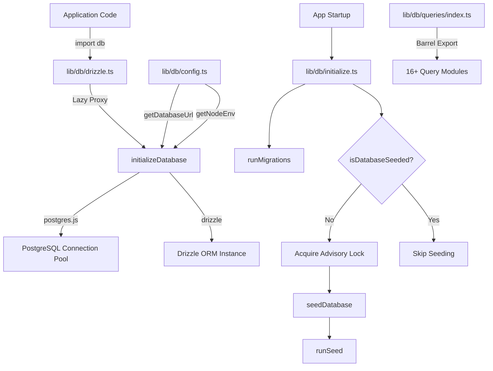
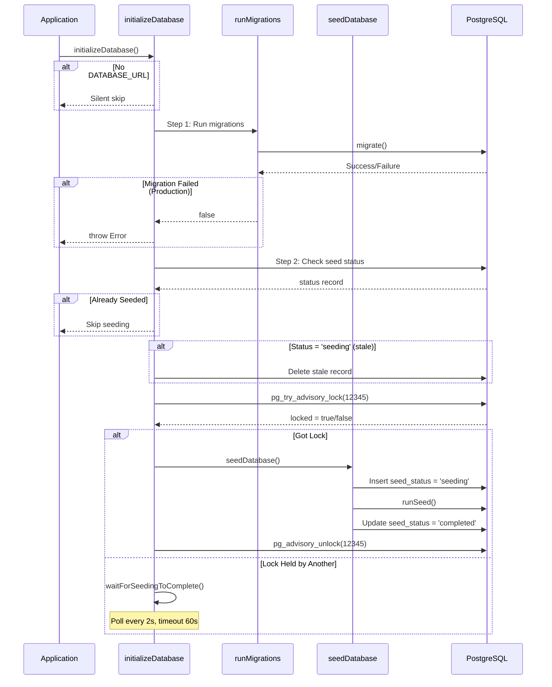

# Moduł narzędzi bazodanowych

Moduł narzędzi bazy danych (`template/lib/db/`) zarządza łączeniem połączeń PostgreSQL poprzez `postgres.js`, inicjalizacją Drizzle ORM, automatycznymi migracjami i zapełnianiem baz danych z blokowaniem zapewniającym ochronę współbieżności. Został zaprojektowany do pracy w środowiskach bezserwerowych (Vercel), w których wiele zimnych startów może inicjować bazę danych.

## Przegląd architektury



## Pliki źródłowe

|Plik|Opis|
|------|-------------|
|`lib/db/config.ts`|Konfiguracja bazy danych bezpieczna dla skryptów (nie `server-only`)|
|`lib/db/drizzle.ts`|Pula połączeń i instancja Drizzle z leniwym serwerem proxy|
|`lib/db/initialize.ts`|Orkiestracja automatycznej migracji i inicjowania|
|`lib/db/migrate.ts`|Biegacz migracji|
|`lib/db/queries/index.ts`|Eksport beczek dla wszystkich modułów zapytań|

## Konfiguracja bazy danych (`config.ts`)

Funkcje bezpieczne dla skryptów, które **nie** importują `server-only`, umożliwiając użycie w skryptach migracji i inicjowania:

```typescript
function getDatabaseUrl(): string | undefined;
function getNodeEnv(): 'development' | 'production' | 'test';
function isProduction(): boolean;
```

## Połączenie i ORM (`drizzle.ts`)

### Leniwy wzór proxy

Eksport `db` wykorzystuje JavaScript `Proxy` w celu odroczenia inicjalizacji połączenia do czasu pierwszego użycia. Zapobiega to błędom połączenia w czasie kompilacji, gdy `DATABASE_URL` może być niedostępny.

```typescript
// Proxy intercepts all property access and initializes on demand
export const db = new Proxy({} as ReturnType<typeof drizzle>, {
  get(target, prop) {
    const database = initializeDatabase();
    return database[prop as keyof typeof database];
  },
});
```

### Konfiguracja puli połączeń

```typescript
function getPoolSize(): number;
// - Reads DB_POOL_SIZE env var (clamped to 1-50)
// - Defaults: 20 (production), 10 (development)
```

Ustawienia basenu:
- `idle_timeout`: 20 sekund
- `connect_timeout`: 30 sekund
- `prepare`: false (wymagane w niektórych środowiskach bezserwerowych)

### Singleton przez `globalThis`

Połączenie jest buforowane w `globalThis`, aby przetrwać przeładowanie gorącego modułu Next.js w fazie rozwoju:

```typescript
const globalForDb = globalThis as unknown as {
  conn: postgres.Sql | undefined;
  db: ReturnType<typeof drizzle> | undefined;
};
```

### Bezpośredni dostęp do instancji

W przypadkach wymagających rzeczywistej instancji Drizzle (np. adaptera NextAuth.js Drizzle):

```typescript
import { getDrizzleInstance } from '@/lib/db/drizzle';

const adapter = DrizzleAdapter(getDrizzleInstance(), { ... });
```

## Biegacz migracji (`migrate.ts`)

### `runMigrations(): Promise<boolean>`

Uruchamia migracje Drizzle z folderu `./lib/db/migrations`. Można bezpiecznie zadzwonić do każdego startupu, ponieważ `migrate()` Drizzle'a jest idempotentny — śledzi zastosowane migracje w tabeli `__drizzle_migrations`.

```typescript
import { runMigrations } from '@/lib/db/migrate';

const success = await runMigrations();
if (!success) {
  console.error('Migrations failed -- run pnpm db:migrate manually');
}
```

**Zachowanie:**
- Rejestruje najnowszą historię migracji przed i po wykonaniu
- Zwraca `true` w przypadku powodzenia, `false` w przypadku niepowodzenia
- Nie rzuca — błędy są rejestrowane i zwracane jako wartość logiczna

## Inicjalizacja bazy danych (`initialize.ts`)

### `initializeDatabase(): Promise<void>`

Główna funkcja inicjująca wywoływana podczas uruchamiania aplikacji. Obsługuje cały cykl życia:



### Bezpieczeństwo współbieżności

Jednocześnie można uruchomić wiele instancji bezserwerowych. Moduł zapobiega podwójnemu zaszczepianiu za pomocą:

1. **Blokada doradcza PostgreSQL** (`pg_try_advisory_lock(12345)`) — nieblokująca
2. **Tabela stanu nasion** śledzenie stanów `seeding`, `completed`, `failed`
3. **Wykrywanie przestarzałych danych** — 5-minutowy próg dla statusu `seeding`
4. **Poczekaj i odpytuj** — instancje, które nie mogą uzyskać odpytywania o blokadę co 2 sekundy

### Funkcje pomocnicze

```typescript
// Check if database has been successfully seeded
async function isDatabaseSeeded(): Promise<boolean>;

// Wait for another instance to finish seeding (60s timeout, 2s intervals)
async function waitForSeedingToComplete(): Promise<boolean>;
```

## Moduły zapytań

Katalog `lib/db/queries/` zawiera moduły zapytań specyficzne dla domeny, wszystkie ponownie wyeksportowane poprzez `index.ts`:

|Moduł|Domena|
|--------|--------|
|`activity.queries.ts`|Rejestrowanie aktywności|
|`auth.queries.ts`|Uwierzytelnianie (wyszukiwanie użytkownika, weryfikacja hasła)|
|`client.queries.ts`|Profile klientów|
|`comment.queries.ts`|Komentarze|
|`company.queries.ts`|Profile firm|
|`dashboard.queries.ts`|Statystyki panelu|
|`engagement.queries.ts`|Wyświetlenia, głosy, agregacja ulubionych|
|`item.queries.ts`|Pozycja CRUD|
|`location-index.queries.ts`|Indeksowanie oparte na lokalizacji|
|`newsletter.queries.ts`|Subskrypcje biuletynu|
|`payment.queries.ts`|Zapisy płatności|
|`report.queries.ts`|Raporty|
|`subscription.queries.ts`|Subskrypcje|
|`survey.queries.ts`|Ankiety i odpowiedzi|
|`user.queries.ts`|Zarządzanie użytkownikami|
|`vote.queries.ts`|System głosowania|

### Importuj wzór

```typescript
import {
  getUserByEmail,
  getClientProfileByUserId,
  logActivity,
  isUserAdmin,
} from '@/lib/db/queries';
```

## Zmienne środowiskowe

|Zmienna|Wymagane|Opis|
|----------|----------|-------------|
|`DATABASE_URL`|Nie (opcjonalnie DB)|Ciąg połączenia PostgreSQL|
|`DB_POOL_SIZE`|Nie|Rozmiar puli połączeń (domyślnie: 10/20)|
|`NODE_ENV`|Nie|Określa domyślne rozmiary puli i rejestrowanie|
