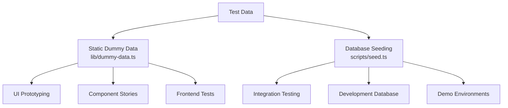
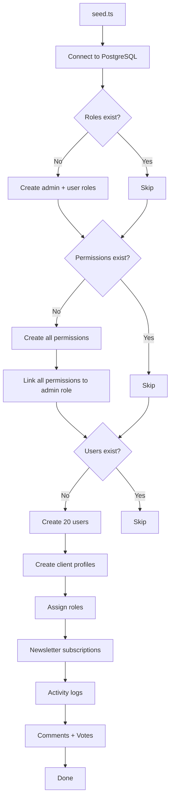
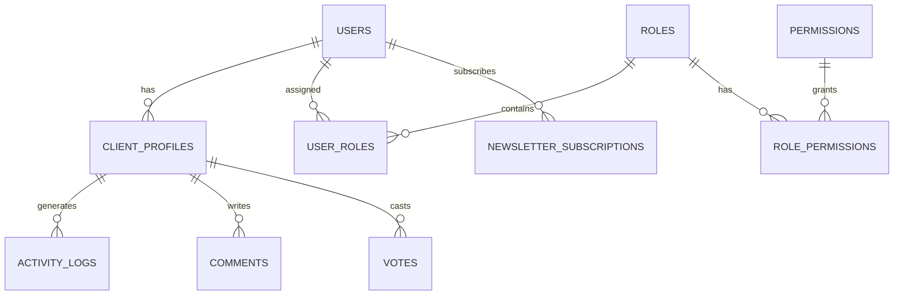

# Fałszywy system danych

Szablon zapewnia dwa podejścia do testowania danych: statyczne fikcyjne dane do tworzenia interfejsu użytkownika i prototypowania oraz system inicjowania bazy danych do generowania realistycznych rekordów w PostgreSQL. Razem obejmują pełny cykl rozwoju, od makiet po testy integracyjne.

## Przegląd



## Statyczne dane fikcyjne

Moduł `lib/dummy-data.ts` eksportuje wpisane przykładowe dane do wykorzystania w komponentach podczas programowania.

### Interfejs przesyłania

```typescript
export interface Submission {
  id: string;
  title: string;
  description: string;
  status: "approved" | "pending" | "rejected";
  submittedAt: string | null;
  approvedAt?: string;
  rejectedAt?: string;
  rejectionReason?: string;
  category: string;
  tags: string[];
  views: number;
  likes: number;
}
```

### fałszywe zgłoszenia

Sześć przykładowych zgłoszeń obejmujących wszystkie stany statusu:

|Identyfikator|Tytuł|Stan|Kategoria|Widoki|Lubi|
|---|---|---|---|---|---|
| 1 |Nowoczesna platforma e-commerce|zatwierdzony|Rozwój sieci| 1250 | 89 |
| 2 |Aplikacja do zarządzania zadaniami|w toku|Rozwój mobilny| 567 | 23 |
| 3 |Panel pogodowy|odrzucony|Rozwój sieci| 890 | 45 |
| 4 |Asystent czatu AI|zatwierdzony|AI/ML| 2100 | 156 |
| 5 |Aplikacja do śledzenia kondycji|w toku|Rozwój mobilny| 432 | 18 |
| 6 |Platforma blogowa|w toku|Rozwój sieci| 0 | 0 |

Zastosowanie w komponentach:

```typescript
import { dummySubmissions } from '@/lib/dummy-data';

export function SubmissionList() {
  return (
    <div>
      {dummySubmissions.map((submission) => (
        <SubmissionCard key={submission.id} submission={submission} />
      ))}
    </div>
  );
}
```

### fikcyjny portfel

Trzy przykładowe pozycje portfolio do prezentacji kart projektów:

|Identyfikator|Tytuł|Polecane|Tagi|
|---|---|---|---|
| 1 |Platforma handlu elektronicznego|Tak|Next.js, Stripe, E-commerce|
| 2 |Aplikacja do zarządzania zadaniami|Tak|Reaguj, Firebase, w czasie rzeczywistym|
| 3 |Panel pogodowy|Nie|Vue.js, API pogodowe, Panel kontrolny|

Każdy element portfela zawiera:

```typescript
{
  id: string;
  title: string;
  description: string;
  imageUrl: string;      // Unsplash placeholder image
  externalUrl: string;   // Demo link
  tags: string[];
  isFeatured: boolean;
}
```

## Zasiew bazy danych

Skrypt `scripts/seed.ts` generuje realistyczne dane bezpośrednio w PostgreSQL przy użyciu Drizzle ORM.

### Architektura siewu



### Relacje danych



### Wygenerowane profile użytkowników

Siewnik tworzy profile z deterministyczną zmiennością:

```typescript
// Plan distribution
plan: i % 5 === 0 ? 'premium'    // 20% premium
    : i % 3 === 0 ? 'standard'   // ~13% standard
    : 'free';                     // ~67% free

// Job titles alternate
jobTitle: i % 2 === 0 ? 'Developer' : 'Designer';

// Companies alternate
company: i % 2 === 0 ? 'Acme Inc.' : 'Globex';

// Bios for every 3rd user
bio: i % 3 === 0 ? 'Power user' : null;
```

### Wzorce dziennika aktywności

Dzienniki aktywności obejmują cztery typy działań:

|Wzór indeksu|Akcja|Opis|
|---|---|---|
|`i % 4 === 0`|`SIGN_UP`|Tworzenie konta|
|`i % 4 === 1`|`SIGN_IN`|Zdarzenie logowania|
|`i % 4 === 2`|`COMMENT`|Komentarz opublikowany|
|`i % 4 === 3`|`VOTE`|Oddano głos|

Sygnatury czasowe są losowo wybierane w ciągu ostatnich 7 dni.

### Dystrybucja głosów

Głosy są podzielone 75/25 na korzyść głosów „za”:

```typescript
voteType: i % 4 === 0 ? VoteType.DOWNVOTE : VoteType.UPVOTE
```

### Konfiguracja połączenia

Seeder wykorzystuje konserwatywne ustawienia połączenia odpowiednie dla skryptów:

```typescript
const conn = postgres(databaseUrl, {
  max: 1,              // Single connection (no pool needed)
  idle_timeout: 20,    // Close idle connections after 20s
  connect_timeout: 10, // 10-second connection timeout
  prepare: false,      // Disable prepared statements
});
```

## Wysiew produktów w paski

Skrypt `scripts/seed-stripe-products.ts` tworzy katalog rozliczeniowy w Stripe. Pełną listę produktów znajdziesz w dokumentacji [Skrypty bazy danych](../development/database-scripts.md).

## Idempotencja

Obydwa podejścia do inicjowania zaprojektowano tak, aby były bezpieczne w przypadku wielokrotnego wykonywania:

|Typ danych|Stan strażnika|Zachowanie po ponownym uruchomieniu|
|---|---|---|
|Role|`SELECT * FROM roles LIMIT 1`|Pomiń, jeśli takie istnieją|
|Uprawnienia|`SELECT * FROM permissions LIMIT 1`|Pomiń, jeśli takie istnieją|
|Użytkownicy|`SELECT count(*) FROM users`|Pomiń, jeśli liczba > 0|
|Biuletyn|Zawarte w bloku tworzenia użytkowników|Pominięte z użytkownikami|

## Używanie fałszywych danych w rozwoju

### Wzorzec 1: Prototypowanie komponentów

Użyj statycznych danych fikcyjnych, aby zbudować komponenty interfejsu użytkownika, zanim backend będzie gotowy:

```typescript
import { dummySubmissions, type Submission } from '@/lib/dummy-data';

interface SubmissionCardProps {
  submission: Submission;
}

export function SubmissionCard({ submission }: SubmissionCardProps) {
  const statusColors = {
    approved: 'bg-green-100 text-green-800',
    pending: 'bg-yellow-100 text-yellow-800',
    rejected: 'bg-red-100 text-red-800',
  };

  return (
    <div className="p-4 border rounded-lg">
      <h3>{submission.title}</h3>
      <span className={statusColors[submission.status]}>
        {submission.status}
      </span>
      <p>{submission.description}</p>
      <div className="flex gap-2">
        {submission.tags.map(tag => (
          <span key={tag} className="badge">{tag}</span>
        ))}
      </div>
    </div>
  );
}
```

### Wzór 2: Makiety pulpitu nawigacyjnego

```typescript
import { dummySubmissions } from '@/lib/dummy-data';

// Derive stats from dummy data
const stats = {
  total: dummySubmissions.length,
  approved: dummySubmissions.filter(s => s.status === 'approved').length,
  pending: dummySubmissions.filter(s => s.status === 'pending').length,
  rejected: dummySubmissions.filter(s => s.status === 'rejected').length,
  totalViews: dummySubmissions.reduce((sum, s) => sum + s.views, 0),
};
```

### Wzór 3: Zamień na prawdziwe dane

Gdy integracja zaplecza będzie gotowa, zamień import:

```typescript
// Before (dummy data)
import { dummySubmissions } from '@/lib/dummy-data';
const submissions = dummySubmissions;

// After (real data)
const submissions = await getSubmissions();
```

## Dodawanie nowych fałszywych danych

Dodając nowe funkcje, rozszerz `lib/dummy-data.ts` o wpisane przykładowe dane:

1. Zdefiniuj interfejs TypeScript dla kształtu danych
2. Wyeksportuj go do użycia w komponentach
3. Twórz przykładowe wpisy obejmujące przypadki Edge (puste pola, ciągi o maksymalnej długości, wszystkie wartości statusu)
4. Używaj realistycznych wartości (nazwy własne, prawidłowe adresy URL, rozsądne liczby)
5. W stosownych przypadkach uwzględnij zarówno elementy polecane, jak i nie

```typescript
// Example: adding dummy reviews
export interface DummyReview {
  id: string;
  authorName: string;
  rating: number;
  comment: string;
  createdAt: string;
}

export const dummyReviews: DummyReview[] = [
  {
    id: "1",
    authorName: "Jane Developer",
    rating: 5,
    comment: "Excellent tool for rapid prototyping",
    createdAt: "2024-02-01T10:00:00Z"
  },
  // ... more entries covering 1-star, no comment, etc.
];
```
