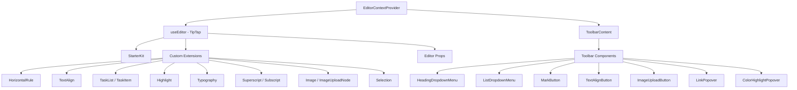

# System edytorski

Szablon zawiera edytor tekstu sformatowanego oparty na TipTap (ProseMirror) z modułową architekturą rozszerzeń, komponentów paska narzędzi, haków i funkcji narzędziowych. Edytor obsługuje nagłówki, listy, listy zadań, obrazy, bloki kodu, formatowanie tekstu i nie tylko.

## Przegląd architektury



## Pliki źródłowe

|Katalog|Spis treści|
|-----------|----------|
|`lib/editor/extensions/`|Ponowny eksport i konfiguracja rozszerzenia TipTap|
|`lib/editor/components/`|Komponenty interfejsu użytkownika (przyciski paska narzędzi, wyskakujące okienka, ikony)|
|`lib/editor/hooks/`|Haki reagujące na zarządzanie stanem edytora|
|`lib/editor/providers/`|Dostawca kontekstu edytora z konfiguracją rozszerzenia|
|`lib/editor/contents/`|Układ paska narzędzi i składniki zawartości edytora|
|`lib/editor/utils/`|Funkcje użytkowe (skróty, sprawdzanie poprawności, przesyłanie)|

## Konfiguracja rozszerzenia

Rozszerzenia rejestrowane są w rejestrze `EditorContextProvider`. `StarterKit` zapewnia podstawową funkcjonalność z dodatkowymi rozszerzeniami:

```typescript
const extensions = useMemo(() => [
  StarterKit.configure({
    horizontalRule: false,
    link: { openOnClick: false, enableClickSelection: true },
  }),
  HorizontalRule,
  TextAlign.configure({ types: ['heading', 'paragraph'] }),
  ImageUploadNode.configure({
    accept: 'image/*',
    maxSize: MAX_FILE_SIZE, // 5MB
    limit: 3,
    upload: handleImageUpload,
    onError: (error) => console.error('Upload failed:', error),
  }),
  TaskList,
  TaskItem.configure({ nested: true }),
  Highlight.configure({ multicolor: true }),
  Image,
  Typography,
  Superscript,
  Subscript,
  Selection,
], []);
```

### Podsumowanie rozszerzenia

|Rozszerzenie|Źródło|Cel|
|-----------|--------|---------|
|`StarterKit`|`@tiptap/starter-kit`|Akapity, pogrubienie, kursywa, listy, kod, cytat blokowy|
|`HorizontalRule`|`@tiptap/extension-horizontal-rule`|Przegrody poziome|
|`TextAlign`|`@tiptap/extension-text-align`|Lewo, środek, prawo, wyjustuj wyrównanie|
|`TaskList` / `TaskItem`|`@tiptap/extension-list`|Interaktywne listy pól wyboru|
|`Highlight`|`@tiptap/extension-highlight`|Wielokolorowe podświetlanie tekstu|
|`Typography`|`@tiptap/extension-typography`|Inteligentne cytaty, myślniki, wielokropki|
|`Superscript`|`@tiptap/extension-superscript`|Tekst górny|
|`Subscript`|`@tiptap/extension-subscript`|Tekst indeksu|
|`Selection`|`@tiptap/extensions`|Ulepszona obsługa zaznaczeń|
|`Image`|`@tiptap/extension-image`|Statyczne wyświetlanie obrazu|
|`ImageUploadNode`|Niestandardowe|Przesyłanie obrazu metodą „przeciągnij i upuść” wraz z postępem|

## Dostawca kontekstu edytora

Edytor jest udostępniany poprzez kontekst React w celu uzyskania dostępu do całego drzewa:

```typescript
export const EditorContext = createContext<Editor | null>(null);

export function EditorContextProvider({ children }: { children: React.ReactNode }) {
  const editor = useEditor({
    immediatelyRender: false,
    shouldRerenderOnTransaction: false,
    editorProps: {
      attributes: {
        autocomplete: 'on',
        autocorrect: 'on',
        autocapitalize: 'off',
        'aria-label': 'Main content area, start typing to enter text.',
        class: cn('min-h-96'),
      },
    },
    extensions,
  });

  return <EditorContext.Provider value={editor}>{children}</EditorContext.Provider>;
}
```

Kluczowe możliwości konfiguracji:
- `immediatelyRender: false` zapobiega niedopasowaniu nawodnienia SSR
- `shouldRerenderOnTransaction: false` optymalizuje wydajność, unikając niepotrzebnych ponownych renderowań

## Konfiguracja paska narzędzi

Komponent `ToolbarContent` definiuje kompletny układ pasków narzędzi zorganizowanych w grupy:

|Grupa|Komponenty|
|-------|------------|
|Historia|Cofnij, powtórz|
|Typy bloków|Lista rozwijana nagłówków (H1-H4), Lista rozwijana (punktor, uporządkowane, zadanie), Cytat blokowy, Blok kodu|
|Znaki wbudowane|Pogrubienie, kursywa, przekreślenie, kod, podkreślenie, wyróżnienie koloru, łącze|
|Skrypt|Indeks górny, indeks dolny|
|Wyrównanie|Lewo, Środek, Prawo, Justowanie|
|Media|Przesyłanie obrazu|

Grupy oddzielone są komponentami `ToolbarSeparator` z elementami `Spacer` służącymi do pozycjonowania.

## Haki redaktorskie

### `useTiptapEditor`

Zapewnia elastyczny dostęp do instancji edytora z poziomu właściwości lub kontekstu:

```typescript
export function useTiptapEditor(providedEditor?: Editor | null): {
  editor: Editor | null;
  editorState?: Editor["state"];
  canCommand?: Editor["can"];
}
```

Ten hak łączy bezpośrednio dostarczony edytor z edytorem kontekstowym, umożliwiając komponentom pracę zarówno samodzielnie, jak i w drzewie dostawców.

### Dodatkowe haczyki

|Hak|Cel|
|------|---------|
|`use-editor.ts`|Zarządzanie stanem głównego edytora|
|`use-editor-sync.ts`|Synchronizacja pomiędzy instancjami edytora|
|`use-cursor-visibility.ts`|Śledzenie pozycji kursora i widoczności|
|`use-element-rect.ts`|Śledzenie prostokąta ograniczającego element|
|`use-scrolling.ts`|Przewiń pozycję i zachowanie|
|`use-throttled-callback.ts`|Ograniczone wykonywanie wywołania zwrotnego|
|`use-window-size.ts`|Responsywne śledzenie rozmiaru okna|
|`use-unmount.ts`|Czyszczenie po odmontowaniu komponentu|

## Funkcje użytkowe

### Formatowanie klawiszy skrótu

System obsługuje skróty klawiaturowe specyficzne dla platformy:

```typescript
export const MAC_SYMBOLS: Record<string, string> = {
  mod: "Command", command: "Command", meta: "Command",
  ctrl: "Ctrl", alt: "Option", shift: "Shift",
  // ... additional mappings
};

export const formatShortcutKey = (key: string, isMac: boolean, capitalize?: boolean) => {
  // Returns Mac symbols or formatted key names
};

export const parseShortcutKeys = (props: {
  shortcutKeys: string | undefined;
  delimiter?: string;
  capitalize?: boolean;
}) => string[];
```

### Walidacja schematu

```typescript
// Check if a mark type exists in the editor schema
export const isMarkInSchema = (markName: string, editor: Editor | null): boolean;

// Check if a node type exists in the editor schema
export const isNodeInSchema = (nodeName: string, editor: Editor | null): boolean;

// Check if extensions are registered
export function isExtensionAvailable(editor: Editor | null, extensionNames: string | string[]): boolean;
```

### Nawigacja węzła

```typescript
// Find a node at a specific document position
export function findNodeAtPosition(editor: Editor, position: number): TiptapNode | null;

// Find a node by reference or position
export function findNodePosition(props: {
  editor: Editor | null;
  node?: TiptapNode | null;
  nodePos?: number | null;
}): { pos: number; node: TiptapNode } | null;

// Move focus to the next node
export function focusNextNode(editor: Editor): boolean;
```

### Przesyłanie obrazu

```typescript
export const MAX_FILE_SIZE = 5 * 1024 * 1024; // 5MB

export const handleImageUpload = async (
  file: File,
  onProgress?: (event: { progress: number }) => void,
  abortSignal?: AbortSignal
): Promise<string>;
```

Program obsługi przesyłania sprawdza rozmiar pliku, obsługuje śledzenie postępu i obsługuje anulowanie za pośrednictwem `AbortSignal`.

### Oczyszczanie adresów URL

```typescript
export function isAllowedUri(uri: string | undefined, protocols?: ProtocolConfig): boolean;
export function sanitizeUrl(inputUrl: string, baseUrl: string, protocols?: ProtocolConfig): string;
```

Zapewnia, że w linkach dozwolone są wyłącznie bezpieczne protokoły (`http`, `https`, `ftp`, `mailto` itp.). Niebezpieczne adresy URL są zastępowane przez `"#"`.
