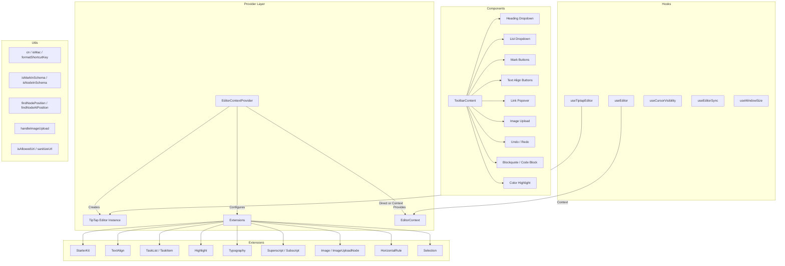

# Moduł narzędzi edytora

Moduł narzędzi edytora (`template/lib/editor/`) zapewnia kompletne rozwiązanie do edycji tekstu sformatowanego oparte na **TipTap** (ProseMirror). Zawiera wstępnie skonfigurowanego dostawcę edytora, rozszerzenia TipTap, pełną bibliotekę komponentów paska narzędzi, funkcje narzędziowe do manipulacji DOM i niestandardowe hooki React do zarządzania stanem edytora.

## Przegląd architektury



## Pliki źródłowe

|Katalog|Opis|
|-----------|-------------|
|`lib/editor/index.ts`|Eksport beczek dla wszystkich podmodułów|
|`lib/editor/providers/`|`EditorContextProvider` i `EditorContext`|
|`lib/editor/extensions/`|Reeksport rozszerzenia TipTap|
|`lib/editor/hooks/`|Niestandardowe haki React|
|`lib/editor/utils/`|Funkcje użytkowe|
|`lib/editor/contents/`|Komponenty `ToolbarContent` i `EditorContent`|
|`lib/editor/components/`|Elementy proste interfejsu użytkownika, przyciski paska narzędzi, ikony, węzły|
|`lib/editor/styles/`|Edytor stylów CSS|

## Dostawca edytora

### `EditorContextProvider`

Opakowuje dzieci wstępnie skonfigurowaną instancją edytora TipTap:

```tsx
import { EditorContextProvider } from '@/lib/editor';

function MyEditor() {
  return (
    <EditorContextProvider>
      <ToolbarContent editor={null} />
      <EditorContent />
    </EditorContextProvider>
  );
}
```

### Konfiguracja

Dostawca konfiguruje TipTap z następującymi ustawieniami:

```typescript
const editor = useEditor({
  immediatelyRender: false,
  shouldRerenderOnTransaction: false,
  editorProps: {
    attributes: {
      autocomplete: 'on',
      autocorrect: 'on',
      autocapitalize: 'off',
      'aria-label': 'Main content area, start typing to enter text.',
      class: 'min-h-96',
    },
  },
  extensions: [/* ... */],
});
```

### Wstępnie skonfigurowane rozszerzenia

|Rozszerzenie|Konfiguracja|
|-----------|--------------|
|`StarterKit`|`horizontalRule: false`, `link.openOnClick: false`|
|`HorizontalRule`|Domyślne|
|`TextAlign`|Dotyczy węzłów `heading` i `paragraph`|
|`ImageUploadNode`|Zaakceptuj: `image/*`, maksymalnie 5MB, limit 3 obrazów|
|`TaskList` / `TaskItem`|Włączono zadania zagnieżdżone|
|`Highlight`|Włączono tryb wielokolorowy|
|`Image`|Domyślne|
|`Typography`|Inteligentne cytaty i myślniki|
|`Superscript` / `Subscript`|Domyślne|
|`Selection`|Domyślne|

## Haczyki

### `useEditor(): Editor`

Pobiera instancję edytora z `EditorContext`. Należy użyć w obrębie `EditorContextProvider`.

```typescript
import { useEditor } from '@/lib/editor';

function MyComponent() {
  const editor = useEditor();
  // editor is the TipTap Editor instance
}
```

### `useTiptapEditor(providedEditor?): { editor, editorState?, canCommand? }`

Elastyczny hak, który akceptuje opcjonalną instancję edytora lub powraca do kontekstu TipTap:

```typescript
import { useTiptapEditor } from '@/lib/editor/hooks';

function ToolbarButton({ editor: externalEditor }) {
  const { editor, editorState, canCommand } = useTiptapEditor(externalEditor);

  const isBold = editorState ? editor?.isActive('bold') : false;
  const canBold = canCommand ? canCommand().toggleBold() : false;
}
```

### Inne haczyki

|Hak|Cel|
|------|---------|
|`useCursorVisibility`|Śledzi widoczność pozycji kursora w rzutni|
|`useEditorSync`|Synchronizuje zawartość edytora ze stanem zewnętrznym|
|`useElementRect`|Śledzi prostokąt ograniczający element|
|`useScrolling`|Wykrywa stan przewijania|
|`useThrottledCallback`|Ogranicza funkcję wywołania zwrotnego|
|`useUnmount`|Uruchamia czyszczenie po odmontowaniu komponentu|
|`useWindowSize`|Śledzi wymiary okien|

## Funkcje użytkowe

### Pomocnik nazw klas

```typescript
function cn(...classes: (string | boolean | undefined | null)[]): string;
// Filters falsy values and joins with space
cn('min-h-96', isActive && 'bg-blue-500', undefined); // 'min-h-96 bg-blue-500'
```

### Wykrywanie platformy

```typescript
function isMac(): boolean;
// Returns true if navigator.platform includes 'mac'
```

### Formatowanie klawiszy skrótu

```typescript
function formatShortcutKey(key: string, isMac: boolean, capitalize?: boolean): string;
// Mac: 'ctrl' -> '???', 'alt' -> '???', 'shift' -> '???', 'meta' -> '???'
// Windows: 'ctrl' -> 'Ctrl'

function parseShortcutKeys(props: {
  shortcutKeys: string | undefined;
  delimiter?: string;    // default: '+'
  capitalize?: boolean;  // default: true
}): string[];
// 'ctrl+shift+b' -> ['???', '???', 'B'] (Mac) or ['Ctrl', 'Shift', 'B'] (Windows)
```

### Kontrola schematu

```typescript
function isMarkInSchema(markName: string, editor: Editor | null): boolean;
// Checks if a mark type exists in the editor schema

function isNodeInSchema(nodeName: string, editor: Editor | null): boolean;
// Checks if a node type exists in the editor schema

function isExtensionAvailable(editor: Editor | null, extensionNames: string | string[]): boolean;
// Checks if one or more extensions are registered
// Logs a warning if none found
```

### Operacje węzła

```typescript
function findNodeAtPosition(editor: Editor, position: number): TiptapNode | null;
// Returns the node at the given document position

function findNodePosition(props: {
  editor: Editor | null;
  node?: TiptapNode | null;
  nodePos?: number | null;
}): { pos: number; node: TiptapNode } | null;
// Finds position by node reference or position number

function focusNextNode(editor: Editor): boolean;
// Moves cursor to the next node, creating a paragraph if at end

function isNodeTypeSelected(editor: Editor | null, types: string[]): boolean;
// Checks if current selection is a NodeSelection matching any type

function isValidPosition(pos: number | null | undefined): pos is number;
// Type guard for valid document positions (>= 0)
```

### Przesyłanie obrazu

```typescript
const MAX_FILE_SIZE = 5 * 1024 * 1024; // 5MB

async function handleImageUpload(
  file: File,
  onProgress?: (event: { progress: number }) => void,
  abortSignal?: AbortSignal,
): Promise<string>;
// Returns the URL of the uploaded image
// Default implementation is a demo stub -- replace with actual upload logic
```

### Weryfikacja adresu URL

```typescript
function isAllowedUri(uri: string | undefined, protocols?: ProtocolConfig): boolean;
// Checks URI against allowed protocols:
// http, https, ftp, ftps, mailto, tel, callto, sms, cid, xmpp
// Plus any custom protocols passed in

function sanitizeUrl(inputUrl: string, baseUrl: string, protocols?: ProtocolConfig): string;
// Returns sanitized URL or '#' if not allowed
```

## Zawartość paska narzędzi

Komponent `ToolbarContent` udostępnia kompletny, wstępnie skonfigurowany pasek narzędzi:

```tsx
import { ToolbarContent } from '@/lib/editor/contents';

<ToolbarContent editor={editor} />
```

### Grupy pasków narzędzi

|Grupa|Komponenty|
|-------|-----------|
|Cofnij/Ponów|`UndoRedoButton` (cofnij, ponów)|
|Formatowanie bloku|`HeadingDropdownMenu` (H1-H4), `ListDropdownMenu` (punktor, zamówione, zadanie), `BlockquoteButton`, `CodeBlockButton`|
|Formatowanie wbudowane|`MarkButton` (pogrubienie, kursywa, przekreślenie, kod, podkreślenie), `ColorHighlightPopover`, `LinkPopover`|
|Indeks górny|`MarkButton` (indeks górny, dolny)|
|Wyrównanie tekstu|`TextAlignButton` (lewy, środkowy, prawy, justowanie)|
|Media|`ImageUploadButton`|

## Biblioteka komponentów

### Komponenty prymitywne

Podstawowe komponenty interfejsu użytkownika używane przez przyciski paska narzędzi:

- `Badge`, `Button`, `Card`, `DropdownMenu`, `Input`, `Popover`, `Separator`, `Spacer`, `Toolbar`, `Tooltip`

### Składniki węzła

Niestandardowe widoki węzłów TipTap:

- `HorizontalRuleNode` — niestandardowe rozszerzenie linii poziomej
- `ImageUploadNode` — węzeł przesyłania plików metodą „przeciągnij i upuść”.

### Składniki ikon

Ikony SVG dla wszystkich działań na pasku narzędzi (pogrubienie, kursywa, poziomy nagłówków, listy, wyrównanie itp.).
