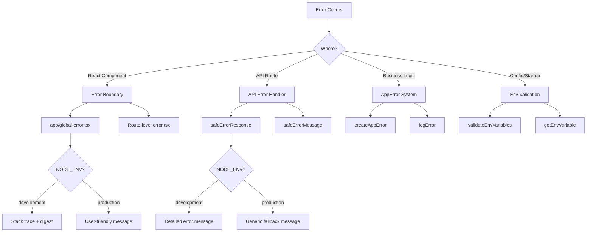

# Wzorce obsługi błędów

## Przegląd

Szablon Ever Works implementuje wielowarstwową strategię obsługi błędów, która obejmuje granice błędów React, odpowiedzi na błędy tras API, błędy aplikacji i sprawdzanie poprawności zmiennych środowiskowych. W projekcie priorytetem jest bezpieczeństwo (brak wycieku informacji w środowisku produkcyjnym), przy jednoczesnym zachowaniu przyjaznego dla programistów debugowania w fazie rozwoju.

## Architektura



## Pliki źródłowe

|Plik|Cel|
|------|---------|
|`template/app/global-error.tsx`|Granica błędu reakcji na poziomie głównym|
|`template/app/not-found.tsx`|Strona 404 Nie znaleziono|
|`template/lib/utils/api-error.ts`|Narzędzia błędów trasy API|
|`template/lib/utils/error-handler.ts`|Typy błędów aplikacji i rejestrowanie|
|`template/lib/auth/error-handler.ts`|Obsługa błędów specyficzna dla uwierzytelniania|

## Reaguj na granice błędów

### Globalna granica błędu

Plik `global-error.tsx` przechwytuje nieobsłużone błędy w katalogu głównym aplikacji:

```typescript
'use client';

export default function GlobalError({
    error,
    reset,
}: {
    error: Error & { digest?: string };
    reset: () => void;
}) {
    useEffect(() => {
        console.error(error);
    }, [error]);

    return (
        <html lang="en">
            <body>
                <h1>Something went wrong!</h1>
                {process.env.NODE_ENV !== 'production' && (
                    <div>
                        <p className="text-red-600">{error.message}</p>
                        {error.stack && <pre>{error.stack}</pre>}
                        {error.digest && <p>Error ID: {error.digest}</p>}
                    </div>
                )}
                <Button onPress={() => reset()}>Refresh</Button>
                <Link href="/">Go Home</Link>
            </body>
        </html>
    );
}
```

Kluczowe zachowania:
- **Rozwój**: Pokazuje komunikat o błędzie, ślad stosu i podsumowanie błędów
- **Produkcja**: Pokazuje tylko komunikat ogólny
- **Skrót błędów**: unikalny identyfikator wygenerowany przez Next.js na potrzeby korelacji błędów po stronie serwera
- **Funkcja resetowania**: Ponownie renderuje poddrzewo granicy błędu
- **Samodzielny kod HTML**: zawiera własne tagi `<html>` i `<body>`, ponieważ zastępuje całą stronę

### Nie znaleziono strony

```typescript
'use client';

export default function NotFound() {
    const router = useRouter();
    return (
        <div>
            <h1>404</h1>
            <h2>Page Not Found</h2>
            <Button onClick={() => router.back()}>Go Back</Button>
            <Button onClick={() => router.push('/')}>Back to Home</Button>
        </div>
    );
}
```

## Obsługa błędów API

### bezpieczna odpowiedź na błąd

Podstawowe narzędzie do odpowiedzi na błędy trasy API:

```typescript
export function safeErrorResponse(
    error: unknown,
    fallbackMessage: string,
    status: number = 500
): NextResponse {
    const detail = error instanceof Error ? error.message : String(error);

    // Always log full details server-side
    console.error(`[API Error] ${fallbackMessage}:`, detail);

    const message = process.env.NODE_ENV === "development" ? detail : fallbackMessage;

    return NextResponse.json({ success: false, error: message }, { status });
}
```

Zastosowanie w trasach API:

```typescript
export async function GET(request: NextRequest) {
    try {
        const result = await someOperation();
        return NextResponse.json(result);
    } catch (error) {
        return safeErrorResponse(error, 'Failed to process request');
    }
}
```

### bezpieczny komunikat o błędzie

W przypadkach, gdy potrzebujesz ciągu błędu bez tworzenia odpowiedzi:

```typescript
export function safeErrorMessage(error: unknown, fallbackMessage: string): string {
    if (process.env.NODE_ENV === "development") {
        return error instanceof Error ? error.message : String(error);
    }
    return fallbackMessage;
}
```

## System błędów aplikacji

### Typy błędów

```typescript
export enum ErrorType {
    AUTH = 'auth',
    CONFIG = 'config',
    DATABASE = 'database',
    NETWORK = 'network',
    VALIDATION = 'validation',
    UNKNOWN = 'unknown'
}

export interface AppError {
    message: string;
    type: ErrorType;
    code?: string;
    originalError?: unknown;
}
```

### Tworzenie błędów pisarskich

```typescript
import { createAppError, ErrorType } from '@/lib/utils/error-handler';

const error = createAppError(
    'Failed to configure OAuth providers',
    ErrorType.CONFIG,
    'OAUTH_CONFIG_FAILED',
    originalError
);
```

### Ustrukturyzowane rejestrowanie błędów

```typescript
import { logError } from '@/lib/utils/error-handler';

// Logs: [CONFIG] [Auth Config]: Failed to configure OAuth providers
// Logs: Error code: OAUTH_CONFIG_FAILED
// Logs: Original error: <original error details>
logError(error, 'Auth Config');
```

Funkcja `logError` obsługuje trzy kształty błędów:
1. **AppError** – dziennik strukturalny z typem, kodem i oryginalnym błędem
2. **Błąd** — standardowy dziennik z komunikatami i śladem stosu
3. **Nieznany** — dziennik awaryjny z wymuszaniem ciągów

### Walidacja zmiennej środowiskowej

```typescript
import { validateEnvVariables, getEnvVariable } from '@/lib/utils/error-handler';

// Validate multiple variables at once
const validationError = validateEnvVariables([
    'DATABASE_URL', 'AUTH_SECRET', 'CRON_SECRET'
]);
if (validationError) {
    logError(validationError, 'Startup');
}

// Get a single required variable (throws if missing)
const dbUrl = getEnvVariable('DATABASE_URL');

// Get an optional variable
const optional = getEnvVariable('OPTIONAL_VAR', false);
```

## Obsługa błędów w uwierzytelnianiu

Konfiguracja uwierzytelniania wykorzystuje łagodną degradację:

```typescript
const configureProviders = () => {
    try {
        const oauthProviders = configureOAuthProviders();
        return createNextAuthProviders({ /* full config */ });
    } catch (error) {
        const appError = createAppError(
            'Failed to configure OAuth providers. Falling back to credentials only.',
            ErrorType.CONFIG,
            'OAUTH_CONFIG_FAILED',
            error
        );
        logError(appError, 'Auth Config');

        // Fallback to credentials only
        return createNextAuthProviders({
            credentials: { enabled: true },
            google: { enabled: false },
            github: { enabled: false },
            facebook: { enabled: false },
            twitter: { enabled: false },
        });
    }
};
```

Jeśli konfiguracja dostawcy OAuth nie powiedzie się, system powróci do uwierzytelniania wyłącznie na podstawie poświadczeń, zamiast ulegać awarii.

## Błąd obsługi przepływu według warstwy

|Warstwa|Strategia|Zachowanie produkcyjne|
|-------|----------|-------------------|
|Komponenty reakcji|Granica błędu (`global-error.tsx`)|Wiadomość ogólna, brak śladu stosu|
|Trasy API|`safeErrorResponse()`|Ogólny komunikat zastępczy|
|Działania serwera|`validatedAction()` przechwytuje błędy Zoda|Pierwszy komunikat o błędzie sprawdzania poprawności|
|Konfiguracja uwierzytelniania|Spróbuj/złap za pomocą `createAppError()`|Pełna wdzięku degradacja do referencji|
|Praca Crona|Try/catch + rejestrowanie strukturalne|Zapisano błąd, zwrócono odpowiedź|
|Haki internetowe|Spróbuj/złap + 400 odpowiedzi|Ogólny komunikat o błędzie dla dostawcy|

## Najlepsze praktyki

1. **Nigdy nie ujawniaj elementów wewnętrznych w środowisku produkcyjnym** — zawsze używaj `safeErrorResponse` dla tras API
2. **Loguj wszystko po stronie serwera** — pełne szczegóły błędów trafiają do konsoli/rejestrowania niezależnie od środowiska
3. **Użyj błędów pisarskich** -- `createAppError` z `ErrorType` dla spójnej kategoryzacji
4. **Ładna degradacja** – zamiast awarii powracaj do ograniczonej funkcjonalności
5. **Spis błędów dla korelacji** — użyj pola `digest` z błędów Next.js, aby prześledzić problemy po stronie serwera
6. **Sprawdź na granicach** — sprawdź zmienne środowiskowe przy uruchomieniu, zweryfikuj dane wejściowe na granicach API
