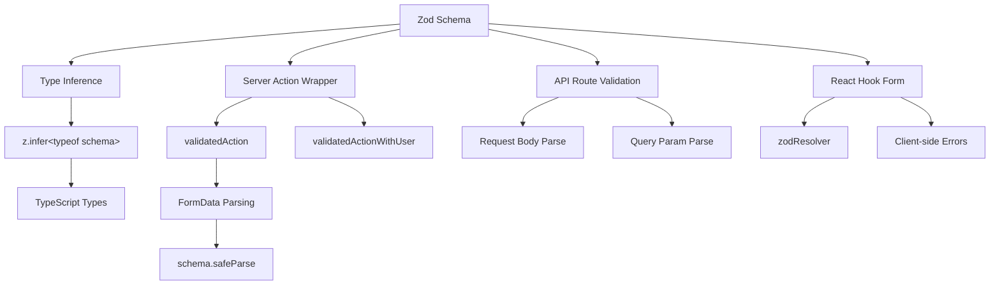

# Wzorce walidacji formularzy

## Przegląd

Szablon Ever Works wykorzystuje **Zod** jako pojedyncze źródło prawdy do sprawdzania poprawności danych zarówno na granicy klienta, jak i serwera. Schematy walidacyjne są zorganizowane w `lib/validations/` i są wykorzystywane przez:

- **Akcje serwera** poprzez opakowania `validatedAction()` i `validatedActionWithUser()`
- **Procedury obsługi tras API** do sprawdzania poprawności treści żądania/parametru zapytania
- Integracja z **React Hook Form** w celu sprawdzania poprawności formularzy po stronie klienta
- **Wnioskowanie o typie** poprzez `z.infer<>` dla zapewnienia kompleksowego bezpieczeństwa

## Architektura



## Pliki źródłowe

|Plik|Cel|
|------|---------|
|`template/lib/validations/auth.ts`|Schemat sprawdzania hasła|
|`template/lib/validations/company.ts`|Schematy firmowe CRUD|
|`template/lib/validations/client-item.ts`|Schematy przesyłania/aktualizacji elementów klienta|
|`template/lib/validations/client-dashboard.ts`|Schematy zapytań w panelu kontrolnym|
|`template/lib/validations/sponsor-ad.ts`|Schematy cyklu życia reklamy sponsora|
|`template/lib/validations/item.ts`|Schemat danych lokalizacyjnych|
|`template/lib/validations/user-location.ts`|Schemat ustawień lokalizacji użytkownika|
|`template/lib/auth/middleware.ts`|`validatedAction` / `validatedActionWithUser` narzędzia|

## Wzorce schematów walidacji

### Wzorzec 1: weryfikacja hasła za pomocą reguł łańcuchowych

```typescript
import { z } from "zod";

export const passwordSchema = z
    .string()
    .min(8, "Password must be at least 8 characters")
    .regex(/[A-Z]/, "Password must contain at least one uppercase letter")
    .regex(/[a-z]/, "Password must contain at least one lowercase letter")
    .regex(/[0-9]/, "Password must contain at least one number")
    .regex(/[^A-Za-z0-9]/, "Password must contain at least one special character");
```

Ten schemat wymusza wymagania dotyczące silnych haseł poprzez udoskonalenia łańcuchowe. Każdy `.regex()` zawiera określony komunikat o błędzie, który interfejs użytkownika może wyświetlić w tekście.

### Wzorzec 2: Utwórz/zaktualizuj pary schematów

Walidacja firmy demonstruje wzorzec tworzenia/aktualizacji:

```typescript
export const createCompanySchema = z.object({
    name: z.string().min(1, "Company name is required").max(255),
    website: z.string().url("Invalid URL format").optional().or(z.literal("")),
    domain: z.string().max(255).optional()
        .transform((val) => val?.toLowerCase().trim() || undefined),
    slug: z.string().max(255).optional()
        .transform((val) => val?.toLowerCase().trim() || undefined)
        .refine(
            (val) => !val || /^[a-z0-9-]+$/.test(val),
            { message: "Slug must contain only lowercase letters, numbers, and hyphens" }
        ),
    status: z.enum(companyStatus).default("active"),
});

export const updateCompanySchema = z.object({
    id: z.string().uuid(),
    name: z.string().min(1).max(255).optional(),  // Optional for updates
    // ... other fields also optional
    status: z.enum(companyStatus).optional(),
});
```

Kluczowe różnice:
- **Utwórz schematy** mają wymagane pola z wartościami domyślnymi
- **Schematy aktualizacji** wymagają `id` i sprawiają, że wszystkie pozostałe pola są opcjonalne
- Obydwa mają wspólną logikę `.transform()` służącą do normalizacji (np. małe litery)

### Wzorzec 3: Pola stanu oparte na wyliczeniu

```typescript
export const companyStatus = ["active", "inactive"] as const;
export const itemStatus = ['pending', 'approved', 'rejected'] as const;
export const sponsorAdStatuses = [
    "pending_payment", "pending", "rejected",
    "active", "expired", "cancelled",
] as const;

// Usage in schemas
status: z.enum(companyStatus).default("active"),
status: z.enum(sponsorAdStatuses).optional(),
```

Używanie tablic `as const` z `z.enum()` zapewnia zarówno sprawdzanie poprawności w czasie wykonywania, jak i bezpieczeństwo typu w czasie kompilacji.

### Wzorzec 4: Schematy parametrów zapytań z transformacjami

```typescript
export const clientItemsListQuerySchema = z.object({
    page: z.string().optional()
        .transform(val => (val ? parseInt(val, 10) : 1))
        .refine(val => !Number.isNaN(val), { message: 'Page must be a valid number' })
        .refine(val => val >= 1, { message: 'Page must be at least 1' }),
    limit: z.string().optional()
        .transform(val => (val ? parseInt(val, 10) : 10))
        .refine(val => val >= 1 && val <= 100, { message: 'Limit must be between 1 and 100' }),
    status: z.enum(clientStatusFilter).optional().default('all'),
    search: z.string().max(100, 'Search query is too long').optional(),
    sortBy: z.enum(['name', 'updated_at', 'status', 'submitted_at']).optional().default('updated_at'),
    sortOrder: z.enum(['asc', 'desc']).optional().default('desc'),
    deleted: z.string().optional().transform(val => val === 'true'),
});
```

Parametry zapytania przychodzą jako ciągi. Schemat używa `.transform()` do konwersji ich na prawidłowe typy (liczby, wartości logiczne) podczas stosowania sprawdzania poprawności i wartości domyślnych.

### Wzorzec 5: Zagnieżdżone schematy obiektów z walidacją między polami

```typescript
export const updateLocationSchema = z
    .object({
        defaultLatitude: z.number().min(-90).max(90).nullable().optional(),
        defaultLongitude: z.number().min(-180).max(180).nullable().optional(),
        defaultCity: z.string().max(200).nullable().optional(),
        defaultCountry: z.string().max(100).nullable().optional(),
        locationPrivacy: locationPrivacySchema.optional(),
    })
    .refine(
        (data) => {
            const hasLat = data.defaultLatitude != null;
            const hasLng = data.defaultLongitude != null;
            return hasLat === hasLng;  // Both or neither
        },
        { message: 'Both latitude and longitude must be provided together' }
    );
```

`.refine()` na poziomie obiektu sprawdza zależności między polami — szerokość i długość geograficzna muszą być obecne lub oba nie mogą być obecne.

### Wzór 6: Typy unii dla elastycznych danych wejściowych

```typescript
category: z.union([
    z.string().min(1, 'Category is required'),
    z.array(z.string().min(1)).min(1, 'At least one category is required'),
]).optional().nullable(),
```

Akceptuje to zarówno pojedynczy ciąg, jak i tablicę ciągów dla pola kategorii, obsługując różne typy danych wejściowych formularza.

## Walidacja po stronie serwera

### zatwierdzone opakowanie akcji

```typescript
export function validatedAction<S extends z.ZodType<any, any>, T>(
    schema: S,
    action: ValidatedActionFunction<S, T>
) {
    return async (prevState: ActionState, formData: FormData): Promise<T> => {
        const result = schema.safeParse(Object.fromEntries(formData));
        if (!result.success) {
            return { error: result.error.issues[0].message } as T;
        }
        return action(result.data, formData);
    };
}
```

Ta funkcja wyższego rzędu:
1. Konwertuje `FormData` na zwykły obiekt
2. Sprawdza poprawność schematu Zoda przy użyciu `safeParse()`
3. Zwraca pierwszy błąd sprawdzania poprawności, jeśli jest nieprawidłowy
4. Wywołuje funkcję akcji z przeanalizowanymi, wpisanymi danymi, jeśli są prawidłowe

### walidowane opakowanie ActionWithUser

```typescript
export function validatedActionWithUser<S extends z.ZodType<any, any>, T>(
    schema: S,
    action: ValidatedActionWithUserFunction<S, T>
) {
    return async (prevState: ActionState, formData: FormData): Promise<T> => {
        const session = await auth();
        if (!session?.user) {
            throw new Error("User is not authenticated");
        }
        const result = schema.safeParse(Object.fromEntries(formData));
        if (!result.success) {
            return { error: result.error.issues[0].message } as T;
        }
        return action(result.data, formData, session.user);
    };
}
```

Dodaje to kontrolę uwierzytelnienia przed walidacją, przekazując uwierzytelniony obiekt `user` do funkcji akcji.

## Wpisz wnioskowanie

Każdy schemat eksportuje wywnioskowane typy TypeScript:

```typescript
export type CreateCompanyInput = z.infer<typeof createCompanySchema>;
export type UpdateCompanyInput = z.infer<typeof updateCompanySchema>;
export type ClientUpdateItemInput = z.infer<typeof clientUpdateItemSchema>;
export type ClientCreateItemInput = z.infer<typeof clientCreateItemSchema>;
```

Te typy są używane w całej warstwie usług i trasach API, zapewniając, że zweryfikowany kształt danych jest zgodny z oczekiwaniami logiki biznesowej.

## Najlepsze praktyki

1. **Pojedynczy schemat, wielu konsumentów** - zdefiniuj raz w `lib/validations/`, używaj wszędzie
2. **Przekształć na granicy** — użyj `.transform()`, aby przekonwertować ciągi na odpowiednie typy
3. **Niestandardowe komunikaty o błędach** – każda reguła sprawdzania poprawności zawiera komunikat przyjazny dla użytkownika
4. **Wspólne schematy podrzędne** — ponowne wykorzystanie schematów takich jak `locationSchema` i `passwordSchema` w różnych formularzach
5. **Wyciągaj typy ze schematów** — nigdy nie definiuj ręcznie typów, które duplikują definicje schematów
6. **Weryfikacja międzypolowa** – użyj `.refine()` na poziomie obiektu dla reguł wielopolowych
7. **Rozsądne wartości domyślne** — użyj `.default()` dla opcjonalnych pól ze standardowymi wartościami
