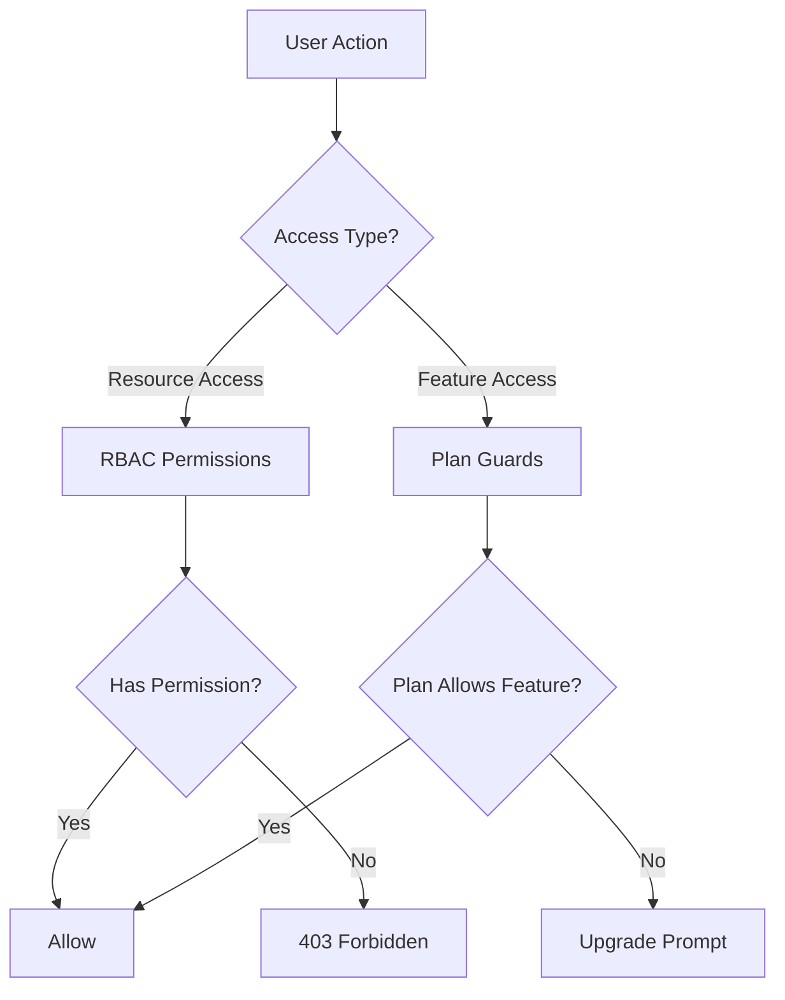
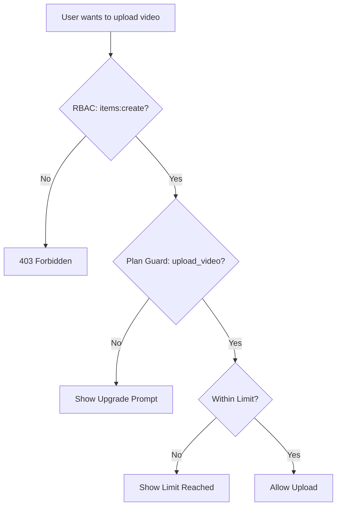

# System strażników i zezwoleń

Szablon Ever Works implementuje dwuwarstwowy system kontroli dostępu: **uprawnienia RBAC** dla dostępu do zasobów opartego na rolach i **ochrony planu** dla bramkowania funkcji opartego na subskrypcji. Razem systemy te kontrolują, co użytkownicy mogą robić i do jakich funkcji mają dostęp.

## Architektura systemu



## System uprawnień RBAC

### Definicje uprawnień

Wszystkie uprawnienia są zdefiniowane w `lib/permissions/definitions.ts` przy użyciu formatu `resource:action`:

```typescript
const PERMISSIONS = {
  items: {
    read: 'items:read',
    create: 'items:create',
    update: 'items:update',
    delete: 'items:delete',
    review: 'items:review',
    approve: 'items:approve',
    reject: 'items:reject',
  },
  categories: { read, create, update, delete },
  tags: { read, create, update, delete },
  roles: { read, create, update, delete },
  users: { read, create, update, delete, assignRoles },
  analytics: { read, export },
  system: { settings },
} as const;
```

### Typ zezwolenia

Typ `Permission` wywodzi się z obiektu const `PERMISSIONS`, zapewniając bezpieczeństwo typu:

```typescript
type Permission = 'items:read' | 'items:create' | ... | 'system:settings';
```

### Role domyślne

Wstępnie skonfigurowane są dwie domyślne role:

|Rola|Identyfikator|Uprawnienia|
|---|---|---|
|Superadministrator|`super-admin`|Wszystkie uprawnienia systemowe|
|Menedżer treści|`content-manager`|Przedmioty + Kategorie + Tagi (pełny CRUD + recenzja)|

### Grupy uprawnień

Uprawnienia są podzielone na grupy przyjazne dla interfejsu użytkownika w `lib/permissions/groups.ts`:

|Grupa|Ikona|Zawarte zasoby|
|---|---|---|
|Zarządzanie treścią|`FileText`|Przedmioty, kategorie, tagi|
|Zarządzanie użytkownikami|`Users`|Użytkownicy, role|
|System i analityka|`Settings`|Analityka, system|

### Funkcje użytkowe

Moduł `lib/permissions/utils.ts` udostępnia narzędzia do zarządzania stanem dla interfejsu użytkownika uprawnień:

```typescript
// Create a permission state map for checkboxes
const state = createPermissionState(currentPermissions);
// { 'items:read': true, 'items:create': true, ... }

// Get selected permissions from state
const selected = getSelectedPermissions(state);

// Calculate changes between old and new permissions
const changes = calculatePermissionChanges(original, updated);
// { added: ['items:delete'], removed: ['tags:create'] }

// Compare two permission sets
const equal = arePermissionsEqual(perms1, perms2);

// Filter permissions by search term
const filtered = filterPermissions(allPerms, 'items');
```

## Zaplanuj system strażników

Strażnicy planu kontrolują dostęp do funkcji w oparciu o plan subskrypcji użytkownika. System jest zdefiniowany w `lib/guards/plan-features.guard.ts`.

### Hierarchia planu

```typescript
const PLAN_LEVELS: Record<string, number> = {
  free: 1,
  standard: 2,
  premium: 3,
};
```

### Definicje funkcji

Wszystkie funkcje bramkowane są wyliczone w `FEATURES`:

|Kategoria|Funkcje|
|---|---|
|Poddanie|`submit_product`, `extended_description`, `unlimited_description`, `upload_images`, `upload_video`|
|Odznaki|`verified_badge`, `sponsored_badge`|
|Recenzja|`priority_review`, `instant_review`|
|Widoczność|`search_visibility`, `category_placement`, `sponsored_position`, `homepage_featured`, `newsletter_mention`|
|Analityka|`view_statistics`, `advanced_analytics`|
|Wsparcie|`email_support`, `priority_email_support`, `phone_support`|
|Społeczny|`social_sharing`, `learn_more_button`|
|Inne|`free_modifications`, `unlimited_submissions`|

### Macierz dostępu do funkcji

Każda funkcja jest mapowana na regułę dostępu:

|Typ dostępu|Składnia|Przykład|
|---|---|---|
|Wszystkie plany|`'all'`|`submit_product`, `upload_images`|
|Pojedynczy plan|`PaymentPlan.PREMIUM`|`upload_video`, `instant_review`|
|Minimalny plan|`{ minPlan: PaymentPlan.STANDARD }`|`verified_badge`, `priority_review`|
|Konkretne plany|`[PaymentPlan.STANDARD, PaymentPlan.PREMIUM]`|(funkcje niestandardowe)|

### Limity planu

Limity liczbowe różnią się w zależności od planu:

|Limit|Bezpłatny|Standardowe|Premium|
|---|---|---|---|
|`max_images`| 1 | 5 |Nieograniczony|
|`max_description_words`| 200 | 500 |Nieograniczony|
|`max_submissions`| 1 | 10 |Nieograniczony|
|`review_days`| 7 | 3 | 1 |
|`free_modification_days`| 0 | 30 | 365 |

### Użycie strażnika po stronie serwera

```typescript
import { canAccessFeature, createPlanGuard, FEATURES } from '@/lib/guards';

// Simple check
const allowed = canAccessFeature(FEATURES.UPLOAD_VIDEO, userPlan);

// Guard factory for multiple checks
const guard = createPlanGuard(userPlan);
guard.canAccess(FEATURES.VERIFIED_BADGE);       // boolean
guard.requireFeature(FEATURES.UPLOAD_VIDEO);     // throws PlanGuardError
guard.getLimit('max_images');                    // number | null
guard.isWithinLimit('max_submissions', count);   // boolean
guard.getAccessibleFeatures();                   // Feature[]
```

### Błąd PlanGuarda

Gdy `requireFeature` zakończy się niepowodzeniem, zgłaszany jest błąd:

```typescript
class PlanGuardError extends Error {
  feature: Feature;      // e.g., 'upload_video'
  userPlan: string;      // e.g., 'free'
  requiredPlan: PaymentPlan; // e.g., 'premium'
}
```

### Hak ochronny po stronie klienta

Hak `usePlanGuard` w `hooks/use-plan-guard.ts` otacza system ochrony komponentów React:

```typescript
import { usePlanGuard, FEATURES } from '@/hooks/use-plan-guard';

function VideoUploadButton() {
  const { canAccess, requireUpgrade, isLoading } = usePlanGuard();

  if (isLoading) return <Spinner />;

  const upgradePlan = requireUpgrade(FEATURES.UPLOAD_VIDEO);
  if (upgradePlan) {
    return <UpgradePrompt plan={upgradePlan} />;
  }

  return <Button>Upload Video</Button>;
}
```

### Haki specjalistyczne

#### `useFeatureAccess`

Sprawdź dostęp do pojedynczej funkcji:

```typescript
const { hasAccess, requiredPlan, isLoading } = useFeatureAccess(FEATURES.VERIFIED_BADGE);
```

#### `useFeatureLimit`

Sprawdź limity liczbowe z pozostałą liczbą:

```typescript
const { limit, isUnlimited, remaining, isWithinLimit } = useFeatureLimit('max_images', currentCount);

if (!isUnlimited && remaining <= 0) {
  return <LimitReached />;
}
```

## Komponowanie strażników

Strażnicy naturalnie komponują dla złożonych scenariuszy kontroli dostępu:

```typescript
// Server: Combine RBAC + plan check
function canCreateItem(userPermissions: UserPermissions, userPlan: string): boolean {
  const hasRBACAccess = hasPermission(userPermissions, 'items:create');
  const hasPlanAccess = canAccessFeature(FEATURES.SUBMIT_PRODUCT, userPlan);
  return hasRBACAccess && hasPlanAccess;
}

// Client: Combine hooks
function CreateItemButton() {
  const { canAccess } = usePlanGuard();
  const { permissions } = useRolePermissions();

  const canCreate =
    hasPermission(permissions, 'items:create') &&
    canAccess(FEATURES.SUBMIT_PRODUCT);

  if (!canCreate) return null;
  return <Button>Create Item</Button>;
}
```

## Schemat przepływu osłony



## Dodawanie nowych strażników

### Dodawanie nowego uprawnienia

1. Dodaj do `PERMISSIONS` w `lib/permissions/definitions.ts`:

```typescript
billing: {
  read: 'billing:read',
  manage: 'billing:manage',
},
```

2. Dodaj do grupy uprawnień w `lib/permissions/groups.ts`
3. Przypisz do odpowiednich ról domyślnych

### Dodanie nowej funkcji planu

1. Dodaj stałą cechy do `FEATURES` w `lib/guards/plan-features.guard.ts`
2. Zdefiniuj regułę dostępu w `FEATURE_ACCESS`
3. Opcjonalnie dodaj limity liczbowe do `PLAN_LIMITS`

## Najlepsze praktyki

1. **Preferuj strażników planu do bramkowania funkcji** i RBAC do kontroli dostępu do zasobów — nie mieszaj ich.
2. **Zawsze sprawdzaj na serwerze**, nawet jeśli klient ukrywa elementy interfejsu użytkownika — kontrole po stronie klienta dotyczą wyłącznie interfejsu użytkownika.
3. **Użyj `createPlanGuard`** w przypadku wielokrotnych kontroli w tym samym żądaniu, aby uniknąć wielokrotnego wyszukiwania planów.
4. **Obsługa stanów ładowania** w hakach — dane planu mogą być ładowane asynchronicznie z usługi subskrypcji.
5. **Zachowaj opisowe nazwy funkcji** — użyj `upload_video`, a nie `feature_3` dla przejrzystości dzienników i komunikatów o błędach.
